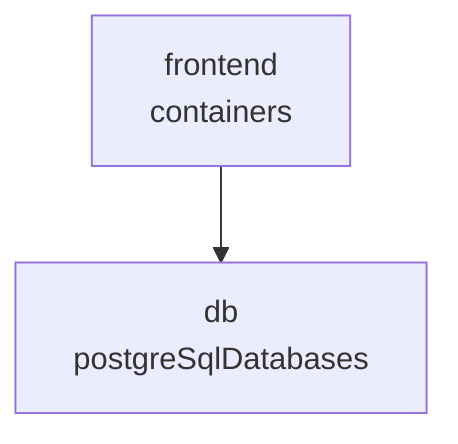

# Inline Mermaid Preview

The skill emits a mermaid `flowchart` block in chat alongside the full
HTML viewer. It is a structural preview only — no diff coloring, no
popup, no zoom. The full Cytoscape viewer is the source of truth.

## Rules

1. Use `flowchart TD` (top-down).
2. One node per resource in `application.resources`.
3. Node id = a sanitized form of `resource.name` (replace any char
   matching `/[^A-Za-z0-9_]/` with `_`). If two resources collide,
   append `_2`, `_3`, ...
4. Node label = `<name> <shortType>` where
   `shortType = resource.type.split('/').pop()`.
5. Use rectangle shape: `id["label"]`.
6. Edge rule (mirrors the HTML renderer): for every resource, iterate
   `connections` and emit `source --> target` for each connection where
   `direction === 'Outbound'` AND the target `id` is present in
   `application.resources`. Use the same sanitized ids.
7. Do NOT add a legend, do NOT add classDefs, do NOT add diff styling.

## Example

For an application with two resources `frontend` (a container) connected
to `db` (a postgres database), emit:

That's the entire mermaid block.
