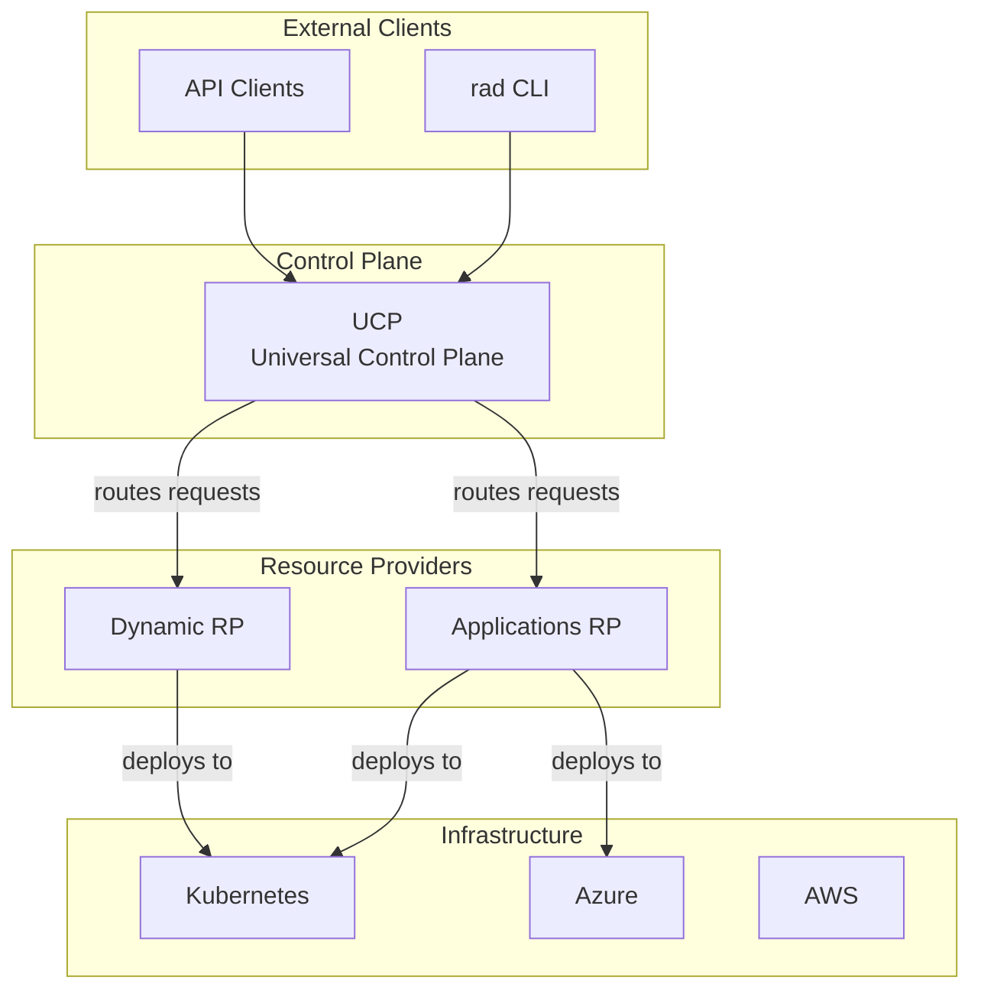
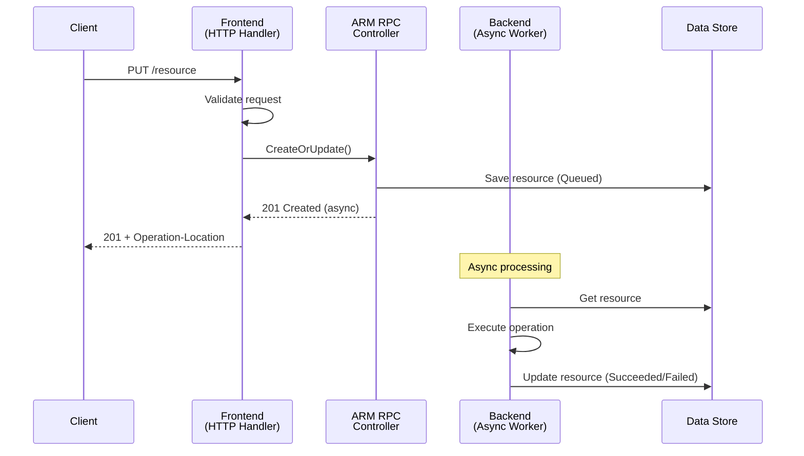
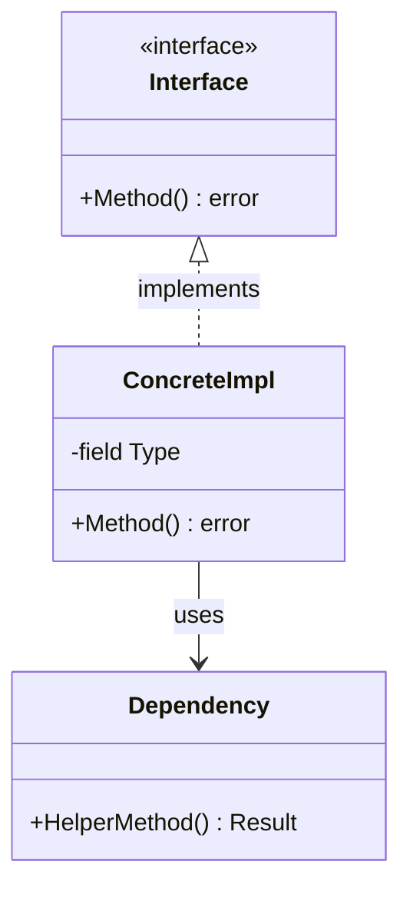
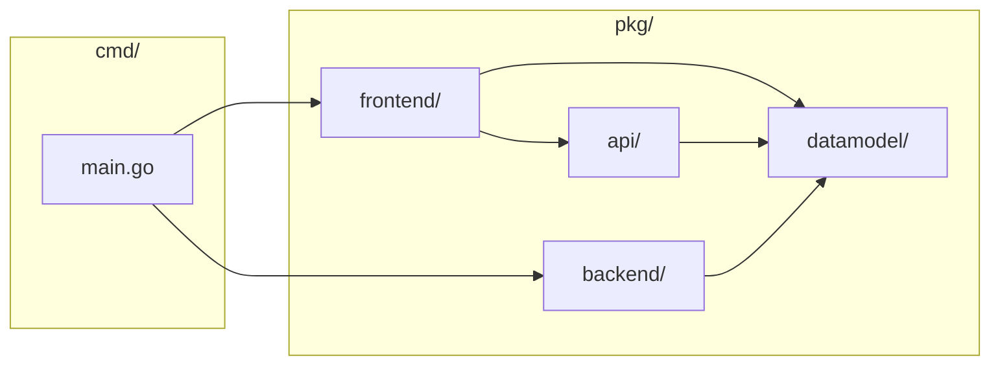
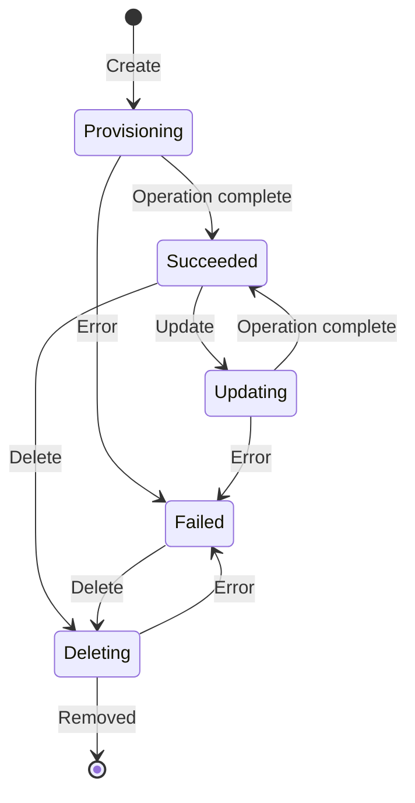
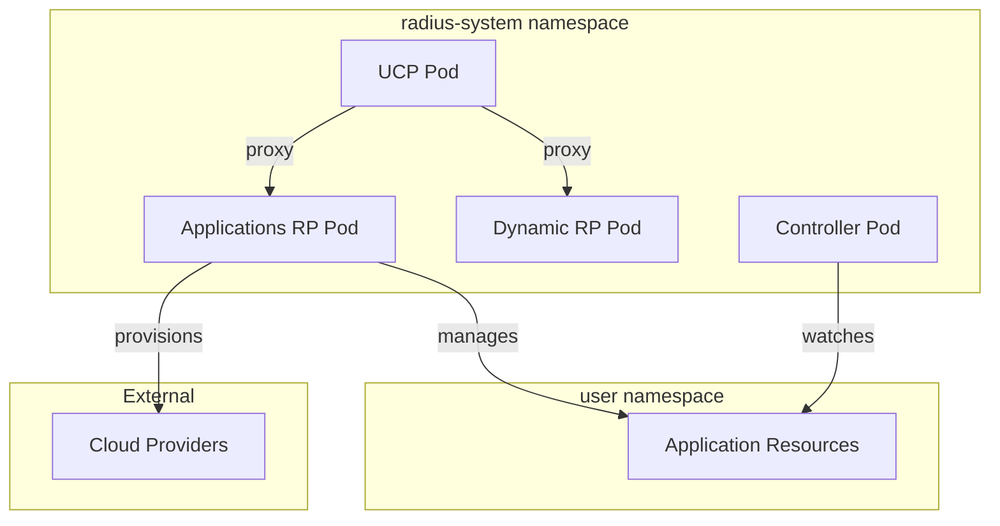

# Mermaid Diagram Patterns

Reusable Mermaid templates for architecture documentation. Copy and adapt these patterns.

## High-Level System Overview (Top-Down Flowchart)

## Sequence Diagram (Request Flow)

## Component Diagram (Entity Relationships)

## Package Dependency Diagram

## State Diagram (Resource Lifecycle)

## Deployment Topology (Subgraphs)

## Tips for Effective Diagrams

### Keep It Readable

- **Max ~15 nodes** per diagram. Split complex systems into multiple diagrams.
- Use **subgraphs** to group related components and reduce visual clutter.
- Use **short labels** on arrows — one or two words.
- Prefer **top-down** (`TD`) for hierarchical relationships and **left-right** (`LR`) for data flows.

### Make It Accurate

- Use **actual names** from the code (package names, type names, function names).
- Show **real relationships** — don't invent connections that don't exist in the code.
- Include a **legend** or note if using non-obvious conventions.

### Sequence Diagram Tips

- Name participants after their **actual role** in the code (e.g., "FrontendController" not "Server").
- Use `Note over` to explain non-obvious steps.
- Use `activate`/`deactivate` to show which participant is processing.
- Show **error paths** with `alt`/`else` blocks when they are architecturally significant.

### Class Diagram Tips

- Use `<<interface>>` stereotypes for Go interfaces.
- Show only **architecturally significant** fields and methods, not every field.
- Use composition (`*--`) vs. aggregation (`o--`) vs. dependency (`-->`) appropriately.
