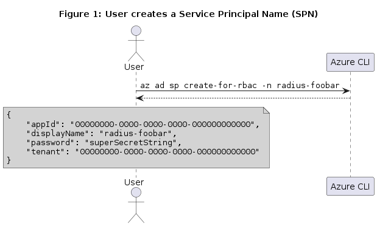
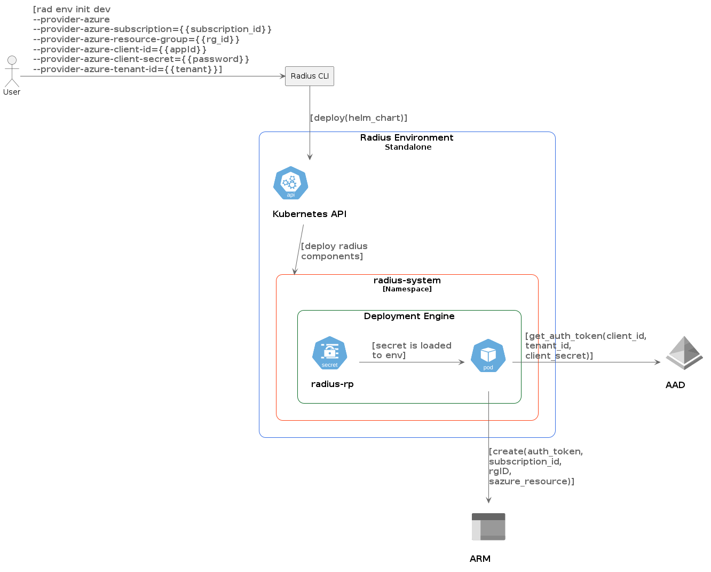

# 002 ADR: Enable local environments to deploy Azure resources

## Stakeholders

* Radius Core Team

## Status

accepted

## Context

Credentials are necessary to be able to deploy Azure resources, at the time of writing a user that creates a new standalone Radius environment (dev, kubernetes) cannot specify what credentials should be used for deploying Azure resources.

We want users to be able to deploy Azure resources to 'dev' and 'kubernetes' Radius environments. The following options are explored to specify the required credentials:

### Proposed Solution: User creates a service principal name to be used for deployment of Azure resource types

In this flow, the user creates and configures a service principal name (SPN) with the corresponding role bindings before initializing a Radius standalone environment ('dev' or 'kubernetes'). During environment creation (`rad env init`), the user provides the `client_id`, `client_secret` and `tenant_id` of the managed identity that will be used by the deployment engine when making ARM requests.

For example, the user could use the command [`az ad sp create-for-rbac`](https://docs.microsoft.com/en-us/cli/azure/ad/sp?view=azure-cli-latest#az-ad-sp-create-for-rbac) to create the SPN

The identifier of the managed identity will be stored as a secret in the runtime environment and will be appended to the runtime context of the deployment engine
The deployment engine will load the credentials from environment variables set in its runtime.

### Interactive flow

## Decision

* We will adopt the proposed solution described above

## Consequences

* The user will need to create a SPN with the appropriate role bindings to be able to deploy Azure resources which adds complexity to the 'dev' environment setup
* Standalone (kubernetes) with SPN will be the recommended experience for shared standalone production deployments
* We will research for a more convenient way to create Azure resources in the 'dev' environments that doesn't require a SPN to simplify the local developer experience
* We will use the naming convention used in the result of calling `az ad sp create-for-rbac` (`appId`, `password` and `tenant`) in the interactive flow to create a Radius environment
* We will use the canonical terminology (`client_id`, `client_secret` and `tenant_id`) for non-interactive invocations of the Radius CLI

