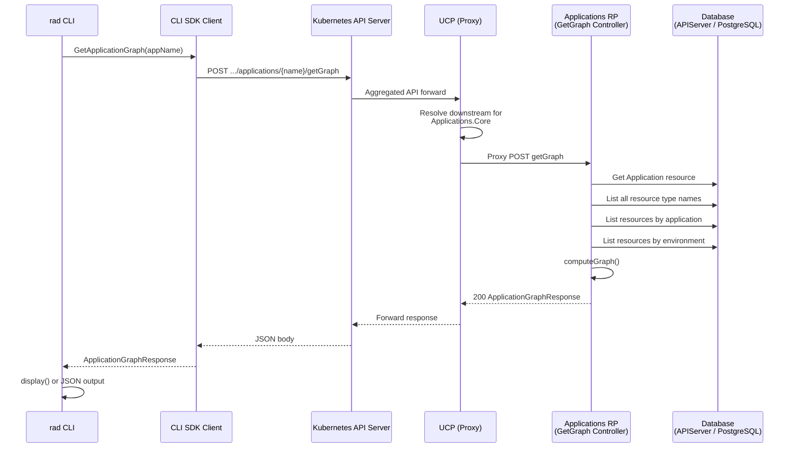
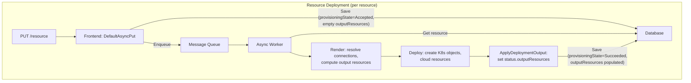
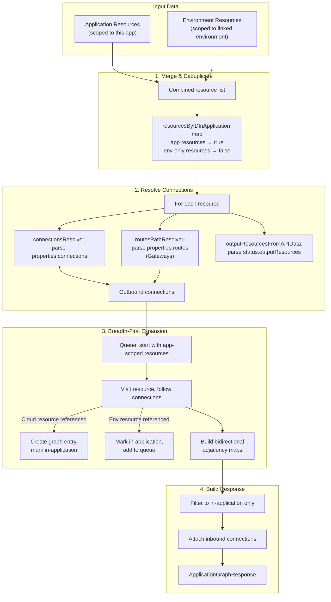
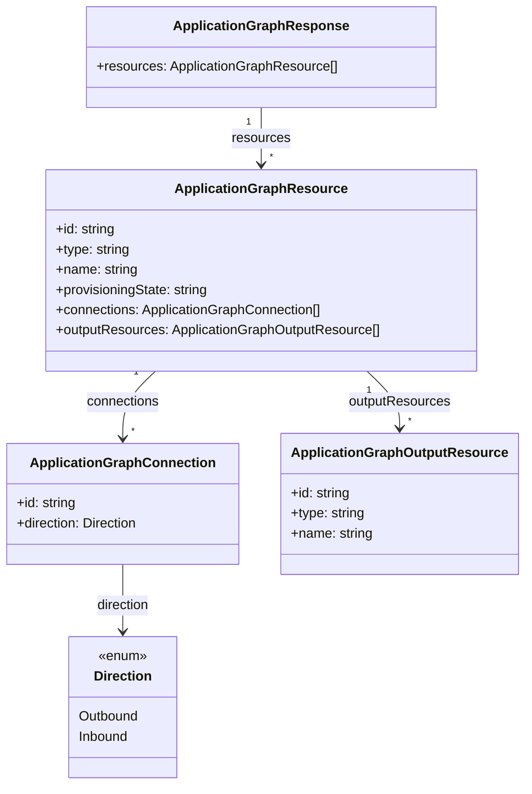
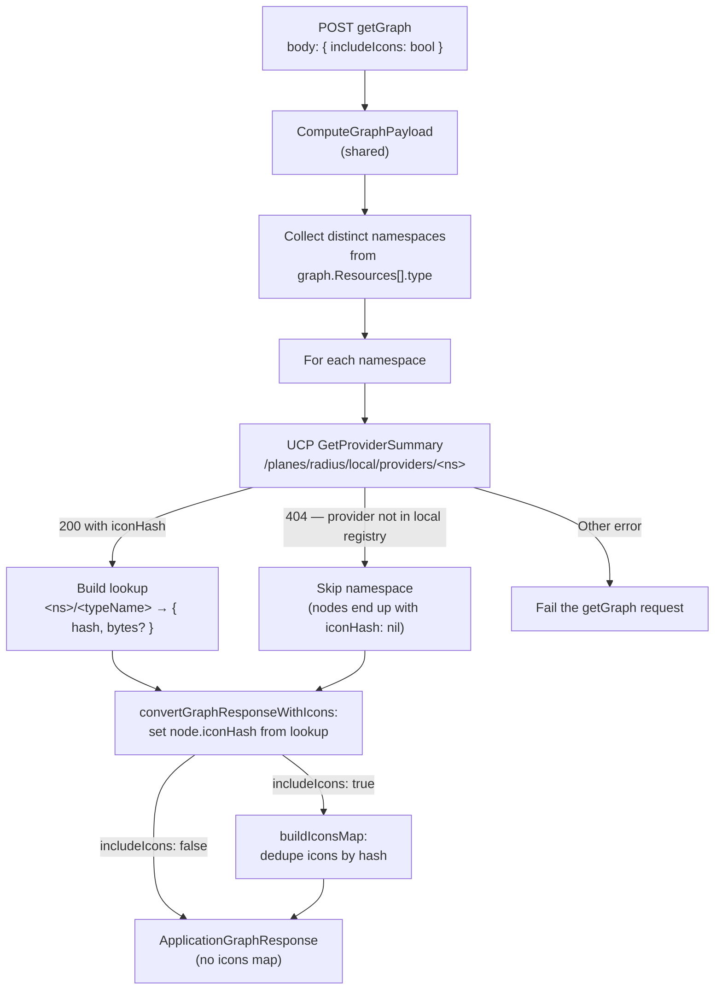
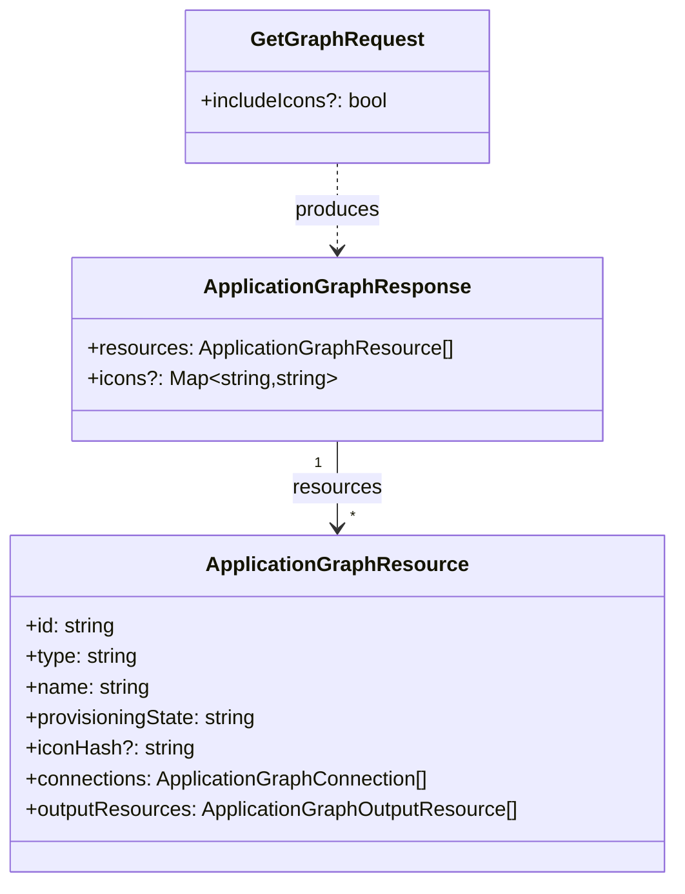

# Application Graph

The application graph is a read-only, on-demand view of every resource that
belongs to a Radius application, including their interconnections and the
underlying infrastructure (output resources) backing each one. It is computed
at query time from data already persisted in storage — there is no separate
graph database or materialized view.

The graph is exposed at two API versions. The stable
`Applications.Core/applications/getGraph@2023-10-01-preview` endpoint returns
the resources/connections/output-resources view described throughout most of
this document. The newer
`Radius.Core/applications/getGraph@2025-08-01-preview` endpoint reuses the same
computation and additionally attaches per-node icon metadata resolved from the
UCP resource-type registry; see [Radius.Core preview: icon
enrichment](#radiuscore-preview-icon-enrichment) for the delta.



## Key Components

| Component | Location | Responsibility |
|---|---|---|
| `rad app graph` command | `pkg/cli/cmd/app/graph/graph.go` | CLI entry point; dispatches between the stable Applications.Core path and the `--preview` Radius.Core path |
| `rad app graph --preview` runner | `pkg/cli/cmd/app/graph/preview/graph.go` | Preview runner; owns the `--include-icons` flag and calls the Radius.Core preview client |
| `display()` | `pkg/cli/cmd/app/graph/display.go` | Formats graph resources into human-readable text |
| `UCPApplicationsManagementClient` | `pkg/cli/clients/management.go` | CLI SDK wrapper; calls `ApplicationsClient.GetGraph()` |
| `ApplicationsClient.GetGraph()` | `pkg/corerp/api/v20231001preview/zz_generated_applications_client.go`, `pkg/corerp/api/v20250801preview/zz_generated_applications_client.go` | Auto-generated ARM clients (one per API version); build the HTTP POST request |
| UCP Proxy | `pkg/ucp/frontend/controller/radius/proxy.go` | Routes request to the Applications RP based on registered provider |
| `GetGraph` controller (Applications.Core) | `pkg/corerp/frontend/controller/applications/getgraph.go` | Server-side entry point for the stable API; orchestrates resource listing and graph computation |
| `GetGraphv20250801preview` controller (Radius.Core) | `pkg/corerp/frontend/controller/applications/v20250801preview/getgraph.go` | Preview handler; wraps the shared computation with icon enrichment |
| `fetchIcons` / `convertGraphResponseWithIcons` | `pkg/corerp/frontend/controller/applications/v20250801preview/graphicons.go` | Preview icon pipeline: one `GetProviderSummary` call per distinct namespace, then attaches per-node `iconHash` and optionally builds the deduped `icons` map |
| `computeGraph()` | `pkg/corerp/frontend/controller/applications/graph_util.go` | Core algorithm that builds the graph from raw resource data (shared by both API versions) |
| `database.Client` | `pkg/components/database/client.go` | Storage interface for all resource CRUD |

## How Data Gets Into Storage

The application graph is **not** populated by deployment. Instead, each resource
is stored individually during its normal create/update lifecycle. The graph
computation reads these resources at query time.

### Resource Persistence During Deployment



After deployment completes, each resource in the database contains:

- **`properties.connections`** — user-defined connections to other resources
  (e.g., a container connecting to a Redis cache). These are set by the user in
  the Bicep/ARM template and stored verbatim.
- **`properties.status.outputResources`** — the underlying infrastructure
  resources created during deployment (e.g., Kubernetes Deployments, AWS
  MemoryDB clusters). These are populated by the async backend after the
  `DeploymentProcessor` finishes.
- **`properties.application`** — the resource ID of the parent application.
- **`properties.environment`** — the resource ID of the parent environment.

### Storage Implementations

| Provider | Backend | Usage |
|---|---|---|
| `apiserver` | Kubernetes CRDs (key-value via SHA1-hashed names) | Default for Kubernetes deployments |
| `postgresql` | PostgreSQL (via `pgx/v5`) | Alternative persistent store |
| `inmemory` | Go `map` with mutex | Testing and development |

All implementations share the `database.Client` interface
(`Get`, `Save`, `Delete`, `Query`) and store resources as `database.Object`
with the full ARM-style resource ID as the key.

## Server-Side Graph Computation

The `GetGraph` controller in
`pkg/corerp/frontend/controller/applications/getgraph.go` is registered as a
custom action on the `applications` resource type:

```go
// pkg/corerp/setup/setup.go
Custom: map[string]builder.Operation[datamodel.Application]{
    "getGraph": {
        APIController: func(opt apictrl.Options) (apictrl.Controller, error) {
            return app_ctrl.NewGetGraph(opt, *recipeControllerConfig.UCPConnection)
        },
    },
},
```

### Step 1: Fetch the Application and Environment

`GetGraph.Run()` first loads the Application resource from storage to obtain
the linked environment ID. It needs both scopes because Radius resources can
be either application-scoped or environment-scoped.

### Step 2: Discover All Resource Types

The controller calls `ListAllResourceTypesNames()` which queries UCP's resource
provider registry for every registered resource type (e.g.,
`Applications.Core/containers`, `Applications.Datastores/redisCaches`). It
excludes internal types like `Microsoft.Resources/deployments`,
`Radius.Core/environments`, and `Radius.Core/applications`.

### Step 3: List Resources by Application and Environment

For each discovered resource type, the controller lists resources using the
generic ARM client (`GenericResourcesClient.ListByRootScope`). Resources
are filtered:

- **Application resources**: resources whose `properties.application` matches
  the target application name.
- **Environment resources**: resources whose `properties.environment` matches
  the linked environment name.

### Step 4: Compute the Graph

The `computeGraph()` function in `graph_util.go` is the core algorithm. It
does not return errors — it silently skips corrupted or missing data to produce
partial results rather than failing entirely.



#### Connection Resolution

Two resolver functions handle different connection types:

- **`connectionsResolver`**: Parses `properties.connections` — a map of named
  connection objects each with a `source` field pointing to a resource ID or
  hostname. Used by containers and similar resources.
- **`routesPathResolver`**: Parses `properties.routes` — an array of route
  objects with a `destination` field. Used by `Applications.Core/gateways`.

The `findSourceResource()` helper supports three resolution strategies:

1. Direct resource ID parsing (if `source` is a valid ARM ID)
2. Hostname lookup (if `source` is a URL, extract hostname and match by
   resource name)
3. Fallback to the raw string (marked as `ErrInvalidSource`)

#### Breadth-First Expansion

The algorithm starts with resources known to be in the application and
traverses outbound connections to discover:

- **Cloud resources** referenced by application resources (e.g., an Azure Redis
  cache) — these get new graph entries created for them.
- **Environment-scoped resources** connected to application resources — these
  are marked as "in the application" and added to the queue for further
  traversal.

This ensures the graph captures the full transitive closure of resources
reachable from the application.

#### Output Resources

For each Radius resource, the algorithm extracts `properties.status.outputResources`
— the underlying infrastructure resources (Kubernetes Deployments, cloud
resources, etc.) that were created during deployment. These are parsed from the
weakly-typed property bag returned by the API.

### Data Model



The types are defined in TypeSpec at `typespec/Radius.Core/applications.tsp`
and generated into `pkg/corerp/api/v20231001preview/`.

## CLI Display

The `rad app graph` command supports two output formats, driven by the
`--output` flag.

### Text Output (default)

The `display()` function in `pkg/cli/cmd/app/graph/display.go` renders a
human-readable text representation:

1. **Sort** resources: `Applications.Core/containers` first, then alphabetically
   by type, name, and ID.
2. **For each resource**, print:
   - `Name: {name} ({type})`
   - `Connections:` — each connection shown as `source -> destination` with
     direction indicated by the `Direction` field.
   - `Resources:` — each output resource shown as `{name} ({type})`. Azure
     resources are rendered as clickable console hyperlinks to the Azure Portal.

Example output:

```
Displaying application: test-app

Name: webapp (Applications.Core/containers)
Connections:
  webapp -> redis (Applications.Datastores/redisCaches)
Resources:
  demo (kubernetes: apps/Deployment)

Name: redis (Applications.Datastores/redisCaches)
Connections:
  webapp (Applications.Core/containers) -> redis
Resources:
  redis-aqbjixghynqgg (aws: AWS.MemoryDB/Cluster)
```

### JSON Output (`--output json`)

When `--output json` is specified, the raw `ApplicationGraphResponse` is
serialized directly to JSON via `Output.WriteFormatted()`, preserving the full
API response structure including all resource IDs, types, connections, and
output resources.

## API Wire Format

The graph endpoint is a **custom action** on the Application resource. Two API
versions are live; both flow through the Kubernetes aggregated API
(`api.ucp.dev/v1alpha3`) to UCP, which proxies to the appropriate Applications
RP handler based on the registered resource provider.

### `Applications.Core` (stable)

| Field | Value |
|---|---|
| HTTP Method | `POST` |
| URL | `{rootScope}/providers/Applications.Core/applications/{name}/getGraph?api-version=2023-10-01-preview` |
| Request Body | `{}` (empty JSON object) |
| Response | `ApplicationGraphResponse` (200 OK) |

### `Radius.Core` (preview)

| Field | Value |
|---|---|
| HTTP Method | `POST` |
| URL | `{rootScope}/providers/Radius.Core/applications/{name}/getGraph?api-version=2025-08-01-preview` |
| Request Body | `GetGraphRequest` — `{ "includeIcons": false }` (both the object and the field are optional; missing or empty bodies resolve to `false`) |
| Response | `ApplicationGraphResponse` (200 OK) — same resources/connections/output-resources as the stable version, plus per-node `iconHash` and (when `includeIcons: true`) a top-level `icons` map from hash to verbatim SVG bytes |

## Radius.Core Preview: Icon Enrichment

The Radius.Core handler ([`GetGraphv20250801preview`](../../pkg/corerp/frontend/controller/applications/v20250801preview/getgraph.go))
reuses the shared `ComputeGraphPayload` and then attaches icon metadata before
returning the response.



### Fetch, Batch, Dedupe

- **Batching**: `fetchIcons` collects the distinct provider namespaces
  referenced by the graph and issues one `GetProviderSummary` per namespace —
  not one per resource type or per node.
- **Hash vs bytes**: `GetProviderSummary` is called with `IncludeIcons: true`
  only when the caller set `includeIcons: true` on the request. In the default
  hash-only path the UCP client does not fetch icon bytes.
- **Response dedupe**: When `includeIcons: true`, `buildIconsMap` emits at
  most one entry in the top-level `icons` map per distinct `iconHash`,
  regardless of how many nodes reference it. Clients can render every
  referenced icon by iterating `icons` and looking each hash up.

### External Nodes and Missing Providers

`computeGraph` deliberately synthesizes graph entries for connected external
cloud nodes such as `Microsoft.Storage/storageAccounts`. Those namespaces are
not registered in the local Radius resource-type registry, so
`GetProviderSummary` returns 404 for them. `fetchIcons` treats a 404 as "no
icons for this namespace" and continues — the corresponding nodes appear in
the response with `iconHash: null` rather than causing the whole request to
fail. Non-404 errors still surface. This behavior applies regardless of the
`includeIcons` value.

### Data Model Delta



The types are defined in TypeSpec at `typespec/Radius.Core/applications.tsp`
and generated into `pkg/corerp/api/v20250801preview/`. `iconHash` is `nil`
when the resource's type has no icon registered or its provider was not found
in the local registry.

### CLI

`rad app graph --preview` uses this endpoint. The `--include-icons` flag
threads through to `GetGraphRequest.IncludeIcons`; without it the CLI sends
`nil` and the server defaults to `false`. Text output does not render SVGs;
the flag is intended for programmatic consumers using `-o json`.

```bash
# Hash-only: nodes carry iconHash; clients fetch bytes separately by hash.
rad app graph my-app --preview -o json

# Bytes inline: response also includes a deduped icons map (hash → SVG bytes).
rad app graph my-app --preview -o json --include-icons
```

## Notable Details

- **No persistent graph store**: The graph is computed on every request. There
  is no caching, materialized view, or graph database. This keeps the system
  simple but means graph query latency scales with the number of resource types
  and resources.

- **Partial results over errors**: `computeGraph()` never returns errors. If a
  resource ID is invalid or data is corrupted, that entry is silently skipped.
  This design prioritizes displaying whatever information is available.

- **Bidirectional connections**: Connections in the API response include both
  `Outbound` (the resource defines the connection) and `Inbound` (another
  resource connects to this one). The algorithm builds an adjacency map in both
  directions during traversal.

- **Transitive inclusion**: Environment-scoped resources that aren't directly
  part of the application are included in the graph if any application-scoped
  resource connects to them (transitively).

- **Resource type discovery**: The controller queries UCP's resource provider
  registry to enumerate all known types, rather than hard-coding a list.
  This allows user-defined types (UDTs) to appear in the graph automatically.

- **API version resolution**: For each resource type, the controller queries
  UCP for the default API version (or falls back to the first available) to
  ensure queries succeed even when resource types use different API versions.

- **Azure Portal hyperlinks**: The text display generates console escape
  sequences (`\x1b]8;;`) for clickable hyperlinks to Azure Portal resources.
  Currently only Azure resources receive links.
