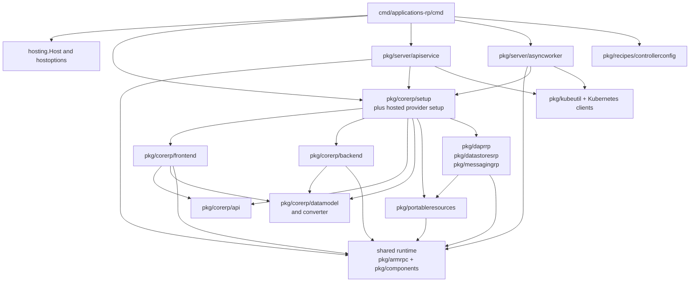
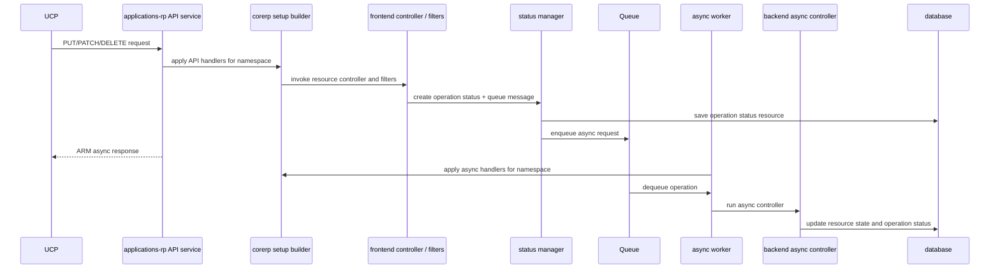

# applications-rp Architecture

`applications-rp` is the main resource provider process for Radius-managed
Applications.* APIs. It also hosts the portable resource providers that are
wired into the same process.

This process owns Applications.Core resource behavior and serves as the main
host for multiple Applications.* namespaces. It handles request validation,
controller execution, persistence, and async work for those resource types.

## Entry Points

- Binary entry: [cmd/applications-rp/main.go](../../cmd/applications-rp/main.go)
- Cobra root: [cmd/applications-rp/cmd/root.go](../../cmd/applications-rp/cmd/root.go)
- API service bootstrap: [pkg/server/apiservice.go](../../pkg/server/apiservice.go)
- Async worker bootstrap: [pkg/server/asyncworker.go](../../pkg/server/asyncworker.go)
- Builder wiring: [cmd/applications-rp/cmd/root.go](../../cmd/applications-rp/cmd/root.go)
- Resource provider setup: [pkg/corerp/setup](../../pkg/corerp/setup)

The root command constructs shared host options and then starts two major
services in the same process:

- an HTTP API service
- an async worker service

## Quick Reference

| Topic | Start Here |
|------|------------|
| Startup | `cmd/applications-rp/cmd/root.go` |
| API host | `pkg/server/apiservice.go` |
| Async host | `pkg/server/asyncworker.go` |
| Namespace wiring | `pkg/corerp/setup/setup.go` |
| Core business logic | `pkg/corerp/frontend`, `pkg/corerp/backend` |

| Test Focus | Packages |
|-----------|----------|
| Core RP behavior | `./pkg/corerp/...` |
| Shared API/async host | `./pkg/server/...` |
| Portable providers when affected | `./pkg/portableresources/...`, `./pkg/daprrp/...`, `./pkg/datastoresrp/...`, `./pkg/messagingrp/...` |

## Core Packages

| Package | Responsibility |
|--------|----------------|
| `pkg/corerp/api` | versioned API models |
| `pkg/corerp/datamodel` | version-agnostic stored models |
| `pkg/corerp/frontend` | request handlers, controllers, middleware |
| `pkg/corerp/backend` | backend logic and async processing |
| `pkg/corerp/setup` | builder registration for Applications.Core |
| `pkg/portableresources` | shared portable-resource backend and rendering patterns |
| `pkg/daprrp` | Dapr provider setup hosted in this process |
| `pkg/datastoresrp` | Datastores provider setup hosted in this process |
| `pkg/messagingrp` | Messaging provider setup hosted in this process |

## How It Works

The root command in [cmd/applications-rp/cmd/root.go](../../cmd/applications-rp/cmd/root.go)
creates shared host options, logging, and supporting services, then builds a
single builder list from `pkg/corerp/setup` plus the hosted provider setup
packages. That is the key structural fact about this binary: multiple provider
namespaces share one host process.

[pkg/server/apiservice.go](../../pkg/server/apiservice.go) consumes that builder
list to register API handlers and validators. [pkg/server/asyncworker.go](../../pkg/server/asyncworker.go)
consumes the same builder list to register async handlers. That shared
registration path is why request-time and background behavior stay aligned.

Inside `pkg/corerp`, the main split is `api/` for versioned wire types,
`datamodel/` for persistence-oriented models, `frontend/` for HTTP behavior,
and `backend/` for async or deployment-time work.

## Invariants And Constraints

- API models and persistence models should stay separate.
- Request-time logic and async/backend logic should stay separate.
- Builder registration is the contract that ties namespaces into the host.
- Because multiple providers share one process, cross-provider changes should be
  deliberate and not accidental side effects.

## Change This Safely

### Packages That Usually Move Together

- `pkg/corerp/api` and `pkg/corerp/datamodel` when model shape changes
- `pkg/corerp/frontend/controller` and `pkg/corerp/backend` when a request path
  also has async or deployment behavior
- `pkg/corerp/setup` and the root command when adding or removing provider
  builders
- `pkg/portableresources` and one of `pkg/daprrp`, `pkg/datastoresrp`, or
  `pkg/messagingrp` when portable-resource behavior changes

### Suggested Test Scope

- `go test ./pkg/corerp/...`
- If portable resources are affected, also run:
  `go test ./pkg/portableresources/... ./pkg/daprrp/... ./pkg/datastoresrp/... ./pkg/messagingrp/...`
- If API/async hosting behavior is affected, also run:
  `go test ./pkg/server/...`

## Package Dependency View

The important static seam is `root -> api service + async worker -> setup`
rather than direct resource-by-resource wiring in the root command. The setup
packages are the hinge between shared framework code and Applications.Core or
portable-provider behavior.

## Representative Flow

The representative Applications RP flow is request-to-async handoff. One shared
builder list is consumed by both the API service and the async worker, which is
why request-time handler registration and background execution stay aligned.

## Related Docs

- [service-interaction-map.md](service-interaction-map.md)
- [state-persistence.md](state-persistence.md)
- [dynamic-rp.md](dynamic-rp.md)