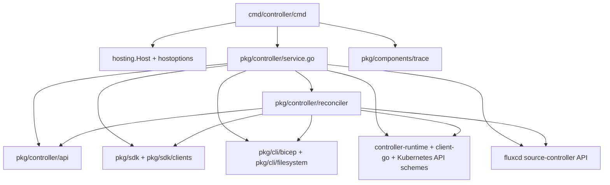
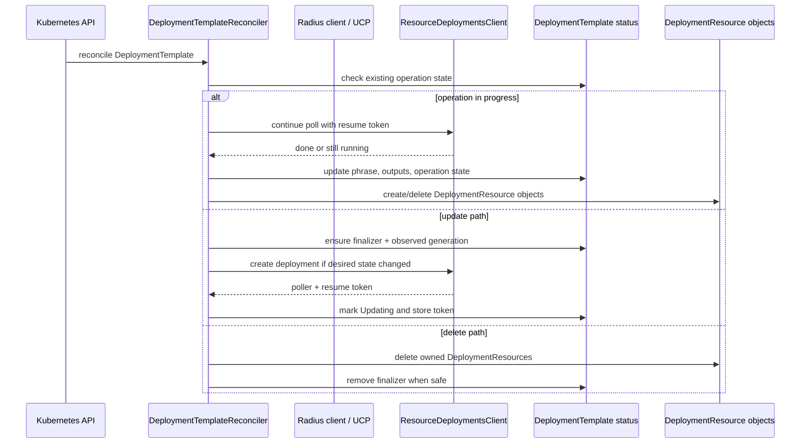

# Controller Architecture

The `controller` binary runs the Kubernetes controller-manager-based workflows
for Radius. It watches cluster resources, reconciles them, and drives Radius
APIs where Kubernetes-native automation is required.

The controller owns reconciliation and webhook behavior. It is not the primary
home of Applications.Core business logic or UCP routing logic.

## Entry Points

- Binary entry: [cmd/controller/main.go](../../cmd/controller/main.go)
- Cobra root: [cmd/controller/cmd/root.go](../../cmd/controller/cmd/root.go)
- Main service: [pkg/controller/service.go](../../pkg/controller/service.go)
- Reconcilers: [pkg/controller/reconciler](../../pkg/controller/reconciler)
- API types: [pkg/controller/api](../../pkg/controller/api)

## Quick Reference

| Topic | Start Here |
|------|------------|
| Startup | `cmd/controller/cmd/root.go` |
| Manager setup | `pkg/controller/service.go` |
| Reconciler logic | `pkg/controller/reconciler` |
| CRD types | `pkg/controller/api` |

| Test Focus | Packages |
|-----------|----------|
| Reconcile and webhook behavior | `./pkg/controller/reconciler/...` |
| Broad safety check | `./pkg/controller/...` |

## Core Packages

| Package | Responsibility |
|--------|----------------|
| `pkg/controller/service.go` | controller manager bootstrap |
| `pkg/controller/reconciler` | reconcilers and webhook wiring |
| `pkg/controller/api` | CRD-backed Kubernetes API types |
| `pkg/sdk` | clients used to call back into Radius APIs |

## How It Works

The root command builds shared host options, creates the logger, and starts a
single `controller.Service` through shared hosting.

Inside [pkg/controller/service.go](../../pkg/controller/service.go), the service
creates a controller-runtime manager, registers API schemes, configures metrics
and health probes, then registers reconcilers for recipe, deployment,
deployment template, deployment resource, and Flux-oriented behavior.

Some reconcilers call back into Radius APIs using SDK clients configured with
the current UCP connection. That is the main architectural bridge between the
controller and the rest of the control plane.

## Invariants And Constraints

- Reconciler logic should stay idempotent.
- Cluster watch logic should stay in reconcilers, not in provider HTTP layers.
- Radius API calls from reconcilers should use the configured UCP connection.
- Manager registration is the single place to confirm which controllers are part
  of the binary.

## Change This Safely

### Packages That Usually Move Together

- `pkg/controller/service.go` and `pkg/controller/reconciler` when adding or
  removing controllers
- `pkg/controller/api` and reconcilers when CRD shape or status handling changes
- SDK client usage and reconciler tests when Radius API calls change

### Suggested Test Scope

- `go test ./pkg/controller/...`
- Pay particular attention to reconciler and webhook tests in
  `pkg/controller/reconciler/...`

## Package Dependency View

The important static seam is `root -> service -> manager/reconcilers`. The
service package owns manager assembly and registration, while the reconciler
packages own the real cluster automation logic.

## Representative Flow

The representative controller flow is the `DeploymentTemplateReconciler` state
machine. It shows the controller's real role in the system: reconcile cluster
state, use Radius deployment APIs as the backend executor, and project outputs
back into Kubernetes resources.

## Related Docs

- [service-interaction-map.md](service-interaction-map.md)
- [rad-cli.md](rad-cli.md)