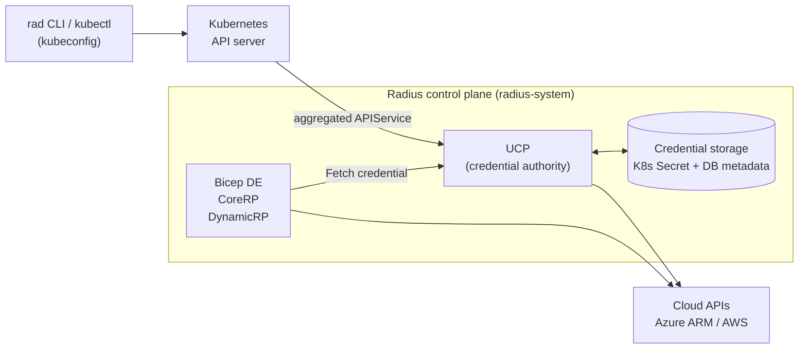
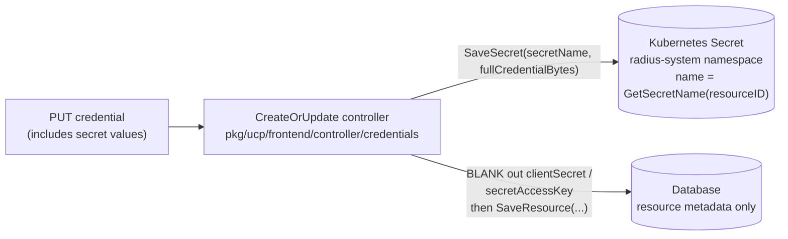
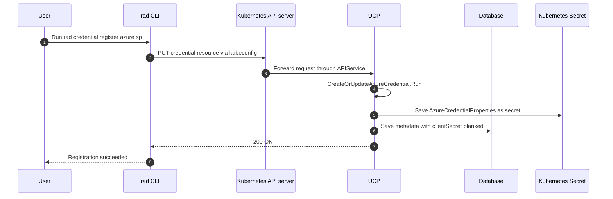
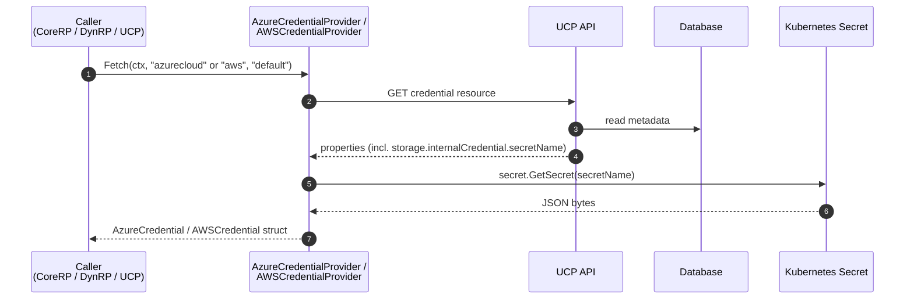
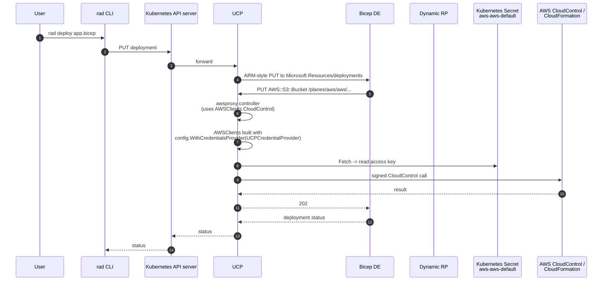
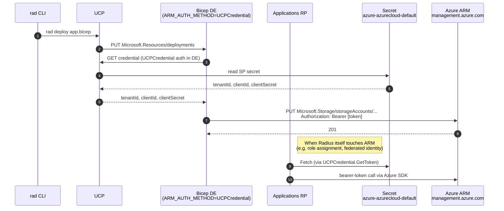
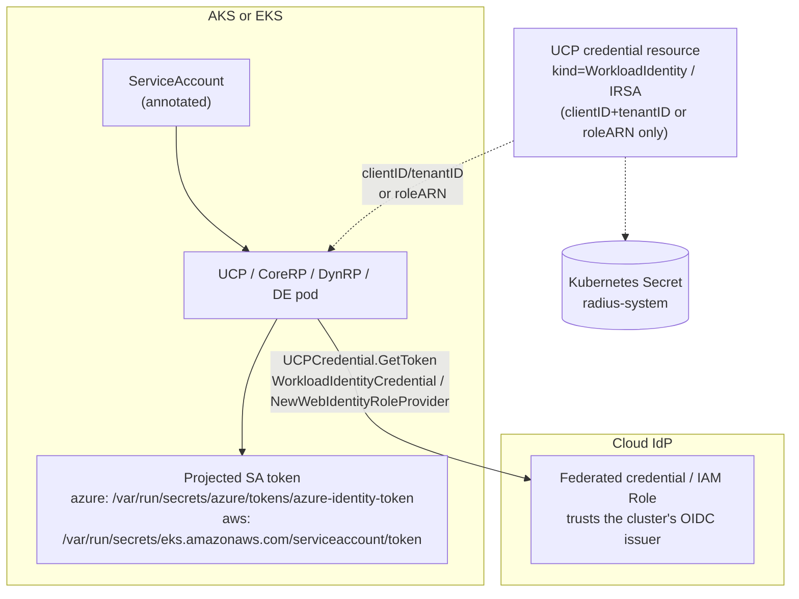
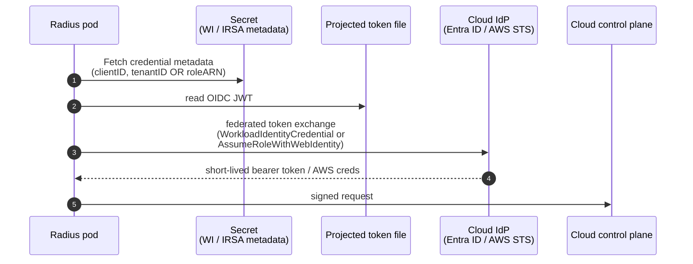
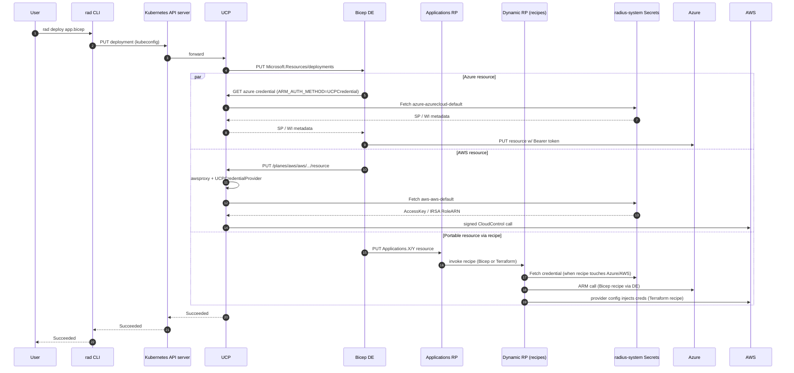
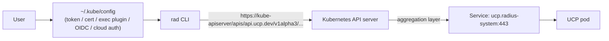

# Credentials in Radius

Radius needs credentials in two very different directions:

1. **Outbound** — Radius itself must call cloud APIs (Azure ARM, AWS CloudControl/CloudFormation, Terraform providers) on behalf of the user when it deploys applications and infrastructure.
2. **Inbound** — A human or tool (the `rad` CLI, the Kubernetes controller, an IT operator's `kubectl`) must connect to a running Radius control plane to read and write resources.

This document walks through both directions for every cluster topology Radius supports. It is grounded in the code under [pkg/ucp/credentials/](../../pkg/ucp/credentials), [pkg/ucp/frontend/controller/credentials/](../../pkg/ucp/frontend/controller/credentials), [pkg/azure/credential/](../../pkg/azure/credential), [pkg/ucp/aws/](../../pkg/ucp/aws), [pkg/components/secret/](../../pkg/components/secret), [pkg/recipes/terraform/config/providers/](../../pkg/recipes/terraform/config/providers), [pkg/cli/credential/](../../pkg/cli/credential), [pkg/cli/workspaces/](../../pkg/cli/workspaces), and the Helm chart at [deploy/Chart/](../../deploy/Chart).

## Summary

Outbound cloud credentials (Azure ServicePrincipal / WorkloadIdentity, AWS AccessKey / IRSA) are stored as Kubernetes `Secret` objects in the `radius-system` namespace, written by UCP. For ServicePrincipal and AccessKey the Secret holds the actual sensitive material (`clientSecret` / `secretAccessKey`). For WorkloadIdentity and IRSA the Secret holds only non-sensitive selectors (clientID/tenantID or roleARN); the real token comes from a projected Service Account token at runtime.

Each outbound credential has two parts: a **UCP credential resource** addressable under a plane (`/planes/azure/azurecloud/...providers/System.Azure/credentials/default` or the AWS equivalent) that holds non-secret metadata (kind, clientID, accessKeyID, etc.) and the name of the backing Secret; and a **Kubernetes Secret** in `radius-system` that holds the sensitive value when there is one. The resource is what `rad credential ...` and the API operate on; the Secret is the storage.

Four outbound cloud credential kinds are supported: **ServicePrincipal**, **WorkloadIdentity**, **AccessKey**, and **IRSA** — the first two for Azure and the last two for AWS. IRSA is AWS's workload-identity model, equivalent to Azure WorkloadIdentity. Both work the same way: the cluster issues a projected Service Account JWT, the cloud's IdP trusts the cluster's OIDC issuer, and the pod exchanges the JWT for short-lived cloud credentials. Radius models them as separate kinds because the SDKs and config knobs differ (`azidentity.WorkloadIdentityCredential` vs AWS STS `AssumeRoleWithWebIdentity`).

At deploy time, CoreRP, DynamicRP, and UCP's AWS proxy all resolve credentials through the same `Fetch` flow. The Helm chart also configures the external Bicep deployment engine with `ARM_AUTH_METHOD=UCPCredential` and `RADIUSBACKENDURL`, but that engine's implementation lives in a separate repo.

**Inbound** authentication — how clients connect to Radius — is delegated entirely to the Kubernetes API server. The `rad` CLI authenticates the same way `kubectl` does, by reusing the user's kubeconfig (Azure AD, `aws eks get-token`, client cert, OIDC, etc.). Radius runs as a Kubernetes [aggregated APIService](https://kubernetes.io/docs/tasks/extend-kubernetes/configure-aggregation-layer/) under `api.ucp.dev/v1alpha3`, so requests go to the cluster's API server, are authenticated and authorized there (cluster RBAC), and are then forwarded to UCP. Radius does **not** issue its own user accounts, tokens, or passwords.

Radius does not encrypt credentials at the application layer. Encryption depends on the cluster (etcd encryption, KMS plugins, etc.). The `radius-encryption-key` Secret is for `pkg/crypto/encryption` sensitive-data handling, not for cloud credentials.

## High-Level Component View



The **UCP credential resource** is the API surface; the Kubernetes `Secret` behind it is the storage. Every in-repo consumer (CoreRP, DynamicRP, UCP's AWS proxy) calls back into UCP to resolve it. The Helm chart also configures the external Bicep deployment engine for that same UCP credential contract, but the engine code is outside this repository. Per-cloud auth methods, proxy vs. direct-call asymmetry, and exact protocols are detailed in sections 3–5.

---

## 1. The Credential Data Model

UCP stores cloud credentials as ARM-style resources scoped to a plane.

| Plane | Default name | Resource type | Source |
|-------|--------------|---------------|--------|
| `/planes/azure/azurecloud` | `default` | `System.Azure/credentials` | [pkg/ucp/frontend/azure/routes.go](../../pkg/ucp/frontend/azure/routes.go) |
| `/planes/aws/aws` | `default` | `System.AWS/credentials` | [pkg/ucp/frontend/aws/routes.go](../../pkg/ucp/frontend/aws/routes.go) |

The version-agnostic data model is in [pkg/ucp/datamodel/credential.go](../../pkg/ucp/datamodel/credential.go):

```go
type AzureCredentialResourceProperties struct {
    Kind            string                       // ServicePrincipal | WorkloadIdentity
    AzureCredential *AzureCredentialProperties
    Storage         *CredentialStorageProperties // Kind: "Internal" + InternalCredential.SecretName
}

type AWSCredentialResourceProperties struct {
    Kind          string                       // AccessKey | IRSA
    AWSCredential *AWSCredentialProperties
    Storage       *CredentialStorageProperties
}
```

### The Four Credential Kinds

| Kind | Sensitive material | Suitable for |
|------|-------------------|--------------|
| **Azure ServicePrincipal** | `clientID`, `tenantID`, **`clientSecret`** | Any cluster (most common for non-Azure clusters) |
| **Azure WorkloadIdentity** | `clientID`, `tenantID` (no secret — token comes from a projected Service Account token) | AKS or any cluster running the Azure Workload Identity webhook |
| **AWS AccessKey** | `accessKeyId`, **`secretAccessKey`** | Any cluster (most common for non-AWS clusters) |
| **AWS IRSA** | `roleARN` (no secret — token comes from a projected EKS Service Account token at `/var/run/secrets/eks.amazonaws.com/serviceaccount/token`) | EKS or any cluster running the AWS Pod Identity Webhook |

### Two-Tier Storage

The credential resource is split between two backends:



Look at [`CreateOrUpdateAzureCredential.Run`](../../pkg/ucp/frontend/controller/credentials/azure/createorupdateazurecredential.go) and [`CreateOrUpdateAWSCredential.Run`](../../pkg/ucp/frontend/controller/credentials/aws/createorupdateawscredential.go). Both controllers:

1. Compute a deterministic secret name with [`credentials.GetSecretName(resourceID)`](../../pkg/ucp/frontend/controller/credentials/utils.go) — e.g. `azure-azurecloud-default` or `aws-aws-default`, normalized for Kubernetes object naming.
2. **Save the full credential** (including secrets) to the secret store via `secret.SaveSecret`.
3. **Blank out** `ClientSecret` / `SecretAccessKey` on the in-memory `newResource` before calling `SaveResource` so the database copy contains no sensitive material.
4. The database copy keeps the non-secret metadata (kind, client ID, tenant ID, access key ID, role ARN, as applicable) plus `properties.storage.internalCredential.secretName`; a later `Fetch` uses that `secretName` to find the backing Secret.

### Secret Storage Backend

The pluggable abstraction is in [pkg/components/secret/](../../pkg/components/secret). Two implementations exist:

| Implementation | When used | File |
|----------------|-----------|------|
| `kubernetes.Client` | Default in production. Stores each credential as a `corev1.Secret` in `radius-system`, with the marshaled JSON under data key `ucp_secret`. | [pkg/components/secret/kubernetes/client.go](../../pkg/components/secret/kubernetes/client.go) |
| `inmemory.Client` | Tests only. | [pkg/components/secret/inmemory/](../../pkg/components/secret/inmemory) |

UCP picks the backend from `secretProvider.provider` in its config ([deploy/Chart/templates/ucp/configmaps.yaml](../../deploy/Chart/templates/ucp/configmaps.yaml) sets `provider: kubernetes`).

Under the covers a Kubernetes Secret looks like this:

```yaml
apiVersion: v1
kind: Secret
metadata:
  name: azure-azurecloud-default
  namespace: radius-system
type: Opaque
data:
  ucp_secret: <base64( JSON of AzureCredentialProperties )>
```

> **Encryption at rest.** Radius does **not** add an extra layer of encryption on top of the Kubernetes Secret. Whether the bytes are encrypted in etcd depends on the cluster ([etcd encryption](https://kubernetes.io/docs/tasks/administer-cluster/encrypt-data/), KMS plugins, etc.). The `radius-encryption-key` Secret you may see in the Helm chart ([deploy/Chart/templates/dynamic-rp/secret.yaml](../../deploy/Chart/templates/dynamic-rp/secret.yaml)) is unrelated — it is consumed by [`pkg/crypto/encryption`](../../pkg/crypto/encryption) to encrypt and decrypt sensitive resource data, not UCP credentials.

---

## 2. Registering a Credential

The user-facing path is the `rad credential register` family of commands under [pkg/cli/cmd/credential/register/](../../pkg/cli/cmd/credential/register).



Note that the CLI never writes the Kubernetes Secret directly. The CLI sends an ARM-style payload (e.g. [serviceprincipal.go](../../pkg/cli/cmd/credential/register/azure/sp/serviceprincipal.go)) through UCP. The controller is the only writer of the Secret.

The corresponding commands are:

| Command | Kind | Sensitive flag |
| --------- | ------ | --------------- |
| `rad credential register azure sp` | ServicePrincipal | `--client-secret` |
| `rad credential register azure wi` | WorkloadIdentity | (none — relies on cluster token) |
| `rad credential register aws access-key` | AccessKey | `--secret-access-key` |
| `rad credential register aws irsa` | IRSA | (none — relies on cluster token) |

---

## 3. Resolving a Credential at Runtime

Every in-repo consumer in the Radius control plane uses the same provider: [`AzureCredentialProvider.Fetch`](../../pkg/ucp/credentials/azure.go) or [`AWSCredentialProvider.Fetch`](../../pkg/ucp/credentials/aws.go).



The Helm chart also configures the external Bicep deployment engine for the same UCP credential contract, but that implementation is outside this repository.

Two important wrappers convert that struct into something cloud SDKs can use:

- **Azure**: [`UCPCredential`](../../pkg/azure/credential/ucpcredentials.go) implements `azcore.TokenCredential`. Its `GetToken` calls `Fetch` (with a 30-second cache controlled by `nextExpiry`), then materializes either an `azidentity.ClientSecretCredential` (ServicePrincipal) or an `azidentity.WorkloadIdentityCredential` (WorkloadIdentity) and delegates `GetToken` to it.
- **AWS**: [`UCPCredentialProvider`](../../pkg/ucp/aws/ucpcredentialprovider.go) implements `aws.CredentialsProvider`. Its `Retrieve` calls `Fetch`, then either returns the access key directly or calls AWS STS `AssumeRoleWithWebIdentity` using the projected EKS service-account token at `/var/run/secrets/eks.amazonaws.com/serviceaccount/token` (IRSA).

For in-repo Azure clients, the auth method is selected by configuration: [`armauth.GetAuthMethod`](../../pkg/azure/armauth/auth.go) reads `ARM_AUTH_METHOD` (Helm sets it to `UCPCredential` for the Bicep DE in [deploy/Chart/templates/de/deployment.yaml](../../deploy/Chart/templates/de/deployment.yaml)), and the AWS plane reads `m.options.Config.Identity.AuthMethod` ([pkg/ucp/frontend/aws/routes.go](../../pkg/ucp/frontend/aws/routes.go)), which UCP's chart sets to `UCPCredential` in [ucp-config.yaml](../../deploy/Chart/templates/ucp/configmaps.yaml). The chart also sets `ARM_AUTH_METHOD=UCPCredential` and `RADIUSBACKENDURL` for the Bicep DE, but this repo does not contain the DE implementation itself.

---

## 4. Topologies

Radius supports four broad topologies. The *storage* is identical in all of them — the difference is what kind of credential you put in the Secret and how the cluster supplies pod-level identity.

### Topology A — Non-cloud cluster deploying to AWS

Example: Radius on a developer's `kind` / `k3d` cluster, or any non-AWS Kubernetes, deploying AWS resources.

- **Stored credential kind:** `AccessKey` (because there is no AWS-issued pod identity available).
- **Where:** Kubernetes Secret `aws-aws-default` in `radius-system`, containing `accessKeyId` + `secretAccessKey` JSON.
- **How registered:** `rad credential register aws access-key --access-key-id ... --secret-access-key ...`
- **How used:**



Key call sites:

- AWS plane wiring: [pkg/ucp/frontend/aws/routes.go](../../pkg/ucp/frontend/aws/routes.go) (`switch m.options.Config.Identity.AuthMethod` → `UCPCredential` → `NewAWSCredentialProvider` + `NewUCPCredentialProvider`).
- Recipe-side equivalent (Terraform driver): the AWS provider is configured with the literal access key/secret read from UCP — see [pkg/recipes/terraform/config/providers/aws.go](../../pkg/recipes/terraform/config/providers/aws.go) (`generateProviderConfigMap` writes `access_key` / `secret_key` into the Terraform provider block).

### Topology B — Non-cloud cluster deploying to Azure

Example: Radius on a developer's local cluster deploying Azure resources.

- **Stored credential kind:** `ServicePrincipal`.
- **Where:** Kubernetes Secret `azure-azurecloud-default` in `radius-system`, containing `tenantId`, `clientId`, `clientSecret` JSON.
- **How registered:** `rad credential register azure sp --client-id ... --client-secret ... --tenant-id ...`
- **How used:** Azure ARM calls inside the control plane go through Azure SDKs that accept a `TokenCredential`. The injected credential is `UCPCredential`, which on first call reads the SP from the Secret and builds an `azidentity.ClientSecretCredential` to mint bearer tokens.



Key call sites:

- Azure SDK clients are constructed by [`armauth.NewArmConfig`](../../pkg/azure/armauth/auth.go), which calls `NewARMCredential` and returns `UCPCredential` when `ARM_AUTH_METHOD=UCPCredential`.
- `armConfig` is then used by code such as [pkg/azure/roleassignment/roleassignment.go](../../pkg/azure/roleassignment/roleassignment.go) and resource clients in [pkg/portableresources/processors/](../../pkg/portableresources/processors).
- The Bicep DE process is configured by this repo's Helm chart with the same `ARM_AUTH_METHOD` convention — see the env block in [deploy/Chart/templates/de/deployment.yaml](../../deploy/Chart/templates/de/deployment.yaml). The chart also sets the in-cluster backend URL `RADIUSBACKENDURL`. The DE implementation itself lives in a separate repo.

> **A subtlety about the Azure proxy.** UCP exposes an `OperationTypeUCPAzureProxy` route that reverse-proxies arbitrary `/planes/azure/azurecloud/...` calls ([pkg/ucp/frontend/controller/planes/proxycontroller.go](../../pkg/ucp/frontend/controller/planes/proxycontroller.go)). That proxy intentionally **does not** attach an Authorization header — the caller (e.g. the Bicep DE or a Radius SDK client) is expected to mint its own bearer token (typically through `UCPCredential`) before the request reaches UCP. UCP's job here is path / addressing, not auth injection.

### Topology C — Cluster with cloud-attached identity (AKS Workload Identity, EKS IRSA)

Example: Radius on AKS using Azure Workload Identity, or on EKS using IRSA.

In this topology each Radius pod already carries a projected token from the cluster's identity webhook. There are still UCP credential resources, but their role is to **point at the federated identity** — they hold no client secret.



Helm wires the projected tokens conditionally:

- `global.azureWorkloadIdentity.enabled=true` adds the `azure.workload.identity/use: "true"` pod label ([deploy/Chart/templates/ucp/deployment.yaml](../../deploy/Chart/templates/ucp/deployment.yaml), same for `rp`, `dynamic-rp`, `de`). The Azure Workload Identity webhook then injects the OIDC token at `/var/run/secrets/azure/tokens/azure-identity-token`.
- `global.aws.irsa.enabled=true` mounts a projected SA token volume named `aws-iam-token` with audience `sts.amazonaws.com` at `/var/run/secrets/eks.amazonaws.com/serviceaccount/token` ([deploy/Chart/templates/ucp/deployment.yaml](../../deploy/Chart/templates/ucp/deployment.yaml)).

The flow at runtime:



  Notice that **the secret in `radius-system` no longer holds anything sensitive** — only the federated identity selectors (clientID/tenantID for Azure, roleARN for AWS). The actual token is minted from the projected SA JWT by the cloud's IdP. This is why the controller paths still call `SaveSecret` for WI/IRSA credentials but the resulting Secret payload is small and non-secret.

### Topology D — Mixed (cloud cluster targeting another cloud)

Examples and what to choose:

| Cluster | Target cloud | Recommended kind | Why |
|---------|--------------|-----------------|-----|
| AKS | Azure | WorkloadIdentity | No long-lived secret; same identity used by every pod |
| AKS | AWS | IRSA only if you have an OIDC trust to AWS, otherwise AccessKey | The cluster's OIDC issuer must be trusted by the AWS IAM role |
| EKS | AWS | IRSA | Native fit |
| EKS | Azure | WorkloadIdentity if Entra ID trusts the EKS OIDC issuer, otherwise ServicePrincipal | Pure-secret fallback always works |
| Local (kind/k3d/etc.) | Anything | ServicePrincipal / AccessKey | No cluster-issued cloud identity |

Each plane is independent — a single Radius install can hold an Azure WI credential **and** an AWS AccessKey credential at the same time.

---

## 5. How a Deployment Actually Uses Them

Putting Sections 3 and 4 together, here is the end-to-end picture for a single `rad deploy` that creates one Azure resource, one AWS resource, and one recipe-driven portable resource. The Azure and AWS control-plane pieces are validated from this repo; the Bicep DE steps reflect the chart contract (`RADIUSBACKENDURL`, `ARM_AUTH_METHOD`) because the DE code lives in a separate repo.



Two important things to observe in the recipe path:

1. **Bicep recipes** are dispatched through the same Bicep DE endpoint. This repo configures that DE for the UCP credential flow via `ARM_AUTH_METHOD=UCPCredential` and `RADIUSBACKENDURL`, although the DE implementation itself lives in a separate repo.
2. **Terraform recipes** do not have a token credential abstraction — the provider config has to contain literal values. For Azure WI/IRSA the provider blocks reference the same projected token paths the SDKs use (e.g. `oidc_token_file_path = "/var/run/secrets/azure/tokens/azure-identity-token"`, `web_identity_token_file = "/var/run/secrets/eks.amazonaws.com/serviceaccount/token"`). See [pkg/recipes/terraform/config/providers/azure.go](../../pkg/recipes/terraform/config/providers/azure.go) and [aws.go](../../pkg/recipes/terraform/config/providers/aws.go).

---

## 6. Client-to-Radius Authentication

This is the most often misunderstood piece. **Radius does not implement its own user authentication.** Authentication and authorization for the Radius control plane are delegated to the Kubernetes API server, because Radius is exposed as a Kubernetes [aggregated APIService](https://kubernetes.io/docs/tasks/extend-kubernetes/configure-aggregation-layer/) under the group/version `api.ucp.dev/v1alpha3`. The Helm chart registers that APIService in [deploy/Chart/templates/ucp/apiservice.yaml](../../deploy/Chart/templates/ucp/apiservice.yaml).

### How the rad CLI Connects

The `rad` CLI's `Workspace.Connect` ([pkg/cli/workspaces/connection.go](../../pkg/cli/workspaces/connection.go)) builds a `KubernetesConnectionConfig`. Its `Connect()` method:

```go
config, err := kubernetes.NewCLIClientConfig(c.Context)
return sdk.NewKubernetesConnectionFromConfig(config)
```

`NewKubernetesConnectionFromConfig` ([pkg/sdk/connection_kubernetes.go](../../pkg/sdk/connection_kubernetes.go)) takes the kubeconfig REST config and overlays the UCP API path (`/apis/api.ucp.dev/v1alpha3`). Every Radius API call from the CLI is then a plain Kubernetes API call, transported with the kubeconfig's existing credentials and TLS settings.



Concretely, that means:

- A laptop user authenticates to Radius however their kubeconfig authenticates to the cluster. On AKS this is usually Azure AD; on EKS it is usually `aws eks get-token`; on a local kind cluster it is a client cert.
- An IT operator who can `kubectl get pods -n radius-system` can also `rad ...` against that workspace, subject to RBAC on the `api.ucp.dev` API group.
- Network policies, mTLS, and OIDC integrations are **all the cluster's responsibility** — Radius does not duplicate them.
- The Kubernetes API server may be exposed via a public LB (AKS / EKS) or reachable only inside a VNet/VPC; either way the CLI uses the same kubeconfig.

### Direct (Non-Aggregated) Connection

For test scenarios you can point a workspace at a direct URL by setting `overrides.ucp` on the workspace. The `KubernetesConnectionConfig.Connect()` branch then calls `sdk.NewDirectConnection` ([pkg/cli/workspaces/connection.go](../../pkg/cli/workspaces/connection.go)). This bypasses the API server and is **unauthenticated** — only use it for local development or port-forwarded debugging.

### How a Tool Other Than rad Connects

Anything that can speak to the Kubernetes API server can speak to Radius:

```bash
kubectl get --raw "/apis/api.ucp.dev/v1alpha3/planes/radius/local/resourceGroups"
```

You can also use the generated TypeSpec / OpenAPI clients from [pkg/sdk](../../pkg/sdk) directly — they take an `sdk.Connection` built the same way the CLI builds it.

### What the Radius Cluster Connection Is *Not*

- **It is not the same as a UCP cloud credential.** A UCP credential authorizes Radius → cloud (outbound). The Kubernetes connection authorizes caller → Radius (inbound).
- **It does not require Radius to be on the same cluster as the user's workload.** Radius can run on cluster A and target deployments to clouds B and C; the operator just needs a kubeconfig for cluster A.
- **Radius adds no extra bearer token of its own.** Aggregated APIService calls travel inside the API server's existing auth pipeline; UCP receives them already authenticated.

---

## 7. Things That Often Confuse People

### "Where do I see my credentials?"

Two places, in this order:

1. **Resource view** (metadata only):

   ```bash
   rad credential show azure
   rad credential show aws
   # or:
   kubectl get --raw "/apis/api.ucp.dev/v1alpha3/planes/azure/azurecloud/providers/System.Azure/credentials/default"
   ```

2. **Secret bytes** (sensitive — only if the cluster lets you):

   ```bash
   kubectl get secret -n radius-system azure-azurecloud-default -o yaml
   kubectl get secret -n radius-system aws-aws-default -o yaml
   ```

The metadata view will show the kind, clientID/tenantID/accessKeyID, and the backing `secretName`, but never the secret value — that is intentionally blanked before it reaches the database ([createorupdateazurecredential.go](../../pkg/ucp/frontend/controller/credentials/azure/createorupdateazurecredential.go), [createorupdateawscredential.go](../../pkg/ucp/frontend/controller/credentials/aws/createorupdateawscredential.go)).

### "How quickly does a credential rotation take effect?"

`UCPCredential` (Azure) caches the materialized credential for `DefaultExpireDuration = 30s` ([pkg/azure/credential/ucpcredentials.go](../../pkg/azure/credential/ucpcredentials.go)). The AWS path caches issued credentials for `DefaultExpireDuration = 15min` ([pkg/ucp/aws/ucpcredentialprovider.go](../../pkg/ucp/aws/ucpcredentialprovider.go)). The CLI prints the same warning: *"Tokens may take up to 30 seconds to refresh."*

### "Are credentials encrypted?"

- **In transit:** Yes — all calls go through TLS (Kubernetes API server, UCP HTTPS endpoint, cloud APIs).
- **At rest in Kubernetes etcd:** Whatever your cluster does (etcd encryption, KMS plugin, cloud provider managed encryption). Radius does not encrypt the Secret payload itself.
- **In the database:** The metadata copy is stripped of secret values before
  it is written. There is no plaintext secret in the database.
- **`radius-encryption-key` secret:** *Not* used for UCP credentials. It is a per-install symmetric key consumed by [`pkg/crypto/encryption`](../../pkg/crypto/encryption) for sensitive-field encryption and decryption, with a separate key-rotation CronJob ([encryption-rotation-cronjob.yaml](../../deploy/Chart/templates/encryption-rotation-cronjob.yaml)).

### "Why does WorkloadIdentity / IRSA still need a Secret?"

The Secret holds the *selectors* (clientID + tenantID, or roleARN) plus a `Kind` discriminator so consumers can choose the right SDK code path. There is no long-lived credential material — the actual token is minted from the cluster-issued projected SA JWT.

### "Does UCP add Authorization headers when proxying ARM?"

No. The Azure plane proxy ([proxycontroller.go](../../pkg/ucp/frontend/controller/planes/proxycontroller.go)) is a path-rewriting reverse proxy. The caller (Bicep DE, CoreRP, DynamicRP) is expected to attach its own bearer token via `UCPCredential` before the request enters UCP. The AWS plane is different: UCP does sign AWS requests itself, because it constructs the CloudControl/CloudFormation clients with `config.WithCredentialsProvider(UCPCredentialProvider)` ([pkg/ucp/frontend/aws/routes.go](../../pkg/ucp/frontend/aws/routes.go)).

### "What about pulling Radius's own container images?"

That is a separate concern handled by `global.imagePullSecrets` in [deploy/Chart/values.yaml](../../deploy/Chart/values.yaml). Image-pull secrets are never read by UCP and never appear in the credential resource model. They are standard Kubernetes registry credentials referenced by the pod spec.

### "What if I just point a recipe at terraform.tfvars with a service principal?"

That works, but the credential is then opaque to Radius (Radius will not rotate it, surface it via `rad credential show`, or feed it to other Bicep / CoreRP code paths). Prefer registering it via `rad credential register azure sp`; the Terraform driver ([providers/azure.go](../../pkg/recipes/terraform/config/providers/azure.go)) will pick the same credential up automatically and inject it into every generated Azure provider block.

---

## 8. File Map

| Concern | Primary file(s) |
|---------|-----------------|
| Data model | [pkg/ucp/datamodel/credential.go](../../pkg/ucp/datamodel/credential.go) |
| Frontend routes | [pkg/ucp/frontend/azure/routes.go](../../pkg/ucp/frontend/azure/routes.go), [pkg/ucp/frontend/aws/routes.go](../../pkg/ucp/frontend/aws/routes.go) |
| Create/Update controllers | [pkg/ucp/frontend/controller/credentials/azure/createorupdateazurecredential.go](../../pkg/ucp/frontend/controller/credentials/azure/createorupdateazurecredential.go), [pkg/ucp/frontend/controller/credentials/aws/createorupdateawscredential.go](../../pkg/ucp/frontend/controller/credentials/aws/createorupdateawscredential.go) |
| Secret-name derivation | [pkg/ucp/frontend/controller/credentials/utils.go](../../pkg/ucp/frontend/controller/credentials/utils.go) |
| Fetch (server-side providers) | [pkg/ucp/credentials/azure.go](../../pkg/ucp/credentials/azure.go), [pkg/ucp/credentials/aws.go](../../pkg/ucp/credentials/aws.go) |
| Azure SDK adapter | [pkg/azure/credential/ucpcredentials.go](../../pkg/azure/credential/ucpcredentials.go) |
| AWS SDK adapter | [pkg/ucp/aws/ucpcredentialprovider.go](../../pkg/ucp/aws/ucpcredentialprovider.go) |
| `armConfig` factory + auth-method selection | [pkg/azure/armauth/auth.go](../../pkg/azure/armauth/auth.go) |
| Secret storage abstraction | [pkg/components/secret/client.go](../../pkg/components/secret/client.go), [pkg/components/secret/kubernetes/client.go](../../pkg/components/secret/kubernetes/client.go), [pkg/components/secret/secretprovider/](../../pkg/components/secret/secretprovider) |
| Recipe Terraform providers | [pkg/recipes/terraform/config/providers/azure.go](../../pkg/recipes/terraform/config/providers/azure.go), [pkg/recipes/terraform/config/providers/aws.go](../../pkg/recipes/terraform/config/providers/aws.go) |
| CLI client to UCP credential API | [pkg/cli/credential/](../../pkg/cli/credential), [pkg/cli/cmd/credential/](../../pkg/cli/cmd/credential) |
| CLI workspace connection | [pkg/cli/workspaces/connection.go](../../pkg/cli/workspaces/connection.go), [pkg/sdk/connection_kubernetes.go](../../pkg/sdk/connection_kubernetes.go) |
| Helm: workload identity / IRSA toggles | [deploy/Chart/values.yaml](../../deploy/Chart/values.yaml), [deploy/Chart/templates/ucp/deployment.yaml](../../deploy/Chart/templates/ucp/deployment.yaml), [deploy/Chart/templates/rp/deployment.yaml](../../deploy/Chart/templates/rp/deployment.yaml), [deploy/Chart/templates/dynamic-rp/deployment.yaml](../../deploy/Chart/templates/dynamic-rp/deployment.yaml), [deploy/Chart/templates/de/deployment.yaml](../../deploy/Chart/templates/de/deployment.yaml) |
| UCP service config (auth method, secret backend) | [deploy/Chart/templates/ucp/configmaps.yaml](../../deploy/Chart/templates/ucp/configmaps.yaml) |
| APIService registration | [deploy/Chart/templates/ucp/apiservice.yaml](../../deploy/Chart/templates/ucp/apiservice.yaml) |
| Sensitive-data encryption (separate concern) | [pkg/crypto/encryption/keyprovider.go](../../pkg/crypto/encryption/keyprovider.go), [pkg/dynamicrp/frontend/service.go](../../pkg/dynamicrp/frontend/service.go), [pkg/portableresources/backend/controller/createorupdateresource.go](../../pkg/portableresources/backend/controller/createorupdateresource.go), [deploy/Chart/templates/dynamic-rp/secret.yaml](../../deploy/Chart/templates/dynamic-rp/secret.yaml), [deploy/Chart/templates/encryption-rotation-cronjob.yaml](../../deploy/Chart/templates/encryption-rotation-cronjob.yaml) |
