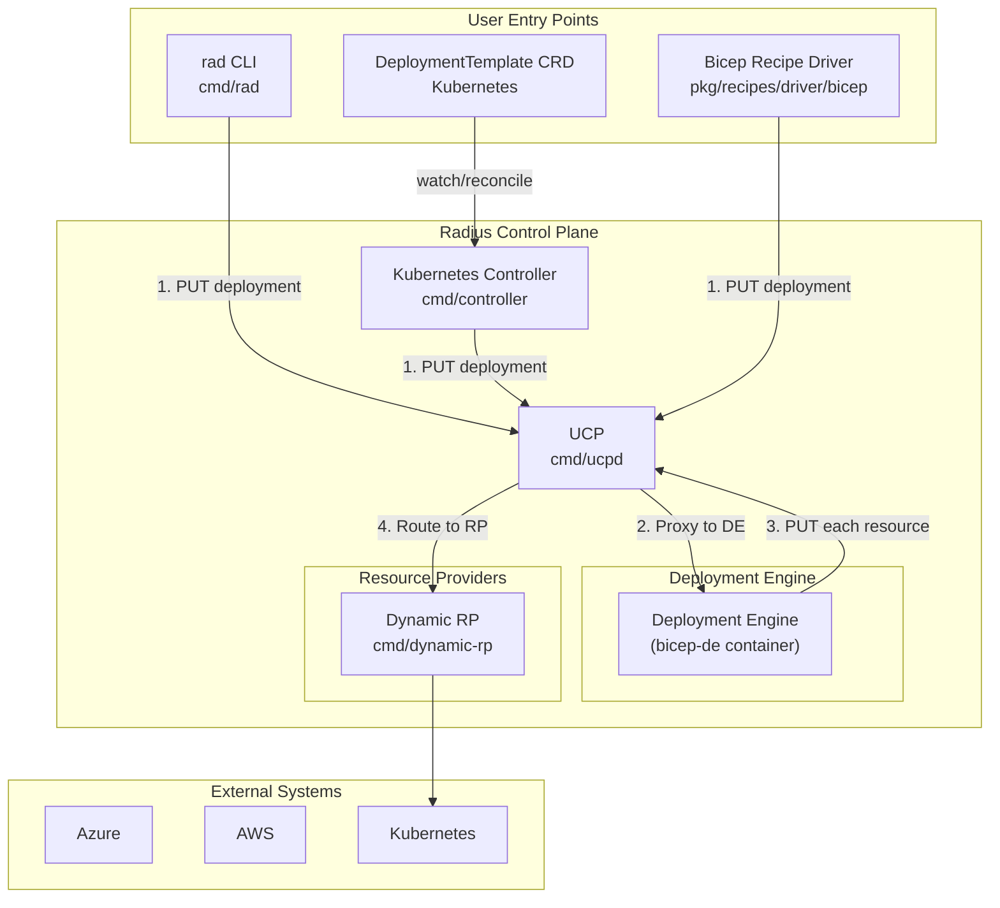
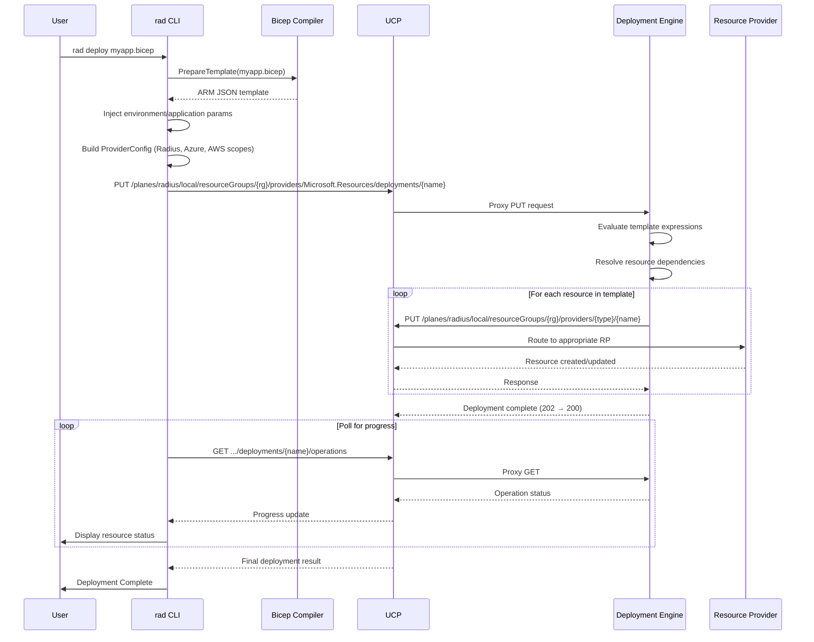
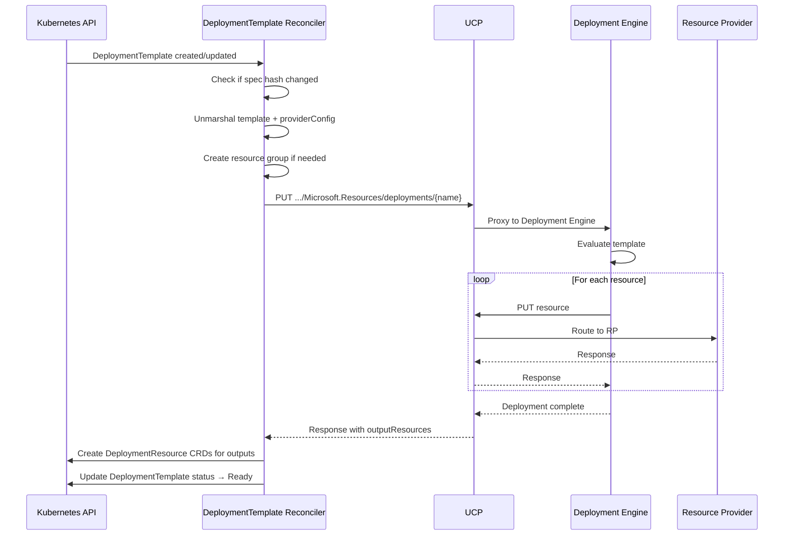
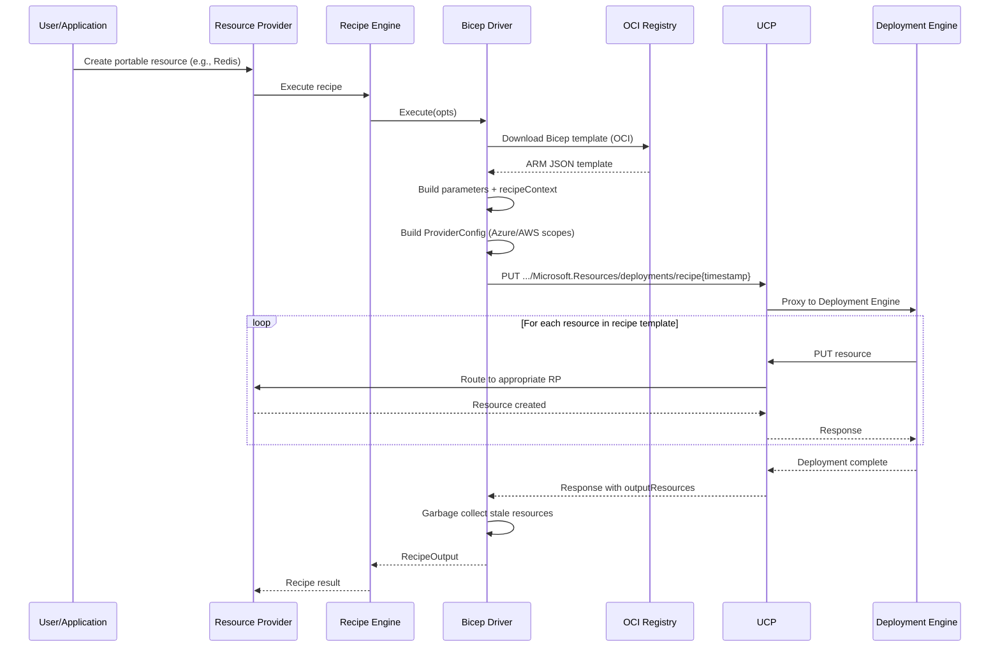
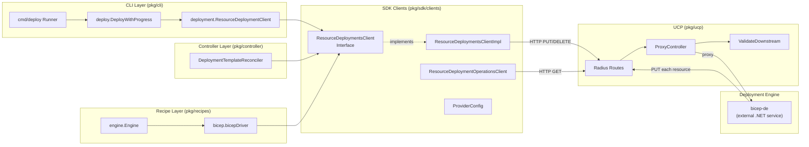
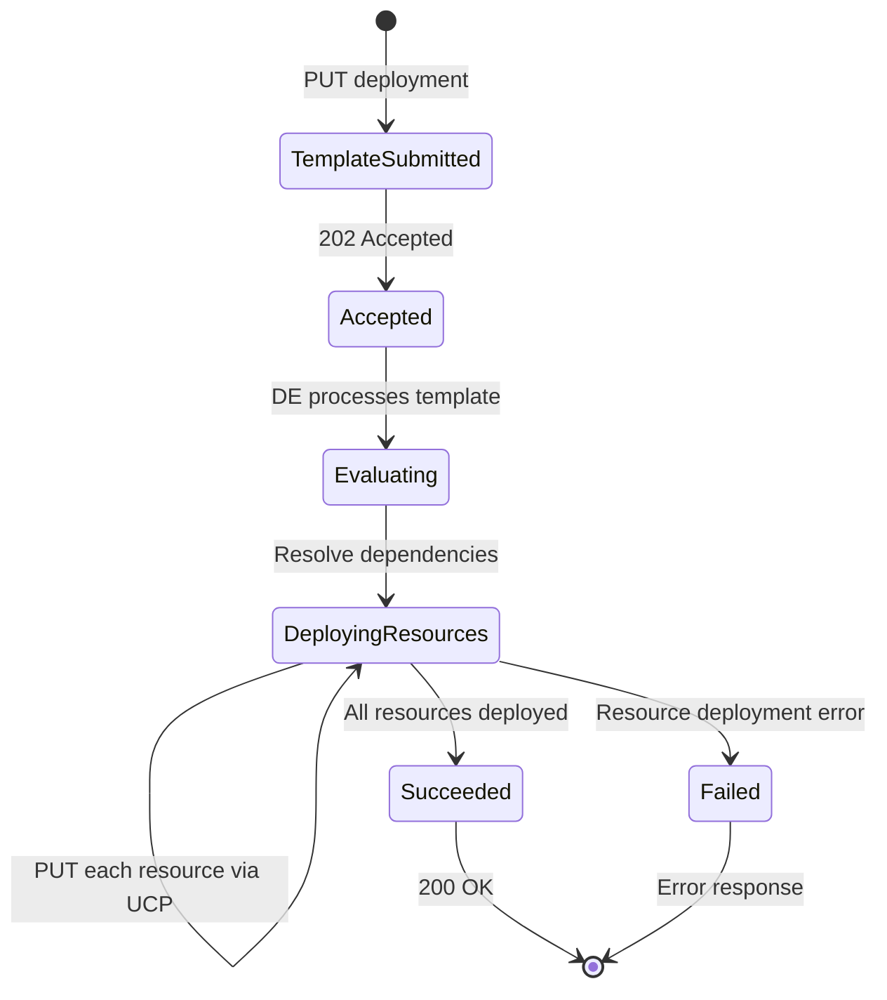
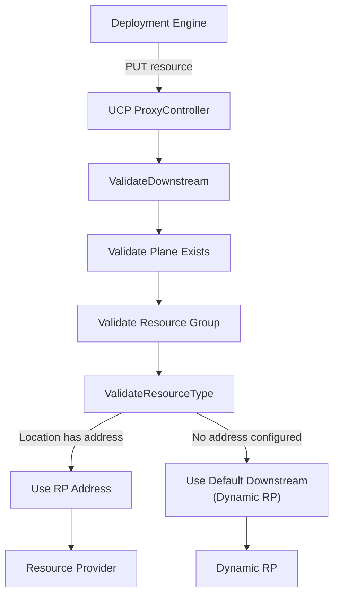
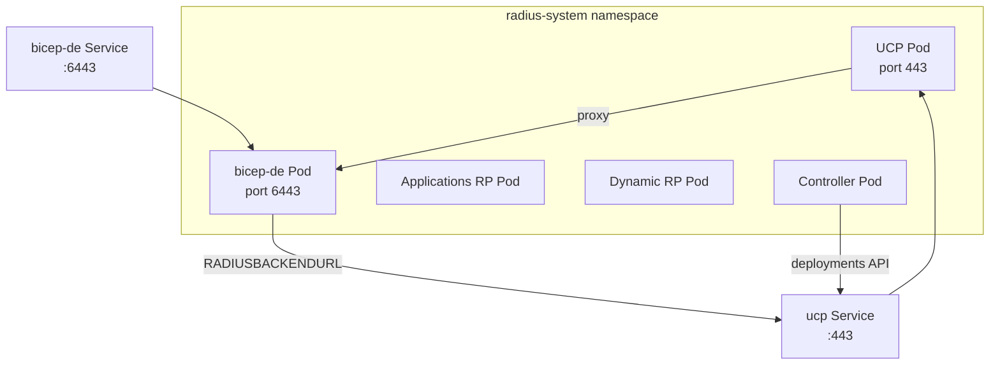

# Deployment Engine Architecture

The **Deployment Engine** (DE) is the component in Radius responsible for
processing ARM/Bicep template deployments. It is an external service (written in C#) that evaluates ARM JSON templates — the compiled output of Bicep
— and orchestrates the creation, update, and deletion of the resources defined
within them. The deployment engine acts as a bridge between declarative template
definitions and the imperative resource operations handled by UCP and the
resource providers.

## High-Level Overview



The deployment engine sits at the center of Radius's deployment pipeline. It
receives compiled ARM JSON templates, evaluates expressions, resolves
dependencies between resources in the template, and issues individual
PUT/DELETE requests back to UCP for each resource. UCP then routes those
requests to the appropriate resource provider.

## Key Components

### Deployment Engine Container (`bicep-de`)

- **Image**: `ghcr.io/radius-project/deployment-engine`
- **Language**: .NET/C# (external to this Go repository)
- **Port**: 6443 in Helm/self-hosted deployments; debug setups commonly expose
  localhost:5017 (for example, via `5017:5445` port-forwarding in Kubernetes
  debug manifests or `5017:8080` in the Docker debug script)
- **Helm chart**: [deploy/Chart/templates/de/](../../deploy/Chart/templates/de/)

The deployment engine is a .NET service deployed as a Kubernetes pod. It
implements the ARM deployment API (`Microsoft.Resources/deployments`) and
is responsible for:

- Parsing and evaluating ARM JSON templates (compiled Bicep output)
- Resolving template expressions, functions, and dependencies
- Orchestrating the order of resource deployments based on `dependsOn` declarations
- Issuing individual resource PUT/DELETE operations back to UCP
- Tracking deployment operations and their status
- Reporting deployment progress and output resources

### Configuration

The deployment engine is configured via environment variables:

| Variable | Purpose | Example |
| --- | --- | --- |
| `RADIUSBACKENDURL` | UCP endpoint for callbacks | `https://ucp.radius-system:443/apis/api.ucp.dev/v1alpha3` |
| `ASPNETCORE_URLS` | Listening URL | `http://+:6443` |
| `ARM_AUTH_METHOD` | Authentication method | `UCPCredential` |
| `SKIP_ARM` | Skip Azure ARM integration | `true` / `false` |
| `kubernetes` | Enable Kubernetes mode | `true` |

In production the `RADIUSBACKENDURL` points to the UCP service inside the
cluster (`https://ucp.radius-system:443/apis/api.ucp.dev/v1alpha3`). In
development, debug scripts/manifests set it to host-reachable UCP endpoints
such as `http://host.docker.internal:9000/apis/api.ucp.dev/v1alpha3` (Docker
debug) or `http://host.k3d.internal:9000/apis/api.ucp.dev/v1alpha3`
(Kubernetes debug manifest).

Debug manifests may also include provider toggles such as `AZURE_ENABLED`,
`AWS_ENABLED`, and `KUBERNETES_ENABLED`.

## How Deployments Work

There are three main entry points that trigger deployments through the
deployment engine:

1. **`rad deploy` CLI command** — interactive user-initiated deployments
2. **Kubernetes `DeploymentTemplate` CRD** — declarative Kubernetes-native deployments
3. **Bicep recipe execution** — infrastructure provisioning as part of portable resource creation

All three follow the same core pattern: compile/prepare an ARM JSON template,
submit it to the deployment engine via UCP, and poll for completion.

### Entry Point 1: `rad deploy` CLI Command



**Step-by-step walkthrough:**

1. The user runs `rad deploy myapp.bicep`. The CLI compiles the Bicep file into
   ARM JSON using the Bicep compiler
   ([pkg/cli/cmd/deploy/deploy.go](../../pkg/cli/cmd/deploy/deploy.go)).

2. The CLI injects automatic parameters (`environment`, `application`) via
   `injectAutomaticParameters` in
   ([pkg/cli/cmd/deploy/deploy.go](../../pkg/cli/cmd/deploy/deploy.go))
   and builds a `ProviderConfig` that specifies the Radius resource group
   scope, and optionally Azure and AWS scopes via `GetProviderConfigs` in
   ([pkg/cli/deployment/deploy.go](../../pkg/cli/deployment/deploy.go)).

3. A `ResourceDeploymentsClient` sends a PUT request to UCP at a path like:

   ```text
   /planes/radius/local/resourceGroups/{rg}/providers/Microsoft.Resources/deployments/rad-deploy-{uuid}
   ```

   The request body includes the compiled template, parameters, and provider
   config
   ([pkg/sdk/clients/resourcedeploymentsclient.go](../../pkg/sdk/clients/resourcedeploymentsclient.go)).

4. UCP's proxy controller receives the request and routes it to the deployment
   engine based on the `Microsoft.Resources` resource provider registration
   ([pkg/ucp/frontend/controller/radius/proxy.go](../../pkg/ucp/frontend/controller/radius/proxy.go)).

5. The deployment engine evaluates the template, resolves `dependsOn`
   dependencies, evaluates Bicep/ARM functions, and issues individual
   PUT requests back to UCP for each resource in the template.

6. UCP routes each resource request to the appropriate resource provider,
  with current authoring work primarily flowing through Dynamic RP, using `ValidateDownstream`
   ([pkg/ucp/frontend/controller/resourceGroups/util.go](../../pkg/ucp/frontend/controller/resourceGroups/util.go)).

7. The CLI polls the deployment operations endpoint to display progress to the
   user. Nested Bicep modules are tracked recursively.

### Entry Point 2: Kubernetes `DeploymentTemplate` CRD



The `DeploymentTemplateReconciler`
([pkg/controller/reconciler/deploymenttemplate_reconciler.go](../../pkg/controller/reconciler/deploymenttemplate_reconciler.go))
enables Kubernetes-native deployment of Bicep/ARM templates through a CRD. It:

- Watches `DeploymentTemplate` custom resources
- Computes a hash of the spec to detect changes
- Submits templates to the deployment engine via
  `ResourceDeploymentsClient.CreateOrUpdate`
- Polls for completion using resume tokens
- Creates `DeploymentResource` CRDs for each output resource
- Manages the full lifecycle including deletion via finalizers

### Entry Point 3: Bicep Recipe Execution



When a portable resource (like a Redis cache or Dapr state store) is created
with a Bicep recipe, the recipe engine's Bicep driver
([pkg/recipes/driver/bicep/bicep.go](../../pkg/recipes/driver/bicep/bicep.go))
executes the recipe by:

1. Downloading the Bicep template from an OCI container registry
2. Building a `recipeContext` parameter with metadata about the requesting resource
3. Constructing a `ProviderConfig` with the appropriate cloud provider scopes
4. Submitting the template to the deployment engine via the same
   `ResourceDeploymentsClient.CreateOrUpdate` API
5. Polling until the deployment completes
6. Garbage-collecting output resources that are no longer needed from previous deployments

## Component Interaction Diagram



### Key Interfaces and Types

| Type | Location | Purpose |
| --- | --- | --- |
| `ResourceDeploymentsClient` | [pkg/sdk/clients/resourcedeploymentsclient.go](../../pkg/sdk/clients/resourcedeploymentsclient.go) | Interface for creating/deleting deployments |
| `ResourceDeploymentsClientImpl` | Same file | HTTP implementation that talks to UCP |
| `ResourceDeploymentOperationsClient` | [pkg/sdk/clients/resourcedeploymentoperationsclient.go](../../pkg/sdk/clients/resourcedeploymentoperationsclient.go) | Client for listing deployment operations (progress) |
| `Deployment` / `DeploymentProperties` | [pkg/sdk/clients/resourcedeploymentsclient.go](../../pkg/sdk/clients/resourcedeploymentsclient.go) | Request payload containing template, parameters, and provider config |
| `ProviderConfig` | [pkg/sdk/clients/resourcedeploymentsclient.go](../../pkg/sdk/clients/resourcedeploymentsclient.go) | Scopes for Radius, Azure, AWS, and deployment targets (helper functions in [providerconfig.go](../../pkg/sdk/clients/providerconfig.go)) |
| `ResourceDeploymentClient` | [pkg/cli/deployment/deploy.go](../../pkg/cli/deployment/deploy.go) | CLI-layer wrapper that adds progress monitoring |
| `ProxyController` | [pkg/ucp/frontend/controller/radius/proxy.go](../../pkg/ucp/frontend/controller/radius/proxy.go) | UCP controller that proxies requests to downstream RPs and the DE |
| `DeploymentTemplateReconciler` | [pkg/controller/reconciler/deploymenttemplate_reconciler.go](../../pkg/controller/reconciler/deploymenttemplate_reconciler.go) | Kubernetes reconciler for `DeploymentTemplate` CRDs |
| `bicepDriver` | [pkg/recipes/driver/bicep/bicep.go](../../pkg/recipes/driver/bicep/bicep.go) | Recipe driver that deploys Bicep templates via the DE |

## Deployment Lifecycle

### Request Flow



1. **Template Submitted**: A client sends a PUT request to create a
   `Microsoft.Resources/deployments` resource. The resource ID follows the
   pattern:

   ```text
   /planes/radius/local/resourceGroups/{rg}/providers/Microsoft.Resources/deployments/{name}
   ```

2. **Accepted (202)**: UCP proxies the request to the deployment engine, which
   returns a 202 Accepted with a location header for polling.

3. **Evaluating**: The deployment engine parses the ARM JSON template,
   evaluates all expressions and functions, and builds a dependency graph of
   resources.

4. **Deploying Resources**: For each resource (in dependency order), the
   deployment engine sends a PUT request back to UCP at the resource's full
   resource ID. UCP routes each request to the correct resource provider.

5. **Complete**: When all resources are deployed, the deployment engine returns
   the final status with the list of output resources and any template outputs.

### Provider Config and Scoping

A **scope** is the base resource ID prefix that the deployment engine prepends
to each resource it deploys. Because a single Bicep template can declare
resources across multiple platforms (Radius, Azure, AWS), the deployment engine
needs to know *where* each category of resource lives. For example, a Radius
resource's full ID is formed by combining the Radius scope
(`/planes/radius/local/resourceGroups/my-rg`) with the provider namespace,
resource type, and name (for example,
`/providers/<radius-provider>/<resource-type>/my-resource`). An Azure resource uses its
Azure subscription and resource group as the scope, and an AWS resource uses
its account and region. Without scopes, the deployment engine would not know
which plane, subscription, account, or resource group to target when issuing
PUT requests back to UCP.

The `ProviderConfig` tells the deployment engine which scopes to use for
different resource types:

```json
{
  "radius": {
    "type": "Radius",
    "value": {
      "scope": "/planes/radius/local/resourceGroups/my-rg"
    }
  },
  "deployments": {
    "type": "Microsoft.Resources",
    "value": {
      "scope": "/planes/radius/local/resourceGroups/my-rg"
    }
  },
  "az": {
    "type": "AzureResourceManager",
    "value": {
      "scope": "/subscriptions/{sub-id}/resourceGroups/{azure-rg}"
    }
  },
  "aws": {
    "type": "AWS",
    "value": {
      "scope": "/planes/aws/aws/accounts/{account}/regions/{region}"
    }
  }
}
```

- **`radius`**: Scope for Radius resource types handled by the control plane
- **`deployments`**: Scope for nested `Microsoft.Resources/deployments`
- **`az`**: Optional Azure subscription/resource group scope
- **`aws`**: Optional AWS account/region scope

#### Why ProviderConfig Exists

A compiled Bicep/ARM template contains resource *types* (e.g.
`<radius-provider>/<resource-type>`, `Microsoft.Storage/storageAccounts`,
`AWS.S3/Bucket`) but does **not** contain any information about which Radius
resource group, Azure subscription, or AWS account those resources should be
created in. That targeting information is external to the template — it depends
on the caller's environment, workspace, and cloud credentials.

The `ProviderConfig` bridges this gap. It is a per-deployment sidecar payload
that maps each cloud provider to a scope (a base resource ID prefix). When the
deployment engine processes a resource, it looks up the provider that owns that
resource type and prepends the corresponding scope to form the full resource
ID. This design keeps templates portable: the same Bicep file can be deployed
into different resource groups, subscriptions, or AWS accounts simply by
changing the `ProviderConfig` — without modifying the template itself.

#### Where the Scopes Come From

The cloud provider scopes originate from user input during environment setup
and flow through the system as follows:

1. **User configures an environment** — When a user runs `rad init`, interactive
   prompts collect Azure credentials (subscription ID, resource group) and/or
   AWS credentials (account ID, region). These are converted into scope strings
   by `CreateEnvProviders()` in
   [pkg/cli/cmd/utils.go](../../pkg/cli/cmd/utils.go):
   - Azure: `/subscriptions/{sub-id}/resourceGroups/{rg}`
   - AWS: `/planes/aws/aws/accounts/{account-id}/regions/{region}`

   The scopes are stored as part of the `Providers` field on the Radius
  **Environment** resource.

2. **CLI reads providers from the environment** — At deploy time, the `rad
   deploy` runner fetches the environment resource and extracts the provider
   scopes via `setupCloudProviders()` in
   [pkg/cli/cmd/deploy/deploy.go](../../pkg/cli/cmd/deploy/deploy.go). The
   Radius scope (resource group) comes from the workspace configuration.

3. **Scopes are assembled into ProviderConfig** — `GetProviderConfigs()` in
   [pkg/cli/deployment/deploy.go](../../pkg/cli/deployment/deploy.go) takes
   those scopes and constructs the `ProviderConfig` that is sent with the
   deployment request.

For recipes, the same environment provider scopes are available in the
`ExecuteOptions.Configuration.Providers` field passed to the Bicep driver,
which reads them in `newProviderConfig()`.

For `DeploymentTemplate` CRDs, the provider config is set in the CRD's
`spec.providerConfig` field by whatever controller or tool creates the custom
resource — typically the Radius controller, which pulls scopes from the
same environment resource.

#### How ProviderConfig Is Built

`ProviderConfig` is not a config file on disk — it is a Go struct
([pkg/sdk/clients/resourcedeploymentsclient.go](../../pkg/sdk/clients/resourcedeploymentsclient.go))
that is constructed at runtime and serialized to JSON inside the deployment
request body (`DeploymentProperties.ProviderConfig`). Helper functions for
building it live in
[pkg/sdk/clients/providerconfig.go](../../pkg/sdk/clients/providerconfig.go).

There are three places where a `ProviderConfig` is constructed:

1. **CLI deploys** — `GetProviderConfigs()` in
   [pkg/cli/deployment/deploy.go](../../pkg/cli/deployment/deploy.go) calls
   `NewDefaultProviderConfig()` to set the Radius and deployments scopes, then
   optionally adds Azure and AWS scopes based on the user's workspace
   configuration.

2. **Bicep recipe driver** — `newProviderConfig()` in
   [pkg/recipes/driver/bicep/bicep.go](../../pkg/recipes/driver/bicep/bicep.go)
   builds a config using the recipe's environment provider settings (Azure
   subscription/resource group, AWS account/region).

3. **DeploymentTemplate reconciler** —
   [pkg/controller/reconciler/deploymenttemplate_reconciler.go](../../pkg/controller/reconciler/deploymenttemplate_reconciler.go)
   reads the provider config from the `DeploymentTemplate` CRD's
   `spec.providerConfig` field, which is populated by whoever creates the
   Kubernetes custom resource.

In all cases the `ProviderConfig` travels as part of the PUT request body to
the deployment engine, which reads it to determine the scope prefix for each
resource's ID.

### UCP Routing

When the deployment engine sends resource requests back to UCP, the
`ProxyController` determines the downstream destination:



Resource provider URLs are registered in UCP's database as part of the resource
provider manifest system. UCP looks up the registered location for a resource
type and routes the request to its configured address. If no specific address is
found, requests fall through to the default downstream (Dynamic RP).

## Deployment in Kubernetes



In a production Kubernetes cluster, the deployment engine runs as:

- **Deployment**: `bicep-de` with 1 replica
- **Service**: `bicep-de` on port 6443
- **ServiceAccount**: `bicep-de` with cluster-admin privileges — required
  because Bicep templates can use the Kubernetes extensibility provider
  (`extension kubernetes`) to deploy arbitrary Kubernetes resource types
  (Deployments, Services, Secrets, CRDs, etc.) directly to the Kubernetes
  API, bypassing UCP. Since the set of resource types and target namespaces
  is determined by user templates and is unbounded, a fixed set of RBAC
  rules is not feasible.
- **ConfigMap**: `bicep-de-config` with ASP.NET Core app settings

The deployment engine communicates with UCP via the `RADIUSBACKENDURL`
environment variable, which points to the UCP service's internal cluster URL.

## Notable Details

### Asynchronous Operation Pattern

Deployments are long-running operations. The deployment engine returns HTTP 202
(Accepted) with a polling URL. Callers use Azure SDK pollers to track progress:

- `ResourceDeploymentsClient.CreateOrUpdate()` returns a `Poller` that can be
  polled with `PollUntilDone()`
- The Kubernetes reconcilers use `ContinueCreateOperation()` with resume tokens
  to survive pod restarts across reconciliation loops
- The CLI polls the `/operations` sub-resource to display per-resource progress

### Bicep Compilation Happens Client-Side

The Bicep compiler runs on the client (CLI machine), not inside the cluster.
The deployment engine only understands ARM JSON — the compiled output format.
This means:

- `rad deploy myapp.bicep` first compiles to ARM JSON via `PrepareTemplate()`
- Recipe templates are stored as compiled ARM JSON in OCI registries
- The `DeploymentTemplate` CRD stores pre-compiled ARM JSON in its `spec.template` field

### Callback Pattern

The deployment engine and UCP form a bidirectional communication loop:

1. **Client → UCP → DE**: The initial deployment request flows through UCP to
   the deployment engine
2. **DE → UCP → RP**: For each resource, the deployment engine calls back to
   UCP, which routes to the appropriate resource provider

This means the deployment engine must have network access to UCP (via
`RADIUSBACKENDURL`) and UCP must have network access to the deployment engine
(via the registered service URL).

### Progress Monitoring

The CLI provides real-time deployment progress by polling the deployment
operations endpoint. The `monitorProgress` function in
[pkg/cli/deployment/deploy.go](../../pkg/cli/deployment/deploy.go)
recursively monitors nested Bicep modules by spawning additional polling
goroutines when it detects `Microsoft.Resources/deployments` sub-operations.

### DeploymentProcessor vs. Deployment Engine

These are two different concepts that can be confused:

- **Deployment Engine** (`bicep-de`): External .NET service that evaluates ARM
  templates and orchestrates multi-resource deployments
- **DeploymentProcessor** ([pkg/corerp/backend/deployment/deploymentprocessor.go](../../pkg/corerp/backend/deployment/deploymentprocessor.go)):
  Go interface inside the Applications RP that handles rendering and deploying
  individual Radius resources (containers, gateways, volumes) to their target
  infrastructure (e.g., Kubernetes). The deployment engine creates the
  individual resources; the `DeploymentProcessor` handles what happens inside
  each resource provider when it receives a PUT request.
