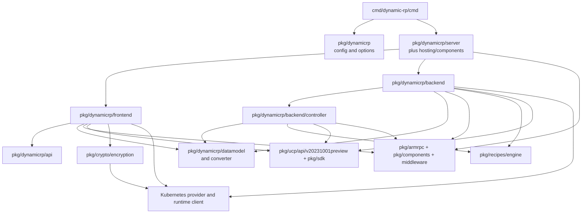
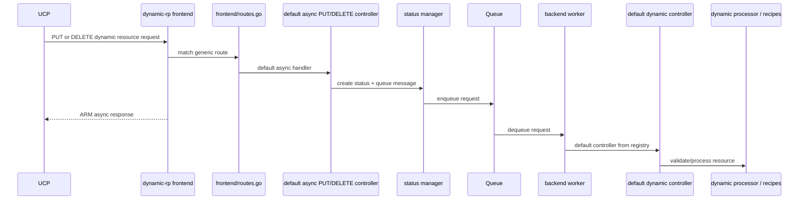

# dynamic-rp Architecture

`dynamic-rp` is the generic resource provider for resource types that do not
have their own dedicated provider implementation in this repository.

This process owns generic resource lifecycle handling for dynamic types. It is
the place for shared generic provider behavior, not for specialized logic that
belongs in a dedicated Applications.* provider.

## Entry Points

- Binary entry: [cmd/dynamic-rp/main.go](../../cmd/dynamic-rp/main.go)
- Cobra root: [cmd/dynamic-rp/cmd/root.go](../../cmd/dynamic-rp/cmd/root.go)
- Config loading: [pkg/dynamicrp/config.go](../../pkg/dynamicrp/config.go)
- Option construction: [pkg/dynamicrp/options.go](../../pkg/dynamicrp/options.go)
- Server bootstrap: [pkg/dynamicrp/server/server.go](../../pkg/dynamicrp/server/server.go)

## Quick Reference

| Topic | Start Here |
|------|------------|
| Startup | `cmd/dynamic-rp/cmd/root.go` |
| Host composition | `pkg/dynamicrp/server/server.go` |
| API service | `pkg/dynamicrp/frontend/service.go` |
| Route wiring | `pkg/dynamicrp/frontend/routes.go` |
| Async backend | `pkg/dynamicrp/backend/service.go` |

| Test Focus | Packages |
|-----------|----------|
| Frontend/read-path behavior | `./pkg/dynamicrp/frontend/...` |
| Backend/processor behavior | `./pkg/dynamicrp/backend/...` |
| Integration coverage | `./pkg/dynamicrp/integrationtest/...` |
| Broad safety check | `./pkg/dynamicrp/...` |

## Core Packages

| Package | Responsibility |
|--------|----------------|
| `pkg/dynamicrp/frontend` | request handling and API surface |
| `pkg/dynamicrp/backend` | backend processing and async work |
| `pkg/dynamicrp/datamodel` | dynamic resource persistence model |
| `pkg/dynamicrp/api` | versioned API types |
| `pkg/dynamicrp/server` | process bootstrap and hosting |

## How It Works

The process starts in [cmd/dynamic-rp/cmd/root.go](../../cmd/dynamic-rp/cmd/root.go),
which reads config, constructs runtime options, and builds a host through
[pkg/dynamicrp/server/server.go](../../pkg/dynamicrp/server/server.go).

The important distinction from `applications-rp` is not “simpler” but
“generic.” Dynamic RP exists so Radius can manage types without a bespoke RP
implementation, so its route and backend layers need to stay type-agnostic.

Change `dynamic-rp` when the behavior applies across dynamic resource types,
such as generic lifecycle orchestration, shared persistence behavior, generic
async handling, or common validation and metadata behavior. If the behavior is
really specific to one Applications.* resource, it probably belongs in a
dedicated RP.

## Invariants And Constraints

- Keep the implementation generic and type-agnostic where possible.
- Avoid leaking dedicated provider behavior into the dynamic provider.
- Treat persistence, queueing, and secrets as shared runtime dependencies rather
  than business logic destinations.

## Change This Safely

### Packages That Usually Move Together

- `pkg/dynamicrp/frontend` and `pkg/dynamicrp/backend` when request handling and
  async behavior are linked
- `pkg/dynamicrp/api` and `pkg/dynamicrp/datamodel` when resource shape changes
- `pkg/dynamicrp/server`, config, and options code when process bootstrap changes

### Suggested Test Scope

- `go test ./pkg/dynamicrp/...`
- Pay particular attention to frontend, backend/controller, backend/processor,
  and integration tests under `pkg/dynamicrp/integrationtest/...`

## Package Dependency View

The important static seam is `root -> host -> frontend generic routes` versus
`backend default controller registration`. Dynamic RP is organized around a
generic request model rather than a large set of resource-specific setup
packages.

## Representative Flow

The representative Dynamic RP flow is generic request-to-default-controller
handoff. The frontend builds generic routes and default async handlers, then the
backend worker resolves the operation through a default controller factory
instead of a resource-specific registration table.

## Related Docs

- [service-interaction-map.md](service-interaction-map.md)
- [applications-rp.md](applications-rp.md)
- [state-persistence.md](state-persistence.md)