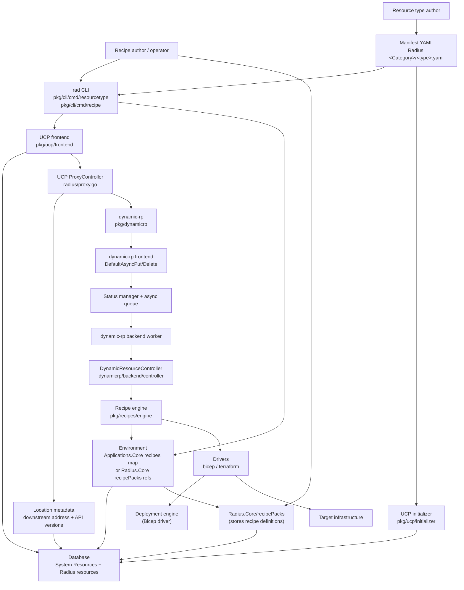
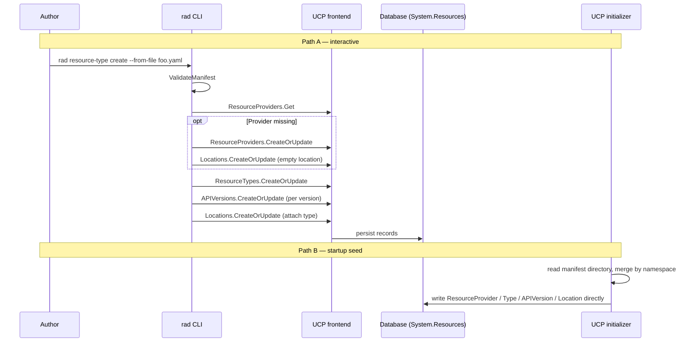
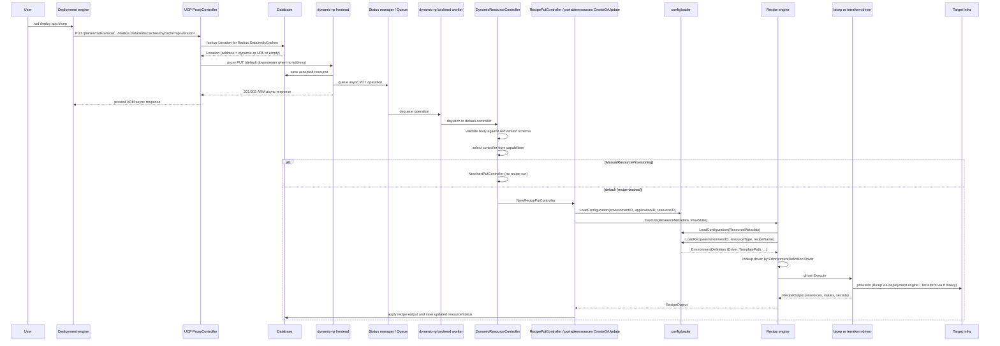
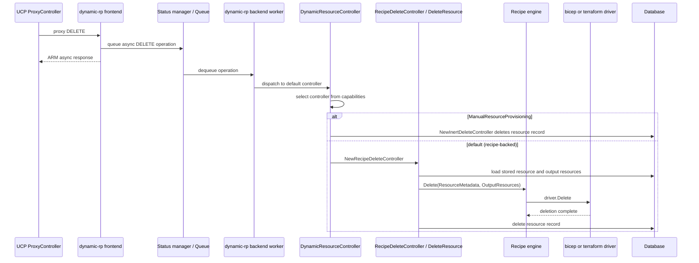

# Radius Extensibility Architecture

Radius is extended by registering **resource types** (the API surface) and,
for recipe-backed dynamic types, **recipes** (the implementation that
provisions infrastructure for those types). A Bicep deployment that references
a registered type is routed by UCP according to that type's `Location` record.
When the location has no custom downstream address, UCP uses its default
downstream, which is configured as dynamic-rp. dynamic-rp then either runs the
selected recipe or uses an inert controller for types that declare manual
resource provisioning.

This document covers the three flows that make extensibility work:

1. How resource types are registered.
2. How recipes are registered.
3. How types and recipes are invoked during deployment.

## High-Level View



### Key Components

- **Resource type manifest** — YAML describing the namespace
  (`Radius.<Category>`), one or more types, API versions, OpenAPI schemas, and
  capabilities. Source of truth for the type.
- **UCP `System.Resources` provider** — internal provider that owns the
  `resourceProviders`, `resourceTypes`, `apiVersions`, and `locations`
  resources used for routing and validation.
- **dynamic-rp** — the generic resource provider that handles registered
  resource types routed to the default downstream instead of to a dedicated RP
  ([dynamic-rp.md](dynamic-rp.md)).
- **Environment** — holds the recipe references used by the engine. The
  `Applications.Core/environments` path uses a per-type recipe map
  (`properties.recipes[<type>][<recipeName>]`); the newer
  `Radius.Core/environments` path uses `properties.recipePacks` references and
  optional `properties.recipeParameters` overrides.
- **Recipe pack** — `Radius.Core/recipePacks` resource whose
  `properties.recipes[<type>]` entries store recipe kind, location,
  parameters, and `plainHttp` for the `Radius.Core` environment path.
- **Recipe engine** — selects a driver and runs the recipe to produce
  resources, values, and secrets.

## Resource Type Registration

A resource type is registered by writing its manifest into UCP under the
`System.Resources` provider. There are two paths to do this. They produce
equivalent database records but are not interchangeable: Path A
(`rad resource-type create`) registers custom, user-defined types against a
running cluster, while Path B (the UCP initializer) runs only at UCP pod
startup and registers the built-in and bundled types that ship with Radius.

### Path A: `rad resource-type create`

Used by authors registering types into an existing cluster.

- Command: [pkg/cli/cmd/resourcetype/create/create.go](../../pkg/cli/cmd/resourcetype/create/create.go)
- Manifest parse / validate: [pkg/cli/manifest/validation.go](../../pkg/cli/manifest/validation.go), [pkg/cli/manifest/parser.go](../../pkg/cli/manifest/parser.go)
- Provider + types + API versions + location calls: [pkg/cli/manifest/registermanifest.go](../../pkg/cli/manifest/registermanifest.go)
- UCP client: `pkg/ucp/api/v20231001preview`

`rad resource-type create` calls UCP through the generated client factory in
this order:

1. `EnsureResourceProviderExists` — fetch the namespace (e.g.
  `Radius.Compute`), or create the resource provider and an empty location if
  it does not exist.
2. `RegisterType` — register each selected type from the manifest.
3. `ResourceTypesClient.BeginCreateOrUpdate` — create the type (e.g.
   `containers`) with its capabilities, default API version, and description.
4. `APIVersionsClient.BeginCreateOrUpdate` — create one entry per API version
   with the OpenAPI schema attached.
5. `LocationsClient.BeginCreateOrUpdate` — update the location resource so the
   type appears under that location, optionally with a downstream `address`
   that points UCP at a specific RP. If no address is set, UCP routes to its
   default downstream (dynamic-rp).

### Path B: UCP initializer

Used during control-plane startup to seed built-in and bundled types.

- Service: [pkg/ucp/initializer/service.go](../../pkg/ucp/initializer/service.go)
- Built-in core schemas: [pkg/ucp/initializer/radius_core_openapi.go](../../pkg/ucp/initializer/radius_core_openapi.go)

The initializer scans a manifest directory, merges files by namespace (so
`containers.yaml` and `persistentVolumes.yaml` collapse into one
`Radius.Compute` provider), and writes `ResourceProvider`, `ResourceType`,
`APIVersion`, `Location`, and `ResourceProviderSummary` records **directly to
the database**, bypassing the HTTP API and async queue. This path exists so
the cluster boots into a known good state without going through itself.

### Storage Layout

All records live under the local Radius plane:

```text
/planes/radius/local/providers/System.Resources/resourceProviders/<Namespace>
  /resourceTypes/<typeName>
    /apiVersions/<version>
  /locations/<locationName>
```

The `Location` resource is what UCP consults at request time to decide where
to proxy a request for that type.

### Registration Flow



## Recipe Registration

`rad recipe register` stores recipes as entries on an
`Applications.Core/environments` resource, keyed by the resource type the
recipe targets. That CLI path is not the only recipe storage model in the
current code: `Radius.Core/recipePacks` are first-class resources, and
`Radius.Core/environments` reference them through `properties.recipePacks`.

- Command: [pkg/cli/cmd/recipe/register/register.go](../../pkg/cli/cmd/recipe/register/register.go)
- Environment client: `pkg/cli/clients` (`CreateOrUpdateEnvironment`)
- Environment data model / properties: `pkg/corerp/datamodel`, `pkg/corerp/api/v20231001preview`
- Recipe pack resource model: [pkg/corerp/datamodel/recipepack.go](../../pkg/corerp/datamodel/recipepack.go), [pkg/corerp/setup/setup.go](../../pkg/corerp/setup/setup.go)

`rad recipe register` does the following:

1. Fetches the target environment.
2. Builds either a `BicepRecipeProperties` or `TerraformRecipeProperties`
   value depending on the `--template-kind` flag, populating
   `TemplateKind`, `TemplatePath`, optional `TemplateVersion` /
   `PlainHTTP`, and any `Parameters`.
3. Inserts the recipe under
   `envResource.Properties.Recipes[<resourceType>][<recipeName>]`.
4. Calls `CreateOrUpdateEnvironment` to persist.

The resulting `Applications.Core/environments` shape stores a single recipe per
resource type under `properties.recipes[<type>].default`:

```yaml
properties:
  recipes:
    Radius.Data/redisCaches:
      default:
        templateKind: bicep
        templatePath: ghcr.io/.../redis:1.0.0
        parameters: { ... }
```

The same `properties.recipes` map can be edited directly (e.g. by Bicep that
defines an `Applications.Core` environment) — the CLI is a convenience that
performs the merge and update.

For the `Radius.Core` environment path, recipe definitions are stored on
`Radius.Core/recipePacks` resources. An environment references those packs by
ID and optionally overrides their parameters per resource type:

```yaml
# Radius.Core/environments
properties:
  recipePacks:
    - /planes/radius/local/resourceGroups/default/providers/Radius.Core/recipePacks/data-recipes
  recipeParameters:
    Radius.Data/redisCaches:
      size: standard
```

```yaml
# Radius.Core/recipePacks (referenced above)
properties:
  recipes:
    Radius.Data/redisCaches:
      recipeKind: bicep
      recipeLocation: ghcr.io/.../redis:1.0.0
      plainHttp: false
      parameters: { ... }
```

During recipe loading,
[configloader.LoadRecipe](../../pkg/recipes/configloader/environment.go)
fetches the environment's recipe pack IDs, finds the first pack with a recipe
whose key matches the resource type, and reconciles that recipe's parameters
with environment-level `recipeParameters` for the same type.

Recipe names are selected by the resource being deployed. For dynamic
resources, omitting `properties.recipe` does not disable recipes;
[DynamicResource.GetRecipe](../../pkg/dynamicrp/datamodel/dynamicresource.go)
returns a recipe named `default` when the property is absent. That means an
environment recipe named `default` is the implicit convention for resource
types that should work without an explicit recipe block.

## Deployment Invocation

Once the type exists and its selected dynamic-rp path has the required backing
configuration, a user deploys a Bicep file that references the type. For a
recipe-backed type this means an environment recipe map entry or recipe pack
definition exists; for a manual-provisioning type no recipe is required. For
example:

```bicep
resource cache 'Radius.Data/redisCaches@2025-08-01-preview' = {
  name: 'mycache'
  properties: {
    environment: env.id
    application: app.id
    recipe: { name: 'default' }
  }
}
```

The full invocation chain is:



### How UCP Routes The Request

[pkg/ucp/frontend/controller/radius/proxy.go](../../pkg/ucp/frontend/controller/radius/proxy.go)
implements `ProxyController.Run`. For every request to a Radius-plane resource
it calls
[resourcegroups.ValidateDownstream](../../pkg/ucp/frontend/controller/resourcegroups/util.go),
which loads the `Location` for the resource type and reads
`location.Properties.Address`. If the address is set, UCP proxies to that URL;
otherwise it falls back to the `defaultDownstream` configured at startup,
which in practice is dynamic-rp ([pkg/ucp/config.go](../../pkg/ucp/config.go)).

This is the extension point that allows both dynamic and dedicated resource
providers. A location with no address uses dynamic-rp; a location with an
address routes to the RP implementation at that URL. UCP still validates the
registered type and API version in both cases before forwarding the request.

After proxying a mutating top-level resource request that
`ProxyController.ShouldTrackRequest` accepts, UCP may also update tracked
resource state. If the downstream response is terminal it tries to update the
tracked resource synchronously; otherwise it queues a background tracked
resource update. This is separate from the dynamic-rp recipe operation queue.

### How dynamic-rp Picks A Path

[pkg/dynamicrp/backend/controller/dynamicresource.go](../../pkg/dynamicrp/backend/controller/dynamicresource.go)
hosts the generic async controller. It:

1. Looks up the `ResourceType` / `APIVersion` and validates the incoming body
   against the schema.
2. Reads the type's capabilities and the operation method (PUT / DELETE).
3. Returns an inert controller when the type declares
   `ManualResourceProvisioning` (resources whose state is provided by the
   caller, not provisioned by a recipe), or a recipe-backed controller
   otherwise:
   - PUT → [putrecipe.go](../../pkg/dynamicrp/backend/controller/putrecipe.go) →
     `portableresources/backend/controller.NewCreateOrUpdateResource`
   - DELETE → [deleterecipe.go](../../pkg/dynamicrp/backend/controller/deleterecipe.go)

The dynamic-rp frontend handles the first half of the async operation. Its PUT
route uses `defaultoperation.NewDefaultAsyncPut`, which converts the request,
runs update filters, saves the accepted resource, queues the async operation,
and returns the ARM async response. The backend worker later dispatches that
queued operation to the default controller registered in
[pkg/dynamicrp/backend/service.go](../../pkg/dynamicrp/backend/service.go).

Dynamic resources also use schema annotations for sensitive input handling.
The frontend encryption filter fetches the resource schema, finds fields marked
with `x-radius-sensitive`, and encrypts those property values before the
accepted resource is stored. During backend processing,
`CreateOrUpdateResource` decrypts a recipe-only copy of those values, persists
a redacted resource, and passes the decrypted copy to the recipe engine. This
keeps recipe input usable without storing sensitive plaintext.

### How The Recipe Runs

[pkg/portableresources/backend/controller/createorupdateresource.go](../../pkg/portableresources/backend/controller/createorupdateresource.go)
assembles a `recipes.ResourceMetadata` (environment ID, application ID, the
resource's own ID and properties, and any connected-resource metadata) and
calls `engine.Execute`.

The engine
([pkg/recipes/engine/engine.go](../../pkg/recipes/engine/engine.go)) then:

1. Loads runtime configuration for the environment via
   [`configloader.LoadConfiguration`](../../pkg/recipes/configloader/environment.go).
2. Skips driver execution when the environment is simulated.
3. Loads the recipe definition via
   [`configloader.LoadRecipe`](../../pkg/recipes/configloader/environment.go).
   For `Applications.Core` environments, this fetches the environment, looks
   up `Properties.Recipes[resourceType][recipeName]`, and returns an
   `EnvironmentDefinition` whose `Driver` field is the `TemplateKind` string.
   For `Radius.Core` environments, this fetches the referenced recipe packs,
   finds the definition keyed by the resource type, applies matching
   environment-level recipe parameter overrides, and maps `RecipeKind` /
   `RecipeLocation` into the same `EnvironmentDefinition` shape.
4. Selects the driver from the engine's `Drivers` map keyed by
   `EnvironmentDefinition.Driver`
   (see
   [pkg/recipes/controllerconfig/config.go](../../pkg/recipes/controllerconfig/config.go) —
   `recipes.TemplateKindBicep` maps to the bicep driver, `TemplateKindTerraform`
   to the terraform driver).
5. Loads any driver-required secrets through `DriverWithSecrets` and the
    environment's configured secret stores.
6. Calls `driver.Execute`. The bicep driver hands the template to the
   deployment engine; the terraform driver shells out to the terraform binary.
7. Returns a `RecipeOutput` (`Resources`, `Values`, `Secrets`) to the
  controller.

The dynamic resource processor records deployed resources, computed values,
and secret references under status. It uses the registered schema as a filter
when copying computed or secret values back into top-level resource
properties, so recipe output only becomes user-visible when the property name
exists in the schema and is not one of the basic Radius properties. The
processor does not currently validate dynamic recipe output against the full
registered schema; [pkg/dynamicrp/backend/processor/dynamicresource.go](../../pkg/dynamicrp/backend/processor/dynamicresource.go)
contains a TODO noting that schema-driven output validation is bypassed.

## Delete Invocation

DELETE follows the same UCP routing, dynamic-rp frontend, async queue, and
`DynamicResourceController` selection path as PUT. The recipe-backed branch
delegates to [deleterecipe.go](../../pkg/dynamicrp/backend/controller/deleterecipe.go),
which constructs the shared `DeleteResource` controller.



`DeleteResource` skips driver deletion when the recipe deployment failed during
setup, because no output resources were created. Otherwise it passes the stored
output resources to the driver so recipe-created infrastructure can be cleaned
up before the Radius resource record is removed.

## Invariants

- The contract between UCP and any RP (built-in or dynamic) is `Location`
  routing on the resource type — never type-specific switching in UCP.
- dynamic-rp must remain type-agnostic. Schema validation and capability
  inspection drive behavior; there is no per-type code path here.
- For the `Applications.Core` path, recipes are owned by the environment, not
  the type. A type with no recipe registered for the environment fails at
  `LoadRecipe` with `RecipeNotFoundFailure`. For the `Radius.Core` path,
  recipes are stored on `Radius.Core/recipePacks`, and the environment owns
  the list of recipe pack references and per-type parameter overrides.
- Dynamic resources default to recipe name `default` when `properties.recipe`
  is omitted.
- The driver lookup key is the recipe's `templateKind` for
  `Applications.Core` recipes and the mapped `recipeKind` for
  `Radius.Core` recipe packs. Adding a new driver means registering it in the
  engine's `Drivers` map.
- Dynamic recipe output only becomes user-visible resource properties when
  those properties exist in the registered schema and are not basic Radius
  properties such as `application` or `environment`.
- Sensitive input fields marked by schema annotations are encrypted by the
  frontend filter when the accepted resource is first stored. During backend
  processing the recipe controller decrypts an in-memory copy for recipe
  execution and then persists a redacted resource with those fields set to
  `nil`, so the durable resource record retains neither plaintext nor
  ciphertext for sensitive fields.

## Change This Safely

- Adding a new built-in resource type: add a manifest, register it through the
  CLI or initializer, and (if it has default recipe-backed behavior) wire a
  recipe through the environment recipe map or a recipe pack used by tests.
- Adding a new recipe driver: implement `recipes/driver.Driver`, register it
  in [controllerconfig/config.go](../../pkg/recipes/controllerconfig/config.go),
  and pick a stable driver key used by `templateKind` or `recipeKind`.
- Adding a new capability that changes the deployment path: extend
  `DynamicResourceController.selectController` and add the corresponding
  controller under
  [pkg/dynamicrp/backend/controller](../../pkg/dynamicrp/backend/controller/).
- Changing the manifest schema: update
  [pkg/cli/manifest](../../pkg/cli/manifest/) **and** the initializer's direct
  database writer in [pkg/ucp/initializer/service.go](../../pkg/ucp/initializer/service.go).
  Both paths must produce equivalent records.

## Related Docs

- [dynamic-rp.md](dynamic-rp.md) — the process that hosts the generic
  controllers described above.
- [ucp.md](ucp.md) — UCP request routing and the proxy controller.
- [deployment-engine.md](deployment-engine.md) — what the bicep driver hands
  templates to.
- [terraform-bicep-config.md](terraform-bicep-config.md) — environment-level
  recipe configuration (private registries, provider installation, env vars).
- [state-persistence.md](state-persistence.md) — where resource and recipe
  state lives.
