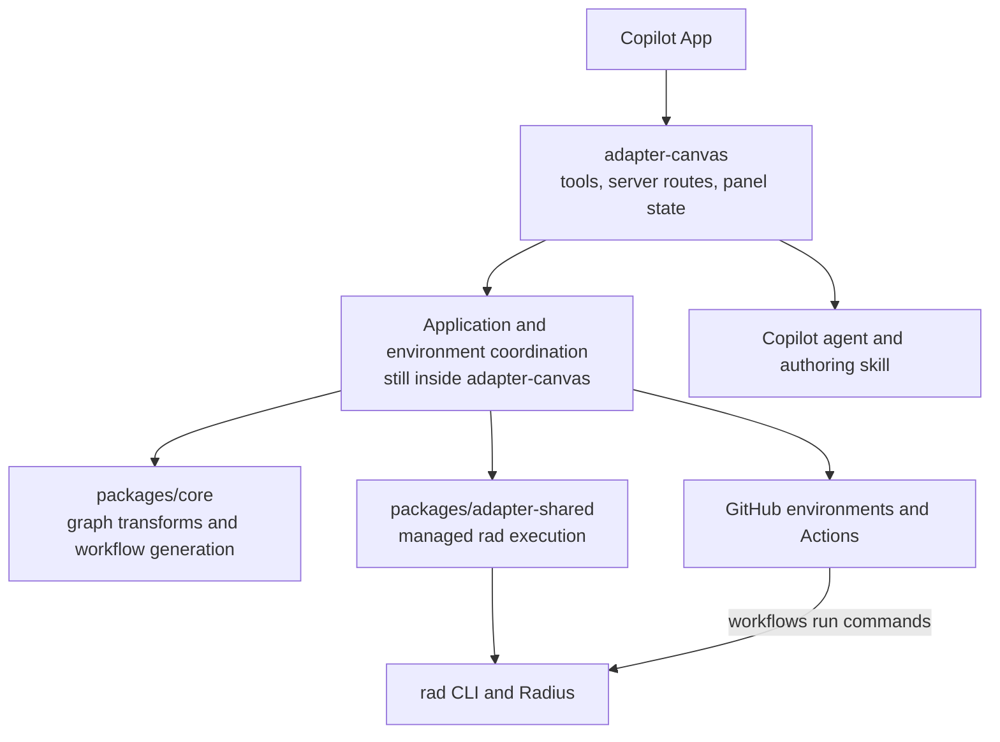
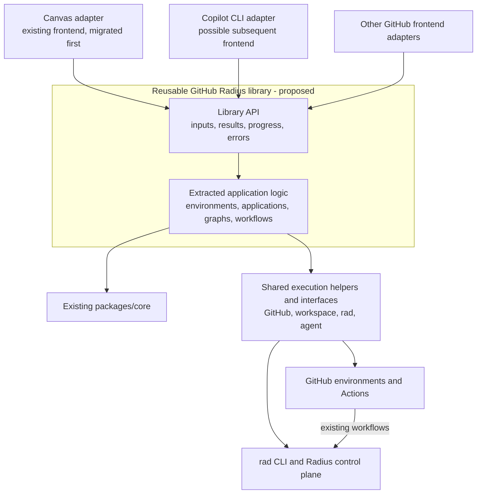
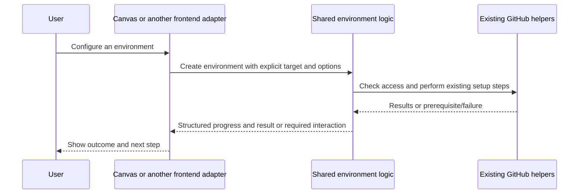
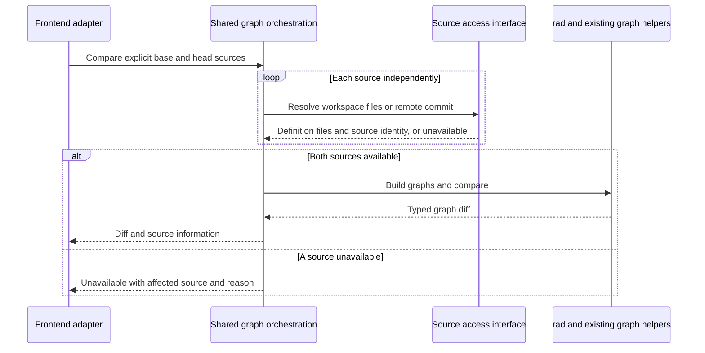

# GitHub Radius: Extracting a Reusable Library from Canvas

**Status: Proposed refactor.** Extract GitHub Radius's existing application and environment functionality from Canvas-specific code into a reusable library in `radius-project/ai-extensions`. Canvas becomes a consumer of that library, and other GitHub frontends can use the same implementation.

## Problem and Goal

GitHub Radius currently creates GitHub environments, coordinates Radius application authoring and deployment, calls the Radius CLI, and reports workflow results through the Copilot App's Canvas integration. Some of this functionality is reusable today, but much of the coordination still lives in the Canvas adapter and depends on its server, request types, or panel state.

That coupling makes another frontend expensive to build. A Copilot CLI integration, for example, would have to reproduce the Canvas implementation's decisions about environment setup, command execution, workflow dispatch, progress, and failures, or depend on Canvas being open. Copies of this logic would drift: a deployment fix in Canvas would not necessarily fix the same problem in another frontend.

**The goal is to implement GitHub Radius functionality once and reuse it across frontends, including Canvas.** Move the application logic into a library with a clear API contract. Frontends collect input, call that API, and present results. The library performs the shared work through existing GitHub, workspace, agent, and `rad` integrations.

The result should be that adding a frontend means writing an adapter for its interaction model, not reimplementing environment creation or deployment.

## Scope

The implementation work is primarily in **`radius-project/ai-extensions`**: extract existing functionality, remove Canvas dependencies from it, and route Canvas through the extracted library. **`radius-project/radius`** continues to provide the CLI, control plane, resource APIs, graph construction, and deployment engine. This document lives in the Radius repository because it explains that cross-repository boundary; it does not propose moving the Go implementation into the extension library.

| In scope                           | What it means                                                                                                                                                           |
|------------------------------------|-------------------------------------------------------------------------------------------------------------------------------------------------------------------------|
| Extract existing application logic | Move environment setup, application-definition coordination, graph orchestration, deployment, status, repair coordination, and deletion out of Canvas-specific code.    |
| Reuse existing shared packages     | Build on `packages/core` and `packages/adapter-shared`; do not duplicate their graph, workflow-generation, or CLI-execution code.                                       |
| Define a library API contract      | Give callers explicit inputs, typed results and errors, progress, and interaction requirements without Canvas objects or HTTP response types.                           |
| Migrate Canvas                     | Preserve its supported workflows and user experience while replacing internal implementations with library calls.                                                       |
| Demonstrate frontend independence  | Exercise the library without a Canvas server, using a small non-Canvas caller or adapter test harness. A full second frontend is not required to finish the extraction. |

**Out of scope:** Operation history, recovery across sessions or process restarts, and durable retry guarantees are out of scope of this refactor.

Two terms need distinction.

A **GitHub environment** is a repository deployment environment used by GitHub Actions for configuration and protection rules.

A **Radius environment** is a Radius resource that supplies deployment configuration such as recipe packs. Existing setup workflows connect them, but they are not the same object.

A **Radius application definition** is `.radius/app.bicep` and its supporting modules, custom resource types, and recipe packs; authoring those files is distinct from deploying them to create or update Radius resources.

## Quick Reference

| Topic                                         | Start Here                                                      |
|-----------------------------------------------|-----------------------------------------------------------------|
| Why this refactor and what it includes        | [Problem and Goal](#problem-and-goal), [Scope](#scope)          |
| Existing reusable code and Canvas coupling    | [Current Architecture](#current-architecture)                   |
| Proposed library and dependency direction     | [Proposed Architecture](#proposed-architecture)                 |
| What moves and what stays                     | [Key Components](#key-components)                               |
| Contract between the library and frontends    | [Library API Contract](#library-api-contract)                   |
| Environment, application, and graph flows     | [How It Works](#how-it-works)                                   |
| Workflow failures and user-facing diagnostics | [Error Detection and Reporting](#error-detection-and-reporting) |
| Behavior preservation and completion criteria | [Migration and Verification](#migration-and-verification)       |

## Current Architecture

The source baseline inspected for this proposal is `radius-project/radius` at `c8ad9211a25699c377c45268890e4f67070aa114` and `radius-project/ai-extensions` at `6f1fec8f282f96100e58f780987f6a697b65056f`. Extension links below are pinned to that revision.

The system is already partly separated. [`packages/core`](https://github.com/radius-project/ai-extensions/blob/6f1fec8f282f96100e58f780987f6a697b65056f/packages/core/src/index.ts) provides graph transformations and workflow generation. [`packages/adapter-shared`](https://github.com/radius-project/ai-extensions/blob/6f1fec8f282f96100e58f780987f6a697b65056f/packages/adapter-shared/src/rad.ts) provides managed `rad` execution.

| Existing code                                                                                                                                                                                                                                                                                                                                              | Reusable responsibility                                                                                                 | Coupling to remove                                                                                                   |
|------------------------------------------------------------------------------------------------------------------------------------------------------------------------------------------------------------------------------------------------------------------------------------------------------------------------------------------------------------|-------------------------------------------------------------------------------------------------------------------------|----------------------------------------------------------------------------------------------------------------------|
| [Environment creation](https://github.com/radius-project/ai-extensions/blob/6f1fec8f282f96100e58f780987f6a697b65056f/packages/adapter-canvas/src/server/routes/create-environment.ts)                                                                                                                                                                      | Coordinate permission checks, GitHub environment setup, provider configuration, workflow publication, and verification. | The use case still lives in a Canvas route with instance lookup, request handling, and UI narration dependencies.    |
| [Graph workflows](https://github.com/radius-project/ai-extensions/blob/6f1fec8f282f96100e58f780987f6a697b65056f/packages/adapter-canvas/src/server/routes/graph-workflows.ts)                                                                                                                                                                              | Resolve sources, coordinate compilation and recipe enrichment, and compare graphs.                                      | Requests include `instanceId` and a raw HTTP body; dependencies include Canvas state and presentation updates.       |
| [Deployment tools](https://github.com/radius-project/ai-extensions/blob/6f1fec8f282f96100e58f780987f6a697b65056f/packages/adapter-canvas/src/runtime/create-radius-tools.ts) and [status handling](https://github.com/radius-project/ai-extensions/blob/6f1fec8f282f96100e58f780987f6a697b65056f/packages/adapter-canvas/src/server/routes/deployments.ts) | Start deployment, read workflow results, and coordinate repair.                                                         | Tools locate a Canvas server; status polling can initiate an agent repair handoff.                                   |
| [Environment deletion](https://github.com/radius-project/ai-extensions/blob/6f1fec8f282f96100e58f780987f6a697b65056f/packages/adapter-canvas/src/server/services/environment-deletion.ts)                                                                                                                                                                  | Coordinate teardown through already separated execution interfaces.                                                     | The service is still packaged in the Canvas adapter and must be checked for host-specific dependencies before reuse. |

Simply moving these files to a different folder would not be enough. The extracted code must accept repository, environment, source, and execution context directly rather than looking them up through a Canvas instance.

## Proposed Architecture

Create a **reusable GitHub Radius library** from the existing application logic in `ai-extensions`. The library exposes a typed API and uses shared execution helpers. Canvas and subsequent frontend adapters depend on the library; the library must not import Canvas runtime or rendering code.

## Key Components

- **Frontend adapters** collect input, select the user's repository and branch, display progress and errors, and present confirmations. Canvas instance IDs, DOM state, HTTP serialization, and Copilot SDK handles stay here. Existing Canvas tools remain frontend entry points.
- **Library API** defines the inputs, outputs, and behavior shared by every caller. It is an API contract for in process functions.
- **Extracted application logic** owns the sequence of steps for environment setup, application authoring and deployment, graph operations, status interpretation, and teardown. A fix to these decisions should apply to every frontend through the same library implementation.
- **Shared execution helpers and interfaces** perform GitHub calls, workspace access, `rad` execution, and agent interactions. Use existing implementations where possible.
- **Radius and GitHub Actions** remain the execution systems. Radius owns resource creation, recipe execution, and the control plane; the existing workflows run commands and manage deployment-state restore/save. The library coordinates them rather than reproducing their internals.

### Extraction Boundary

| Capability                 | Library responsibility                                                                                                                        | Frontend responsibility                                                                           |
|----------------------------|-----------------------------------------------------------------------------------------------------------------------------------------------|---------------------------------------------------------------------------------------------------|
| GitHub environment setup   | Validate target and permissions, coordinate creation/configuration and existing workflow publication/verification.                            | Collect the environment name and provider choices; present authorization and next steps.          |
| Radius applications        | Coordinate definition authoring/validation, deployment, inspection where supported, and deletion using existing skills, workflows, and `rad`. | Gather user intent and display application information; supply host-supported agent interactions. |
| Radius CLI calls           | Reuse managed execution, command construction, output handling, and error translation.                                                        | Supply authorized execution context; do not independently rebuild command logic.                  |
| Graphs and comparison      | Resolve the intended sources and call existing graph compilation, enrichment, and comparison helpers.                                         | Select the graph view and render its result.                                                      |
| Workflow status and repair | Read execution evidence, interpret failures, and coordinate repair under an explicit policy.                                                  | Decide when to refresh a view and present or obtain required user decisions.                      |
| Credentials and teardown   | Preserve permission checks, target ownership checks, and safe sequencing.                                                                     | Present authentication or destructive-action confirmation using the host's UI.                    |

The library need not implement every capability afresh. Some work is relocation, some is replacing a Canvas dependency with an explicit input or interface, and some is routing through a helper that already exists.

## Library API Contract

The contract should describe **existing use cases first**. Extract typed inputs and results from the current implementations, preserving supported workflow behavior. Final function names, exact schemas, and package versioning belong to implementation design.

| Contract element      | Requirement                                                                                                                                                                                                               |
|-----------------------|---------------------------------------------------------------------------------------------------------------------------------------------------------------------------------------------------------------------------|
| Inputs                | Explicit repository, relevant GitHub/Radius environment and application, source branch or revision, and authorized workspace context when needed. Do not infer them from a panel ID.                                      |
| Results               | Typed domain data and execution references available from the existing implementation, not HTML, Canvas state, or an HTTP response object. Distinguish application information from the result of one deployment attempt. |
| Progress              | Structured step/phase information that any adapter can present. UI refresh timing must not define the underlying business workflow.                                                                                       |
| Errors                | Shared error categories, safe messages, diagnostic context, and clearly stated uncertainty. Frontends format errors but do not independently decide whether deployment succeeded.                                         |
| Required interactions | Explicit requests for user decisions or agent work, with responses tied to the relevant request. Preserve authorization and output validation; unsupported interactions produce a visible limitation.                     |
| Dependencies          | Narrow interfaces for host-provided capabilities such as authorized workspace access and agent execution. Shared GitHub and `rad` helpers remain reusable implementations.                                                |

For example, environment creation should accept a repository and setup options, run the existing setup sequence, and report progress plus a result or error. Canvas translates form values into those inputs and renders the result. A CLI adapter translates a prompt or tool invocation into the same inputs and formats the same result. Neither frontend should duplicate the GitHub environment creation or workflow publication sequence.

Preserve current execution references and cancellation boundaries during extraction. Do not promise cross-session recovery, exactly-once dispatch, or stronger revision/phase verification merely because a result now has a TypeScript type. Where the current implementation lacks evidence, the contract must expose that limitation.

### Schemas and Adapter Conformance

**Machine-readable schemas define the data.** Shared TypeScript types can define the library calls; runtime schemas are useful where an adapter accepts untrusted tool or network input. JSON Schema is one option for validating those messages or generating bindings, not a commitment to a network service. Maintain the definitions together in `ai-extensions` rather than letting each adapter invent its own shapes.

**Adapter conformance fixtures define test scenarios.** Each fixture supplies inputs, controlled dependency responses, and expected results and side effects. Run shared scenarios against Canvas and a non-Canvas caller to prove that extracting the logic preserves behavior.

| Scenario                                  | Expected behavior in either caller                                                                                      |
|-------------------------------------------|-------------------------------------------------------------------------------------------------------------------------|
| Create a GitHub environment               | Use the same setup sequence and report the same result or failure.                                                      |
| Start an authorized deployment            | Construct the same workflow request and expose the same available execution reference.                                  |
| Request an unsupported agent interaction  | Report the limitation rather than claim authoring or repair completed.                                                  |
| Read deployment status                    | Return the same interpretation; any repair follows an explicit shared policy, not an implicit consequence of rendering. |
| Compare graphs with an unavailable source | Report an unavailable comparison, not an empty diff or success.                                                         |

The App can render a panel while a CLI prints text; their presentation differs, but the meaning and side effects of the library call must agree. These types, schemas, and fixtures become the implementation's source of truth for the contract. They do not replace authorization checks or integration tests.

## How It Works

### Creating Environments and Applications

Environment setup is a useful first extraction because it demonstrates the problem directly. Today, Canvas-specific code coordinates a multistep GitHub setup operation. After extraction, the library owns that sequence and Canvas supplies input and presentation.

The following sequence shows the proposed call boundary, not new API names or a replacement for the existing setup workflow. Setup may require publication or approval steps before verification; a successful library call must not claim more than the existing flow has completed.

For Radius applications, reuse the existing authoring skill and deployment path. Authoring produces the application-definition files; deployment calls the existing workflow and `rad` to create or update resources. The library coordinates those steps, while the frontend handles agent interaction and presentation. A completed agent response does not by itself prove that the files are valid or authorize their publication or deployment.

Application discovery and inspection should reuse available `rad` and artifact readers rather than become another frontend implementation. A definition on disk is not proof of a deployed application, and a missing artifact is not proof that an application was deleted. Preserve the distinction between authored inputs, observed resources, and workflow results.

### Graph Resolution and Comparison

**Shared graph orchestration** is the graph-related code in the library, not a separately deployed service. It coordinates source access and existing `rad` graph-building and shared graph comparison code, then returns structured results.

An **authored graph** comes from the application-definition files. A **planned graph** enriches that graph with expected recipe outputs; it is not an authoritative Terraform or cloud-provider deployment plan. A **deployed graph** represents observed deployment resources. Keep these meanings and the source information independent of the frontend's layout or selected view.

For the current session, preserve access to its actual worktree and branch, including uncommitted definition changes. Another repository or branch uses its remote source. A graph read must not commit or push source just to make it readable. Reuse the existing `runRadAppGraph` helper's temporary-directory and `GITHUB_ACTIONS` isolation rather than duplicate raw CLI execution in each adapter.

Graph comparison already has complementary implementations: Radius's [`ComputeDiffHash`](../../pkg/cli/graph/diffhash.go) defines the authored-property/dependency hash, and the extension's [`computeGraphDiff`](https://github.com/radius-project/ai-extensions/blob/6f1fec8f282f96100e58f780987f6a697b65056f/packages/core/src/graph/diff.ts) compares fields, connections, and that hash. Extract their orchestration, not their algorithms.

At the inspected baseline, the [planned-graph route](https://github.com/radius-project/ai-extensions/blob/6f1fec8f282f96100e58f780987f6a697b65056f/packages/adapter-canvas/src/server/routes/graph-workflows.ts) uses the default provider recipe pack. Resolving the target environment's actual registrations is a separate behavior improvement, not something relocation alone provides. Missing recipe registration must not be hidden by inventing a custom type or inline singleton recipe.

### Deployment and Status

The library reuses the [canonical workflows](https://github.com/radius-project/ai-extensions/blob/6f1fec8f282f96100e58f780987f6a697b65056f/.github/extension/README.md) and existing dispatch/artifact helpers. GitHub Actions still runs `rad`, restores and saves Radius deployment state, and cleans up the ephemeral control plane. The application workload cluster remains separate. The refactor changes who coordinates those calls, not where the workload runs.

Preserve the existing command allow-list and workflow input compatibility. Resolve the intended repository and source explicitly and correlate available results to the requested execution, not simply the newest run. If dispatch or completion cannot be established, report uncertainty instead of retrying the mutation or inventing success.

Canvas currently connects status polling with repair handoffs. During extraction, make that policy an explicit part of shared coordination and keep status observation separately callable. Canvas can retain its intended repair experience by invoking the shared policy deliberately; another frontend must not need to reproduce the policy or imitate panel polling. Changes to automatic repair behavior require separate tests and an explicit compatibility decision.

Similarly, the existing dispatcher can start deployment after credential verification. Preserve an intentionally requested composite flow; do not silently reinterpret it as a configuration-only call. A new configuration-only operation or a new workflow result schema would be a separate feature, not a requirement of this library extraction.

### Error Detection and Reporting

Error handling is part of the functionality being shared, not a reason to give each frontend its own workflow parser. Workflows expose execution evidence, the library interprets it, and adapters present it. Start by moving the existing error paths and preserving diagnostics; separately identify missing workflow evidence that would require a producer change.

**Detect failures at the execution boundary.** Preserve command exit codes and distinguish available restore, deployment, state-save, and cleanup outcomes. A later cleanup or diagnostic failure must not overwrite the primary failure. Best-effort diagnostic collection must not turn a failed command into a successful result, and cancellation or runner loss may prevent final artifacts from being published.

**Classify evidence in the library.** Reuse GitHub run/job outcomes and available artifacts, validating identity and supported schema before interpreting them. Logs supply diagnostic detail; the presence of the word "error" is not a reliable status API. Waiting for approval is not a deployment failure. Missing evidence is not success.

| Evidence                                                                    | Shared interpretation for every frontend                                                                                |
|-----------------------------------------------------------------------------|-------------------------------------------------------------------------------------------------------------------------|
| GitHub explicitly rejects dispatch                                          | Report the rejection and actionable permission/configuration issue; do not claim deployment started.                    |
| Dispatch times out without a confirmed run                                  | Explain that execution may have started; do not dispatch again automatically.                                           |
| Deployment command fails                                                    | Report the failure and available diagnostics, with state-save and cleanup outcomes separately.                          |
| Deployment succeeds but state save is confirmed to fail                     | Explain that resources may have changed but state was not saved successfully; do not report overall deployment success. |
| GitHub confirms failure or cancellation, but detailed artifacts are missing | Report the confirmed workflow conclusion and mark detailed phase outcomes unavailable.                                  |
| Status retrieval fails and the execution outcome is unknown                 | Report an observation error, not a new deployment failure; mark prior observations stale or the outcome unknown.        |

**Return actionable errors.** The contract should carry a shared error category, concise message, affected target, available run/step references, and bounded, redacted diagnostics. Include a workflow link and a safe next step where available. Canvas can show expandable detail; another frontend can return text or structured tool output. Neither should replace this information with a generic "something went wrong."

For example: "The deployment command succeeded, but saving Radius state failed. Resources may have changed. Inspect the workflow's state-save failure before attempting another deployment." Return that interpretation only when the available evidence supports it. If the workflow cannot confirm state-save status, say so rather than manufacture a phase result.

Keep retries of status reads separate from retries of deployments. Use bounded backoff for transient read errors and respect GitHub rate limits; do not blindly repeat mutations after timeouts or initiate repairs as a side effect of reading status. Redact secrets before diagnostic publication and before returning data to a frontend or agent, disclose truncation, and keep detailed-log access subject to GitHub permissions.

## Notable Details

### Preserve Behavior and Safety

This is a behavior-preserving extraction by default, not permission to remove safeguards that complicate the move. Keep workspace change checks, authorization, command validation, cancellation boundaries, destructive-action confirmation, and deployment-state protection in the shared path. A frontend-supplied approval flag cannot replace GitHub environment protection or backend permission checks.

The existing [application-definition promotion script](https://github.com/radius-project/ai-extensions/blob/6f1fec8f282f96100e58f780987f6a697b65056f/extensions/radius/skills/radius-app-bicep/scripts/promote-app-model.mjs) stages output and guards the managed files it might replace. Reuse it; do not equate a completed agent response with permission to overwrite current files. Broader fingerprinting of every effective input would be additional work, not an existing guarantee.

The inspected [teardown action](https://github.com/radius-project/ai-extensions/blob/6f1fec8f282f96100e58f780987f6a697b65056f/.github/extension/actions/teardown/action.yml) attempts state saving after later command failures only when restore succeeded. Saving after failed or skipped restore could replace valid deployment state with uninitialized state. Preserve that guard. Cancellation does not promise rollback or a completed save.

Keep GitHub identity and workspace authorization in trusted execution context rather than editable request claims. Frontend independence does not imply unrestricted filesystem access, identical provider capabilities, or permission to expose credentials. Destructive operations must retain target ownership checks and report partial completion.

### Trade-Offs

| Approach                                                   | Consequence                                                                                                                    |
|------------------------------------------------------------|--------------------------------------------------------------------------------------------------------------------------------|
| Copy Canvas logic into each new frontend                   | Fast initial duplication, followed by repeated fixes and inconsistent behavior. Does not meet the goal.                        |
| Wrap existing Canvas routes without extracting their logic | May help transition, but retains server/panel dependencies and makes Canvas the backend for other frontends.                   |
| Extract a reusable library and migrate Canvas to it        | Requires careful dependency separation and regression coverage, but gives every frontend the same implementation. Recommended. |
| Build a new hosted service and lifecycle API first         | Adds deployment, transport, and compatibility work before the existing code is reusable. Outside this refactor's scope.        |

## Migration and Verification

1. **Inventory and characterize existing behavior.** Map each Canvas use case to shared helpers, side effects, inputs, results, and host dependencies. Add tests around successful, failed, cancelled, and partially completed flows before moving code. Use the current extension revision at implementation time.
2. **Extract one complete use case.** Start with environment setup or another bounded flow. Move its coordination behind typed inputs and dependency interfaces, reuse existing execution helpers, and replace its Canvas implementation with a library call. Keep the old user-facing tool/route contract during migration.
3. **Repeat across the existing capability set.** Extract application authoring/deployment, graphs, status and repair coordination, and deletion in reviewable changes. Do not leave Canvas on a separate copy of the logic. Separate necessary behavior changes from mechanical moves and test both explicitly.
4. **Prove reuse without Canvas.** Run the same library calls from a non-Canvas test harness or a thin adapter. Verify that environment setup, `rad` invocation, result interpretation, and errors do not require a Canvas instance. A full Copilot CLI integration can follow when needed.
5. **Remove superseded paths.** Retire duplicate implementations after parity checks. Roll back a migration slice by reverting adapter routing only when its dependencies and in-flight work remain compatible; never dual-run a mutation to compare old and new implementations.

The extraction is complete when Canvas uses the library for the migrated capability set, that library has no Canvas imports or instance requirements, and a non-Canvas caller can exercise the same logic. Import-boundary checks should cover both direct and transitive dependencies so a helper does not bring Canvas back into the library.

Shared tests should assert dependency calls and side effects, not just matching UI messages. Cover environment creation, command construction, workflow dispatch, source selection, unsupported agent interactions, cancellation boundaries, and destructive-action authorization. Use controlled GitHub/process/agent dependencies for tests; demonstrate successful integration separately with the existing supported workflows.

Error fixtures should cover rejected and ambiguous dispatches, status API outages/rate limits, failed or cancelled runs without artifacts, mismatched artifact identity, conflicting phase evidence, deployment failure followed by cleanup failure, state-save failure, and secret-bearing diagnostics. Check that both callers preserve the primary failure and do not leak secrets or trigger duplicate mutations.

### Decisions Left for Implementation

Choose the package name and export layout, the first extraction slice, and the smallest useful dependency interfaces from the current code. Decide where runtime schemas are needed rather than requiring them for every internal call. Additional frontend delivery, transport adapters, new operation catalogs, stronger execution guarantees, and operation-history architecture are follow-up work, not blockers for this refactor.

## Related Documentation and Source

Read [CLI architecture](rad-cli.md), [application graph](application-graph.md), [durable state archive](state-archive.md), and [credential architecture](credentials.md) for Radius internals. The [deploy-environment contributor guide](../contributing/contributing-deploy-environments.md) and [pinned workflow documentation](https://github.com/radius-project/ai-extensions/blob/6f1fec8f282f96100e58f780987f6a697b65056f/.github/extension/README.md) describe setup and execution. These systems are reused by the library, not replaced by it.
