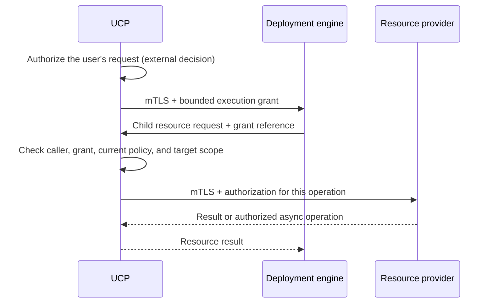

# Radius Internal Component Authorization and Secure Communication

- **Author**: [@sk593](https://github.com/sk593)

## Overview

This design describes authorization and secure communication *between Radius components*. Today Radius largely trusts its internal services: a request that appears to come from another Radius component is treated as legitimate. This design gives each component a verifiable identity, limits what each may do, and keeps a user's authorization intact as work moves between services during a deployment.

**RBAC (role-based access control)** answers three questions: who is making the request, what are they allowed to do, and where does that permission apply? This document applies those questions to internal callers — services, controllers, and background workers — rather than end users.

## Motivation

Radius runs several cooperating services, and a deployment fans out into many follow-on requests handled by different components. As Radius is used for production applications across multiple teams, this creates needs the current model does not meet. The motivations below explain why this design is needed; they are framed as capabilities to add rather than a catalog of specific weaknesses.

- **Verifiable component identity and least privilege.** Internal services largely trust one another and can hold more platform and cluster authority than any single task requires. Components should prove their identity to each other and act with the minimum permissions their role needs, so a single compromised component has a limited blast radius.
- **Authorization that survives the whole request path.** A user's authorization is established at the front door, but deployments continue through callbacks, controllers, and background workers that run after the original request returns. That authorization needs to travel with the work and be re-checked when it executes, rather than being lost partway through.
- **Consistent enforcement beyond the HTTP API.** Components can reach shared storage, queues, and cloud credentials directly, so an API-layer permission check is not sufficient on its own. The same separation of responsibilities must be enforced on these lower-level paths.

## Terms and definitions

- **Authentication:** verify who is calling. For internal callers, use a verified component identity rather than a self-asserted header.
- **Principal:** the component, controller, or worker acting on a request.
- **Action:** an operation such as creating a resource, running a recipe, or reconciling an object.
- **Scope:** the plane, resource group, or individual resource where an operation applies.
- **Mutual TLS (mTLS):** encrypted communication that verifies both services' identities. It does not decide what they may do.
- **Execution grant:** a verifiable record of the operations and targets that were approved for one deployment. It travels with follow-on requests so a downstream component can confirm the work was authorized.

## Objectives

Extend authorization to internal calls, controllers, and asynchronous work, so the authorization decided at the front door cannot be bypassed or exceeded further inside the system.

> **Issue Reference:** Not yet assigned.

### Goals

- Authenticate internal services and limit each component's authority.
- Preserve authorization across deployment callbacks, controllers, queues, and backend access.
- Restrict direct database, credential, and Kubernetes access so it cannot bypass the API checks.
- Migrate existing installations without silently broadening access.

### Non goals

- The user-facing role model (role definitions and assignments). That is a separate design; this document assumes UCP already produces an authorization decision for a user's request and focuses on carrying and enforcing it internally.
- Human authentication beyond Kubernetes.
- Application-level authorization or replacing Kubernetes RBAC, Azure RBAC, or AWS IAM.
- Hard isolation from the host cluster administrator.

### User scenarios (optional)

#### User story 1

As a platform engineer, I want a compromised or buggy component to be unable to perform work no user authorized, even if it can open a network connection to another service.

#### User story 2

As a platform engineer, I want a deployment's follow-on work — child resources, recipes, controllers, and queued operations — to stay within exactly what the original request was allowed to do.

## User Experience (if applicable)

These changes are invisible to a developer using Radius: the same `rad deploy` and application templates continue to work when the caller is authorized. The difference is internal — each service now proves its identity and every follow-on request carries the approval it was issued. Operators see new configuration for service certificates and controller namespace mappings, covered under Implementation Details.

## Design

### High Level Design

A user request enters through Kubernetes and UCP, which decides whether the user may perform the operation. This design begins where that decision ends: UCP records the decision as an **execution grant** and passes it inward, and every downstream component authenticates its caller and verifies that the requested work falls within an approval before acting.

Two problems are addressed together:

- **Who is calling?** Services identify each other with mutual TLS instead of trusting caller-supplied identity headers.
- **Is this work approved?** Each follow-on request carries an execution grant that names the approved operations and targets, so a component never has to re-derive the user's permissions or take a service's word for it.

The external deployment engine must support this internal protocol before enforcement can be enabled.

### Architecture Diagram

UCP issues a bounded execution grant, then validates every subsequent resource request against it:

### Detailed Design

#### Verify callers and restrict component permissions

When a user deploys, Kubernetes identifies the user and forwards the request to UCP. UCP verifies the Kubernetes API server's client certificate before trusting the user and group names in the headers, so an application cannot impersonate the user. The trusted certificate authority and proxy names come from Kubernetes's aggregation configuration.

Calls between Radius services use mutual TLS: each service has its own auto-renewing certificate, so UCP can tell the deployment engine from Dynamic RP, and no service can obtain another's certificate or service account. Identifying a component is not enough — the receiving service still checks what that component may do. The deployment engine, for example, can submit operations for an approved deployment but cannot assign itself an administrator role.

UCP makes the user-facing decision, so resource providers need only verify that an authorized caller sent the request and that the work was approved — not the user's original headers or role logic. Identity can travel with the approval for logging, but identity alone is not permission.

Serve Kubernetes-forwarded and internal requests on separate UCP endpoints so each applies the right authentication. NetworkPolicies can further limit which pods reach these endpoints, but an allowed connection is not an allowed operation.

##### Options for component identity

How a component proves who it is drives the rest of the design. Four realistic options:

All of these options except ServiceAccount tokens are mTLS-based and therefore require a certificate authority to issue and rotate the per-service certificates — cert-manager runs one, SPIRE acts as one, and a service mesh runs its own. Only the ServiceAccount token option avoids a certificate authority, because it reuses the Kubernetes API server's token signing as its trust root instead.

| Option                                        | How it works                                                                                                                                                                                  | Trade-offs                                                                                                                                                                                       |
|-----------------------------------------------|-----------------------------------------------------------------------------------------------------------------------------------------------------------------------------------------------|--------------------------------------------------------------------------------------------------------------------------------------------------------------------------------------------------|
| Projected ServiceAccount tokens + TokenReview | Each pod presents its short-lived, audience-bound Kubernetes ServiceAccount token; the receiver validates it through the Kubernetes `TokenReview` API.                                        | No new PKI and reuses identities Radius already has, but every validation depends on the API server being reachable and fast, and it only covers HTTP calls, not direct storage or queue access. |
| cert-manager-issued X.509 (mTLS)              | An in-cluster certificate authority (for example cert-manager) issues one certificate per service with the service identity in the certificate. Services present it on every mTLS connection. | Standard mTLS that verifies **offline** against the CA and also protects non-HTTP paths; Radius must run and rotate a CA.                                                                        |
| SPIFFE/SPIRE workload identity                | SPIRE attests each workload and issues a short-lived SPIFFE identity (X.509 or JWT).                                                                                                          | Purpose-built for workload identity and portable across clusters and clouds, but adds a component to operate.                                                                                    |
| Service-mesh mTLS (Istio, Linkerd)            | A sidecar mesh transparently establishes mTLS between pods.                                                                                                                                   | No application code change, but forces a mesh dependency on every Radius install and still needs an application-level authorization check on top.                                                |

**Recommendation:** issue one X.509 identity per service through an in-cluster CA (cert-manager) and require mTLS on all internal connections. It verifies offline, needs no per-call dependency on the Kubernetes API server, and — unlike a service mesh — does not impose a mesh on users. Name **SPIFFE/SPIRE** as the growth path if cross-cluster or multi-cloud attestation becomes a requirement. Do not mandate a service mesh.

#### Keep deployment authority limited

Checking the initial request is not enough: as the deployment engine creates the application's resources, its follow-on requests must stay within what the user was allowed to deploy. UCP records that approval in an **execution grant** — a permission record for one deployment, not a new role. It names the user, application, target environment, approved template version, permitted operations and targets, and an expiry.

The deployment proceeds as follows:

1. UCP authorizes the user's request, then sends the deployment engine the grant with the deployment.
2. The engine asks UCP to create a resource and references the grant.
3. UCP verifies that the caller is the engine, that the grant covers this operation, and that current policy still permits it. An attempt to target a different environment, such as production, is rejected.
4. UCP forwards the approved operation to the resource provider, which verifies the caller and the approval before doing the work.

The engine cannot enlarge the grant; nested deployments, retries, and cleanup deletions all stay within the same limits. Recipes add one distinction: a user may request a database without permission to create cloud infrastructure directly. The platform team authorizes the recipe to provision it using the environment's credentials, but only for that recipe's approved inputs and targets — the user cannot substitute an arbitrary template.

##### Options for the execution grant format

The grant must let a receiver confirm approval without trusting an editable header. Three realistic formats:

| Option                        | How it works                                                                                                                                                                                                                                                                 | Trade-offs                                                                                                                                                                               |
|-------------------------------|------------------------------------------------------------------------------------------------------------------------------------------------------------------------------------------------------------------------------------------------------------------------------|------------------------------------------------------------------------------------------------------------------------------------------------------------------------------------------|
| Signed JWT (JWS)              | UCP signs a compact token whose claims name the user, application, environment, allowed actions and targets, the intended audience service, the specific operation, an expiry, and a unique ID (`jti`). Receivers verify the signature offline against UCP's published keys. | Ubiquitous libraries, offline verification, and standard tooling; revoking before expiry relies on short lifetimes plus a policy re-check, and the token grows if it lists many targets. |
| Macaroons                     | A bearer token with caveats that any holder can **narrow** without contacting UCP, so the engine can derive a tighter grant for a child deployment itself.                                                                                                                   | Delegation and attenuation are built in, but the format is less familiar and has fewer mature libraries.                                                                                 |
| Opaque handle + introspection | UCP returns a random handle; the receiver calls UCP to validate it on every use.                                                                                                                                                                                             | Instant revocation and a tiny token, but every hop makes an online call to UCP, adding latency and making UCP a per-call dependency.                                                     |

**Recommendation:** use a **signed JWT (JWS)** verified offline against UCP's published keys, bound to a single audience service and operation with a short expiry and a `jti` for replay detection. Handle revocation by keeping the lifetime short and re-checking current policy at each hop rather than trusting the token alone. For nested deployments, avoid macaroon-style self-attenuation: have the engine ask UCP to mint a fresh, narrower JWT per child request, so UCP stays the single authority on what each grant permits. Keep the opaque-handle option in reserve for the specific operations where instant revocation matters more than latency.

For asynchronous work the self-contained JWT is a poor fit, because a queued operation may run long after the token would expire. Store the grant's `jti` and a hash of the approved inputs in the queue message, and keep the authoritative approval as a **renewable server-side execution record** keyed by that `jti`. A worker re-validates the record (not just the expired token) before executing, and renewal re-checks current policy so a revoked permission stops new steps.

#### Controllers and asynchronous work

The Radius controller acts on Kubernetes object changes, not the user's authenticated request, so without a restriction a user could create an object that tells the controller to change another team's resources. An administrator therefore maps each namespace to the resource groups and environments it may target, and the controller enforces that mapping plus the source object's ID and ownership before acting — for example, a development namespace cannot select the production environment. Existing installations need these mappings before enforcement.

Background workers run after the API request finished, so each queued operation must reference UCP's approval and the exact approved inputs; a worker rechecks that approval before executing. Trusting only the message's sender is insufficient, since that sender could be compromised. Queue connections authenticate both services and encrypt messages, workers accept only their assigned operation types, and an operation ID lets them ignore duplicate delivery.

Long-running work cannot rely on a token that expires in seconds. Use a separate, renewable execution permission with a queue-wait limit; renewal rechecks current policy, and revoking a user's permission stops new steps without undoing completed cloud changes. Cancellation and cleanup use narrowly limited permissions. Renewal timing and restart behavior need agreement before implementation.

#### Permissions outside the HTTP API

Checking UCP requests does not help if a service can make the same change by writing directly to the database. Storage, queues, cloud credentials, and Kubernetes permissions must enforce the same separation of responsibilities.

| Access path               | How it must be restricted                                                                                                                                                                                             |
|---------------------------|-----------------------------------------------------------------------------------------------------------------------------------------------------------------------------------------------------------------------|
| Resource state and queues | A provider may change only the records and work assigned to it. If the storage system cannot enforce this, place an access-checking service in front of it and remove the provider's direct access.                   |
| Cloud credentials         | A component may use a credential for an approved deployment without being allowed to retrieve every stored credential. Short-lived tokens still need limited cloud permissions; a short lifetime alone is not enough. |
| Kubernetes workloads      | Application deployments must not create pods using control-plane service accounts or read unrelated Secrets. Installation and Kubernetes-managed pod replacement must continue to work.                               |
| Startup registration      | UCP's initializer writes built-in resource definitions directly to storage. Give this startup task specific administrative permission rather than leaving it outside the authorization model.                         |

##### Options for storage and credential isolation

The table above states the requirement; two decisions need concrete mechanisms.

For **resource state and queues**:

| Option                          | How it works                                                                                                                                       | Trade-offs                                                                                                                                                             |
|---------------------------------|----------------------------------------------------------------------------------------------------------------------------------------------------|------------------------------------------------------------------------------------------------------------------------------------------------------------------------|
| Per-component store credentials | Each provider connects with its own database/queue credentials scoped to the records and queues it owns (separate schemas, tables, or namespaces). | Enforced by the store itself with no extra hop, but only works where the store can express per-caller scoping, and it spreads credential management across components. |
| Shared data-access service      | Providers stop connecting to the store directly and go through one internal service that checks ownership on every read and write.                 | Works even when the underlying store cannot scope access and centralizes the rule in one place, but adds a service on the hot path.                                    |

**Recommendation:** use per-component credentials where the store supports scoping, and a shared data-access service for stores that cannot. Either way, remove providers' direct, unrestricted store access.

For **cloud credentials**:

| Option                                  | How it works                                                                                                                                                                                                                                    | Trade-offs                                                                                                                          |
|-----------------------------------------|-------------------------------------------------------------------------------------------------------------------------------------------------------------------------------------------------------------------------------------------------|-------------------------------------------------------------------------------------------------------------------------------------|
| Credential broker minting scoped tokens | A broker service holds the root credential and, for an approved deployment, mints a short-lived token scoped to just that deployment's targets (via workload identity federation or the cloud's STS). Components never see the root credential. | Smallest blast radius — a leaked token is short-lived and narrowly scoped — but Radius runs and secures the broker.                 |
| Direct short-lived tokens per component | Each component is granted its own standing cloud identity with a fixed permission set.                                                                                                                                                          | Simpler to set up, but the permission set is static and broader than any single deployment needs, so a compromise is more damaging. |

**Recommendation:** mint **per-deployment, short-lived scoped tokens through a credential broker** rather than giving components standing cloud identities. A short lifetime alone is not enough; the token must also be scoped to the approved targets.

Some deployments need to create cluster-wide Kubernetes objects (for example, custom resource definitions), while most only touch resources in a single namespace. Granting every deployment broad cluster permissions to cover the first case makes a compromise of the deploying component far more damaging.

Run ordinary application deployments with a worker whose Kubernetes permissions are limited to the target namespace. Handle cluster-wide changes through a separate path that requires explicit administrator approval, so broad permissions are used only when a deployment genuinely needs them.

Until these direct access paths are restricted, a compromised provider may still make unauthorized changes even if all its HTTP connections use mTLS.

#### Advantages (of each option considered)

Letting UCP issue an approval that providers verify means providers confirm approved work rather than independently deciding what every user role means. Mutual TLS plus a per-deployment grant contains a compromised component: it can act only as itself and only within grants it was given.

#### Disadvantages (of each option considered)

Radius must operate more security infrastructure: service certificates, approval issuance, and re-checks for background work. Failures in those systems can stop deployments, so renewal and recovery need testing. Simpler alternatives reduce this operational work but leave requests between components insufficiently restricted.

#### Proposed Option

Give each service an X.509 identity from an in-cluster CA and require mTLS on all internal connections. Have UCP issue a short-lived signed-JWT execution grant, bound to one audience service and operation, that downstream components verify offline; back long-running work with a renewable server-side execution record. Restrict direct store access with per-component credentials or a data-access service, and mint per-deployment scoped cloud tokens through a credential broker — as part of the same effort, not a substitute for the API checks.

### API design (if applicable)

Internal service-to-service calls need to carry the authorization decision inward so downstream components do not re-derive it. Add an **execution grant** to the internal request contract between components. Per the [Detailed Design](#options-for-the-execution-grant-format), the proposed grant is a short-lived signed JWT for synchronous hops, backed by a renewable server-side execution record for asynchronous work.

The grant carries at least these fields, and a receiver rejects the request if any check fails:

| Field                        | Purpose                                          | Receiver check                                                                             |
|------------------------------|--------------------------------------------------|--------------------------------------------------------------------------------------------|
| `subject`                    | The user the deployment acts for.                | Recorded for logging and policy re-check.                                                  |
| `application`, `environment` | The approved application and target environment. | Must match the resource the request targets.                                               |
| `actions`, `targets`         | The operations and resource scopes UCP approved. | The requested operation must be listed; the target must be within scope.                   |
| `audience`                   | The one service allowed to present this grant.   | Must equal the receiving service's own identity.                                           |
| `operation`                  | The specific step this grant authorizes.         | Must match the request; blocks reuse for a different call.                                 |
| `exp`, `jti`                 | Expiry and unique ID.                            | Rejected if expired; `jti` is used to detect replay and to key the async execution record. |

The follow-on-approval flow is explicit rather than open-ended:

- **UCP** issues the initial grant after it authorizes the user's request, signing it with a key whose public half is published for offline verification.
- The **deployment engine** presents the grant on each child request. When it needs a *narrower* grant for a nested deployment, it asks UCP to mint one; it never edits or widens a grant itself.
- **Resource providers** (Core RP and the portable/dynamic providers) verify the grant's signature, audience, operation, and scope, plus the calling service's mTLS identity, before changing state — never trusting caller-supplied identity headers.
- **Asynchronous workers and the controller** persist the `jti` and approved inputs with the queued operation and re-validate the server-side execution record at execution time, since the original request has already returned.

The internal contract must distinguish "a user requested this deployment" from "the deployment engine is making this resource request on the user's behalf," and must never let a service assert another user's identity to gain that user's permissions. Exact field names, signing-key rotation, and the introspection endpoint for the fallback opaque-handle option are settled during implementation.

### CLI Design (if applicable)

No new user-facing CLI commands are introduced. The changes are internal to service-to-service communication. Operators configure certificates and controller namespace mappings through installation, described below, not through `rad`.

### Implementation Details

#### UCP (if applicable)

Add caller authentication and grant issuance in `pkg/ucp/frontend` and `pkg/ucp/proxy`: verify the calling service's identity, issue an execution grant when it forwards an authorized deployment, and validate the grant, caller, and target scope on every subsequent resource request. Apply explicit permissions to startup registration as well.

#### Bicep (if applicable)

No Bicep language change is needed. Authorization information travels between services, not inside user-authored templates. The same application templates remain usable when the caller is authorized.

#### Deployment Engine (if applicable)

Update the external engine to retain UCP's approval and reference it whenever it requests a resource operation. This must work for nested deployments and retries, not only the first request. The engine also needs the separate execution paths for namespace-limited and administrator-approved cluster-wide deployments.

#### Core RP (if applicable)

Add common caller and grant checks to the shared ARM-RPC server and integrate them with `pkg/corerp`. These checks run before resource handlers change state and verify the service caller and approved operation for both legacy APIs and current `Radius.Core` resources.

#### Portable Resources / Recipes RP (if applicable)

Carry the approved deployment information through `pkg/dynamicrp`, portable providers, `pkg/recipes`, and their background workers. When selecting a recipe, verify that the selected version and parameters belong to the approved deployment.

#### Controller and shared backends

In `pkg/controller/reconciler`, check the administrator's namespace-to-Radius mapping before sending a request. In `pkg/components` and its storage implementations, prevent a component from reading or changing another component's protected data. Where the backend cannot make that distinction, route access through a service that can.

#### Clients and installation

Update SDK connections to send the required service credentials and deployment approval. Update Helm to configure certificates, service-account permissions, and network restrictions.

### Error Handling

An invalid TLS certificate can stop the connection before any HTTP response exists. Clients must never retry a failed authenticated connection using an unauthenticated endpoint.

If a caller is authenticated but the requested work is not covered by a valid grant, reject it rather than performing it. If Radius cannot read the policy or grant needed to decide, return `503 Service Unavailable` rather than guessing that the request is allowed.

For work already running, record the failed authorization step and stop starting new operations. Use the limited cleanup permission described earlier where needed; do not silently continue with an old or broader service permission.

## Test plan

Unit tests should cover verification of deployment approvals and grant-scope checks. Functional tests should exercise complete requests across services, using scenarios such as:

| Scenario                                                             | Expected result                                                |
|----------------------------------------------------------------------|----------------------------------------------------------------|
| An application sends a fake user header or calls a provider directly | It cannot impersonate a user or bypass UCP's approval.         |
| The engine uses development approval for a production resource       | UCP rejects the request.                                       |
| A controller object targets another team's resource group            | The controller rejects it before starting the change.          |
| A worker receives altered inputs or the same message twice           | It rejects the changed work and avoids duplicate effects.      |
| Permission is removed during deployment                              | New steps stop; any permitted cleanup stays within its limits. |
| A provider tries to access unrelated state or credentials            | The backend denies access, not just the HTTP API.              |

Use cluster integration tests for certificate renewal, protected service accounts, restarts, upgrades, and interrupted deployments. Include the external engine and both legacy and current resource APIs. Test administrator-approved cluster-wide deployments separately from ordinary namespace deployments.

## Security

This design protects against an internal service requesting more work than the user was allowed to start. Verified service identities and limited deployment approvals address it.

Because approvals are signed (a JWS grant), only UCP holds the private signing key; other services receive only the public key needed to verify a grant. Verifying an existing grant must never let a service mint a new one. Rotate certificates and signing keys without sharing private keys or storing user credentials in queue messages.

These protections depend on restricting direct infrastructure access too. An encrypted connection does not make a broadly privileged cloud token safe. Likewise, using different Radius plane names does not by itself isolate teams that share a database and credentials. The Kubernetes cluster administrator remains trusted because that administrator can change the services and their permissions.

## Compatibility (optional)

The changes are internal, so a developer's workflow is unchanged. However, older providers and deployment engines must be upgraded before they can participate in the new authenticated request flow; enabling checks before they are upgraded would break them. Agree on compatible versions and upgrade order, and keep an observation mode that logs what would be rejected before enforcement is turned on.

See [core API registration](../../pkg/corerp/setup/setup.go) and [extensibility](extensibility.md).

## Monitoring and Logging

An operator should be able to answer: "Which service attempted this step, under which grant, and why was it allowed or denied?" Each decision records the service, requested action, target resource, referenced grant, and policy version.

Use the same deployment or operation ID in UCP, provider, and worker logs so the operator can follow the request between services. Track invalid approvals and expired certificates separately from unavailable policy storage. Never log credentials or the tokens carrying approval.

## Development plan

Internal authentication must be available when user checks are enforced elsewhere; otherwise callers could avoid those checks by connecting directly to a provider.

| Stage                                  | Deliverable and exit condition                                                                                                                                                                                               |
|----------------------------------------|------------------------------------------------------------------------------------------------------------------------------------------------------------------------------------------------------------------------------|
| 1. Identify and authenticate callers   | Document existing service calls and direct backend access. Add verified Kubernetes and component connections, including the external engine. Log how the new policy would decide without rejecting existing traffic yet.     |
| 2. Carry permissions through execution | Add execution grants for engine callbacks and queued work, component permission checks, and controller namespace mappings. Test retries and recovery before enforcing these checks.                                          |
| 3. Restrict remaining direct access    | Enforce database and credential separation, and run deployments with least-privilege identities scoped to what each deployment needs. Verify that a compromised provider cannot use these paths to avoid the earlier checks. |

This is a dependency plan, not a claim that each intermediate stage provides complete isolation. Approval for deployment steps and checks on background work must be ready before promising end-to-end authorization. Any unauthenticated local debugging option must be explicitly enabled and accept connections only from the local machine.

## Open Questions

The Detailed Design proposes a specific option for each major decision; what remains are the narrower details to settle during implementation.

**Q: Which CA issues service certificates, and how are they rotated?**

**A:** The design proposes an in-cluster CA (cert-manager) issuing one X.509 identity per service. Remaining: the rotation interval and renewal tooling, and whether SPIFFE/SPIRE is adopted now or kept as the cross-cluster growth path.

**Q: What are the exact grant lifetime and signing-key details?**

**A:** The design proposes a short-lived signed JWT with a renewable server-side record for async work. Remaining: the concrete expiry and renewal window, the signing-key rotation and publication (JWKS) mechanism, and how quickly a revoked permission must stop in-flight work.

**Q: How will the deployment engine and other providers adopt these checks?**

**A:** Agree on compatible versions and upgrade order. The engine still needs an explicit design for administrator-approved cluster-wide templates as well as normal namespace deployments.

**Q: Which storage and credential mechanism applies to each backend?**

**A:** The design proposes per-component credentials where the store can scope access and a data-access service where it cannot, plus a credential broker for per-deployment cloud tokens. Remaining: classify each existing backend into one of these and decide who operates the broker.

## Alternatives considered

| Option                                              | Assessment                                                                                                                                                |
|-----------------------------------------------------|-----------------------------------------------------------------------------------------------------------------------------------------------------------|
| NetworkPolicy only                                  | Can block network connections, but cannot distinguish an allowed deployment request from a forbidden one sent by the same service.                        |
| Shared internal API key                             | Every service would possess the same secret and could impersonate the others. Use separate service identities instead.                                    |
| Trust the calling service without a grant           | A compromised component could then perform any work by claiming it was authorized. The grant lets a receiver verify approval independently of the caller. |
| Forward the user's original identity headers inward | Providers would each need to re-derive the user's permissions, and editable headers can be forged. A verifiable grant avoids both problems.               |

## Design Review Notes

Pending maintainer review. The draft incorporates feedback about keeping permissions intact through deployment requests, retries, and direct backend access. The open questions above still require decisions.
