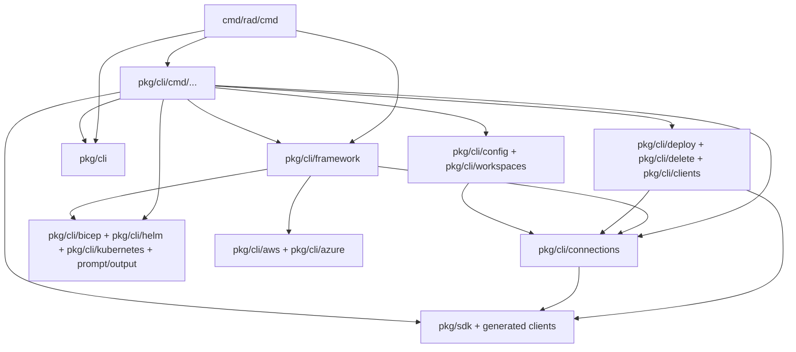
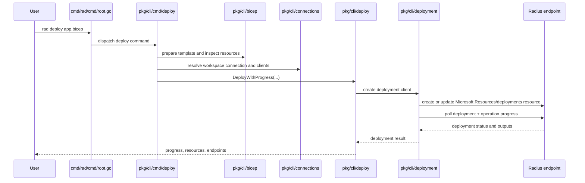

# rad CLI Architecture

`rad` is the user-facing command-line entry point for Radius. It translates user
intent into service calls, cluster operations, and local workflow behavior.

The CLI owns command composition, config and workspace resolution, output
formatting, and orchestration of clients and helper interfaces. It is not the
place for backend business rules that belong in UCP or a resource provider.

## Entry Points

- Binary entry: [cmd/rad/main.go](../../cmd/rad/main.go)
- Cobra root: [cmd/rad/cmd/root.go](../../cmd/rad/cmd/root.go)
- Command organization note: [pkg/cli/cmd/README.md](../../pkg/cli/cmd/README.md)
- CLI framework types: [pkg/cli/framework/framework.go](../../pkg/cli/framework/framework.go)

## Quick Reference

| Topic | Start Here |
|------|------------|
| Root command wiring | `cmd/rad/cmd/root.go` |
| Command pattern | `pkg/cli/cmd/README.md` |
| Shared CLI abstractions | `pkg/cli/framework/framework.go` |
| Workspace and connections | `pkg/cli/config`, `pkg/cli/connections` |

| Test Focus | Packages |
|-----------|----------|
| Command tests | `./pkg/cli/cmd/...` |
| Shared CLI behavior | `./pkg/cli/...` |
| Command coverage target | `make test-validate-cli` |

## Core Packages

| Package | Responsibility |
|--------|----------------|
| `cmd/rad/cmd` | top-level command tree assembly |
| `pkg/cli/cmd` | command implementations |
| `pkg/cli/framework` | shared factory and runner abstractions |
| `pkg/cli/config` | CLI config loading and persistence |
| `pkg/cli/connections` | workspace connection resolution |
| `pkg/cli/output` | formatting and output |
| `pkg/cli/helm` | installation and upgrade helpers |
| `pkg/cli/kubernetes` | cluster-facing helpers |
| `pkg/sdk` | Radius API clients used by commands |

## How It Works

### Root command

[cmd/rad/cmd/root.go](../../cmd/rad/cmd/root.go) builds the global CLI process.
It initializes tracing, installs panic handling, configures persistent flags,
and assembles the entire command tree.

### Framework injection

The root command constructs a `framework.Impl`, which provides the interfaces
that commands use for their real work: Bicep, connections, deploy/delete,
Kubernetes, Helm, output, prompts, and cloud clients.

This is the core architectural pattern for the CLI. Commands are not supposed to
reach directly into global state; they are expected to depend on the framework
factory.

### Command structure

Each command lives in its own package under `pkg/cli/cmd`. The command package
usually exposes:

- `NewCommand(factory)`
- a `Runner`
- `Validate`
- `Run`

That pattern is documented in [pkg/cli/cmd/README.md](../../pkg/cli/cmd/README.md)
and enforced by the `framework.RunCommand` helper in
[pkg/cli/framework/framework.go](../../pkg/cli/framework/framework.go).

The root command builds the global CLI process, initializes tracing and panic
handling, configures persistent flags, and assembles the command tree.

The core pattern is framework injection. `cmd/rad/cmd/root.go` creates one
`framework.Impl`, and each command package consumes that factory through the
common `NewCommand(factory)` plus `Runner.Validate` and `Runner.Run` pattern.

That keeps command-specific behavior in `pkg/cli/cmd/...` while shared config,
workspace resolution, connection creation, and operation helpers stay in their
own packages.

## Invariants And Constraints

- Commands should stay thin and use the shared framework.
- Validation should happen in `Validate`, not ad hoc throughout `Run`.
- Output formatting should go through `pkg/cli/output`.
- Workspace and connection resolution should remain consistent across commands.

## Change This Safely

### Packages That Usually Move Together

- `cmd/rad/cmd/root.go` and `pkg/cli/cmd/...` when registering new commands
- `pkg/cli/framework` and command packages when shared interfaces change
- `pkg/cli/config`, `pkg/cli/connections`, and workspace-related commands when
  connection resolution changes
- `pkg/cli/helm` or `pkg/cli/kubernetes` and install/upgrade commands when
  cluster workflows change

### Suggested Test Scope

- `go test ./pkg/cli/...`
- For command-package changes, also run the relevant subtree such as:
  `go test ./pkg/cli/cmd/...`
- The command authoring note in
  [../../pkg/cli/cmd/README.md](../../pkg/cli/cmd/README.md) also calls out the
  `make test-validate-cli` target for CLI command coverage.

## Package Dependency View

The important static seam is `root -> framework -> command packages ->
connection/operation layers`. The root command assembles the process-wide
dependency container, while command packages own user-facing behavior through
the validate/run runner pattern.

## Representative Flow

The representative CLI flow is `rad deploy`. It shows the CLI's intended role:
resolve workspace and template context locally, then hand off the real
deployment work to reusable operation and client layers built from the active
workspace connection.

## Related Docs

- [service-interaction-map.md](service-interaction-map.md)
- [controller.md](controller.md)