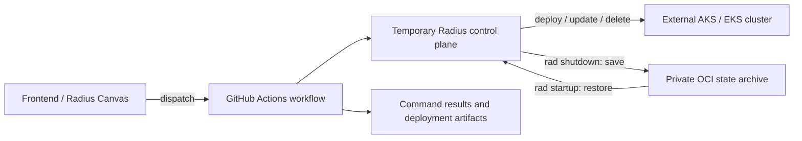

# Repo Radius: implementation and remaining work

Status as of October 6, 2026.

Repo Radius can deploy and manage applications through a temporary Radius control plane in GitHub Actions. State save/restore, cloud-specific workflows, and frontend integration are implemented. The remaining work is to make the actions a supported public interface, publish them to GitHub Marketplace, and close compatibility gaps.

There is no verified general-availability announcement. The status below comes from code and issue discussions, not from whether an issue is open or closed.

## What Repo Radius is

Repo Radius runs the Radius control plane only when a repository workflow needs it. The Radius Canvas or another frontend starts a GitHub Actions workflow, which restores Radius state, runs commands, saves state, and removes the temporary control plane.

- Application workloads run on a separate AKS or EKS cluster and remain there after the workflow ends.
- Users still need a workload cluster, cloud permissions, credentials, and durable state storage.
- The original proposal covered deployment, environment setup, promotion, and management. Its [feature-spec PR](https://github.com/radius-project/radius/pull/12078) closed without merging; the implementation landed through separate PRs.

## Key components and ownership

- **Radius CLI and control plane:** `radius-project/radius` contains command execution, external-cluster access, and state save/restore.
- **Workflows and actions:** `radius-project/ai-extensions`, under `.github/extension/`, contains authentication, control-plane setup, command execution, reporting, and teardown.
- **Frontend/plugin:** ai-extensions generates repository workflows and drives verification and deployment.
- **Durable storage:** Radius implements OCI archives for state and modeled graphs. Each uses a separately configured registry repository.
- **Workload cluster:** The user's AKS or EKS cluster keeps running the application.

The workflows moved to ai-extensions in [radius-project/ai-extensions#424](https://github.com/radius-project/ai-extensions/pull/424). [radius-project/radius#12719](https://github.com/radius-project/radius/pull/12719), merged August 31, removed the duplicate assets from Radius.

## How it works

1. The frontend writes verification and deployment workflows into the application repository and configures a GitHub Environment.
2. The workflow selects Azure or AWS, authenticates through GitHub OIDC, and connects to the workload cluster.
3. Shared actions create a temporary Radius control plane. `rad startup` restores its saved state.
4. The workflow configures credentials and recipe packs, then runs the requested `rad` commands or the default deployment.
5. The workflow publishes command results and deployment graph/status artifacts.
6. Teardown attempts `rad shutdown` to save state, then removes the temporary cluster.

The [teardown action](https://github.com/radius-project/ai-extensions/blob/a77ba988a4fb0e42c9cc96e70b2b0bf6f694a3d1/.github/extension/actions/teardown/action.yml) protects the archive:

- If startup did not report successful state restoration, teardown skips state saving so an uninitialized control plane cannot overwrite the archive.
- If a later step fails, teardown still attempts to save state, including changes from a partially applied deployment.
- A lost runner or abrupt termination can prevent state saving, cleanup, or artifact publication.

## What has been implemented

- **Temporary control-plane lifecycle:** Start Radius, restore state, run commands, save state, and tear down. The foundation landed in [radius-project/radius#12214](https://github.com/radius-project/radius/pull/12214).
- **External-cluster deployment:** Radius manages workloads outside its own cluster. The foundation landed in [radius-project/radius#12106](https://github.com/radius-project/radius/pull/12106); provider workflows connect to AKS/EKS. See the [Azure workflow](https://github.com/radius-project/ai-extensions/blob/a77ba988a4fb0e42c9cc96e70b2b0bf6f694a3d1/.github/extension/run-rad-commands-azure.yml). This does not establish support for every cluster configuration.
- **Durable OCI state:** A later control plane can restore state saved by an earlier run. [radius-project/radius#12364](https://github.com/radius-project/radius/pull/12364) merged July 17. The [archive factory](https://github.com/radius-project/radius/blob/ec90522af3e8ca3d4aa348848a16a15e9e1988e9/pkg/statearchive/factory/factory.go) and [archive documentation](https://github.com/radius-project/radius/blob/ec90522af3e8ca3d4aa348848a16a15e9e1988e9/docs/architecture/state-archive.md) describe the current implementation.
- **Cloud verification and OIDC authentication:** Provider workflows check cloud access and configure deployment credentials. Verification work landed in [radius-project/radius#12170](https://github.com/radius-project/radius/pull/12170). Provisioning cloud-side identities is separate.
- **Custom types and recipe packs:** Support landed in [radius-project/radius#12367](https://github.com/radius-project/radius/pull/12367), merged July 25. [radius-project/radius#12742](https://github.com/radius-project/radius/pull/12742), merged August 24, fixed recipe-pack reconciliation on repeated deployments.
- **Application and environment deletion:** Delete workflows landed in [radius-project/radius#12367](https://github.com/radius-project/radius/pull/12367) and moved with the other workflow assets.
- **Command results:** The [command action](https://github.com/radius-project/ai-extensions/blob/a77ba988a4fb0e42c9cc96e70b2b0bf6f694a3d1/.github/extension/actions/run-rad-commands/action.yml) emits versioned results in command order under `rad-commands-result`. Some requirements in [radius-project/radius#12526](https://github.com/radius-project/radius/issues/12526) remain unfinished.
- **Graph and status artifacts:** The [status action](https://github.com/radius-project/ai-extensions/blob/a77ba988a4fb0e42c9cc96e70b2b0bf6f694a3d1/.github/extension/actions/publish-deploy-status/action.yml) publishes graph, progress, and diagnostic files. These are workflow artifacts, not native GitHub Deployment records.
- **Pinned workflow assets:** Plugin releases bundle workflows, and generated first-party action references pin a source commit. [radius-project/ai-extensions#657](https://github.com/radius-project/ai-extensions/pull/657) merged August 31. GitHub Marketplace publication is still outstanding.
- **State lifecycle testing:** A scheduled test restores state from private GHCR after replacing the control plane, then updates an existing workload on a persistent target cluster. See the [test documentation](https://github.com/radius-project/radius/blob/ec90522af3e8ca3d4aa348848a16a15e9e1988e9/docs/contributing/contributing-code/contributing-code-tests/repo-radius-state-e2e.md).

## What is left to implement or resolve

All issues below were open at the assessment date.

- **Document the supported interface.** Define installation or workflow generation, inputs, outputs, permissions, result schemas, examples, and breaking-change rules. Add tests for successful deployment, failed deployment, and invalid commands. [radius-project/radius#12997](https://github.com/radius-project/radius/issues/12997)
- **Publish the GitHub Marketplace actions.** The `run-rad-commands` composite action exists. Cloud verification currently lives in `verify-azure.yml` and `verify-aws.yml`; it still needs a standalone action before publishing the requested `radius-project/verify-cloud-auth` and `radius-project/run-rad-commands` identities. The September 29 issue update overstates the verification action's completion. [radius-project/radius#12524](https://github.com/radius-project/radius/issues/12524)
- **Update the generated wrappers.** Switch the existing commit-pinned workflows to the requested published actions after publication. [radius-project/radius#12525](https://github.com/radius-project/radius/issues/12525)
- **Finish result reporting.** Reconcile `rad-commands-result` with the requested name `run-rad-commands-result`, add the versioned `verify-cloud-auth-result` document, and report state-save failure separately from command failure. State saving currently happens during teardown. [radius-project/radius#12526](https://github.com/radius-project/radius/issues/12526)
- **Add an application-source `ref`.** Let callers select a commit or tag for promotion and redeployment. GitHub dispatch can already target a branch/tag, which default checkout can follow, but the dispatcher has no explicit application-source input. The Canvas's dispatch-ref selection was not verified. [radius-project/radius#12527](https://github.com/radius-project/radius/issues/12527)
- **Record native GitHub Deployments.** Record the deployed commit and environment, and mark the corresponding deployment inactive when the application is deleted. Existing graph/status artifacts do not do this. [radius-project/radius#12528](https://github.com/radius-project/radius/issues/12528)
- **Fix AAD-enabled AKS deployment.** Azure verification installs `kubelogin` and converts kubeconfig; deployment lacks equivalent setup. The runner and Radius pods need different authentication modes. A July 28 maintainer comment quotes documentation that AKS-managed AAD is unsupported. [radius-project/radius#12550](https://github.com/radius-project/radius/issues/12550)
- **Settle cloud-storage scope.** Decide whether OCI replaces the original request for credential-driven Azure Blob/S3 storage. If not, add storage provisioning before control-plane startup and the required archive backend. The current factory supports neither Blob nor S3. [radius-project/radius#11605](https://github.com/radius-project/radius/issues/11605)
- **Investigate the September 25 state-test failure.** Eleven consecutive scheduled runs passed afterward, but that does not explain the failure or prove it was fixed. [radius-project/radius#13112](https://github.com/radius-project/radius/issues/13112)

## Notable details and assessment

- OCI is the only supported archive backend. The factory rejects `git`; the closed [Git-storage issue](https://github.com/radius-project/radius/issues/11604) does not mean that backend remains available.
- Older design text still mentions Git storage and pre-migration workflow paths. Current code and migration notes take precedence.
- The frontend can use the existing workflows today. That is separate from offering a stable public interface and published GitHub Marketplace actions.

## Recommended implementation sequence

This is a proposed order, not an approved roadmap or delivery commitment.

1. **Agree on results and failures.** Settle artifact names and schemas before publishing actions. Test verification, invalid commands, command failures, and state-save failures. A successful command must not hide a failed state save. [radius-project/radius#12526](https://github.com/radius-project/radius/issues/12526)
2. **Document and publish the actions.** Define supported inputs, outputs, permissions, and upgrade rules; package verification as an action; publish immutable releases; then update wrappers. Test installation and result handling from a consumer repository. [radius-project/radius#12997](https://github.com/radius-project/radius/issues/12997), [radius-project/radius#12524](https://github.com/radius-project/radius/issues/12524), [radius-project/radius#12525](https://github.com/radius-project/radius/issues/12525)
3. **Finish promotion and deployment history.** Add the application-source `ref`, record the actual deployed commit, and mark deployments inactive on delete. Test that promotion checks out the intended revision. [radius-project/radius#12527](https://github.com/radius-project/radius/issues/12527), [radius-project/radius#12528](https://github.com/radius-project/radius/issues/12528)
4. **Close authentication and storage gaps.** Test both runner and pod access on supported clusters. Decide whether OCI meets the storage requirement, then test save/restore for the accepted storage option. [radius-project/radius#12550](https://github.com/radius-project/radius/issues/12550), [radius-project/radius#11605](https://github.com/radius-project/radius/issues/11605)

Investigate [radius-project/radius#13112](https://github.com/radius-project/radius/issues/13112) in parallel. If it reveals a defect, add a regression test before declaring the failure resolved.

## Architectural decisions needed to finish implementation

These choices need agreement before the remaining work can be finished. The recommendations are proposals, not approved decisions.

### What will consumers be able to rely on?

- Decide which actions, reusable workflows, generated wrappers, configuration settings, and result files are supported public interfaces.
- Choose whether the two actions release independently or together with the CLI and plugin. Independent releases allow separate upgrades but require more compatibility testing; coordinated releases couple upgrades.
- Decide how ai-extensions packages and publishes the two GitHub Marketplace identities.
- **Recommendation:** Keep wrappers thin, pin immutable releases, and document which action, CLI, and frontend versions work together.

Related: [radius-project/radius#12997](https://github.com/radius-project/radius/issues/12997), [radius-project/radius#12524](https://github.com/radius-project/radius/issues/12524), [radius-project/radius#12525](https://github.com/radius-project/radius/issues/12525).

### Who reports the final outcome?

- The command action reports results before teardown saves state. Decide who combines those outcomes into the final run result.
- Separate reports keep actions independent but leave each frontend to reconcile them. A combined report simplifies consumers but must retain command-level details.
- Define how consumers handle partial execution, state-save failure, and interrupted runs. A runner that disappears may never publish an artifact.
- **Recommendation:** Have the workflow assemble the final result after teardown attempts state saving. Keep ordered command results, report persistence separately, and version artifact-name changes with the schema.

Related: [radius-project/radius#12526](https://github.com/radius-project/radius/issues/12526), [radius-project/radius#12997](https://github.com/radius-project/radius/issues/12997).

### Which revision is deployed, and how is it recorded?

- Decide how workflow dispatch ref and application-source ref interact. The requested omitted-ref default is the latest default-branch commit; dispatch-ref checkout can select another branch.
- Define when a deployment counts as successful, including what happens if commands succeed but state saving fails.
- Decide how deletion finds the right GitHub Deployment when an environment contains multiple applications.
- **Recommendation:** Resolve the source ref once to a commit SHA and use it for checkout, results, and deployment history. Define default and invalid-ref behavior and application/environment matching.
- Pinning source does not pin mutable container images or recipe dependencies. The action's version is also separate from the application's revision.

Related: [radius-project/radius#12527](https://github.com/radius-project/radius/issues/12527), [radius-project/radius#12528](https://github.com/radius-project/radius/issues/12528).

### Is OCI the final storage choice?

- Decide whether OCI meets the original cloud-storage request or whether Azure Blob/S3 archives are still required.
- OCI already works, but needs registry credentials and access controls. Cloud blob storage could use the deployment cloud identity, but adds provisioning, backend testing, and migration work.
- Assign responsibility for provisioning, permissions, retention, and recovery.
- **Recommendation:** Settle the requirement before adding a backend. If OCI is accepted, document its operating requirements. If Blob/S3 is required, define bootstrap and migration behavior while keeping the shared archive interface.
- Keep state and graph policies separate. Terraform state in S3 or Azure Blob is outside the control-plane archive and needs its own protection.

Related: [radius-project/radius#11605](https://github.com/radius-project/radius/issues/11605) and [Durable State Archive](state-archive.md).

### How do the runner and Radius pods authenticate?

- Define supported AKS/EKS configurations and the credentials each consumer can use.
- For AAD-enabled AKS, decide how to produce runner and pod kubeconfigs, supply credential-plugin binaries, and refresh tokens.
- The runner's Azure CLI session is not available inside Radius pods. Installing `kubelogin` only on the runner can move the failure into the pods.
- **Recommendation:** Configure each consumer explicitly, with the appropriate non-interactive authentication mode and permissions. Test deployment and management end to end; a successful verification workflow is not enough.

Related: [radius-project/radius#12550](https://github.com/radius-project/radius/issues/12550).

### What counts as finished?

- Agree on the supported GitHub Actions interface and the cloud configurations that must pass end-to-end tests.
- Keep the wider deployment-engine roadmap separate. The supported-interface issue excludes a new engine, non-GitHub CI, and cloud-side OIDC identity provisioning.
- **Recommendation:** Judge completion against the documented interface and tested cloud configurations. Track broader engine work under [radius-project/radius#12996](https://github.com/radius-project/radius/issues/12996).
- The historical state-test failure needs investigation, not a design decision.

Related: [radius-project/radius#12997](https://github.com/radius-project/radius/issues/12997), [radius-project/radius#13112](https://github.com/radius-project/radius/issues/13112).

## Evidence baseline

- Radius source and documentation: `ec90522af3e8ca3d4aa348848a16a15e9e1988e9`, matching this worktree's HEAD and remote main when assessed.
- ai-extensions source: `a77ba988a4fb0e42c9cc96e70b2b0bf6f694a3d1`.
- Issue discussions, PR states, and workflow runs: checked October 6, 2026.

This snapshot does not cover every frontend/cloud combination or assign owners and delivery dates.

## Review and corrections

Claude Opus 5.5 reviewed the initial report against code and GitHub evidence. Corrections covered verification-action packaging, state-test results, teardown's archive guard, AKS authentication, source-ref selection, and command-result reporting. The implementation sequence, architectural decisions, and readability rewrite came afterward and were not part of that review.
