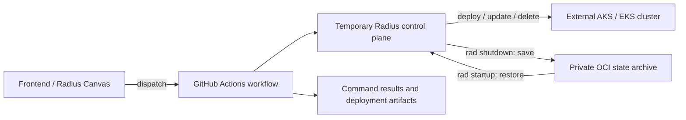

# Repo Radius: implementation and remaining work

**Assessment date:** October 6, 2026.

**Bottom line:** Repo Radius has an implemented on-demand execution path, durable state storage, cloud-specific deployment workflows, and frontend integration. Its public integration contract and intended GitHub Marketplace distribution remain incomplete. The evidence supports "implemented, with productization and compatibility work outstanding," not a declaration that the entire feature is finished or generally available.

This report distinguishes implementation evidence from issue status. A closed issue is not proof that every original requirement shipped; an open issue can contain substantial completed work. No completion percentage, release commitment, or delivery date is inferred.

## What Repo Radius is

Repo Radius runs the Radius control plane temporarily inside a GitHub Actions runner. A frontend, such as the Radius Canvas, configures and dispatches repository workflows. Those workflows authenticate to the cloud, create an ephemeral Kubernetes control plane, restore durable Radius state, run deployment or management commands, save state, and remove the temporary control plane.

The application workloads deploy to a separate, external AKS or EKS cluster. Repo Radius removes the need for a permanently running **Radius control plane**; it does not remove the need for a workload cluster, cloud permissions, configured credentials, or durable storage.

The original feature proposal described a more accessible, repository-driven Radius experience, including deployment, environment setup, promotion, and management. Its feature-spec PR, [radius-project/radius#12078](https://github.com/radius-project/radius/pull/12078), was closed without merging. Implementation landed through separate changes, so that proposal should not be treated as an approved, fully delivered specification.

## Key components and ownership

| Component | Responsibility | Current home |
| --- | --- | --- |
| Radius CLI and control plane | Run commands, manage resources, reach the external target cluster, and save/restore control-plane state. | `radius-project/radius` |
| Workflow templates and composite actions | Coordinate verification, authentication, temporary control-plane setup, command execution, result reporting, and teardown. | `radius-project/ai-extensions`, under `.github/extension/` |
| Frontend/plugin integration | Generate repository workflows and drive the verification/deployment experience. | `radius-project/ai-extensions` |
| Durable state and modeled-graph archives | Preserve Radius state between temporary control-plane instances; the same archive abstraction also supports durable modeled-graph output. | OCI implementation in Radius; separately configured state and graph repositories supply storage. |
| External workload cluster | Continue running application workloads after the temporary Radius control plane is removed. | User's AKS or EKS cluster. |

The workflow implementation moved out of the Radius repository. [radius-project/radius#12719](https://github.com/radius-project/radius/pull/12719), merged August 31, removed the duplicated extension assets after the port in [radius-project/ai-extensions#424](https://github.com/radius-project/ai-extensions/pull/424). The absence of `.github/extension/` in Radius is therefore an ownership change, not removal of Repo Radius.

## How it works

1. A frontend writes verification and deployment workflows into the application repository and configures a GitHub Environment.
2. The deployment dispatcher selects the Azure or AWS provider workflow using environment configuration.
3. The provider workflow authenticates using GitHub OIDC and obtains access to the external workload cluster.
4. Shared actions create a temporary control plane and configure Radius to target the external cluster.
5. `rad startup` restores previously archived state before commands execute.
6. The workflow configures cloud credentials and recipe packs, then runs requested `rad` commands or the default application deployment.
7. Command results and deployment graph/status information are published as workflow artifacts.
8. When startup reported successful state restoration, teardown attempts `rad shutdown` to persist state and removes the temporary cluster.

Teardown is arranged to run even after earlier workflow failures. It deliberately skips `rad shutdown` if startup did not report successful state restoration, so an uninitialized control plane cannot overwrite the existing archive. After a later failure, such as a partially applied deployment, it still attempts to save state. This is a recovery mechanism, not a guarantee that state can always be saved: a lost runner or abrupt termination can prevent cleanup or artifact publication. See the [teardown action](https://github.com/radius-project/ai-extensions/blob/a77ba988a4fb0e42c9cc96e70b2b0bf6f694a3d1/.github/extension/actions/teardown/action.yml).

## What has been implemented

| Capability | Implemented behavior | Evidence and qualification |
| --- | --- | --- |
| Ephemeral Radius lifecycle | Start a temporary control plane, restore state, run commands, save state, and tear down. | Foundational state externalization merged in [radius-project/radius#12214](https://github.com/radius-project/radius/pull/12214). Maintained provider workflows and shared actions implement the orchestration. |
| External-cluster deployment | Radius can manage workloads outside its own temporary Kubernetes cluster; provider workflows connect to AKS/EKS. | Multi-cluster foundation [radius-project/radius#12106](https://github.com/radius-project/radius/pull/12106) and the maintained [Azure workflow](https://github.com/radius-project/ai-extensions/blob/a77ba988a4fb0e42c9cc96e70b2b0bf6f694a3d1/.github/extension/run-rad-commands-azure.yml). This is not evidence that every AKS/EKS configuration is supported. |
| Durable OCI state | Radius state can be archived outside the running control plane and restored by a later run. | [radius-project/radius#12364](https://github.com/radius-project/radius/pull/12364), merged July 17; current [archive factory](https://github.com/radius-project/radius/blob/ec90522af3e8ca3d4aa348848a16a15e9e1988e9/pkg/statearchive/factory/factory.go) and [architecture documentation](https://github.com/radius-project/radius/blob/ec90522af3e8ca3d4aa348848a16a15e9e1988e9/docs/architecture/state-archive.md). |
| Cloud verification and OIDC deployment integration | Provider-specific workflows verify or consume cloud access and configure deployment credentials. | Verification work merged in [radius-project/radius#12170](https://github.com/radius-project/radius/pull/12170); maintained templates/actions are now in ai-extensions. Cloud-side identity provisioning is distinct from the deployment workflow itself. |
| Custom resource types and recipe packs | Repo Radius workflows support registering custom types and applying custom recipe packs. | [radius-project/radius#12367](https://github.com/radius-project/radius/pull/12367), merged July 25. Repeat-deploy reconciliation was fixed in [radius-project/radius#12742](https://github.com/radius-project/radius/pull/12742), merged August 24. |
| Application/environment deletion | Supporting delete workflows were added. | [radius-project/radius#12367](https://github.com/radius-project/radius/pull/12367) and the migrated assets described in [radius-project/radius#12719](https://github.com/radius-project/radius/pull/12719). Native GitHub Deployment deactivation is a separate requirement. |
| Structured command results | The command action emits versioned, ordered command results under the artifact name `rad-commands-result`. | The current [run-rad-commands action](https://github.com/radius-project/ai-extensions/blob/a77ba988a4fb0e42c9cc96e70b2b0bf6f694a3d1/.github/extension/actions/run-rad-commands/action.yml) confirms the older partial-completion audit on [radius-project/radius#12526](https://github.com/radius-project/radius/issues/12526). The requested end-to-end result contract is not fully implemented. |
| Deployment graph/status reporting | The workflow publishes deployed graph, progress, and diagnostic/status files for frontend consumption. | Current [publish-deploy-status action](https://github.com/radius-project/ai-extensions/blob/a77ba988a4fb0e42c9cc96e70b2b0bf6f694a3d1/.github/extension/actions/publish-deploy-status/action.yml). Workflow artifacts are not native GitHub Deployment records. |
| Release-aligned workflow distribution | Plugin artifacts include workflow assets, and generated first-party action references pin the source commit. | [radius-project/ai-extensions#657](https://github.com/radius-project/ai-extensions/pull/657), merged August 31. This addresses mutable-source drift, not GitHub Marketplace publication. |
| State lifecycle end-to-end coverage | A scheduled test replaces the control plane, restores state from private GHCR, and updates the existing workload on a persistent target cluster. | [Test documentation](https://github.com/radius-project/radius/blob/ec90522af3e8ca3d4aa348848a16a15e9e1988e9/docs/contributing/contributing-code/contributing-code-tests/repo-radius-state-e2e.md) and recent runs described below. |

## What is left to implement or resolve

| Workstream | Completed portion | Remaining requirement or decision | Tracking |
| --- | --- | --- | --- |
| Supported deployment contract | Working deployment workflows and structured command artifacts exist. | Finish a documented installation/generation mechanism, stable inputs/outputs/permissions, a published result schema, compatibility and migration rules, examples, and contract-level success/failure/invalid-command coverage. Individual building blocks do not prove the aggregate acceptance criteria are complete. | [radius-project/radius#12997](https://github.com/radius-project/radius/issues/12997), open. |
| GitHub Marketplace actions | A canonical, commit-pinned `run-rad-commands` composite action exists. Cloud-auth verification exists as `verify-azure.yml` and `verify-aws.yml`, not as a standalone `verify-cloud-auth` action in the inspected tree. | Package verification as a reusable action, then publish and verify the requested `radius-project/verify-cloud-auth` and `radius-project/run-rad-commands` GitHub Marketplace identities and their release scheme. | [radius-project/radius#12524](https://github.com/radius-project/radius/issues/12524), open. Its September 29 update confirms publication is outstanding but overstates the standalone verification-action implementation; the current source tree takes precedence. |
| Thin workflows using GitHub Marketplace identities | Ready-to-commit, commit-pinned workflows exist. | Switch wrappers to the two requested published action identities after publication. This depends on the preceding workstream. | [radius-project/radius#12525](https://github.com/radius-project/radius/issues/12525), open; September 29 maintainer update. |
| Complete result-artifact contract | Versioned, ordered command results exist. | Resolve the `rad-commands-result` versus requested `run-rad-commands-result` naming contract; provide the required versioned `verify-cloud-auth-result` envelope; represent state-save failure distinctly. State saving currently happens separately during teardown. | [radius-project/radius#12526](https://github.com/radius-project/radius/issues/12526), open and partially complete. |
| Source revision selection and promotion | Generated workflow implementation is pinned to an immutable action-source commit. GitHub dispatch itself can target a branch or tag, which default checkout can follow. | Add the requested explicit application-source `ref` input and checkout contract for promotion or redeployment. The absence of that input does not mean branch/tag selection through dispatch is impossible; this report has not verified how the Canvas selects its dispatch ref. Pinning action code is not the same as selecting the application's revision. | [radius-project/radius#12527](https://github.com/radius-project/radius/issues/12527), open; the observed dispatcher exposes no `ref` input. |
| Native GitHub Deployment history | Deployment graph/status artifacts exist. | Record a GitHub Deployment at the deployed commit/environment and mark it inactive on application deletion. The observed status publisher uploads artifacts rather than creating Deployment API records. | [radius-project/radius#12528](https://github.com/radius-project/radius/issues/12528), open. |
| AKS Automatic / AAD compatibility | The Azure verification workflow installs `kubelogin` and converts its kubeconfig. The deployment workflow connects to AKS but lacks equivalent `kubelogin` setup. | Fix the deployment path and the different authentication requirements of runner commands and Radius pods, then verify supported target configurations. Successful verification does not establish that AAD-enabled deployment will work. | [radius-project/radius#12550](https://github.com/radius-project/radius/issues/12550), open. A July 28 maintainer comment quotes the docs stating AKS-managed AAD is unsupported; the inspected deploy template still lacks the setup. |
| Cloud-storage scope | OCI archival supplies durable storage outside the control plane. | Decide whether OCI replaces the original request for credential-driven cloud blob storage. If not, provision Azure Blob/S3 storage before control-plane startup using Repo Radius cloud credentials. The current archive factory has no such backend. | [radius-project/radius#11605](https://github.com/radius-project/radius/issues/11605), open; September 11 audit identifies this decision. |
| Historical state-test failure | Eleven consecutive scheduled runs are passing since the September 25 failure. | Investigate or document disposition of the earlier failure before declaring it fixed. | [radius-project/radius#13112](https://github.com/radius-project/radius/issues/13112), open. |

## Notable details and assessment

**Storage has changed since the early proposal.** The current factory accepts OCI or an unset backend and explicitly rejects `git`. The closed Git-storage issue, [radius-project/radius#11604](https://github.com/radius-project/radius/issues/11604), does not imply the Git backend remains supported. Some older design paragraphs still mention Git storage and pre-migration action locations; current implementation and explicit migration notes take precedence.

**Contract support is different from working integration.** A frontend can drive the existing workflows today, while the supported public interface, GitHub Marketplace identities, and full result contract remain unfinished. There is no verified evidence here of a formal general-availability declaration.

## Recommended implementation sequence

This sequence is a recommendation based on the dependencies described above, not a maintainer commitment, approved roadmap, or release schedule. The acceptance checks below are proposed ways to verify completion.

### Settle the result schema and failure semantics

Resolve artifact naming, define the versioned verification envelope, and represent command execution and state-save outcomes separately. A deployment command can succeed while saving state fails; consumers need to distinguish those outcomes rather than infer overall success from command results alone.

For the work tracked in [radius-project/radius#12526](https://github.com/radius-project/radius/issues/12526), verify successful execution, invalid commands, command failures, and teardown state-save failures against the agreed schema. Establish this contract before publishing actions that external consumers will depend on.

### Finish the supported contract and action distribution

Document installation or workflow generation, inputs, outputs, permissions, examples, and compatibility and migration rules for [radius-project/radius#12997](https://github.com/radius-project/radius/issues/12997). Package cloud verification as a reusable action and settle the release scheme for the GitHub Marketplace identities requested in [radius-project/radius#12524](https://github.com/radius-project/radius/issues/12524).

After publication, update the thin workflow wrappers in [radius-project/radius#12525](https://github.com/radius-project/radius/issues/12525) to consume those identities. Verify that a consumer repository can install and run the documented workflows and receive the agreed success and failure artifacts.

### Complete revision selection and deployment history

Define the explicit application-source `ref` input and checkout behavior requested in [radius-project/radius#12527](https://github.com/radius-project/radius/issues/12527). Keep application revision selection distinct from the immutable version of the workflow implementation.

Then implement the native GitHub Deployment records requested in [radius-project/radius#12528](https://github.com/radius-project/radius/issues/12528). Verify that promotion or redeployment checks out the intended application revision, records that commit and environment, and marks the deployment inactive when the application is deleted.

### Close compatibility and storage-scope gaps

Address AKS authentication separately for runner commands and Radius pods, as tracked in [radius-project/radius#12550](https://github.com/radius-project/radius/issues/12550). Acceptance tests should cover deployment and management on the supported target configurations, not only successful cloud verification.

Resolve [radius-project/radius#11605](https://github.com/radius-project/radius/issues/11605) explicitly: either document OCI as the replacement for the original cloud-storage request or implement the required credential-driven Azure Blob/S3 provisioning. Verify save and restore behavior for whichever storage scope is accepted.

### Investigate the historical state failure in parallel

Investigate or document the disposition of [radius-project/radius#13112](https://github.com/radius-project/radius/issues/13112) independently of the productization sequence. The passing streak is a useful reliability signal, but it does not identify the September 25 failure's cause or prove a fix. If investigation identifies a defect, add a regression test that exercises the failure before declaring it resolved.

## Architectural decisions needed to finish implementation

The remaining work needs explicit decisions about the public interface, lifecycle outcomes, deployment identity, storage, and authentication. The issue requirements establish desired behavior, but do not settle every design choice below. Recommendations here are proposals, not approved architecture or additional release commitments.

### Public interface and release boundary

**Decision:** Define which interfaces consumers can depend on: published actions, reusable workflows, generated wrappers, result artifacts, and environment configuration. Decide how the two requested GitHub Marketplace identities are packaged and released from the implementation now maintained in ai-extensions, and how their versions align with the Radius CLI and generated workflows.

Publishing independently versioned actions gives each action a clear release boundary, but creates compatibility coordination across actions, CLI versions, and frontend consumers. A coordinated release simplifies that matrix but couples upgrades. Either approach needs immutable references and a migration policy; the existing source-commit pinning does not establish that policy.

**Recommended direction:** Keep generated workflows thin, identify the supported interfaces explicitly, and publish a tested compatibility matrix with immutable release references. Settle packaging and versioning before changing wrappers to GitHub Marketplace identities. This unblocks [radius-project/radius#12997](https://github.com/radius-project/radius/issues/12997), [radius-project/radius#12524](https://github.com/radius-project/radius/issues/12524), and [radius-project/radius#12525](https://github.com/radius-project/radius/issues/12525).

### Lifecycle outcome and result ownership

**Decision:** Choose the component that assembles the final run result after command execution and state saving. Define how verification, invalid commands, partial execution, state-save failure, and interrupted runs appear to consumers, and reconcile the competing command-result artifact names.

The command action currently publishes results while state saving happens later in teardown. Leaving these as separate reports preserves modularity, but forces every frontend to reconcile them. A workflow-level final result can combine them, but must preserve command-level detail and cannot promise an artifact after abrupt runner loss.

**Recommended direction:** Assign final-result assembly to the workflow orchestration layer, after teardown has attempted persistence. Preserve ordered command results and report persistence separately; do not label a run wholly successful when its state could not be saved. Document missing-artifact handling for interrupted runs and version the schema and artifact-name migration together. This addresses [radius-project/radius#12526](https://github.com/radius-project/radius/issues/12526) and the every-run result requirement in [radius-project/radius#12997](https://github.com/radius-project/radius/issues/12997).

### Application revision and deployment identity

**Decision:** Define the relationship between the workflow dispatch ref, the requested application-source ref, the resolved commit, and the GitHub Deployment record. Resolve omitted-ref behavior explicitly: [radius-project/radius#12527](https://github.com/radius-project/radius/issues/12527) requests the latest default-branch commit, whereas dispatch-ref checkout can select another branch. Also define how delete identifies the corresponding deployment when an environment contains multiple applications.

Deploying whatever a branch points to at execution time is convenient but can make promotion differ from the tested deployment. Resolving the source once to a commit SHA provides a stable identity for checkout, reporting, and promotion. That identity remains distinct from the version of the action implementation and does not by itself pin mutable container images or recipe dependencies.

**Recommended direction:** Resolve the requested source ref once, use its SHA consistently for checkout and deployment history, and document the default and invalid-ref behavior. Define application/environment matching and when a deployment becomes successful, including the treatment of state-save failure, before implementing activation and deletion status updates. This connects [radius-project/radius#12527](https://github.com/radius-project/radius/issues/12527) and [radius-project/radius#12528](https://github.com/radius-project/radius/issues/12528).

### Durable storage scope and responsibility

**Decision:** Decide whether OCI fulfills the original cloud-storage requirement or whether Azure Blob/S3 archives and pre-control-plane storage provisioning remain required. Define who provisions storage, grants access, and owns retention and recovery for the accepted option.

OCI is the only implemented archive backend and already supports ephemeral control-plane save/restore. Retaining it avoids another storage implementation, but requires registry credentials and access controls. Adding cloud blob archives could align storage with the deployment cloud identity, but adds provisioning, backend testing, and migration work. Cloud-backed Terraform state is a separate concern: selecting S3 or Azure Blob for Terraform does not provide a Radius control-plane archive.

**Recommended direction:** Record an explicit disposition of [radius-project/radius#11605](https://github.com/radius-project/radius/issues/11605) before adding a backend. If OCI is accepted, document provisioning, private state storage, retention, and recovery responsibilities. If cloud blob archival remains required, define its bootstrap and migration contract while preserving the shared archive interface. Keep state and graph storage policies distinct, and document external Terraform-state protection separately. The current boundary is described in [Durable State Archive](state-archive.md).

### Authentication boundary and supported cluster configurations

**Decision:** Define how the runner and temporary Radius pods authenticate to the external cluster, which credentials each can use, and which AKS/EKS configurations the integration supports. For AAD-enabled AKS, decide how separate runner and pod kubeconfigs are produced and how credential-plugin binaries and token refresh are supplied.

Sharing one kubeconfig looks simpler, but an exec-plugin configuration that depends on the runner's Azure CLI session is not suitable for pods using a federated token. Fixing only the runner's missing `kubelogin` can therefore move the failure into the control plane rather than resolve it.

**Recommended direction:** Treat runner and pod authentication as separate explicit contracts. For the AKS path described in [radius-project/radius#12550](https://github.com/radius-project/radius/issues/12550), provide the appropriate non-interactive mode and required binaries for each consumer, with documented permissions. Require end-to-end deployment and management tests for supported configurations; successful verification alone is insufficient.

### Completion boundary versus the broader deployment roadmap

**Decision:** Agree which contracts and cloud configurations constitute completion of Repo Radius, and which work belongs to the broader deployment-engine roadmap. The supported-contract issue explicitly excludes a new deployment engine, non-GitHub CI, and cloud-side OIDC identity provisioning.

Making Repo Radius completion depend on a new engine would expand the scope beyond [radius-project/radius#12997](https://github.com/radius-project/radius/issues/12997). Conversely, declaring completion from a successful state round trip would omit the public contract, distribution, and compatibility gaps documented here.

**Recommended direction:** Define completion around the supported GitHub Actions contract and an explicit tested cloud matrix. Track broader engine changes separately under [radius-project/radius#12996](https://github.com/radius-project/radius/issues/12996). Treat the historical failure in [radius-project/radius#13112](https://github.com/radius-project/radius/issues/13112) as an investigation requiring evidence, not as an architectural decision that can be resolved by choosing a design.

## Evidence baseline

Radius code and documents were examined at `ec90522af3e8ca3d4aa348848a16a15e9e1988e9`, which matched both this worktree's HEAD and remote main when checked. The ai-extensions implementation baseline was `a77ba988a4fb0e42c9cc96e70b2b0bf6f694a3d1`. Issue states, maintainer comments, PR merge states, and workflow runs were retrieved live on October 6, 2026.

This is an evidence-based status snapshot, not a complete requirements audit of every frontend and cloud combination. It does not assign owners, promise dates, or infer that all requirements of an open issue are unimplemented.

## Review and corrections

Claude Opus 5.5 independently reviewed the initial report against source code and live GitHub evidence. The corrected report distinguishes verification workflows from a standalone verification action, records the full observed 11-run passing streak and its tested commit, explains teardown's archive-protection guard, separates the AKS verification and deployment authentication paths, clarifies dispatch-ref selection versus an explicit application-source input, and cites current result-action code alongside the older issue audit. The review found no omission that changes the overall assessment. The implementation-sequence and architectural-decision sections were added afterward and were not part of that review.
