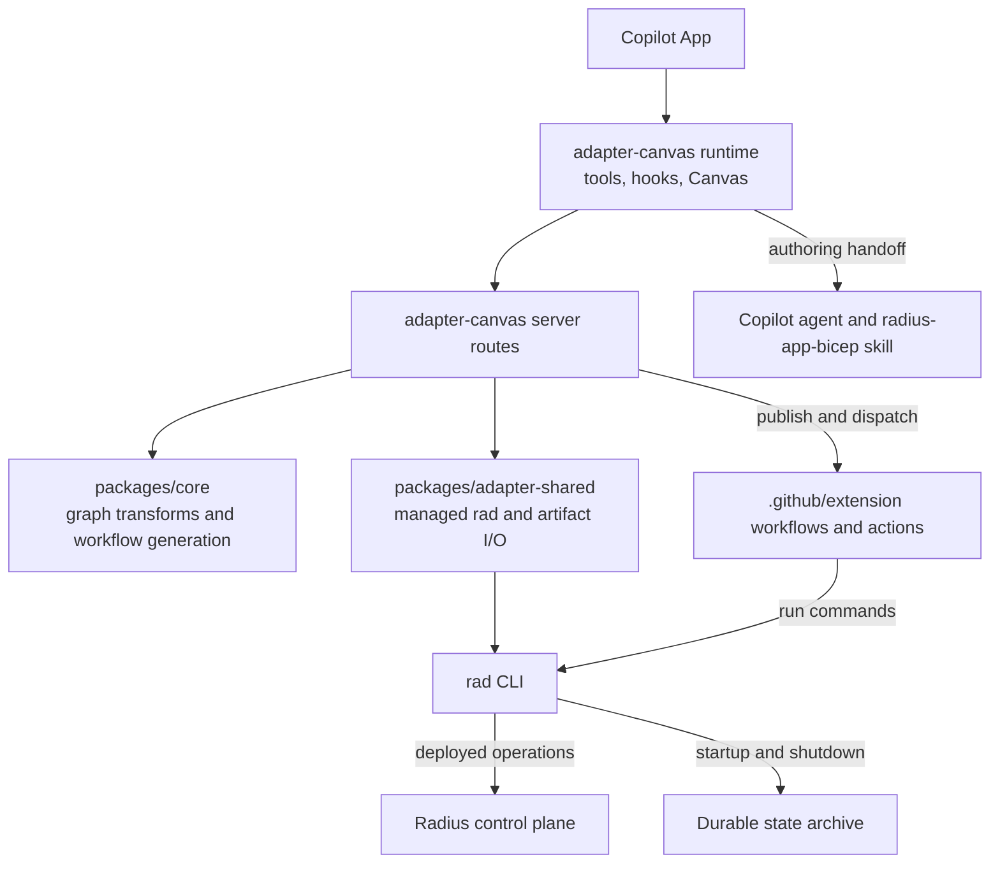
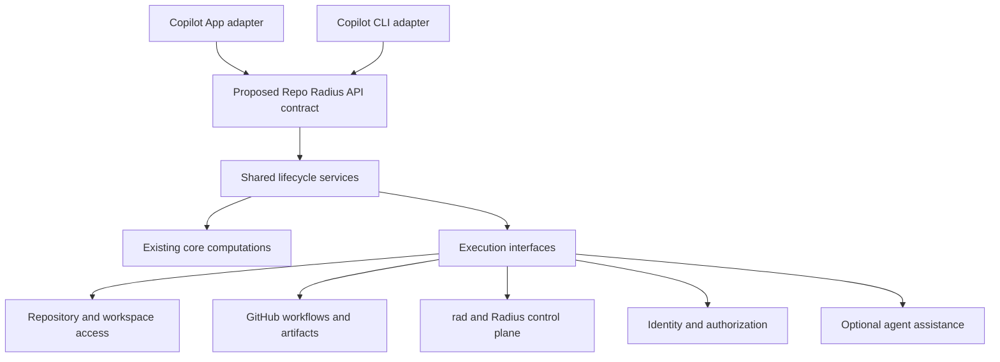
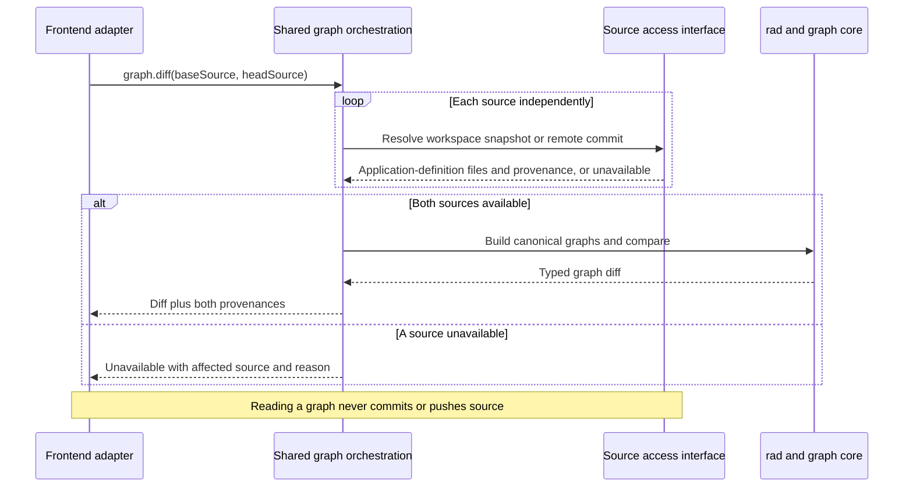
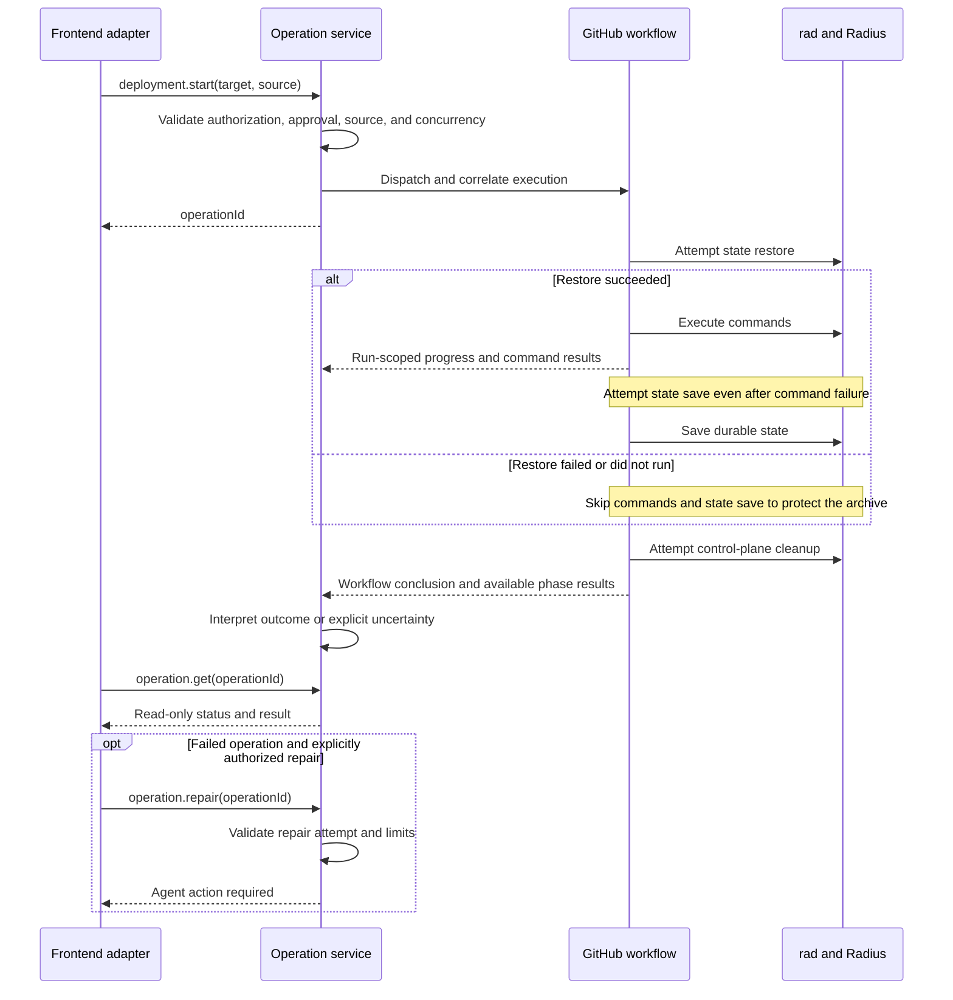

# Frontend-Neutral Repo Radius Architecture

**Status: Proposed architecture.** The current-state section describes inspected code; subsequent sections propose a contract and migration, not APIs that are available today.

Repo Radius should expose one application lifecycle through multiple GitHub frontends. This document uses the Copilot App and Copilot CLI as frontend examples. They should differ in how they collect input and display results, not in how they author an application's Radius definition, resolve its graph, or deploy it.

Here, **backend** means shared Repo Radius capabilities and orchestration, not an always-on server. **Frontend** means a user-facing adapter, not the HTTP handler packages named `frontend` inside Radius resource providers.

## Scope

The proposal covers authoring Radius application definitions, authored/planned/deployed graphs, graph comparison, credentials and environments, deployment, status, repair, application deletion, and environment teardown. It preserves the existing Copilot App integration while making these capabilities usable without an open Canvas.

Operation history, recovery across sessions or process restarts, and durable retry guarantees are deferred to a future architecture document. This proposal defines frontend-facing operation behavior without selecting how it is retained. Existing Radius deployment-state archives remain part of the execution flow.

**Radius application definition** means `.radius/app.bicep` and its supporting files, such as referenced Bicep modules, custom resource type definitions, and recipe packs. An **authored graph** is a graph derived from those files, rather than observed deployed resources. Existing implementation names such as `BuildModeledGraph` remain unchanged in code references; the proposed API uses `definition` for the source files and `authored` for the graph derived from them.

## Quick Reference

| Topic                                         | Start Here                                                      |
|-----------------------------------------------|-----------------------------------------------------------------|
| Existing implementation and coupling          | [Current Architecture](#current-architecture)                   |
| Shared services and frontend boundaries       | [Proposed Architecture](#proposed-architecture)                 |
| Component responsibilities and ownership      | [Key Components](#key-components)                               |
| API operations and request/result semantics   | [Proposed API Contract](#proposed-api-contract)                 |
| Graph, authoring, and deployment flows        | [How It Works](#how-it-works)                                   |
| Workflow failures and user-facing diagnostics | [Error Detection and Reporting](#error-detection-and-reporting) |
| Copilot App and Copilot CLI integration       | [Frontend Adapters](#frontend-adapters)                         |
| Trust boundaries and trade-offs               | [Notable Details](#notable-details)                             |
| Incremental adoption and compatibility        | [Migration](#migration)                                         |

## Current Architecture

The inspected baseline is `radius-project/radius` at `c8ad9211a25699c377c45268890e4f67070aa114` and `radius-project/ai-extensions` at `6f1fec8f282f96100e58f780987f6a697b65056f`. Extension source links below are pinned to that revision.



This is already a partially separated system. [`packages/core`](https://github.com/radius-project/ai-extensions/blob/6f1fec8f282f96100e58f780987f6a697b65056f/packages/core/src/index.ts) contains reusable graph transformations and workflow generation; [`packages/adapter-shared`](https://github.com/radius-project/ai-extensions/blob/6f1fec8f282f96100e58f780987f6a697b65056f/packages/adapter-shared/src/rad.ts) handles managed `rad` execution. The [extension composition root](https://github.com/radius-project/ai-extensions/blob/6f1fec8f282f96100e58f780987f6a697b65056f/packages/adapter-canvas/src/extension.ts) connects these components to Copilot.

### Existing Contracts

| Boundary                                          | Existing behavior                                                                                                                                                                                                                                                                                                                                                                                                                                                                                                                                                                                                                                                                                    |
|---------------------------------------------------|------------------------------------------------------------------------------------------------------------------------------------------------------------------------------------------------------------------------------------------------------------------------------------------------------------------------------------------------------------------------------------------------------------------------------------------------------------------------------------------------------------------------------------------------------------------------------------------------------------------------------------------------------------------------------------------------------|
| Bicep to authored graph                           | [`rad app graph <bicep>`](../../pkg/cli/cmd/app/graph/graph.go) compiles locally without querying the control plane. [`BuildModeledGraph`](../../pkg/cli/graph/modeled.go) produces the Radius `ApplicationGraphResponse`, including redaction and dependency handling.                                                                                                                                                                                                                                                                                                                                                                                                                              |
| Deployed graph                                    | The [preview graph command](../../pkg/cli/cmd/app/graph/preview/graph.go) queries deployed resources and can attach dependency edges from a local Bicep file.                                                                                                                                                                                                                                                                                                                                                                                                                                                                                                                                        |
| Application-definition authoring request to agent | [`radius_generate_app`](https://github.com/radius-project/ai-extensions/blob/6f1fec8f282f96100e58f780987f6a697b65056f/packages/adapter-canvas/src/runtime/create-radius-tools.ts) returns a [skill bootstrap](https://github.com/radius-project/ai-extensions/blob/6f1fec8f282f96100e58f780987f6a697b65056f/packages/adapter-canvas/src/skill.ts), not a completed Radius application definition. The [promotion script](https://github.com/radius-project/ai-extensions/blob/6f1fec8f282f96100e58f780987f6a697b65056f/extensions/radius/skills/radius-app-bicep/scripts/promote-app-model.mjs) guards staged output and detects changes to the existing application definition before replacing it. |
| Frontend to GitHub Actions                        | The [workflow templates](https://github.com/radius-project/ai-extensions/blob/6f1fec8f282f96100e58f780987f6a697b65056f/.github/extension/README.md) expose `workflow_dispatch` inputs including `environment`, `image`, and `rad_commands`; the command result is the `rad-commands-result` artifact.                                                                                                                                                                                                                                                                                                                                                                                                |
| Deployment progress                               | The [artifact reader](https://github.com/radius-project/ai-extensions/blob/6f1fec8f282f96100e58f780987f6a697b65056f/packages/adapter-canvas/src/deploy-artifacts.ts) understands schema version 1 of `deploy-progress.json`, alongside `deploy-graph.json`. Live snapshots rotate through run-scoped artifacts; readers use payload identity and sequence, not listing order.                                                                                                                                                                                                                                                                                                                        |
| Durable storage                                   | [`persistence.Store`](../../pkg/graph/persistence/store.go) stores graphs. [`statearchive.Archive`](../../pkg/statearchive/statearchive.go) abstracts whole-directory snapshots with git and OCI implementations. Neither is a public Repo Radius operation API.                                                                                                                                                                                                                                                                                                                                                                                                                                     |

Workflow templates and composite actions belong to `ai-extensions/.github/extension/`. Radius owns CLI/control-plane execution, resource schemas, graph construction, and state persistence. These responsibilities should remain consistent through multiple front ends.

The raw `rad app graph <bicep>` command writes `app-graph.json` locally or, when `GITHUB_ACTIONS=true`, persists it to the graph archive under a branch-derived key. The existing `runRadAppGraph` helper in `packages/adapter-shared/src/rad.ts` already uses a temporary working directory and clears `GITHUB_ACTIONS` to avoid archive writes. Reuse that isolation for read-only graph requests; the raw command's archive key uses environment-derived branch identity and does not distinguish applications on the same branch.

The current [planned-graph route](https://github.com/radius-project/ai-extensions/blob/6f1fec8f282f96100e58f780987f6a697b65056f/packages/adapter-canvas/src/server/routes/graph-workflows.ts) fetches the default provider recipe pack for output enrichment. Resolving the target environment's actual pack registrations is a proposed requirement below, not a guarantee of this existing path.

### Coupling to Remove

The [graph workflow interface](https://github.com/radius-project/ai-extensions/blob/6f1fec8f282f96100e58f780987f6a697b65056f/packages/adapter-canvas/src/server/routes/graph-workflows.ts) accepts a Canvas `instanceId` and an HTTP-shaped body. Deploy and status [tools](https://github.com/radius-project/ai-extensions/blob/6f1fec8f282f96100e58f780987f6a697b65056f/packages/adapter-canvas/src/runtime/create-radius-tools.ts) locate a Canvas server and derive context from it. The [deployment status handler](https://github.com/radius-project/ai-extensions/blob/6f1fec8f282f96100e58f780987f6a697b65056f/packages/adapter-canvas/src/server/routes/deployments.ts) can initiate an agent repair handoff during polling. These dependencies make a panel part of operation execution rather than just a view.

Environment operations also contain shared business behavior inside the Canvas adapter. [Environment creation](https://github.com/radius-project/ai-extensions/blob/6f1fec8f282f96100e58f780987f6a697b65056f/packages/adapter-canvas/src/server/routes/create-environment.ts) publishes workflows; [environment deletion](https://github.com/radius-project/ai-extensions/blob/6f1fec8f282f96100e58f780987f6a697b65056f/packages/adapter-canvas/src/server/services/environment-deletion.ts) already separates several execution interfaces. Extract those services instead of duplicating them in new frontends.

## Proposed Architecture

Place a **versioned Repo Radius API contract** between frontend adapters and shared lifecycle services. Keep computations already in `core` there and reuse the execution adapter. Move workflow coordination out of Canvas request handlers into shared services with explicit interfaces for repository access, workflow execution, identity, and agent assistance.



These are logical boundaries, not proposed network hops. An Actions runner can invoke shared services as a library, a Copilot tool can use an in-process binding, and an MCP or HTTP adapter can expose the same contract. A permanently running service is not required.

## Key Components

These responsibilities and ownership boundaries describe the proposed architecture.

- **Frontend adapters**: In `ai-extensions`, collect user intent, render results, present approval requests, and translate host interactions. Canvas instance IDs, DOM state, and Copilot SDK handles stay here.
- **API contract**: In `ai-extensions`, define versioned request/result schemas, capability discovery, errors, operation identity, and lifecycle semantics.
- **Lifecycle services**: In `ai-extensions`, resolve source context, validate requests, enforce authorization, coordinate workflows and agent actions, and interpret results. No dependency on Canvas being open.
- **Pure computations**: Reuse `packages/core` for graph normalization/diff, projections, and workflow generation. Do not introduce a second Bicep graph compiler.
- **Execution interfaces**: Reuse `packages/adapter-shared` and extract existing interfaces for GitHub, workspaces, identity, `rad`, and agent execution. These software interfaces describe required capabilities without tying shared services to a particular implementation or frontend runtime.
- **Radius execution**: In `radius`, provide resource APIs, CLI/control-plane behavior, canonical graph construction, deployment and recipe execution, and durable Radius state. See [CLI architecture](rad-cli.md) and [state archive](state-archive.md).

Planned-graph resolution belongs to the shared lifecycle services in `ai-extensions`; it combines the Radius graph with the selected environment's recipe-pack information. For graph comparison, Radius's [`ComputeDiffHash`](../../pkg/cli/graph/diffhash.go) defines the authored-property/dependency hash, while the extension's [`computeGraphDiff`](https://github.com/radius-project/ai-extensions/blob/6f1fec8f282f96100e58f780987f6a697b65056f/packages/core/src/graph/diff.ts) compares resource fields, connections, and that hash. These are complementary responsibilities; frontend adapters must not independently redefine graph equivalence.

## Proposed API Contract

The names and JSON envelopes in this section are illustrative **new contract elements**. They are not current tool names, HTTP endpoints, or drop-in workflow inputs. A later implementation should publish machine-readable schemas and adapter conformance fixtures as their source of truth.

### Schemas and Adapter Conformance

**Machine-readable schemas define the data.** For example, a JSON Schema could specify the required repository, environment, and source revision for `deployment.start`, its optional fields, and the structure of its responses and errors. Shared services and adapters could use these schemas to validate messages and generate language-specific types. JSON Schema is one possible format, not a decision to require HTTP or a hosted service.

**Adapter conformance fixtures define test scenarios.** Each fixture supplies a request, controlled backend responses, and expected results or side effects. Run the same scenarios against each adapter to check that it translates requests and interprets responses consistently.

| Scenario                                    | Expected behavior in either adapter                                   |
|---------------------------------------------|-----------------------------------------------------------------------|
| Start an authorized deployment              | Translate the request correctly and expose the returned operation ID. |
| Request an unavailable capability           | Report the limitation, not a success.                                 |
| Query a failed deployment's status          | Show the failure without initiating repair.                           |
| Compare graphs when a definition is missing | Report an unavailable comparison, not an empty diff.                  |

The Copilot App could render a panel while the CLI prints text. Their presentation differs, but their interpretation of the API must agree. Schemas check message structure; conformance tests check selected behaviors that schemas cannot express. Neither replaces backend authorization or broader integration testing.

Keep the versioned schemas and fixtures together in `ai-extensions`, with their exact package placement left open. Adapters should use these shared definitions rather than maintain separate interpretations of the contract. This architecture document explains the design; the published contract artifacts would define precise implementation requirements. These artifacts are proposed future work, not existing implementations.

### Operation Catalog

| Operation               | Behavior                                                                                                                                  | Effect or prerequisite                                                                                                      |
|-------------------------|-------------------------------------------------------------------------------------------------------------------------------------------|-----------------------------------------------------------------------------------------------------------------------------|
| `application.delete`    | Delete one application and reconcile its status artifacts.                                                                                | Destructive remote mutation with explicit target approval.                                                                  |
| `application.inspect`   | Return one application's identity, associated environment, and available deployment/resource status, with observation time and freshness. | Read-only; requires an explicit application and repository/environment scope.                                               |
| `application.list`      | Discover applications within an explicit repository/environment scope.                                                                    | Read-only; distinguish authored definitions from deployed applications and disclose incomplete or stale results.            |
| `capabilities.get`      | Return supported operations, versions, execution contexts, and limitations for this caller and repository.                                | Read-only; advertising a capability is not authorization.                                                                   |
| `credentials.configure` | Initiate scoped identity configuration.                                                                                                   | May require interactive authentication and cloud/repository mutations.                                                      |
| `credentials.inspect`   | Inspect identity prerequisites.                                                                                                           | Read-only.                                                                                                                  |
| `definition.author`     | Generate and validate the Radius application definition, then apply it only if the original files have not changed during authoring.      | Workspace mutation; requires agent and workspace capabilities. Committing, pushing, and deploying are separate actions.     |
| `definition.validate`   | Validate an existing Radius application definition and report checks performed, diagnostics, and checks skipped or unavailable.           | No AI agent, source replacement, or deployment; successful validation is not a guarantee of deployment success.             |
| `deployment.start`      | Deploy a specified revision of the Radius application definition to an explicit environment.                                              | Remote mutation; requires published source and appropriate approval.                                                        |
| `environment.configure` | Update an existing environment's configuration, including recipe-pack registrations.                                                      | Validated remote mutation; requires authorization and must not implicitly redeploy applications.                            |
| `environment.create`    | Configure an environment's workflows, identity references, and recipe packs.                                                              | Mutates remote configuration and may require elevated privileges.                                                           |
| `environment.delete`    | Run a scoped teardown with declared treatment of workloads, state, workflows, and identity.                                               | Distinct destructive operation; never inferred from application deletion.                                                   |
| `environment.inspect`   | Describe an environment.                                                                                                                  | Read-only.                                                                                                                  |
| `environment.list`      | Discover available deployment environments within an explicit repository scope.                                                           | Read-only; return only environments visible to the caller.                                                                  |
| `graph.diff`            | Compare independently resolved base/head graphs.                                                                                          | Read-only; return an explicit unavailable result when an application definition cannot be resolved.                         |
| `graph.get`             | Return an authored, recipe-enriched planned, or deployed graph with provenance.                                                           | Read-only; prerequisites depend on graph kind.                                                                              |
| `operation.cancel`      | Request cancellation.                                                                                                                     | Authorized and best-effort.                                                                                                 |
| `operation.get`         | Read available progress/results for an operation.                                                                                         | Read-only; no repair side effects; report unavailable results explicitly.                                                   |
| `operation.list`        | Discover available operations, filtered by repository, environment, and optionally application.                                           | Read-only and paginated; enforce caller access and disclose coverage limitations. Durable history is outside this proposal. |
| `operation.repair`      | Request a bounded repair attempt linked to a failed operation.                                                                            | Requires agent capability and permission to edit; publishing and redeploying require their own authorization.               |
| `operation.respond`     | Submit a user decision or an agent outcome for an outstanding required action.                                                            | Authenticated mutation bound to operation/action IDs; cannot bypass validation or approval requirements.                    |

Backend policy may require additional approval for any mutation. A capability unavailable to one adapter must produce an explicit limitation; it must not be emulated by a no-op or a misleading success.

### Application Discovery and Inspection

Frontends need to discover applications without already knowing their names or a deployment operation ID. `application.list` supplies that discovery, while `application.inspect` answers "What do we know about this application now?" In contrast, `operation.get` answers "What happened to this particular deployment or deletion?" An operation result is not a substitute for application inspection.

Radius already provides [`rad app list`](../../pkg/cli/cmd/app/list/list.go), [`rad app show`](../../pkg/cli/cmd/app/show/show.go), and [`rad app status`](../../pkg/cli/cmd/app/status/status.go) as execution building blocks. The Repo Radius adapter must account for the ephemeral control plane and potentially stale artifacts rather than assume a live control plane is always available. Discovery and inspection results must distinguish authored application definitions from deployed applications, identify their evidence source and freshness, and report unavailable or incomplete observations explicitly. A local definition is not proof of deployment, and a missing artifact is not proof that an application does not exist.

Separate `application.create` and `application.update` operations are unnecessary for this contract: `definition.author` creates or edits the Radius application definition, and `deployment.start` applies it to create or update deployed resources. Additional mutation operations should be introduced only for distinct behavior, not to duplicate that path for CRUD symmetry.

### Request Identity and Source

Every request carries `apiVersion`, `requestId`, `operation`, and an explicit `target`. `target.repo` is `owner/repo`; application and environment are required for operations that need them. Caller identity comes from the trusted transport or execution context, not an editable JSON claim.

Source is a tagged choice. A `workspace` source names an opaque, authorized workspace reference plus its branch and snapshot fingerprint; a `git` source names a ref and expected commit. The backend resolves and returns the actual provenance, validates repository-relative paths, and rejects stale expectations. It must not interpret a workspace reference as an arbitrary server filesystem path.

For the current session, use its worktree and branch, including uncommitted changes to the application definition. Do not substitute the repository's default branch. For another repository or branch, read the remote application definition at a resolved commit. Graph reads and comparisons never commit or push as a side effect; temporary compiler output is permitted, but publishing a graph archive is a separate mutation. Remote deployment requires published source; the requested commit must match the revision actually executed.

An adapter can obtain authorized workspace references and current fingerprints through its source-access integration. A fingerprint is a content hash used to detect changes to the application definition. It should cover the definition's effective inputs, including referenced local modules and relevant configuration, not just the top-level file. The `definitionPath` field below names the entry-point Bicep file; the graph kind `authored` means the graph is derived from those files.

Example: an authored graph read from a session worktree. Hash strings are placeholders.

```json
{
  "apiVersion": "repo-radius/v1",
  "requestId": "req-graph-001",
  "operation": "graph.get",
  "target": {
    "repo": "example/shop",
    "source": {
      "kind": "workspace",
      "workspaceRef": "ws-42",
      "branch": "feature/catalog",
      "expectedFingerprint": "sha256:<application-definition-inputs>"
    },
    "definitionPath": ".radius/app.bicep"
  },
  "input": {
    "kind": "authored",
    "includeIcons": false
  }
}
```

The result contains the canonical graph and its resolved provenance. Frontend layout, selection, and panel state are not part of that graph.

### Results, Errors, and Compatibility

Read operations return a typed result or a structured error. `graph.diff` can return a typed `unavailable` result with a reason and affected source; this is neither an empty diff nor permission to generate or publish an application definition silently.

Errors contain `code`, `message`, `retryable`, `requestId`, optional `operationId`, and redacted details or required actions. Examples include `SOURCE_CHANGED`, `DEFINITION_NOT_FOUND` (the Radius application definition is missing), `RECIPE_PACK_REQUIRED`, `CAPABILITY_UNAVAILABLE`, `FORBIDDEN`, and `VERSION_UNSUPPORTED`. A missing result after execution is `RESULT_UNAVAILABLE`, not proof of deployment failure or success.

For workflow errors, details should identify the failed phase, affected target, and correlated run/attempt when available, with a workflow link and bounded, redacted diagnostics. `retryable` describes whether retrying the request that returned the error is safe; retrying a status read is not permission to repeat the deployment. See [Error Detection and Reporting](#error-detection-and-reporting) for how execution evidence becomes a user-facing result.

Version the Repo Radius API separately from Radius resource API versions and workflow/artifact schema versions. Adapters can translate supported legacy formats, but must reject unknown versions rather than guess. Additive fields can evolve within a version; incompatible semantics require a new version and an explicit compatibility period.

### Long-Running Operations

Starting a long-running mutation returns an `operationId`, resolved target, and initial status. The ID remains stable for that operation and is distinct from a Canvas instance ID. Control requests such as `operation.cancel` and `operation.respond` address the existing operation rather than start another deployment. Operation IDs and workflow/run IDs identify different things; the execution binding must correlate them without assuming that the latest run belongs to the caller.

Use lifecycle states `queued`, `running`, `action_required`, `succeeded`, `failed`, and `cancelled`. Keep observation quality separate: `current`, `stale`, or `unknown`. Loss of a runner or a missing artifact cannot justify inventing a terminal state. Reconciliation can later establish the outcome; it must not automatically retry an uncertain mutation.

| Concern              | Required semantics                                                                                                                                                                                       |
|----------------------|----------------------------------------------------------------------------------------------------------------------------------------------------------------------------------------------------------|
| Dispatch correlation | Correlate a run using explicit operation identity and source, not the newest run in a repository. An ambiguous dispatch remains unresolved rather than being blindly repeated.                           |
| Progress             | Validate repository, environment, application, run, and attempt identity. Sequence numbers order snapshots within a run, not across runs.                                                                |
| Concurrent mutations | Conflicting mutations must not run unsafely against the same Radius deployment-state scope. Preserve execution-layer safeguards; this proposal does not establish cross-session coordination guarantees. |
| Cancellation         | Report a cancellation request separately from confirmed cancellation. Cancellation does not promise cloud rollback; preserve state and report incomplete cleanup when possible.                          |
| Completion           | Distinguish command outcome, workflow conclusion, and durable-state save outcome. Deployment success requires the relevant phases to succeed, not just `rad deploy`.                                     |
| Repair               | Create a distinct attempt linked to the original operation and approved source. Status reads only observe. Any automatic repair policy must be explicit, bounded, and independent of polling.            |

Example: start a deployment. This typed request is translated to the existing execution workflow, not sent verbatim to `workflow_dispatch`.

```json
{
  "apiVersion": "repo-radius/v1",
  "requestId": "req-deploy-001",
  "operation": "deployment.start",
  "target": {
    "repo": "example/shop",
    "application": "shop",
    "environment": "dev",
    "source": {
      "kind": "git",
      "ref": "feature/catalog",
      "expectedCommit": "<full-commit-sha>"
    },
    "definitionPath": ".radius/app.bicep"
  },
  "input": {
    "repairPolicy": "manual"
  }
}
```

A later `operation.get` can return the following terminal result. Receipt of the start request would instead return `queued` with the same operation identity.

```json
{
  "apiVersion": "repo-radius/v1",
  "requestId": "req-status-002",
  "operationId": "op-deploy-001",
  "state": "succeeded",
  "observation": "current",
  "target": {
    "repo": "example/shop",
    "application": "shop",
    "environment": "dev"
  },
  "provenance": {
    "commit": "<full-commit-sha>"
  },
  "execution": {
    "workflowRunId": 123456,
    "attemptId": "attempt-1",
    "sequence": 12
  },
  "result": {
    "commandOutcome": "succeeded",
    "workflowConclusion": "success",
    "statePersistence": "succeeded"
  }
}
```

The existing workflow/artifact contract does not yet provide every proposed guarantee. In particular, explicit dispatch correlation, expected-revision enforcement, and an authoritative Radius deployment-state save outcome require implementation work. Until supported, adapters must expose the limitation instead of promising stronger completion guarantees. This proposal does not promise exactly-once execution or safe automatic retry after an uncertain outcome.

## How It Works

### Graph Resolution and Comparison

**Shared graph orchestration** is proposed backend code in the `ai-extensions` lifecycle services, not a separate deployed service. It handles `graph.get` and `graph.diff` by coordinating source access and calls to existing `rad` graph-building and shared graph comparison code, then returns structured results for the frontend to present.

Authored graphs describe resources and relationships declared in the application definition; planned graphs enrich them with expected recipe outputs for an environment; deployed graphs describe resources and relationships observed in a deployment. A planned graph is not an authoritative Terraform or cloud-provider deployment plan. Preserve the Radius graph representation and attach graph kind, source provenance, environment, and observation time in the result envelope.



An unavailable graph diff must not block creation of a PR. The adapter reports the reason to the user and omits the graph section; it does not replace the PR's actual change description with a graph error.

Planned resolution must use the target environment's recipe-pack registrations. An existing type without a matching recipe returns `RECIPE_PACK_REQUIRED`; do not generate a custom type to bypass missing registration. If no suitable built-in type exists, authoring may propose a custom `Radius.Resources` type with its recipe pack, subject to the supported provider capability (Azure for this authoring path today). A service not provisionable on the supported provider is an explicit limitation. Neither case introduces inline per-type singleton recipes.

### Authoring Application Definitions and Agent Assistance

Authoring a Radius application definition is a multi-step operation: locate the source files, record their starting content fingerprint, request authoring in a staging location, and validate the proposed files. Apply those files to the working tree only if the original definition is unchanged, so concurrent edits are not overwritten. This step is called promotion in the existing scripts; the current script also runs `git add`, but does not commit, push, or deploy the definition. It checks the managed files it may replace; the proposed fingerprint of all effective definition inputs is a broader requirement. Agent assistance is accessed through an explicit software interface, not a requirement that a frontend understand a local skill path. The existing skill and safeguards remain the implementation starting point.

Example: authoring is waiting for an agent. The action kind `agent.author_definition` means authoring the Radius application definition. The `actionId` identifies an outstanding, authorized action; arbitrary clients cannot claim completion to bypass validation.

```json
{
  "apiVersion": "repo-radius/v1",
  "requestId": "req-author-001",
  "operationId": "op-author-001",
  "state": "action_required",
  "observation": "current",
  "requiredAction": {
    "actionId": "action-author-001",
    "kind": "agent.author_definition",
    "workspaceRef": "ws-42",
    "expectedFingerprint": "sha256:<application-definition-inputs>"
  }
}
```

An authorized agent binding reports completion, failure, or cancellation through `operation.respond`, described below; the proposed files can replace the working-tree definition only after backend validation and the unchanged-source check. Repair uses the same handoff pattern, adds the failed operation and attempt identity, and separately authorizes publication and redeployment. A frontend with no agent capability must report that limitation rather than claiming to have generated or repaired an application definition.

### Responding to Required Actions

`operation.respond` completes the interaction contract for `action_required`. It uses the common request envelope, including `apiVersion`, `requestId`, `operation`, and `target`. Its input carries the parent `operationId`, the outstanding `actionId`, and a typed `response`. The backend resolves the outstanding action and verifies the caller, target, action kind, and any bound source revision or fingerprint before accepting the response.

| Response kind   | Payload and authority                                                                                                                                                                                                                                                                                                                              |
|-----------------|----------------------------------------------------------------------------------------------------------------------------------------------------------------------------------------------------------------------------------------------------------------------------------------------------------------------------------------------------|
| `user.decision` | A decision and any explicitly requested input matching the action's declared choices/schema. Only a caller authorized to answer that action may submit it. A user decision cannot stand in for an agent completion report.                                                                                                                         |
| `agent.outcome` | An outcome of `completed`, `failed`, or `cancelled`; completion includes authorized references to staged outputs when required, while failure includes redacted diagnostics. Only an agent execution binding authorized for that action may submit it. Reporting completion does not prove that generated files are valid or approve a deployment. |

Accept a response only for an outstanding action. Conflicting, stale, expired, or superseded responses return structured errors; if the action's status cannot be established, report that uncertainty rather than start the work again. Return the parent operation's resulting state, which may remain `action_required` for another prerequisite or resume backend processing. A response does not mark the parent operation successful by itself. Replay and recovery semantics are outside this proposal.

The backend still enforces unchanged-source checks, output validation, and permissions before any subsequent side effects. GitHub environment approvals remain authoritative and must be verified through the GitHub execution integration; a payload claiming approval cannot replace them. Exact per-action input schemas and transport bindings can be specified later without adding broader management operations.

### Deployment and Durable Outcomes

GitHub Actions remains the existing remote execution boundary. Shared services generate and dispatch the canonical templates; the workflow restores Radius state, runs commands, publishes progress/results, and saves state. The target application cluster is separate from the ephemeral control-plane cluster used by the workflow.

The existing [teardown action](https://github.com/radius-project/ai-extensions/blob/6f1fec8f282f96100e58f780987f6a697b65056f/.github/extension/actions/teardown/action.yml) runs `rad shutdown` only when the restore step reported success. It still attempts a save after a later command failure, but skips it when restore failed or never ran, to avoid replacing durable state with uninitialized state. Cancellation or runner loss can prevent teardown from completing; neither a successful save nor rollback is guaranteed in those cases.



The diagram shows the proposed semantic flow, not an assumption that Actions pushes events to a hosted server. An execution adapter can retrieve artifacts and refresh observations on demand or through an event integration. Reading status never starts repairs or other user mutations.

Preserve the existing `rad_commands` workflow input as a compatibility boundary. New typed lifecycle operations should map through reviewed command builders, not expose an unrestricted shell API. Keep workflow templates and shared actions in `ai-extensions`, version their contracts, and retain pinned execution dependencies.

The existing workflow validates `rad_commands` against an allowed-command set, and its dispatcher also auto-triggers deployment after successful credential verification. That verification-to-deployment chain must not run implicitly for the proposed `environment.configure` operation. Preserve it only as an explicitly authorized composite workflow, or separate verification from deployment in the new binding; the legacy command path must not bypass the new operation's target and approval checks.

Graph artifacts and Radius deployment state serve different purposes. A cached graph cannot restore a deployment. Report missing or expired workflow artifacts explicitly instead of inferring a deployment outcome from their absence.

### Error Detection and Reporting

The proposed error path has three responsibilities: workflows expose execution evidence, shared lifecycle services classify it, and frontend adapters present it. These are requirements for the future contract, not a claim that current workflows already emit every required field. They do not require the operation-history storage design deferred above.

**Detect failures at the execution boundary.** Workflow steps should preserve command exit codes and distinguish state restore, deployment, state save, and cleanup outcomes. Collect diagnostics and publish phase results even after a command fails where execution still permits it, without turning that failure into a successful workflow conclusion. Diagnostic collection or cleanup failures must not overwrite the original failure; report them as additional problems. Cancellation and runner loss can prevent any final result from being published.

**Classify evidence in shared services.** The GitHub execution interface retrieves the correlated run's status, job/step outcomes, and available result artifacts. Shared services validate artifact identity and schema before interpreting them. Prefer structured outcomes over guessing from words such as "error" in logs; use logs for supporting diagnostics. A queued run or one waiting for GitHub approval is not a failed deployment. Report conflicting evidence explicitly rather than choosing whichever result appears successful.

| Evidence                                                                          | API interpretation and user message                                                                                              |
|-----------------------------------------------------------------------------------|----------------------------------------------------------------------------------------------------------------------------------|
| GitHub explicitly rejects dispatch                                                | Report the dispatch error and any actionable permission or configuration requirement. Do not claim deployment started.           |
| Dispatch request times out with no confirmed run identity                         | Report that dispatch is unconfirmed and execution may have started. Do not dispatch again automatically.                         |
| Deployment command fails                                                          | Report failure with the failed phase and diagnostics; show state-save and cleanup outcomes separately.                           |
| Deployment command succeeds but state save fails                                  | Do not report deployment success. Explain that resources may have changed but Radius state was not saved successfully.           |
| GitHub reports a failed or cancelled run but detailed artifacts are missing       | Report the confirmed workflow conclusion while marking detailed phase or resource outcomes unavailable.                          |
| Status retrieval fails, or artifacts are missing while the run outcome is unknown | Report an observation problem, not a new deployment failure or success; mark previous observations stale or the outcome unknown. |

**Report the same meaning in every frontend.** Return a structured error with a concise explanation of what failed, the affected repository/application/environment, the failed phase when known, and whether execution or resource changes are uncertain. Include operation and run identifiers when available, a workflow link, and a safe next action. The App can show a summary with expandable diagnostics; the CLI adapter can provide concise text and structured tool results. Both must preserve the distinction between failure, cancellation, and unavailable status rather than hide it behind a generic "something went wrong" message.

For example, after a confirmed state-save failure, both adapters should convey: "The deployment command succeeded, but saving Radius state failed. Resources may have changed. Inspect the workflow's state-save failure before attempting another deployment." Include the affected target and run link alongside that message. Redact secrets before publishing diagnostics and before returning them to a frontend or agent. Bound diagnostic output, disclose truncation, and keep access to detailed logs subject to GitHub permissions.

**Keep observation retries separate from repair.** Retry transient read failures with bounded backoff and respect GitHub rate limits; if observation remains unavailable, report that limitation. Do not blindly repeat mutations after timeouts, automatically grant missing permissions, or start repair from polling. A repair action must follow the contract's `operation.repair` authorization and source checks. User-actionable prerequisites can use `action_required`, but a frontend response cannot substitute for GitHub approval or prove a failed deployment recovered.

### Credentials and Deletion

Identity inspection must not unexpectedly start an interactive login. Configuration can return an explicit user action, while deployment uses the environment's identity configuration and short-lived OIDC tokens in the execution boundary. Do not put raw credentials in public request/result objects, application graphs, or diagnostic output.

Application deletion targets one application and its status artifacts. Environment teardown must declare what happens to workloads, state packages, workflows, and cloud identities, including resources shared with other environments. Validate ownership/provenance and permissions before each destructive phase; report partial completion and recovery steps rather than treating every deletion as atomic.

## Frontend Adapters

The matrix describes proposed integration paths, not equal capabilities already shipped. Each path calls the same services; unsupported actions are visible.

| Capability                                  | Copilot App                                                         | Copilot CLI                                                         |
|---------------------------------------------|---------------------------------------------------------------------|---------------------------------------------------------------------|
| Application-definition authoring and repair | Existing agent interaction behind explicit action handoffs.         | Agent tools with authorized workspace access.                       |
| Graph and diff                              | Canvas rendering of typed results; keep panel reuse in the adapter. | Structured JSON, text, or Mermaid output.                           |
| Credentials and environment setup           | Guided forms and explicit authentication actions.                   | Prompts and structured tools; browser authentication when required. |
| Deployment and status                       | Canvas/tools call services without requiring an open panel.         | Start and query operations by ID.                                   |
| Application/environment deletion            | Explicit target confirmation and approval.                          | Explicit confirmation and permission checks.                        |

[Copilot CLI supports MCP servers](https://docs.github.com/en/copilot/how-tos/copilot-cli/customize-copilot/add-mcp-servers), making MCP a candidate tool binding, not a reason to replace `rad`. Copilot CLI is the interaction host; `rad` remains an execution tool.

Both frontend adapters use shared backend services to dispatch GitHub Actions workflows and retrieve execution results. The workflow definition must exist on the default branch for [manual workflow dispatch](https://docs.github.com/en/actions/how-tos/manage-workflow-runs/manually-run-a-workflow), but the selected execution/source branch is a separate concern; this does not justify reading every graph from main. Validate the actual checked-out commit before execution.

## Notable Details

### Trust Boundaries

Repository contents, generated application definitions, recipe references, and workflow artifacts are inputs, not authority. Apply source/path validation, artifact identity/schema validation, and redaction in shared services. Enforce repository and environment access on every operation, including reads of potentially sensitive results.

Approvals must bind to the operation, target, and source revision; editing the source invalidates any approval whose scope depended on it. A frontend-supplied `approved: true` must not bypass backend checks. Preserve GitHub environment protection and least-privilege workflow permissions. Fork PR graph inspection must not acquire deployment credentials or execute privileged untrusted workflows.

### Alternatives

| Alternative                                  | Benefit                                                             | Cost or limitation                                                                                                                             |
|----------------------------------------------|---------------------------------------------------------------------|------------------------------------------------------------------------------------------------------------------------------------------------|
| Wrap existing Canvas HTTP routes             | Small initial adapter change.                                       | Retains instance state and polling-triggered repair; does not establish frontend neutrality. Useful only as a temporary compatibility wrapper. |
| Use workflows as the entire public API       | Reuses the existing GitHub Actions execution mechanism.             | Poor fit for uncommitted workspace graphs, local authoring, and interactive identity actions. Keep workflows as an execution binding.          |
| Require a new hosted REST service            | Familiar network API and potentially centralized operations.        | Commits to hosting, authentication, and operational infrastructure before those decisions are needed. Defer.                                   |
| Extract shared services and typed interfaces | Reuses working code and supports local, runner, or hosted bindings. | Requires schema ownership, execution integration, and conformance work. Recommended.                                                           |

## Migration

1. **Formalize existing boundaries.** Inventory tool, workflow, graph, and artifact contracts. Publish proposed request/result schemas and fixtures in `ai-extensions`; keep their version separate from Radius resource schemas.
2. **Extract lifecycle services.** Move context resolution and workflow coordination into shared services using typed requests and explicit dependency interfaces, preserving existing core and execution packages. Introduce frontend-independent operation IDs, explicit agent actions, and read-only status semantics.
3. **Move Canvas onto the contract.** Retain existing tool names, inputs, and panel behavior through compatibility adapters. Compare results with existing fixtures before switching each operation; never dual-run a mutation.
4. **Add the Copilot CLI binding if/when needed.** Start with graph reads and existing deploy workflows, then cover the remaining lifecycle as capabilities permit. Add explicit correlation and completion evidence before claiming the stronger API guarantees.
5. **Retire compatibility paths deliberately.** Keep supported workflow/artifact versions readable during transition. Roll back adapter routing only when the execution binding can continue handling in-flight operations; never roll back by redispatching or discarding them.

Future conformance tests should prove that the same authorized request and fixtures have the same semantic result across bindings. Include deployment without Canvas, worktree graph provenance, missing remote application definitions, stale-source rejection, unsupported agent capabilities, ambiguous dispatch outcomes, missing/expired artifacts, state-save failure after command success, repeated status reads that cannot initiate repair, and deletion that cannot bypass authorization.

Error-reporting fixtures should also cover status API outages and rate limits, failed or cancelled runs without artifacts, mismatched artifact identity, conflicting phase results, deployment failure followed by cleanup failure, and secret-bearing diagnostics. Verify that adapters preserve the primary failure, distinguish observation errors from execution outcomes, and do not leak secrets or trigger duplicate mutations.

### Decisions Left Open

Choose concrete transport bindings, package/schema placement, and any hosted deployment separately. Provider-specific setup/teardown capabilities need explicit declarations rather than assumed Azure/AWS parity. These choices must preserve the contract's separation from frontend state.

## Related Documentation and Source

Read [application graph](application-graph.md), [durable state archive](state-archive.md), and [credential architecture](credentials.md) for Radius internals. The [deploy-environment contributor guide](../contributing/contributing-deploy-environments.md) and [canonical workflow documentation](https://github.com/radius-project/ai-extensions/blob/6f1fec8f282f96100e58f780987f6a697b65056f/.github/extension/README.md) describe today's setup and execution surfaces. Older design notes provide history but may lag current code.
