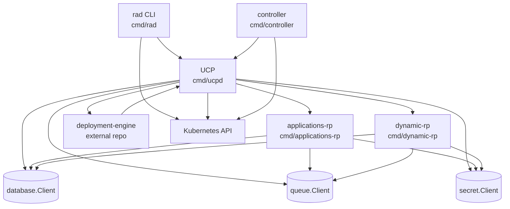
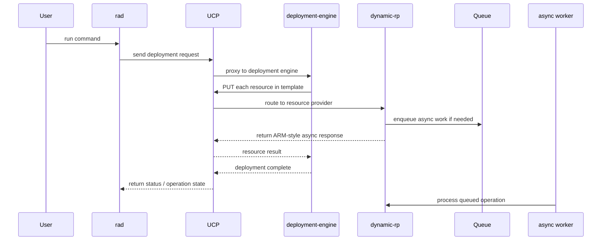
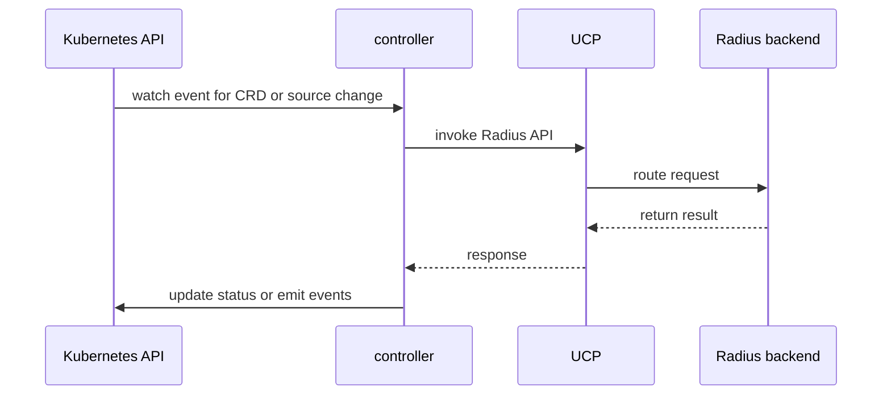

# Service Interaction Map

This document explains how the main executables in this repository fit
together at runtime. Use it as the top-level map before diving into a specific
service.

## Components

- **`rad`** is the user-facing CLI. It loads workspace and connection config,
  builds clients, and invokes Radius APIs or Kubernetes/Helm operations.
- **`ucpd`** is the Universal Control Plane. It is the main routing point for
  control-plane API requests.
- **`applications-rp`** hosts the Applications.Core resource provider and the
  portable resource providers (Dapr, Datastores, Messaging) in the same process.
- **`dynamic-rp`** is the main authoring surface for Radius resource types and
  generic resource lifecycle behavior.
- **`controller`** runs Kubernetes reconcilers and webhooks for Radius custom
  resources and related workflows.
- **Deployment Engine** is not implemented in this repository, but several
  flows cross that boundary. UCP proxies deployment requests to the deployment
  engine, and the deployment engine calls back to UCP for each resource it
  needs to create or update.

This map is intentionally focused on the current contributor path for new work.
Some legacy provider processes still exist in the runtime, but new authoring
work should target Radius resource types through `dynamic-rp`.

## Main Runtime Patterns

### CLI to service path

Most user-initiated operations begin in `rad`, which resolves the active
workspace and connection, then sends requests either to UCP or directly to the
cluster for install/debug workflows.

### UCP as the control-plane hub

UCP receives the request, identifies the target plane or provider, and either:

- serves UCP-native behavior itself
- proxies to `applications-rp` for Applications.Core and portable resource types
- proxies to `dynamic-rp` for dynamically registered resource types
- proxies deployment requests to the deployment engine
- adapts the request for an external control plane such as AWS

### Shared state model

UCP and the provider processes share pluggable abstractions for:

- resource state in `database.Client`
- async work in `queue.Client`
- sensitive values in `secret.Client`

Those abstractions are described in
[state-persistence.md](state-persistence.md).

### Reconciliation path

The controller does not replace the resource providers. Instead it watches
Kubernetes resources, coordinates Kubernetes-native workflows, and uses Radius
clients to drive backend operations through the control plane.

## Typical Flows

### Deploy through the CLI

### Reconcile inside the cluster

## Boundaries That Matter When Changing Code

- If the change is about **routing, plane selection, or protocol translation**,
  start in UCP.
- If the change is about **authoring or handling Radius resource types**,
  start in `dynamic-rp`.
- If the change is about **Kubernetes watch/reconcile/webhook behavior**,
  start in `controller`.
- If the change is about **user experience, config, or command orchestration**,
  start in `rad`.

## Start Reading in Code

- [cmd/ucpd/main.go](../../cmd/ucpd/main.go)
- [cmd/ucpd/cmd/root.go](../../cmd/ucpd/cmd/root.go)
- [cmd/applications-rp/main.go](../../cmd/applications-rp/main.go)
- [cmd/applications-rp/cmd/root.go](../../cmd/applications-rp/cmd/root.go)
- [cmd/dynamic-rp/main.go](../../cmd/dynamic-rp/main.go)
- [cmd/dynamic-rp/cmd/root.go](../../cmd/dynamic-rp/cmd/root.go)
- [cmd/controller/main.go](../../cmd/controller/main.go)
- [cmd/controller/cmd/root.go](../../cmd/controller/cmd/root.go)
- [cmd/rad/main.go](../../cmd/rad/main.go)
- [cmd/rad/cmd/root.go](../../cmd/rad/cmd/root.go)