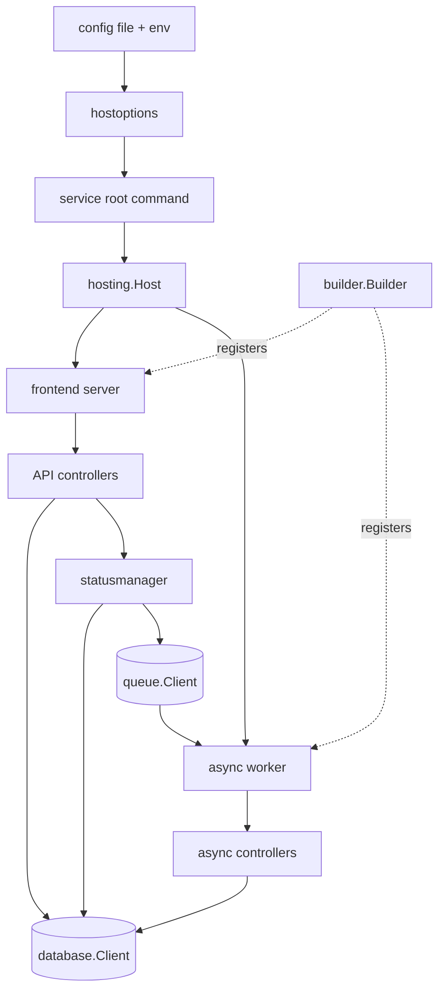

# Shared Runtime And ARM-RPC

This document explains the common service runtime and ARM-RPC framework used by
the Go control-plane services in this repository. Read this before changing the
service startup flow, HTTP request handling, builder registration, or async
operation machinery.

The shared runtime provides a consistent model for loading service
configuration, building long-running services, wiring HTTP servers and
middleware, registering API handlers by namespace and operation, and processing
ARM-style async operations. It exists so UCP and `dynamic-rp` do not each
invent their own hosting, routing, validation, and async patterns.

## Quick Reference

| Topic | Start Here |
|------|------------|
| Host lifecycle | `pkg/components/hosting/hosting.go` |
| Shared HTTP server | `pkg/armrpc/frontend/server/server.go` |
| Namespace/API registration | `pkg/armrpc/builder/builder.go` |
| Async status | `pkg/armrpc/asyncoperation/statusmanager/statusmanager.go` |
| Async worker | `pkg/armrpc/asyncoperation/worker/...` |

| Test Focus | Packages |
|-----------|----------|
| Shared runtime and builder logic | `./pkg/armrpc/...` |
| Shared API/async host usage | `./pkg/server/...` |
| Broad downstream impact check | `./pkg/ucp/...`, `./pkg/corerp/...`, `./pkg/dynamicrp/...` |

## Main Building Blocks

| Package | Responsibility |
|--------|----------------|
| `pkg/armrpc/hostoptions` | turns config files and environment into runtime options |
| `pkg/components/hosting` | starts and supervises one or more long-running services |
| `pkg/armrpc/frontend/server` | shared HTTP server creation, middleware, version and health routes |
| `pkg/armrpc/builder` | namespace-based API and async controller registration |
| `pkg/armrpc/frontend/controller` | controller contracts for HTTP operations |
| `pkg/armrpc/asyncoperation/statusmanager` | creates and updates operation status resources and queue messages |
| `pkg/armrpc/asyncoperation/worker` | dequeues and executes async controllers |

## End-To-End Shape

## Startup Model

### 1. Root command loads config and builds options

Each service root command follows the same general pattern:

- read a config file
- construct runtime options
- create a logger
- create one or more long-running services
- hand them to shared hosting

Examples:

- [cmd/ucpd/cmd/root.go](../../cmd/ucpd/cmd/root.go)
- [cmd/dynamic-rp/cmd/root.go](../../cmd/dynamic-rp/cmd/root.go)

For services using the standard host options path, the main constructor is
[pkg/armrpc/hostoptions/hostoptions.go](../../pkg/armrpc/hostoptions/hostoptions.go).

### 2. Shared hosting starts services and manages shutdown

[pkg/components/hosting/hosting.go](../../pkg/components/hosting/hosting.go)
defines a small but important contract:

- each long-running subsystem implements `Name()` and `Run(ctx)`
- a `Host` starts all services
- duplicate service names are rejected
- shutdown is coordinated through context cancellation and a timeout

This abstraction is what lets one process host multiple subsystems, such as the
API service and async worker inside `dynamic-rp`.

## HTTP Runtime Model

### Shared HTTP server

[pkg/armrpc/frontend/server/server.go](../../pkg/armrpc/frontend/server/server.go)
creates the common HTTP server used by ARM-RPC-based services.

Its default behavior includes:

- panic recovery middleware
- request logging middleware
- API not-found and method-not-allowed handlers
- optional ARM client certificate validation
- request context creation through `servicecontext.ARMRequestCtx`
- built-in `/version` and `/healthz` endpoints
- OpenTelemetry HTTP instrumentation

That means service-specific code usually does not build raw HTTP stacks itself.
Instead, it supplies a `Configure` callback that registers routes on top of the
shared server.

### Request context and validation

The server layer applies middleware that creates an ARM-aware request context.
This is what makes downstream code able to reason about API version, operation
type, resource ID, identity, and correlation metadata in a consistent way.

OpenAPI validation is not hard-coded per route in every service. Instead it is
usually created per namespace through the builder layer.

## Builder Model

The `builder.Builder` type in
[pkg/armrpc/builder/builder.go](../../pkg/armrpc/builder/builder.go) is the key
registration contract between resource namespaces and the shared runtime.

### API registration

`ApplyAPIHandlers` does three things:

- computes the standard root scope paths
- creates subrouters for plane scope, resource-group scope, and resource scope
- registers handler/controller pairs for operations like `GET`, `PUT`, `PATCH`,
  `DELETE`, and list operations

It also registers default ARM-RPC-style operations such as:

- `<namespace>/operations`
- `<namespace>/operationstatuses`
- `<namespace>/operationresults`

### Validation registration

`NewOpenAPIValidator` loads the swagger-backed OpenAPI spec for a namespace and
returns middleware that validates requests for the namespace routes.

This is an important architectural rule: validation is attached at the routing
layer, not left to each controller to reimplement.

### Async registration

`ApplyAsyncHandler` registers async controllers into the worker controller
registry using the same builder registrations. That is why synchronous API
handlers and async backend handlers are usually wired from the same namespace
setup code.

## Async Operation Model

### Status manager

[pkg/armrpc/asyncoperation/statusmanager/statusmanager.go](../../pkg/armrpc/asyncoperation/statusmanager/statusmanager.go)
is the bridge between request-time handling and background execution.

When a request needs long-running processing, the status manager:

- creates an operation status resource in the database
- creates a queue message that captures operation metadata
- stores ARM-facing details such as the operation ID and retry behavior

This is what lets the API layer return an ARM-style async response while the
real work happens later.

### Worker service

[pkg/armrpc/asyncoperation/worker/service.go](../../pkg/armrpc/asyncoperation/worker/service.go)
starts the async worker with:

- a database client
- a queue client
- a status manager
- a controller registry

The controller registry in
[pkg/armrpc/asyncoperation/worker/registry.go](../../pkg/armrpc/asyncoperation/worker/registry.go)
maps operation type plus method to an async controller instance.

That registry can also hold a default factory for operations that do not have a
more specific controller.

## How Services Use This Framework

- UCP uses the shared hosting and HTTP runtime patterns, but its routing layer
  is specialized around module dispatch, proxying, and adaptation.
- `dynamic-rp` uses the same runtime concepts, but applies them to generic
  resource handling rather than a multi-namespace hosted-provider process.

## When To Change Which Layer

- Change `hostoptions` when the service bootstrap or config-to-runtime mapping
  changes.
- Change `hosting` when process lifecycle, startup ordering, or shutdown rules
  change.
- Change `frontend/server` when shared HTTP behavior, middleware, or standard
  endpoints change.
- Change `builder` when namespace route generation, default operations, or
  validation wiring changes.
- Change `statusmanager` or `worker` when async operation semantics change.

## Invariants And Constraints

- Shared runtime code should remain generic across services.
- Builder registration is the contract that binds a namespace into both the API
  layer and the async layer.
- The HTTP path should stay separate from the background worker path even when
  they are hosted in the same process.
- Operation status persistence and queueing must remain consistent with the ARM
  async protocol shape exposed by the API layer.

## Common Mistakes

- Re-implementing routing or validation inside a service instead of using the
  builder and shared server patterns.
- Registering API handlers for a namespace without also checking its async
  handler registration.
- Treating the worker as independent from the status manager and queue contract.
- Changing shared middleware without considering impact on every ARM-RPC-based
  service.

## Change This Safely

When changing the shared runtime, assume you are changing multiple binaries at
once.

### Packages That Usually Move Together

- `pkg/armrpc/frontend/server` and `pkg/middleware` when shared request handling
  changes
- `pkg/armrpc/builder` and namespace setup packages when route registration or
  validator behavior changes
- `pkg/armrpc/asyncoperation/statusmanager` and
  `pkg/armrpc/asyncoperation/worker` when async semantics change
- `pkg/components/hosting` and service root commands when lifecycle behavior
  changes

### Suggested Test Scope

- `go test ./pkg/armrpc/...`
- `go test ./pkg/server/...`
- `go test ./pkg/ucp/...`
- `go test ./pkg/dynamicrp/...`

If the change is broad enough to affect shared process lifecycle or cross-cutting
HTTP behavior, also run the repo unit-test target documented in
[../contributing/contributing-code/contributing-code-tests/README.md](../contributing/contributing-code/contributing-code-tests/README.md).

## Start Reading In Code

- [pkg/components/hosting/hosting.go](../../pkg/components/hosting/hosting.go)
- [pkg/armrpc/frontend/server/server.go](../../pkg/armrpc/frontend/server/server.go)
- [pkg/armrpc/frontend/server/doc.go](../../pkg/armrpc/frontend/server/doc.go)
- [pkg/armrpc/builder/builder.go](../../pkg/armrpc/builder/builder.go)
- [pkg/armrpc/asyncoperation/statusmanager/statusmanager.go](../../pkg/armrpc/asyncoperation/statusmanager/statusmanager.go)
- [pkg/armrpc/asyncoperation/worker/service.go](../../pkg/armrpc/asyncoperation/worker/service.go)
- [pkg/armrpc/asyncoperation/worker/registry.go](../../pkg/armrpc/asyncoperation/worker/registry.go)
- [pkg/server/apiservice.go](../../pkg/server/apiservice.go)
- [pkg/server/asyncworker.go](../../pkg/server/asyncworker.go)

## Related Docs

- [service-interaction-map.md](service-interaction-map.md)
- [ucp.md](ucp.md)
- [dynamic-rp.md](dynamic-rp.md)
- [state-persistence.md](state-persistence.md)