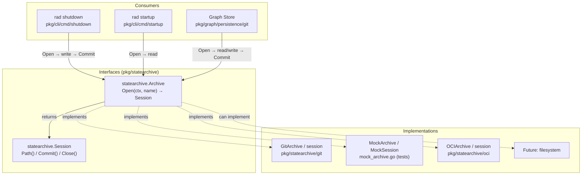
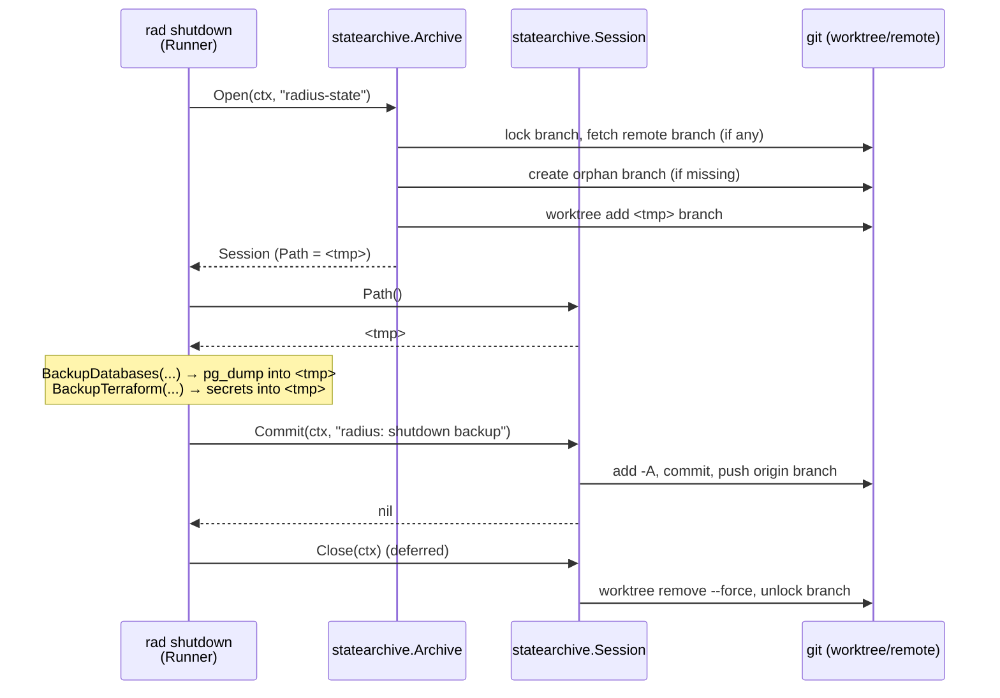
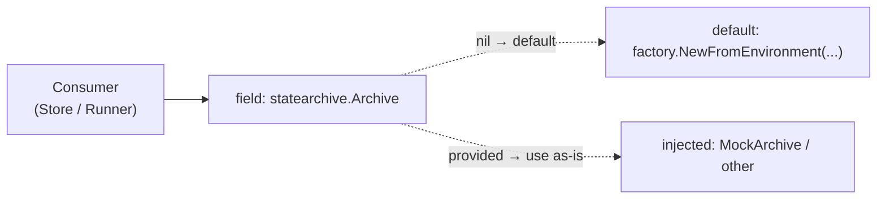

# Durable State Archive

The **state archive** is a pluggable abstraction for durable Radius state that
is exported out of a running cluster and restored later — for example across
ephemeral CI runs. It is defined by two small Go interfaces in
[pkg/statearchive/statearchive.go](../../pkg/statearchive/statearchive.go) and
has two implementations today (a git orphan branch and an OCI artifact), but every caller
depends only on the interfaces, so an alternative backend can be swapped in
without touching consumer code.

This is intentionally distinct from the live, record-oriented persistence
subsystems documented in [state-persistence.md](state-persistence.md)
(`database.Client`, `secret.Client`, `queue.Client`). Those serve the running
control plane one record at a time; an `Archive` captures a **whole directory of
state as a durable snapshot**.



## Key Components

- **`statearchive.Archive`** — the entry-point interface. Its single method
  `Open(ctx, name)` materializes the durable archive identified by `name` into a
  local working directory and returns a `Session`. Files persisted by a previous
  `Commit` are already present when `Open` returns.
- **`statearchive.Session`** — a durable working directory. Callers read and
  write files under `Path()` with any ordinary tool (`pg_dump`, `kubectl`,
  `os.WriteFile`), `Commit(ctx, message)` persists every change made under
  `Path()`, and `Close(ctx)` releases resources (best-effort, safe to `defer`).
- **`GitArchive` / `session`** ([pkg/statearchive/git/git.go](../../pkg/statearchive/git/git.go))
  — a production implementation backed by a git orphan branch checked out into
  an isolated worktree.
- **`OCIArchive` / `session`** ([pkg/statearchive/oci/oci.go](../../pkg/statearchive/oci/oci.go))
  — a production implementation that stores each archive as a gzipped tar layer
  in an OCI artifact.
- **`MockArchive` / `MockSession`** ([pkg/statearchive/mock_archive.go](../../pkg/statearchive/mock_archive.go))
  — GoMock doubles generated from the interfaces, used by consumer tests so they
  never touch git.

## The Contract

The two interfaces are the entire public surface. Everything a consumer needs is
expressed here, and nothing in the contract mentions git:

```go
type Archive interface {
    Open(ctx context.Context, name string) (Session, error)
}

type Session interface {
    Path() string
    Commit(ctx context.Context, message string) error
    Close(ctx context.Context)
}
```

Contract guarantees that callers rely on and implementations must honor:

- **Round-trip durability** — a `name` is a stable key. After a successful
  `Commit`, a later `Open(ctx, name)` presents those files again under `Path()`.
- **Atomic persistence** — `Commit` either durably persists the state or returns
  an error; it never silently drops changes. With nothing to persist it is a
  no-op.
- **Concurrency safety** — implementations must be safe for concurrent use.
  An implementation may serialize concurrent `Open` calls for the same `name`
  when its storage cannot support simultaneous sessions.
- **Best-effort cleanup** — `Close` is safe to `defer`; it logs failures rather
  than returning them so it cannot mask the real error on the happy path.

## How It Works

A consumer always follows the same three-phase shape, using only the interface:

```go
session, err := archive.Open(ctx, "radius-state")
if err != nil {
    return err
}
defer session.Close(ctx)
// ... read/write files under session.Path() with any tool ...
if err := session.Commit(ctx, "radius: backup"); err != nil {
    return err
}
```

The sequence below shows the `rad shutdown` backup flow against the git
implementation. Note that the consumer only ever calls `Open`, `Path`, `Commit`,
and `Close` — the git-specific worktree, fetch, and push steps are entirely
hidden behind the interface.



## The Git Implementation

[pkg/statearchive/git/git.go](../../pkg/statearchive/git/git.go) maps an archive
`name` to a git **orphan branch** — a branch that shares no history with the
application branches — and drives git through `os/exec`. Its design choices all
serve the "durable state that never pollutes the application checkout" goal:

- **Isolated worktree** — `Open` checks the branch out into a temporary worktree
  under `os.TempDir()`, so state files never appear in the application
  checkout's `git status`. `Close` runs `git worktree remove --force`.
- **Per-branch locking** — a package-level `sync.Map` of mutexes
  (`branchLocks`) serializes sessions per branch, because `git worktree add`
  refuses a second worktree for an already-checked-out branch. The lock is held
  from `Open` until `Close`.
- **Remote as durable store** — when an `origin` remote is configured and
  already has the branch, `Open` fetches it (a fetch failure is fatal, so a stale
  local branch cannot shadow the real state) and `Commit` pushes it (a push
  failure fails the operation). With no remote (local dev, tests), the local
  commit alone is sufficient and the missing remote is not an error.
- **Orphan branch creation** — a missing branch is created with git plumbing
  (`commit-tree` on the well-known empty-tree SHA + `update-ref`) so the working
  tree is never touched.
- **CI-friendly identity** — every commit — both the orphan-branch `commit-tree`
  at `Open` and the worktree `commit` — injects a fallback `user.name`/`user.email`
  via `-c` flags when the repo has none, which fresh CI environments frequently
  lack.

Compile-time assertions at the bottom of the file
(`var _ statearchive.Archive = (*GitArchive)(nil)`) guarantee the implementation
keeps satisfying the interface.

## Selecting an Archive

[pkg/statearchive/factory](../../pkg/statearchive/factory/factory.go) selects the
archive implementation. **OCI is the default**, but the two consumers differ in
what happens when no registry is configured:

- `NewStateArchive` (used by `rad startup` and `rad shutdown`) defaults to OCI.
  When `RADIUS_STATE_REGISTRY` is not set, it stays on OCI and `Archive.Open`
  returns a configuration error naming the missing variable — it does not fall
  back to git. Set `RADIUS_STATE_BACKEND=git` to opt into the git backend.
- `NewGraphArchive` (used for modeled graph output in GitHub Actions) uses OCI
  when `RADIUS_GRAPH_REGISTRY` is set and otherwise **falls back to git**, so
  existing workflows keep working without any configuration.
- `RADIUS_STATE_BACKEND` overrides both: `git` always selects git and `oci`
  always selects OCI.
- `RADIUS_STATE_REGISTRY` configures `rad startup` and `rad shutdown`.
- `RADIUS_GRAPH_REGISTRY` configures modeled graph output in GitHub Actions.
- `RADIUS_ARCHIVE_PLAIN_HTTP=true` enables HTTP for a local test registry.

OCI repositories are configured explicitly. Radius does not derive a repository
from `GITHUB_REPOSITORY`, so existing GitHub Actions graph workflows keep using
git until their configuration opts into OCI.

## The OCI Implementation

[pkg/statearchive/oci/oci.go](../../pkg/statearchive/oci/oci.go) maps an archive
`name` to an OCI tag. State and modeled graphs use separate repositories because
they have separate lifecycles and access requirements.

- **Open** resolves the tag and unpacks its single gzipped tar layer into a
  temporary directory. A missing tag starts an empty archive.
- **Commit** streams a deterministic tar.gz artifact through a temporary
  file-backed ORAS store. Memory use stays bounded as archives grow, and
  unchanged files create the same digest, so no upload occurs.
- **GHCR visibility guard** checks GitHub Packages metadata immediately before each state-bearing upload. Private and internal packages are accepted; public packages are rejected without uploading the archive contents. When the package does not exist yet, Radius first pushes a valid empty archive under a reserved bootstrap tag, verifies the resulting package visibility, and only then uploads the real archive. The separate tag cannot overwrite a concurrently created state tag.
- **Authentication** uses Docker credentials, including credentials created by
  `docker/login-action` in GitHub Actions. GHCR visibility checks use the same
  token with GitHub Packages metadata access.
- **Local testing** can use `RADIUS_ARCHIVE_PLAIN_HTTP=true` with a local OCI
  registry.

## End-to-End Test

The OCI state archive has a dedicated end-to-end test that exercises the full
save/restore lifecycle against a real GHCR package. It deploys an application
through one ephemeral Radius control plane to a separate persistent target
cluster, saves state to a private GHCR package, replaces the control plane,
restores the saved state, and confirms the replacement control plane still
manages the existing workload. This validates the round-trip durability
contract and the GHCR visibility guard end to end, including the bootstrap-tag
behavior used when the package does not yet exist. It runs on a schedule rather
than in the per-PR matrix because it needs `packages: write` and a precreated
private package. See
[Repo Radius GHCR state end-to-end test](../contributing/contributing-code/contributing-code-tests/repo-radius-state-e2e.md)
for how to provision, run, and troubleshoot it.

## How Consumers Stay Decoupled

Every consumer stores a `statearchive.Archive` (the interface) and accepts any
implementation for tests or future backends:

- **Graph store** — [pkg/graph/persistence/git/git_store.go](../../pkg/graph/persistence/git/git_store.go)
  holds an `archive statearchive.Archive`. Its
  `Save`/`Load`/`List`/`Delete` methods call `Open` and use `session.Path()` to
  build file paths — never a git command directly; the mutating `Save`/`Delete`
  also `Commit`, while `Load`/`List` only read. Its doc comment states that
  swapping in a different `statearchive.Archive` "requires no change here."
- **`rad shutdown` / `rad startup`** — both `Runner` structs expose an
  `Archive statearchive.Archive` field and drive the same
  `Open → Path → Commit → Close` shape.
- **Tests** — because the field is the interface, tests inject `MockArchive` /
  `MockSession` and assert on `Open`/`Commit`/`Close` calls without any git
  repository.



## Plugging In a Future Implementation

Because consumers depend only on the two interfaces, a new backend (for example
a plain filesystem directory) is added without editing any consumer. The steps:

1. **Create a new package** under `pkg/statearchive/<backend>/` (mirroring
   `pkg/statearchive/git/`).
2. **Implement `statearchive.Archive`** with an `Open(ctx, name)` that
   materializes `name` into a local directory and returns your `Session`.
3. **Implement `statearchive.Session`** — `Path()` returns that directory,
   `Commit()` uploads/persists its contents durably and atomically, `Close()`
   cleans up.
4. **Honor the contract** — round-trip durability keyed by `name`, atomic
   `Commit`, concurrency safety (serialize per-`name` if needed), best-effort
   `Close`.
5. **Add compile-time assertions**:

   ```go
   var (
       _ statearchive.Archive = (*MyArchive)(nil)
       _ statearchive.Session = (*mySession)(nil)
   )
   ```

6. **Wire it in** by passing your implementation where the interface is
   accepted — e.g. `Options.Archive` on the graph store, or the `Archive` field
   on the `rad shutdown`/`rad startup` runners. The default `nil → git` fallback
   means existing behavior is unchanged until a caller opts in.

No consumer logic, test, or file path layout changes: the new backend receives
the same "write files under a directory, then Commit" usage the git backend
does.

## Notable Details

- **`name` semantics are backend-defined but stable.** For the git backend a
  `name` is an orphan branch (`radius-state`, `radius-graph`); a different
  backend might treat it as an OCI tag or a subdirectory. Callers only rely on
  it being a stable durable key.
- **`Commit` on no changes is a deliberate no-op**, so idempotent callers (e.g.
  a graph `Save` that rewrites identical JSON) do not create empty commits.
- **`Close` never returns an error by design** — it is meant for `defer` and
  logs failures so cleanup problems cannot overwrite the real result of the
  operation.
- **The mock is generated**, not hand-written. The `//go:generate` directive in
  [statearchive.go](../../pkg/statearchive/statearchive.go) regenerates
  `mock_archive.go` if the interfaces change, keeping the test doubles in sync
  with the contract.
