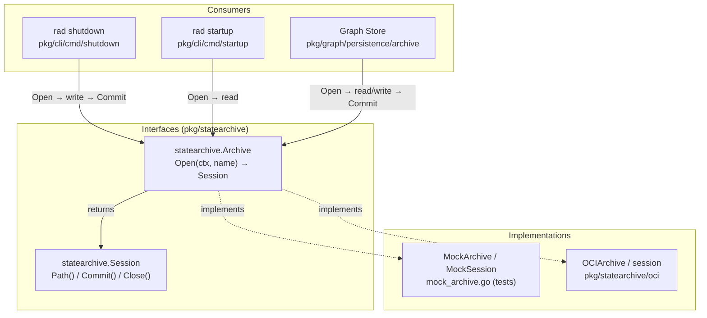
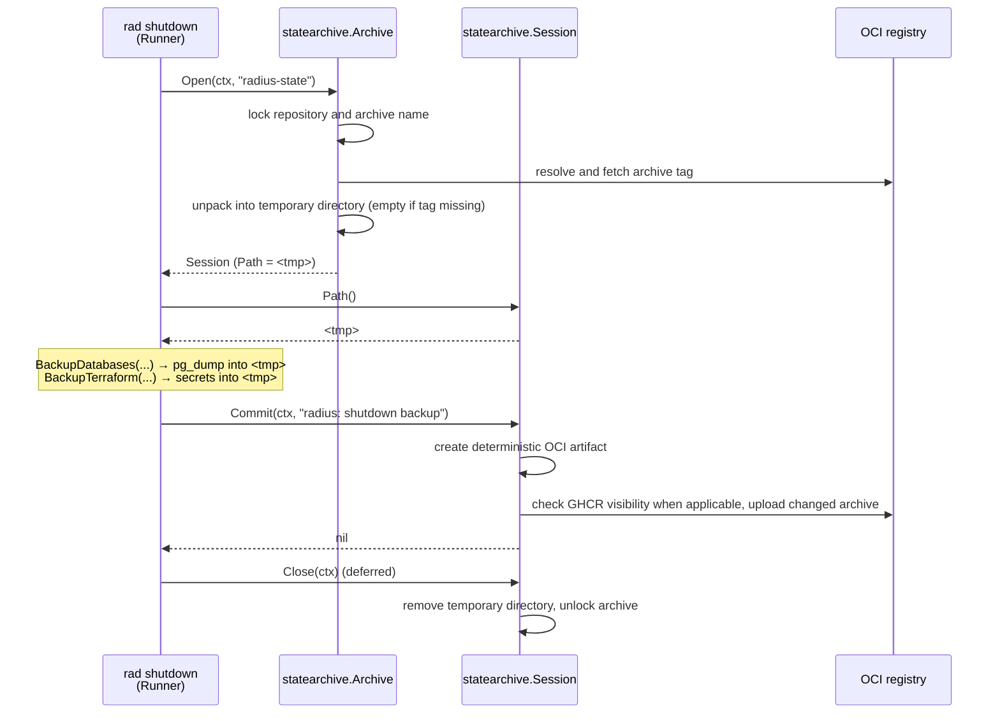
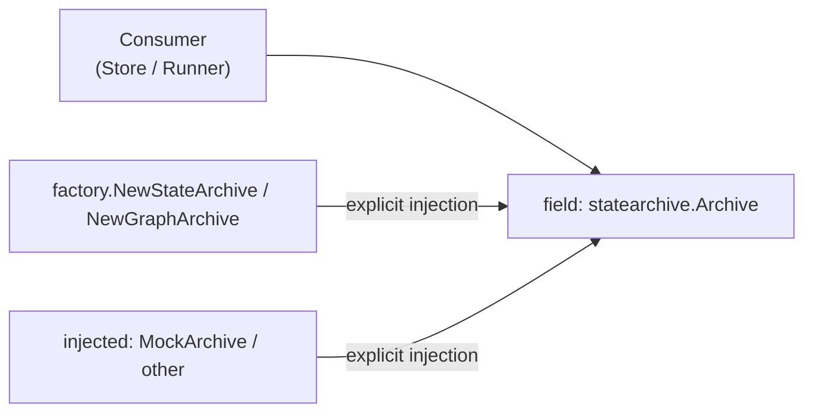

# Durable State Archive

The **state archive** captures durable Radius state exported out of a running cluster and restored later, for example across ephemeral CI runs. It is defined by two small Go interfaces in [pkg/statearchive/statearchive.go](../../pkg/statearchive/statearchive.go). **OCI artifacts are the only durable backend.** Consumers depend on the interfaces and can inject test archives without changing their file handling.

This is intentionally distinct from the live, record-oriented persistence
subsystems documented in [state-persistence.md](state-persistence.md)
(`database.Client`, `secret.Client`, `queue.Client`). Those serve the running
control plane one record at a time; an `Archive` captures a **whole directory of
state as a durable snapshot**.


```mermaid
graph TD
    subgraph "Consumers"
        Shutdown["rad shutdown<br/>pkg/cli/cmd/shutdown"]
        Startup["rad startup<br/>pkg/cli/cmd/startup"]
        GraphStore["Graph Store<br/>pkg/graph/persistence/archive"]
    end

    subgraph "Interfaces (pkg/statearchive)"
        Archive["statearchive.Archive<br/>Open(ctx, name) → Session"]
        Session["statearchive.Session<br/>Path() / Commit() / Close()"]
    end

    subgraph "Implementations"
        MockArchive["MockArchive / MockSession<br/>mock_archive.go (tests)"]
        OCIArchive["OCIArchive / session<br/>pkg/statearchive/oci"]
    end

    Shutdown -->|"Open → write → Commit"| Archive
    Startup -->|"Open → read"| Archive
    GraphStore -->|"Open → read/write → Commit"| Archive

    Archive -->|"returns"| Session

    Archive -.->|implements| OCIArchive
    Archive -.->|implements| MockArchive
```

**Figure 1: Archive consumers and implementations**

State commands and the graph adapter use the shared interfaces; production storage uses OCI and tests can inject mocks.

## Key Components

- **`statearchive.Archive`** — the entry-point interface. Its single method
  `Open(ctx, name)` materializes the durable archive identified by `name` into a
  local working directory and returns a `Session`. Files persisted by a previous
  `Commit` are already present when `Open` returns.
- **`statearchive.Session`** — a durable working directory. Callers read and
  write files under `Path()` with any ordinary tool (`pg_dump`, `kubectl`,
  `os.WriteFile`), `Commit(ctx, message)` persists every change made under
  `Path()`, and `Close(ctx)` releases resources (best-effort, safe to `defer`).
- **`OCIArchive` / `session`** ([pkg/statearchive/oci/oci.go](../../pkg/statearchive/oci/oci.go))
  — a production implementation that stores each archive as a gzipped tar layer
  in an OCI artifact.
- **`MockArchive` / `MockSession`** ([pkg/statearchive/mock_archive.go](../../pkg/statearchive/mock_archive.go)) — GoMock doubles generated from the interfaces, used by consumer tests without a registry.

## The Contract

The two interfaces are the entire public surface. Everything a consumer needs is expressed here, independent of the storage backend:

```go
type Archive interface {
    Open(ctx context.Context, name string) (Session, error)
}

type Session interface {
    Path() string
    Commit(ctx context.Context, message string) error
    Close(ctx context.Context)
}
```

Contract guarantees that callers rely on and implementations must honor:

- **Round-trip durability** — a `name` is a stable key. After a successful
  `Commit`, a later `Open(ctx, name)` presents those files again under `Path()`.
- **Atomic persistence** — `Commit` either durably persists the state or returns
  an error; it never silently drops changes. With nothing to persist it is a
  no-op.
- **Concurrency safety** — implementations must be safe for concurrent use.
  An implementation may serialize concurrent `Open` calls for the same `name`
  when its storage cannot support simultaneous sessions.
- **Best-effort cleanup** — `Close` is safe to `defer`; it logs failures rather
  than returning them so it cannot mask the real error on the happy path.

## How It Works

A consumer always follows the same three-phase shape, using only the interface:

```go
session, err := archive.Open(ctx, "radius-state")
if err != nil {
    return err
}
defer session.Close(ctx)
// ... read/write files under session.Path() with any tool ...
if err := session.Commit(ctx, "radius: backup"); err != nil {
    return err
}
```

The sequence below shows the `rad shutdown` backup flow against OCI. The consumer only calls `Open`, `Path`, `Commit`, and `Close`; registry authentication, artifact transfer, and temporary-directory cleanup stay behind the interface.


```mermaid
sequenceDiagram
    participant Cmd as rad shutdown<br/>(Runner)
    participant Arc as statearchive.Archive
    participant Ses as statearchive.Session
    participant OCI as OCI registry

    Cmd->>Arc: Open(ctx, "radius-state")
    Arc->>Arc: lock repository and archive name
    Arc->>OCI: resolve and fetch archive tag
    Arc->>Arc: unpack into temporary directory (empty if tag missing)
    Arc-->>Cmd: Session (Path = <tmp>)

    Cmd->>Ses: Path()
    Ses-->>Cmd: <tmp>
    Note over Cmd: BackupDatabases(...) → pg_dump into <tmp><br/>BackupTerraform(...) → secrets into <tmp>

    Cmd->>Ses: Commit(ctx, "radius: shutdown backup")
    Ses->>Ses: create deterministic OCI artifact
    Ses->>OCI: check GHCR visibility when applicable, upload changed archive
    Ses-->>Cmd: nil

    Cmd->>Ses: Close(ctx)  (deferred)
    Ses->>Ses: remove temporary directory, unlock archive
```

**Figure 2: Shutdown persists a whole-directory snapshot to OCI**

The state commands do not create Git branches or worktrees; OCI sessions materialize a temporary directory and upload its contents on commit.

## Selecting an Archive

[pkg/statearchive/factory](../../pkg/statearchive/factory/factory.go) configures OCI for both consumers. Configuration errors are returned by `Archive.Open`, not CLI initialization, so unrelated commands such as `rad version --cli` do not need archive configuration.

- `NewStateArchive` (used by `rad startup` and `rad shutdown`) requires `RADIUS_STATE_REGISTRY` when opening the archive.
- `NewGraphArchive` (used for modeled graph output in GitHub Actions) requires `RADIUS_GRAPH_REGISTRY` when opening the archive. It no longer falls back to Git.
- `RADIUS_STATE_BACKEND` may be unset or `oci` (case-insensitive). Explicit `git` returns removal and migration guidance; unknown values remain errors. Neither is silently reinterpreted as OCI.
- `RADIUS_STATE_REGISTRY` and `RADIUS_GRAPH_REGISTRY` are OCI repositories without tags, for example `ghcr.io/<owner>/<repo>-state` and `ghcr.io/<owner>/<repo>-graphs`.
- `RADIUS_ARCHIVE_PLAIN_HTTP=true` enables HTTP for a local test registry.

OCI repositories are configured explicitly; Radius does not derive them from `GITHUB_REPOSITORY`. Authenticate using Docker credentials before using archival. GitHub Actions workflows must configure the relevant repository, log in (for example using `docker/login-action`), and grant the token package read/write and metadata access. GHCR packages must be private or internal; the visibility guard described below still applies.

Outside GitHub Actions, `rad app graph app.bicep` continues to write local `app-graph.json` without opening an archive or requiring a registry. This is the normal local-output mode, not a fallback for failed archival. Missing registry configuration and archive read/write failures are returned to the caller without silently discarding persistence or writing elsewhere.

### Migrating from Git archival

Native Git orphan-branch archival has been removed. Existing local or remote `radius-state` and `radius-graph` branches, worktrees, and saved files are left untouched. There is no automatic migration, and setting an OCI repository does **not** copy or restore old Git state. A missing OCI tag opens an empty archive, even if an older Git archive exists.

Before replacing a control plane that depends on Git state, retain a backup of that state. Use a CLI version that still supports Git to restore it into a compatible control plane, or use the still-running control plane whose state was archived. Then unset `RADIUS_STATE_BACKEND` (or set it to `oci`), configure and authenticate to `RADIUS_STATE_REGISTRY`, and run `rad shutdown` with the OCI-only CLI to save that live state. Confirm the OCI backup succeeded before destroying the old control plane or using `rad startup` to restore into a replacement. Modeled graphs can be regenerated with `RADIUS_GRAPH_REGISTRY` configured in GitHub Actions; their encoded source-branch namespaces and JSON layout are unchanged.

## The OCI Implementation

[pkg/statearchive/oci/oci.go](../../pkg/statearchive/oci/oci.go) maps an archive
`name` to an OCI tag. State and modeled graphs use separate repositories because
they have separate lifecycles and access requirements.

- **Open** resolves the tag and unpacks its single gzipped tar layer into a
  temporary directory. A missing tag starts an empty archive.
- **Commit** streams a deterministic tar.gz artifact through a temporary
  file-backed ORAS store. Memory use stays bounded as archives grow, and
  unchanged files create the same digest, so no upload occurs.
- **GHCR visibility guard** checks GitHub Packages metadata immediately before each state-bearing upload. Private and internal packages are accepted; public packages are rejected without uploading the archive contents. When the package does not exist yet, Radius first pushes a valid empty archive under a reserved bootstrap tag, verifies the resulting package visibility, and only then uploads the real archive. The separate tag cannot overwrite a concurrently created state tag.
- **Authentication** uses Docker credentials, including credentials created by
  `docker/login-action` in GitHub Actions. GHCR visibility checks use the same
  token with GitHub Packages metadata access.
- **Local testing** can use `RADIUS_ARCHIVE_PLAIN_HTTP=true` with a local OCI
  registry.

## End-to-End Test

The OCI state archive has a dedicated end-to-end test that exercises the full save/restore lifecycle against a real GHCR package. It deploys an application through one ephemeral Radius control plane to a separate persistent target cluster, saves state to a private GHCR package, replaces the control plane, restores the saved state, and confirms the replacement control plane still manages the existing workload. This validates the round-trip durability contract and the GHCR visibility guard end to end. It runs on a schedule rather than in the per-PR matrix because it needs `packages: write` and a precreated private package. See [Repo Radius GHCR state end-to-end test](../contributing/contributing-code/contributing-code-tests/repo-radius-state-e2e.md) for how to provision, run, and troubleshoot it.

## How Consumers Stay Decoupled

Every consumer stores a `statearchive.Archive` (the interface) and accepts an injected implementation for tests:

- **Graph store** — [pkg/graph/persistence/archive/store.go](../../pkg/graph/persistence/archive/store.go) requires a non-nil `Options.Archive`; it never constructs a default backend. `Save`/`Load`/`List`/`Delete` call `Open` and use `session.Path()` for JSON file I/O. `Save`/`Delete` also call `Commit`, while `Load`/`List` only read. Missing graphs return `persistence.ErrNotFound`; key validation rejects traversal and path separators.
- **`rad shutdown` / `rad startup`** — both `Runner` structs expose an
  `Archive statearchive.Archive` field and drive the same
  `Open → Path → Commit → Close` shape.
- **Tests** — consumer tests inject `MockArchive` / `MockSession` and assert on `Open`/`Commit`/`Close` calls without a Git repository. OCI tests cover durable state and graph round trips.


```mermaid
graph LR
    Consumer["Consumer<br/>(Store / Runner)"]
    Field["field: statearchive.Archive"]
    Default["factory.NewStateArchive / NewGraphArchive"]
    Inject["injected: MockArchive / other"]

    Consumer --> Field
    Default -->|"explicit injection"| Field
    Inject -->|"explicit injection"| Field
```

**Figure 3: Consumers receive archives explicitly**

The CLI supplies factory-configured OCI archives; tests supply mocks. A nil archive is rejected by the graph adapter.

## Change This Safely

Run `go test ./pkg/statearchive/... ./pkg/graph/persistence/... ./pkg/cli/cmd/app/graph/... ./pkg/cli/cmd/startup ./pkg/cli/cmd/shutdown ./cmd/rad/cmd` after changing archive configuration or the graph adapter. Keep the shared interfaces, OCI format/authentication, archive names, and graph source-branch encoding consistent across these consumers. Graph adapter tests need neither Git nor a registry; the OCI package includes its own artifact fixtures.

## Notable Details

- **`name` is a stable durable key.** OCI uses it as the artifact tag (`radius-state`, `radius-graph`). Source branches used as graph key namespaces are unrelated to storage tags; they remain percent-encoded in `<namespace>/app-graph.json`.
- **`Commit` on no changes is a deliberate no-op**, so idempotent callers (for example a graph `Save` that rewrites identical JSON) do not upload another artifact.
- **`Close` never returns an error by design** — it is meant for `defer` and
  logs failures so cleanup problems cannot overwrite the real result of the
  operation.
- **The mock is generated**, not hand-written. The `//go:generate` directive in
  [statearchive.go](../../pkg/statearchive/statearchive.go) regenerates
  `mock_archive.go` if the interfaces change, keeping the test doubles in sync
  with the contract.
