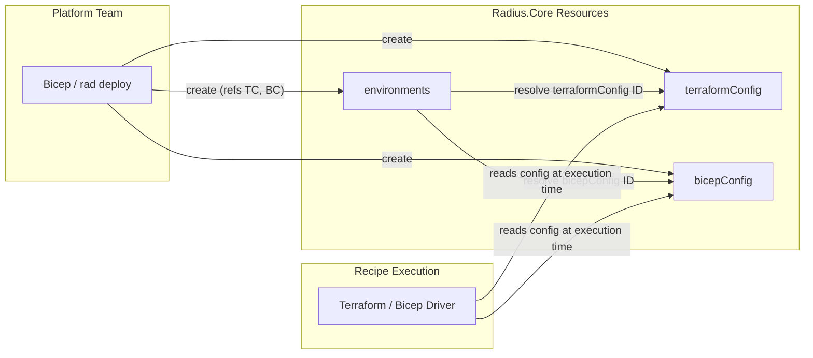

# Reusable Terraform and Bicep Config for Radius.Core/environments

## Summary

Add `Radius.Core/terraformConfig` and `Radius.Core/bicepConfig` as standalone
Radius resources. Environments reference them by resource ID. This lets platform
teams define private registry authentication, provider configuration, and
environment variables once and share them across multiple environments.

This replaces the earlier design ([design-notes #117](https://github.com/radius-project/design-notes/pull/117))
which bundled binary lifecycle management, installer pipelines, and shared PVCs
into the same feature. Those concerns are orthogonal and excluded here.

## Problem

`Radius.Core/environments` has no way to specify private Terraform or Bicep
registries. The legacy `Applications.Core/environments` has an inline
`recipeConfig` for this, but it is not reusable across environments. Platform
teams managing many environments must duplicate identical configuration on each
one.

## Design

### New resources

Two new resources in the `Radius.Core` namespace:

```
Radius.Core/terraformConfig   (CRUD, resource-group scoped)
Radius.Core/bicepConfig        (CRUD, resource-group scoped)
```

### Environment references

`Radius.Core/environments` gains two optional properties:

```typespec
model EnvironmentProperties {
  // ...existing fields (recipePacks, recipeParameters, providers, simulated)...

  @doc("Resource ID of a Radius.Core/terraformConfig providing Terraform recipe settings.")
  terraformConfig?: string;

  @doc("Resource ID of a Radius.Core/bicepConfig providing Bicep recipe settings.")
  bicepConfig?: string;
}
```

### TerraformConfig shape

Follows the schema from the [feature spec](https://github.com/radius-project/design-notes/pull/107).
The `terraformrc` property is a like-for-like representation of the Terraform CLI
configuration file (`.terraformrc`). The `env` property holds non-sensitive
environment variables injected during recipe execution. Provider secrets and
`envSecrets` are not carried forward from the legacy `recipeConfig`; those use
cases are handled by recipe parameters instead.

```typespec
model TerraformConfigResource
  is TrackedResourceRequired<TerraformConfigProperties, "terraformConfigs"> {
  @key("terraformConfigName")
  @path
  @segment("terraformConfigs")
  name: ResourceNameString;
}

model TerraformConfigProperties {
  provisioningState?: ProvisioningState;
  referencedBy?: string[];

  @doc("Terraform CLI configuration file (.terraformrc) settings.")
  terraformrc?: TerraformrcConfig;

  @doc("Environment variables injected during Terraform recipe execution.")
  env?: Record<string>;
}

model TerraformrcConfig {
  providerInstallation?: TerraformProviderInstallation;
  credentials?: Record<TerraformCredentialConfig>;
}
```

Sub-types: `TerraformProviderInstallation` (networkMirror, direct with
include/exclude), `TerraformProviderMirror` (url, include, exclude),
`TerraformProviderDirect` (include, exclude), `TerraformCredentialConfig`
(secret ID).

### BicepConfig shape

Follows the schema from the feature spec. Uses a structured `registryAuthentication`
property supporting three authentication methods (BasicAuth, AzureWI, AwsIrsa)
with first-class properties for non-secret identity values.

```typespec
model BicepConfigResource
  is TrackedResourceRequired<BicepConfigProperties, "bicepConfigs"> {
  @key("bicepConfigName")
  @path
  @segment("bicepConfigs")
  name: ResourceNameString;
}

model BicepConfigProperties {
  provisioningState?: ProvisioningState;
  referencedBy?: string[];

  @doc("Registry authentication configuration for private Bicep registries.")
  registryAuthentication?: BicepRegistryAuthentication;
}

model BicepRegistryAuthentication {
  authenticationMethod?: BicepAuthenticationMethod;  // "BasicAuth" | "AzureWI" | "AwsIrsa"
  basicAuthSecretId?: string;   // SecretStore ID for username/password
  azureWiClientId?: string;     // Azure Workload Identity client ID
  azureWiTenantId?: string;     // Azure Workload Identity tenant ID
  awsIamRoleArn?: string;       // AWS IAM Role ARN for IRSA
}
```

### Architecture



### Runtime flow

1. Platform team deploys `terraformConfig` and/or `bicepConfig` resources.
2. Platform team deploys an `environment` referencing them by resource ID.
3. Environment controller validates the referenced config resources exist
   (PUT-time validation).
4. At recipe execution time, the recipe driver resolves the config resource,
   populates `recipes.Configuration.RecipeConfig`, and proceeds exactly as the
   existing `Applications.Core` code path does today.
5. Secret references (`SecretReference` with `source` + `key`) are resolved at
   execution time by the driver, same as the legacy path. No secrets are
   persisted in the config resources.

### Delete protection

Config resources cannot be deleted while referenced by an environment. The
delete controller checks for active references and returns `409 Conflict` if
any exist. This follows the same pattern used by RecipePacks.

### Example usage

```bicep
resource tfConfig 'Radius.Core/terraformConfigs@2025-08-01-preview' = {
  name: 'corp-terraform'
  properties: {
    terraformrc: {
      providerInstallation: {
        networkMirror: {
          url: 'https://mirror.corp.example.com/terraform/providers'
          include: ['*']
          exclude: ['hashicorp/azurerm']
        }
        direct: {
          exclude: ['hashicorp/azurerm']
        }
      }
      credentials: {
        'app.terraform.io': {
          secret: tfcTokenSecret.id
        }
      }
    }
    env: {
      TF_LOG: 'WARN'
      TF_REGISTRY_CLIENT_TIMEOUT: '15'
    }
  }
}

resource bicepConfig 'Radius.Core/bicepConfigs@2025-08-01-preview' = {
  name: 'corp-bicep'
  properties: {
    registryAuthentication: {
      authenticationMethod: 'BasicAuth'
      basicAuthSecretId: acrSecret.id
    }
  }
}

resource prodEnv 'Radius.Core/environments@2025-08-01-preview' = {
  name: 'production'
  properties: {
    providers: {
      azure: {
        subscriptionId: '...'
      }
      kubernetes: {
        namespace: 'prod'
      }
    }
    recipePacks: [recipePack.id]
    terraformConfig: tfConfig.id
    bicepConfig: bicepConfig.id
  }
}

resource stagingEnv 'Radius.Core/environments@2025-08-01-preview' = {
  name: 'staging'
  properties: {
    providers: {
      azure: {
        subscriptionId: '...'
      }
      kubernetes: {
        namespace: 'staging'
      }
    }
    recipePacks: [recipePack.id]
    terraformConfig: tfConfig.id    // same config, reused
    bicepConfig: bicepConfig.id     // same config, reused
  }
}
```

## What is excluded

| Concern | Status | Rationale |
|---|---|---|
| Terraform binary lifecycle (`rad terraform install`) | Deferred | Orthogonal to registry config. Current init-container approach works. |
| Installer async pipeline / queue worker | Deferred | Only needed for binary lifecycle. |
| Shared PVC with ReadWriteMany | Deferred | Only needed for binary lifecycle. |
| Backend config (S3, AzureRM state stores) | Deferred | Separate concern, not required for private registries. |
| Migration tooling for `Applications.Core` `recipeConfig` | Not needed | `Applications.Core/environments` continues working as-is. |
| `terraformSettings` / `bicepSettings` as designed in design-notes #117 | Replaced | This design achieves the same reusability goal with less complexity. |
| Legacy `providers` on TerraformConfig | Not carried forward | Per spec, provider secrets should flow via recipe parameters. |
| Legacy `envSecrets` on TerraformConfig | Not carried forward | Per spec, replaced with recipe parameters. |

## Compatibility

- `Applications.Core/environments` with `recipeConfig` is unchanged and
  continues to work.
- `Radius.Core/environments` is new; there is no migration concern.
- The Terraform and Bicep recipe drivers already consume
  `recipes.Configuration.RecipeConfig`. The only new code is populating that
  struct from the config resource instead of from inline environment fields.

## Implementation plan

### Task 1: TypeSpec + codegen

- Define `Radius.Core/terraformConfig` and `Radius.Core/bicepConfig` resources
  in TypeSpec under `typespec/Radius.Core/`.
- Add `terraformConfig` and `bicepConfig` optional string fields to
  `Radius.Core/environments`.
- `TerraformConfig`: `terraformrc` (providerInstallation, credentials) + `env`.
  No `providers`, no `envSecrets` (those are legacy; use recipe parameters).
- `BicepConfig`: `registryAuthentication` with `authenticationMethod` enum
  (BasicAuth, AzureWI, AwsIrsa), `basicAuthSecretId`, `azureWiClientId`,
  `azureWiTenantId`, `awsIamRoleArn`.
- Regenerate SDKs.

### Task 2: Datamodel + converters

- Add Go datamodel structs for `TerraformConfigResource` and
  `BicepConfigResource`.
- Implement bidirectional API-to-datamodel converters.
- Unit tests for all conversions.

### Task 3: REST controllers

- Standard CRUD controllers for both config resources.
- Delete-guard filter: reject delete if any environment references the config
  (query environments by `terraformConfig` / `bicepConfig` field).
- Register routes.
- Unit tests.

### Task 4: Environment controller wiring

- On environment create/update, validate that referenced config resource IDs
  exist (return 400 if not).
- At recipe execution time, resolve the config resource and populate
  `recipes.Configuration.RecipeConfig` using the same field mapping the legacy
  `Applications.Core` path uses.
- Unit tests for the resolution path.

### Task 5: Functional tests

- Deploy a Terraform recipe with env vars via `Radius.Core/environments` with
  `terraformConfig.env`.
- Deploy a `Radius.Core/bicepConfigs` resource with `registryAuthentication`
  and validate CRUD + environment reference wiring.
- Verify delete protection: attempt to delete a config resource while
  referenced by an environment, expect 409.
