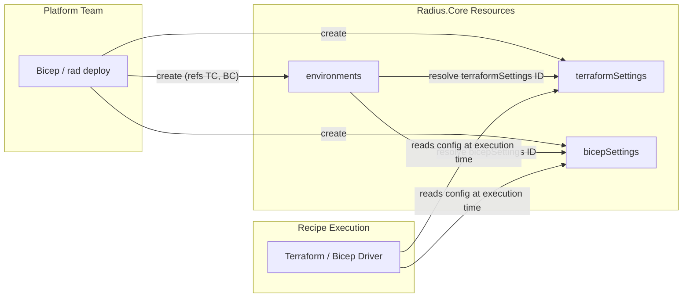

# Reusable Terraform and Bicep Settings for Radius.Core/environments

## Summary

Add `Radius.Core/terraformSettings` and `Radius.Core/bicepSettings` as standalone
Radius resources. Environments reference them by resource ID. This lets platform
teams define private registry authentication, provider configuration, and
environment variables once and share them across multiple environments.

This replaces the earlier design ([design-notes #117](https://github.com/radius-project/design-notes/pull/117))
which bundled binary lifecycle management, installer pipelines, and shared PVCs
into the same feature. Those concerns are orthogonal and excluded here.

## Problem

`Radius.Core/environments` has no way to specify private Terraform or Bicep
registries. The legacy `Applications.Core/environments` has an inline
`recipeConfig` for this, but it is not reusable across environments. Platform
teams managing many environments must duplicate identical configuration on each
one.

## Design

### New resources

Two new resources in the `Radius.Core` namespace:

```text
Radius.Core/terraformSettings   (CRUD, resource-group scoped)
Radius.Core/bicepSettings        (CRUD, resource-group scoped)
```

### Environment references

`Radius.Core/environments` gains two optional properties:

```typespec
model EnvironmentProperties {
  // ...existing fields (recipePacks, recipeParameters, providers, simulated)...

  @doc("Resource ID of a Radius.Core/terraformSettings providing Terraform recipe settings.")
  terraformSettings?: string;

  @doc("Resource ID of a Radius.Core/bicepSettings providing Bicep recipe settings.")
  bicepSettings?: string;
}
```

### TerraformSettings shape

Follows the schema from the [feature spec](https://github.com/radius-project/design-notes/pull/107).
The `terraformrc` property holds **structured properties that Radius uses to
generate a `.terraformrc` file at recipe execution time**. Radius does not
read, merge, or otherwise consume any user-authored `.terraformrc`; the
resource is the single source of truth for Terraform CLI configuration.
The `env` property holds non-sensitive environment variables injected during
recipe execution. Provider secrets and `envSecrets` are not carried forward
from the legacy `recipeConfig`; those use cases are handled by recipe
parameters instead.

See [Why generate, not consume](#why-generate-not-consume) below for the
rationale.

```typespec
model TerraformSettingsResource
  is TrackedResourceRequired<TerraformSettingsProperties, "terraformSettings"> {
  @key("terraformSettingsName")
  @path
  @segment("terraformSettings")
  name: ResourceNameString;
}

model TerraformSettingsProperties {
  provisioningState?: ProvisioningState;
  referencedBy?: string[];

  @doc("Terraform CLI configuration file (.terraformrc) settings.")
  terraformrc?: TerraformrcConfig;

  @doc("Environment variables injected during Terraform recipe execution.")
  env?: Record<string>;
}

model TerraformrcConfig {
  providerInstallation?: TerraformProviderInstallation;
  credentials?: Record<TerraformCredentialConfig>;
}
```

Sub-types: `TerraformProviderInstallation` (networkMirror, direct with
include/exclude), `TerraformProviderMirror` (url, include, exclude),
`TerraformProviderDirect` (include, exclude), `TerraformCredentialConfig`
(secret ID).

### Why generate, not consume

Radius does not accept user-authored `.terraformrc` content. Instead, the
user expresses intent through typed properties on `terraformSettings`, and
Radius renders the file. This:

- Avoids parsing, validating, or migrating arbitrary HCL the user might author.
- Sidesteps OS-specific filename conventions (`.terraformrc` on Linux/macOS,
  `terraform.rc` on Windows): Radius writes the file under a name and at a
  path of its own choosing, then sets `TF_CLI_CONFIG_FILE` to the absolute
  path so Terraform reads exactly that file and ignores its default lookup
  chain (`~/.terraformrc`, `$HOME/.terraformrc`, `%APPDATA%\terraform.rc`).
- Keeps secret references typed and resolvable through Radius (vs. opaque
  strings inside a user file).
- Lets us add or constrain knobs by evolving the schema, not by
  reinterpreting Terraform's grammar.

If a property the user needs is not yet in the schema, the path forward is
to extend the schema, not to bypass it. Possible future additions (out of
scope for this design) include a `rawTerraformrc?: string` field for opaque
content or a `terraformrcSecretId?: string` reference if the content needs
to carry secrets.

### BicepSettings shape

Follows the schema from the feature spec. Uses a structured `registryAuthentication`
property supporting three authentication methods (BasicAuth, AzureWI, AwsIrsa)
with first-class properties for non-secret identity values.

```typespec
model BicepSettingsResource
  is TrackedResourceRequired<BicepSettingsProperties, "bicepSettings"> {
  @key("bicepSettingsName")
  @path
  @segment("bicepSettings")
  name: ResourceNameString;
}

model BicepSettingsProperties {
  provisioningState?: ProvisioningState;
  referencedBy?: string[];

  @doc("Authentication for private Bicep registries, keyed by registry hostname (e.g. 'corp.acr.io').")
  registryAuthentications?: Record<BicepRegistryAuthentication>;
}

model BicepRegistryAuthentication {
  authenticationMethod?: BicepAuthenticationMethod;  // "BasicAuth" | "AzureWI" | "AwsIrsa"
  basicAuthSecretId?: string;   // SecretStore ID for username/password (required for BasicAuth)
  azureWiClientId?: string;     // Azure Workload Identity client ID (required for AzureWI)
  azureWiTenantId?: string;     // Azure Workload Identity tenant ID (required for AzureWI)
  awsIamRoleArn?: string;       // AWS IAM Role ARN for IRSA (required for AwsIrsa)
}
```

### Architecture



### Runtime flow

1. Platform team deploys `terraformSettings` and/or `bicepSettings` resources.
2. Platform team deploys an `environment` referencing them by resource ID.
3. Environment controller validates the referenced settings resources exist
   at PUT time and returns `400 Bad Request` if not.
4. At recipe execution time, the configuration loader fetches the referenced
   config resources and populates `recipes.Configuration.RecipeConfig`. The
   loader bridges the new schema into the existing `RecipeConfig` shape so the
   shared Terraform and Bicep drivers consume it through the same path the
   legacy `Applications.Core` `recipeConfig` flow uses.
5. When `terraformrc.providerInstallation` is set, the Terraform driver
   renders a `.terraformrc` in the working directory and sets
   `TF_CLI_CONFIG_FILE` to the absolute path of that file for both Deploy
   and Delete. `TF_CLI_CONFIG_FILE` overrides Terraform's default
   config-file lookup chain, so any pre-existing `.terraformrc` /
   `terraform.rc` files on disk are intentionally bypassed. The field is
   optional; the legacy `Applications.Core` path leaves it nil and behavior
   is unchanged.
6. Secret references (`SecretReference` with `source` + `key`) are resolved at
   execution time by the driver, same as the legacy path. No secrets are
   persisted in the config resources.

### Example usage

```bicep
resource tfConfig 'Radius.Core/terraformSettings@2025-08-01-preview' = {
  name: 'corp-terraform'
  properties: {
    terraformrc: {
      providerInstallation: {
        networkMirror: {
          url: 'https://mirror.corp.example.com/terraform/providers'
          include: ['*']
          exclude: ['hashicorp/azurerm']
        }
        direct: {
          exclude: ['hashicorp/azurerm']
        }
      }
      credentials: {
        'app.terraform.io': {
          secret: tfcTokenSecret.id
        }
      }
    }
    env: {
      TF_LOG: 'WARN'
      TF_REGISTRY_CLIENT_TIMEOUT: '15'
    }
  }
}

resource bicepConfig 'Radius.Core/bicepSettings@2025-08-01-preview' = {
  name: 'corp-bicep'
  properties: {
    registryAuthentications: {
      'corp.acr.example.io': {
        authenticationMethod: 'BasicAuth'
        basicAuthSecretId: acrSecret.id
      }
    }
  }
}

resource prodEnv 'Radius.Core/environments@2025-08-01-preview' = {
  name: 'production'
  properties: {
    providers: {
      azure: {
        subscriptionId: '...'
      }
      kubernetes: {
        namespace: 'prod'
      }
    }
    recipePacks: [recipePack.id]
    terraformSettings: tfConfig.id
    bicepSettings: bicepConfig.id
  }
}

resource stagingEnv 'Radius.Core/environments@2025-08-01-preview' = {
  name: 'staging'
  properties: {
    providers: {
      azure: {
        subscriptionId: '...'
      }
      kubernetes: {
        namespace: 'staging'
      }
    }
    recipePacks: [recipePack.id]
    terraformSettings: tfConfig.id    // same config, reused
    bicepSettings: bicepConfig.id     // same config, reused
  }
}
```

## What is excluded

| Concern | Status | Rationale |
| --- | --- | --- |
| Terraform binary lifecycle (`rad terraform install`) | Deferred | Orthogonal to registry config. Current init-container approach works. |
| Installer async pipeline / queue worker | Deferred | Only needed for binary lifecycle. |
| Shared PVC with ReadWriteMany | Deferred | Only needed for binary lifecycle. |
| Backend config (S3, AzureRM state stores) | Deferred | Separate concern, not required for private registries. |
| Migration tooling for `Applications.Core` `recipeConfig` | Not needed | `Applications.Core/environments` continues working as-is. |
| Legacy `providers` on TerraformSettings | Not carried forward | Per spec, provider secrets should flow via recipe parameters. |
| Legacy `envSecrets` on TerraformSettings | Not carried forward | Per spec, replaced with recipe parameters. |

## Compatibility

- `Applications.Core/environments` with `recipeConfig` is unchanged and
  continues to work. The legacy datamodel types (`AuthConfig`, `GitAuthConfig`,
  `ProviderConfigProperties`, etc.) are untouched.
- `Radius.Core/environments` is new; there is no migration concern.
- The shared Terraform and Bicep recipe drivers already consume
  `recipes.Configuration.RecipeConfig`. The new resources populate that struct
  through the same internal shape, so the drivers do not need to know which
  namespace the environment came from.
- A new optional `ProviderInstallation` field was added to the shared
  `TerraformConfigProperties` datamodel (the internal transport type consumed
  by the shared drivers, distinct from the new `TerraformSettings` resource).
  The `Applications.Core` path leaves it nil, so the Terraform driver behavior
  is unchanged for existing users.

## Code map

- `typespec/Radius.Core/terraformSettings.tsp`,
  `typespec/Radius.Core/bicepSettings.tsp` — resource definitions.
- `typespec/Radius.Core/environments.tsp` — adds `terraformSettings?` and
  `bicepSettings?` properties.
- `swagger/specification/radius/resource-manager/Radius.Core/preview/2025-08-01-preview/openapi.json`
  and `pkg/corerp/api/v20250801preview/zz_generated_*` — regenerated SDK.
- `pkg/corerp/datamodel/terraformsettings.go`,
  `pkg/corerp/datamodel/bicepsettings.go` — datamodels.
- `pkg/corerp/api/v20250801preview/terraformsettings_conversion.go`,
  `bicepsettings_conversion.go` — bidirectional converters.
- `pkg/corerp/datamodel/converter/terraformsettings_converter.go`,
  `bicepsettings_converter.go` — versioned converter wiring.
- `pkg/corerp/setup/setup.go` — registers CRUD routes for both resources.
- `pkg/corerp/setup/operations.go` — RBAC operation entries
  (read/write/delete) for both resource types.
- `deploy/manifest/built-in-providers/{self-hosted,dev}/radius_core.yaml` —
  UCP manifest entries that register the resource types at install time. UCP
  loads these manifests on startup; without an entry here the corerp REST
  routes exist but UCP rejects requests with `BadRequest: resource type not
  found`.
- `pkg/corerp/frontend/controller/environments/v20250801preview/createorupdateenvironment.go` —
  PUT-time validation of referenced settings IDs.
- `pkg/recipes/configloader/environment.go` — resolves settings resources and
  bridges them into the shared `RecipeConfig` shape.
- `pkg/corerp/datamodel/recipe_types.go` — adds optional `ProviderInstallation`
  to `TerraformConfigProperties` for the shared driver.
- `pkg/recipes/terraform/cliconfig.go` — renders `.terraformrc` from
  `provider_installation` and from `credentials` (native HCL `credentials
  "host" { token = ... }` blocks; secret values are resolved from the
  fetched-secret map at execution time).
- `pkg/recipes/terraform/execute.go` — wires the `.terraformrc` writer into
  Deploy and Delete via `TF_CLI_CONFIG_FILE`.
- `pkg/recipes/driver/terraform/terraform.go` — `FindSecretIDs` reports
  credentials secret stores (with the `token` key) so the engine fetches them
  before the driver runs.
- `pkg/corerp/frontend/controller/bicepsettings/validator.go` — enforces the
  conditional-required-field rule that, for example, `BasicAuth` requires
  `basicAuthSecretId`. TypeSpec cannot express this without a discriminated
  union restructure, so it lives here.
- `test/functional-portable/dynamicrp/noncloud/resources/terraformsettings_bicepsettings_test.go` —
  functional tests for CRUD wiring and the combined Terraform+Bicep flow.

## Status and known limitations

The schema and CRUD plumbing are in place; the loader bridges the new shape
into the existing `RecipeConfig` consumed by the shared drivers. The following
are exposed in the schema or implied by the design but not yet wired end to
end, and are tracked as follow-ups:

- **Delete protection.** Config resources can currently be deleted while still
  referenced by an environment. The intended behavior is to return
  `409 Conflict` if any environment references the config (the same pattern
  used by RecipePacks).
- **`referencedBy`.** The read-only `referencedBy: string[]` property is in
  the schema but not populated by any controller.
- **Bicep `AzureWI` / `AwsIrsa`.** The `BicepRegistryAuthentication` schema
  accepts all three authentication methods, and the controller validates that
  the relevant identity fields are present, but the loader only threads
  `BasicAuth` (via `basicAuthSecretId`) into the existing Bicep driver shape.
  Identity-based methods are accepted by the API but are no-ops at recipe
  execution time until corresponding driver work lands.
- **Git-based Terraform module source auth from `Radius.Core/environments`.**
  `terraformrc.credentials` is for HTTP-based Terraform CLI registry auth
  (rendered as native `credentials "host" {}` blocks with a `token` value);
  it does not cover Git module source PAT authentication, which today is
  available only via the legacy `Applications.Core` `recipeConfig` path. A
  separate property on `terraformSettings` for Git auth is a follow-up.
