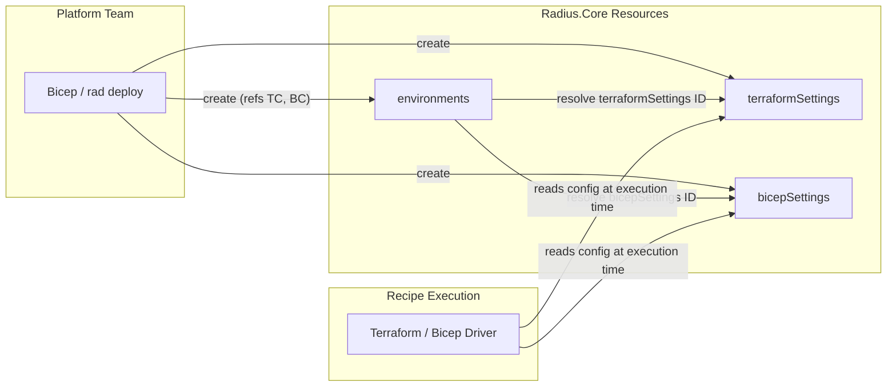

# Reusable Terraform and Bicep Settings for Radius.Core/environments

## Summary

Add `Radius.Core/terraformSettings` and `Radius.Core/bicepSettings` as standalone
Radius resources. Environments reference them by resource ID. This lets platform
teams define private registry authentication, provider configuration, and
environment variables once and share them across multiple environments.

This replaces the earlier design ([design-notes #117](https://github.com/radius-project/design-notes/pull/117))
which bundled binary lifecycle management, installer pipelines, and shared PVCs
into the same feature. Those concerns are orthogonal and excluded here.

## Problem

`Radius.Core/environments` has no way to specify private Terraform or Bicep
registries. The legacy `Applications.Core/environments` has an inline
`recipeConfig` for this, but it is not reusable across environments. Platform
teams managing many environments must duplicate identical configuration on each
one.

## Design

### New resources

Two new resources in the `Radius.Core` namespace:

```text
Radius.Core/terraformSettings   (CRUD, resource-group scoped)
Radius.Core/bicepSettings        (CRUD, resource-group scoped)
```

### Environment references

`Radius.Core/environments` gains two optional properties:

```typespec
model EnvironmentProperties {
  // ...existing fields (recipePacks, recipeParameters, providers, simulated)...

  @doc("Resource ID of a Radius.Core/terraformSettings providing Terraform recipe settings.")
  terraformSettings?: string;

  @doc("Resource ID of a Radius.Core/bicepSettings providing Bicep recipe settings.")
  bicepSettings?: string;
}
```

### TerraformSettings shape

Follows the schema from the [feature spec](https://github.com/radius-project/design-notes/pull/107).
The `terraformrc` property holds **structured properties that Radius uses to
generate a `.terraformrc` file at recipe execution time**. Radius does not
read, merge, or otherwise consume any user-authored `.terraformrc`; the
resource is the single source of truth for Terraform CLI configuration.
The `env` property holds non-sensitive environment variables injected during
recipe execution. Provider secrets and `envSecrets` are not carried forward
from the legacy `recipeConfig`; those use cases are handled by recipe
parameters instead.

See [Why generate, not consume](#why-generate-not-consume) below for the
rationale.

```typespec
model TerraformSettingsResource
  is TrackedResourceRequired<TerraformSettingsProperties, "terraformSettings"> {
  @key("terraformSettingsName")
  @path
  @segment("terraformSettings")
  name: ResourceNameString;
}

model TerraformSettingsProperties {
  provisioningState?: ProvisioningState;
  referencedBy?: string[];

  @doc("Optional immutable cloud state location. Omission uses Kubernetes.")
  backend?: TerraformBackend;

  @doc("Terraform CLI configuration file (.terraformrc) settings.")
  terraformrc?: TerraformrcConfig;

  @doc("Environment variables injected during Terraform recipe execution.")
  env?: Record<string>;
}

model TerraformrcConfig {
  providerInstallation?: TerraformProviderInstallation;
  credentials?: Record<TerraformCredentialConfig>;
}
```

Sub-types: `TerraformProviderInstallation` (networkMirror, direct with
include/exclude), `TerraformProviderMirror` (url, include, exclude),
`TerraformProviderDirect` (include, exclude), `TerraformCredentialConfig`
(secret ID).

### Terraform state backends

`properties.backend` optionally selects Terraform's built-in **S3** or **Azure Blob (`azurerm`)** backend. When absent, including on settings that only configure the CLI or environment variables, Radius continues using Kubernetes secrets with its existing state names and SHA-1 compatibility lookup. Backend configuration is carried through `recipes.Configuration.TerraformBackend`, not the legacy persisted `RecipeConfig.Terraform` object.

S3 settings example:

```json
{
  "location": "global",
  "properties": {
    "backend": {
      "type": "s3",
      "bucket": "existing-terraform-states",
      "region": "us-west-2",
      "keyPrefix": "production/radius"
    }
  }
}
```

Azure Blob settings example:

```json
{
  "location": "global",
  "properties": {
    "backend": {
      "type": "azurerm",
      "storageAccountName": "existingtfstates",
      "containerName": "radius-state",
      "keyPrefix": "production/radius"
    }
  }
}
```

Reference the settings resource from `Radius.Core/environments.properties.terraformSettings` as with CLI-only settings. The bucket, or storage account and blob container, **must already exist**. Radius does not provision storage infrastructure, assign access, or introduce a separate backend credential API.

`keyPrefix` is **required**. There is no default, because a shared default would place every Radius installation that points at the same bucket or container under the same prefix. State keys are derived from environment name, optional application name, and resource ID, none of which is installation-unique, so two installations that deploy the same application to identically named scopes would otherwise collide on the same state object and silently destroy each other's resources. Radius has no installation identifier it could substitute, so operators must choose a prefix that distinguishes their installation. Keys are `<prefix>/<stable-resource-hash>.tfstate`, using the current resource-identity hash (environment name, optional application name, and full resource ID). Parameter updates, retries, and destroy address the same key; distinct resources and resource groups receive distinct keys. Prefixes are case-sensitive, at most 968 ASCII characters for both clouds, and consist of nonempty slash-separated segments containing letters, digits, underscores, and hyphens. This shared limit reserves 56 bytes for `/`, the 40-character hexadecimal hash, `.tfstate`, and S3's mandatory `.tflock` suffix: the longest state key is 1017 bytes and its S3 lock key is 1024 bytes. Azure uses a lease on the state blob, not a separate lock object. Empty prefixes, leading/trailing slashes, repeated slashes, whitespace, and dot segments are rejected rather than normalized. **Installations sharing storage and identical resource IDs must use distinct prefixes.**

The renderer translates API camelCase names into native Terraform snake_case options. S3 always sets `use_lockfile = true`, using native S3 lockfiles, not DynamoDB. Azure always sets `use_azuread_auth = true`, using Entra Blob data-plane authentication, not account-key lookup, and Terraform's native blob lease locking. The existing recipe state-lock timeout applies unchanged.

#### Credentials and permissions

Each deploy, update, and delete fetches the selected cloud's **default credential already registered in Radius**, independently of which providers the recipe requires. This is an installation-wide credential: every environment using a cloud backend authenticates to state storage as the same principal, so backend access cannot be scoped per environment or per settings resource. Terraform state can contain sensitive attribute values, so any principal able to read the configured bucket or container can read the state of every environment that shares it — production state cannot be restricted to a separate identity. Pointing environments at different buckets does not isolate them either, because the single registered principal needs access to all of them; the only isolation boundary today is a separate Radius installation with its own registered credential. Per-settings backend credentials are tracked as follow-up work. S3 supports AWS AccessKey and IRSA; Azure supports ServicePrincipal and WorkloadIdentity. Missing, malformed, or unsupported credentials fail the execution; there is no implicit local, Kubernetes, or host-credential fallback. Workload identity uses the existing projected token files. See [Terraform backend authentication](credentials.md#terraform-backend-authentication) for environment precedence and its effect on provider authentication.

- **S3:** grant the registered principal bucket listing (`s3:ListBucket`, scoped appropriately) and state-object read/write/delete (`s3:GetObject`, `s3:PutObject`, `s3:DeleteObject`), covering both the `.tfstate` objects and the matching `.tflock` objects. `s3:DeleteObject` on the state object is required for post-destroy cleanup. Customer-managed encryption keys may require additional KMS permissions. Bucket versioning is recommended for recovery.
- **Azure:** grant the registered principal **Storage Blob Data Contributor**, or equivalent Blob data-plane read/write/delete/lease permissions, scoped to the existing container as appropriate. Delete permission is required for post-destroy cleanup. Account-key listing permission is not required. Blob soft delete is recommended for recovery. Configure workload identity federation and token projection on the executing Radius pods when using WorkloadIdentity or IRSA.

Radius sets per-execution credentials, user environment variables, and generated `.terraformrc` together **before module download and `terraform init`**, for both deploy and delete. Backend secrets are never rendered into backend JSON or CLI arguments, and the parent process environment is not modified.

How a credential is delivered depends on whether it contains a secret:

- **IRSA and WorkloadIdentity** carry no secret, so Radius renders them into the generated backend block (`assume_role_with_web_identity` for S3, `use_oidc` with `client_id`, `tenant_id`, and `oidc_token_file_path` for `azurerm`) and writes **nothing** to the execution environment. The recipe's providers keep whatever authentication the environment and settings already gave them, except for the Azure variables that Terraform would resolve ahead of the backend's own identity, which are rejected rather than removed; see below. The S3 session name is `radius-tf-backend-<state-key-hash>`, so state access is attributable to a specific Radius resource in CloudTrail.
- **AccessKey and ServicePrincipal** contain a secret that must not reach on-disk configuration, so they are delivered through the execution environment. Terraform's environment is shared by the backend and every provider, so a recipe provider that relies on ambient AWS or Azure environment authentication will use the backend credential for that execution. Configure such providers explicitly, or register an identity-based credential.

The managed S3 backend supports AWS endpoints only, not custom S3-compatible endpoints. Deploy, update, and delete reject nonempty `AWS_ENDPOINT_URL`, `AWS_ENDPOINT_URL_S3`, `AWS_S3_ENDPOINT`, `AWS_ENDPOINT_URL_STS`, or `AWS_STS_ENDPOINT` in the final merged execution environment, including inherited pod variables, settings variables, and resolved environment secrets. This applies to both AccessKey and IRSA, even with `AWS_IGNORE_CONFIGURED_ENDPOINT_URLS=true`. Remove conflicting overrides before execution; empty values are allowed. Radius rejects rather than silently removes overrides because providers share the environment, and removing a provider's emulator endpoint could redirect its operations to real AWS. The error identifies the variable, never its value. This restriction does not apply to the Kubernetes backend.

The managed `azurerm` backend must reach state with the registered credential and nothing else. WorkloadIdentity is rendered into the backend block and deliberately leaves the execution environment alone, so nothing there removes competing Azure authentication. Deploy, update, and delete therefore reject nonempty `ARM_ACCESS_KEY`, `ARM_SAS_TOKEN`, `ARM_CLIENT_CERTIFICATE`, `ARM_CLIENT_CERTIFICATE_PATH`, `ARM_CLIENT_CERTIFICATE_PASSWORD`, `ARM_CLIENT_SECRET`, `ARM_CLIENT_SECRET_FILE_PATH`, `ARM_CLIENT_ID_FILE_PATH`, and `ARM_OIDC_TOKEN` in the same merged environment. Terraform resolves each of these ahead of the rendered identity: the `azurerm` backend checks `access_key` and then `sas_token` before Entra ID authentication at all, and past those it resolves client certificate and then client secret before OIDC, with both hardcoded as enabled so neither can be switched off in configuration. Because the generated block already supplies `client_id` and `tenant_id`, a single stray secret or certificate is enough to complete an unregistered credential for state access. ServicePrincipal delivers its own credential through the environment and already removes these variables, so it is unaffected and continues to accept them. Empty values are allowed, and the error identifies the variable, never its value.

Both Azure credential modes also reject nonempty `ARM_METADATA_HOSTNAME` and `ARM_METADATA_HOST`, which redirect endpoint discovery for state traffic and for the token exchange. Select a sovereign cloud with `ARM_ENVIRONMENT` instead, which remains supported.

#### Update and PATCH policy

Backend selection is immutable from TerraformSettings creation, including the implicit Kubernetes default when `backend` is omitted. An existing backend-less settings resource cannot acquire an S3 or Azure backend, even if it has never been used. Cloud backends are therefore configured on TerraformSettings created for a **new environment**, before anything is deployed to it; see [State lifecycle and limitations](#state-lifecycle-and-limitations) for why there is no path for an environment that already has deployments. The check compares only the stored backend configuration against the incoming one, so it does not depend on whether the settings resource has ever been used for a deployment — which is why the rule applies even to an unused one.

Immutability applies because every field feeds the state key or its location: changing any of them would point Radius at a different, empty state object while the deployed infrastructure still exists, orphaning it. So for cloud backends, `type`, S3 `bucket` and `region`, Azure `storageAccountName` and `containerName`, and `keyPrefix` cannot change, and the backend cannot be removed. A request that resends an identical backend is accepted; unrelated settings can change. Backend-less settings can still be updated while retaining the Kubernetes default.

PUT and PATCH use the **same direct validation**. PATCH retains the synchronous API framework's replacement semantics; there is no new merge machinery. A PATCH that omits `backend`, or sends `"backend": null`, is rejected once a backend exists. Include the unchanged backend alongside any settings updates; errors explicitly explain this requirement. Rejected requests do not modify the stored settings.

#### State lifecycle and limitations

Cloud executions use Terraform init/apply/show/destroy for state access, permission errors, locking, and outputs. Radius does not validate that the bucket or container exists, or that the registered credential can reach it, before running Terraform: the first `terraform init` surfaces those failures with Terraform's own diagnostics. Pre-flight validation is tracked as follow-up work. A missing cloud state may produce a no-op Terraform destroy; other Terraform errors propagate.

After `terraform destroy`, Terraform leaves an **empty state object** behind. Radius deletes that object so that deleting a Radius resource does not accumulate orphaned objects in the user's storage. The delete is **conditional**: Radius reads the object's entity tag immediately beforehand and deletes only if it still matches, using an S3 `If-Match` precondition or an Azure `If-Match` blob access condition. If another writer rewrote the state in between, the precondition fails and Radius leaves the object in place and logs that it did so, rather than destroying state it does not own. Cleanup does not take the Terraform state lock, so this guards against deleting already-rewritten state rather than against the entire race. Cleanup is also **best effort**: it runs after the tracked resources are already destroyed, so a failure is logged with the state key and the delete still succeeds, rather than leaving a resource that cannot be deleted. Operators can remove any leftover object using the logged key. Radius never deletes the bucket, account, or container. If bucket versioning or blob soft delete is enabled, as recommended above, prior versions of the state object survive this deletion and remain subject to the storage account's retention policy.

Cleanup targets the same endpoint Terraform wrote to, in both clouds. For S3 this follows from `region`. For Azure Blob it follows from `ARM_ENVIRONMENT`, the same variable the `azurerm` backend uses to select its cloud, so sovereign-cloud installations are cleaned up correctly rather than having their deletes silently aimed at public Azure. `public`, `usgovernment`, and `china` are recognized, along with the `azurerm` backend's own spellings for each (`AzurePublicCloud`/`AzureCloud`, `USGovernmentCloud`/`AzureUSGovernmentCloud`/`AzureUSGovernment`, and `ChinaCloud`/`AzureChinaCloud`); values are trimmed and matched case-insensitively, and an unset value means public Azure. An unrecognized value fails cleanup with a logged error instead of falling back to a default cloud, because deleting from the wrong cloud could target an unrelated account of the same name.

There is **no state migration or adoption of external state**, and no supported path to move an existing deployment onto a cloud backend. Direct updates cannot switch existing settings from Kubernetes to a cloud backend, and creating new settings for an environment that already has deployments would point Radius at empty state and orphan the deployed infrastructure. Settings deletion/recreation, switching an environment's settings reference, and identity-changing environment/application moves are not guarded by this feature; they must not be used to redirect existing deployments. Cloud backends are for new environments only. There is no stored backend snapshot or deployment-usage tracking. Kubernetes backend customization, OpenTofu, new VM managed identity registration, and installer changes are outside this feature.

Users with existing deployments who want cloud-backed state must therefore redeploy rather than migrate: create a new environment whose TerraformSettings specify the cloud backend from the start, deploy the applications there, verify them, and only then delete the old deployments **through their original environment**, whose Kubernetes-backed state is still intact and still required to destroy them. Deleting the old environment's settings, or pointing them at a different backend, strands that state and leaves the old infrastructure to be cleaned up by hand. This sequence duplicates infrastructure while both environments are live, so it needs planning for stateful resources.

### Why generate, not consume

Radius does not accept user-authored `.terraformrc` content. Instead, the
user expresses intent through typed properties on `terraformSettings`, and
Radius renders the file. This:

- Avoids parsing, validating, or migrating arbitrary HCL the user might author.
- Sidesteps OS-specific filename conventions (`.terraformrc` on Linux/macOS,
  `terraform.rc` on Windows): Radius writes the file under a name and at a
  path of its own choosing, then sets `TF_CLI_CONFIG_FILE` to the absolute
  path so Terraform reads exactly that file and ignores its default lookup
  chain (`~/.terraformrc`, `$HOME/.terraformrc`, `%APPDATA%\terraform.rc`).
- Keeps secret references typed and resolvable through Radius (vs. opaque
  strings inside a user file).
- Lets us add or constrain knobs by evolving the schema, not by
  reinterpreting Terraform's grammar.

If a property the user needs is not yet in the schema, the path forward is
to extend the schema, not to bypass it. Possible future additions (out of
scope for this design) include a `rawTerraformrc?: string` field for opaque
content or a `terraformrcSecretId?: string` reference if the content needs
to carry secrets.

### BicepSettings shape

Follows the schema from the feature spec. Uses a `registryAuthentications` map
keyed by registry hostname, supporting three authentication methods (BasicAuth,
AzureWI, AwsIrsa) with first-class properties for non-secret identity values.

```typespec
model BicepSettingsResource
  is TrackedResourceRequired<BicepSettingsProperties, "bicepSettings"> {
  @key("bicepSettingsName")
  @path
  @segment("bicepSettings")
  name: ResourceNameString;
}

model BicepSettingsProperties {
  provisioningState?: ProvisioningState;
  referencedBy?: string[];

  @doc("Authentication for private Bicep registries, keyed by registry hostname (e.g. 'corp.acr.io').")
  registryAuthentications?: Record<BicepRegistryAuthentication>;
}

model BicepRegistryAuthentication {
  authenticationMethod?: BicepAuthenticationMethod;  // "BasicAuth" | "AzureWI" | "AwsIrsa"
  basicAuthSecretId?: string;   // SecretStore ID for username/password (required for BasicAuth)
  azureWiClientId?: string;     // Azure Workload Identity client ID (required for AzureWI)
  azureWiTenantId?: string;     // Azure Workload Identity tenant ID (required for AzureWI)
  awsIamRoleArn?: string;       // AWS IAM Role ARN for IRSA (required for AwsIrsa)
}
```

### Architecture


```mermaid
graph LR
    subgraph Platform Team
        B["Bicep / rad deploy"]
    end

    subgraph Radius.Core Resources
        TC["terraformSettings"]
        BC["bicepSettings"]
        ENV["environments"]
    end

    subgraph Recipe Execution
        DRIVER["Terraform / Bicep Driver"]
    end

    B -->|create| TC
    B -->|create| BC
    B -->|"create (refs TC, BC)"| ENV
    ENV -->|resolve terraformSettings ID| TC
    ENV -->|resolve bicepSettings ID| BC
    DRIVER -->|"reads config at execution time"| TC
    DRIVER -->|"reads config at execution time"| BC
```

### Runtime flow

1. Platform team deploys `terraformSettings` and/or `bicepSettings` resources.
2. Platform team deploys an `environment` referencing them by resource ID.
3. Environment controller validates the referenced settings resources exist
   at PUT time and returns `400 Bad Request` if not.
4. At recipe execution time, the configuration loader fetches the referenced
   config resources and populates `recipes.Configuration.RecipeConfig` and the optional `recipes.Configuration.TerraformBackend`. The
   loader bridges the new schema into the existing `RecipeConfig` shape so the
   shared Terraform and Bicep drivers consume it through the same path the
   legacy `Applications.Core` `recipeConfig` flow uses.
5. When `terraformrc.providerInstallation` is set, the Terraform driver
   renders a `.terraformrc` in the working directory and sets
   `TF_CLI_CONFIG_FILE` to the absolute path of that file for both Deploy
   and Delete. `TF_CLI_CONFIG_FILE` overrides Terraform's default
   config-file lookup chain, so any pre-existing `.terraformrc` /
   `terraform.rc` files on disk are intentionally bypassed. The field is
   optional; the legacy `Applications.Core` path leaves it nil and behavior
   is unchanged.
6. Secret references (`SecretReference` with `source` + `key`) are resolved at
   execution time by the driver, same as the legacy path. No secrets are
   persisted in the config resources.

### Example usage

```bicep
resource tfConfig 'Radius.Core/terraformSettings@2025-08-01-preview' = {
  name: 'corp-terraform'
  properties: {
    terraformrc: {
      providerInstallation: {
        networkMirror: {
          url: 'https://mirror.corp.example.com/terraform/providers'
          include: ['*']
          exclude: ['hashicorp/azurerm']
        }
        direct: {
          exclude: ['hashicorp/azurerm']
        }
      }
      credentials: {
        'app.terraform.io': {
          secret: tfcTokenSecret.id
        }
      }
    }
    env: {
      TF_LOG: 'WARN'
      TF_REGISTRY_CLIENT_TIMEOUT: '15'
    }
  }
}

resource bicepConfig 'Radius.Core/bicepSettings@2025-08-01-preview' = {
  name: 'corp-bicep'
  properties: {
    registryAuthentications: {
      'corp.acr.example.io': {
        authenticationMethod: 'BasicAuth'
        basicAuthSecretId: acrSecret.id
      }
    }
  }
}

resource prodEnv 'Radius.Core/environments@2025-08-01-preview' = {
  name: 'production'
  properties: {
    providers: {
      azure: {
        subscriptionId: '...'
      }
      kubernetes: {
        namespace: 'prod'
      }
    }
    recipePacks: [recipePack.id]
    terraformSettings: tfConfig.id
    bicepSettings: bicepConfig.id
  }
}

resource stagingEnv 'Radius.Core/environments@2025-08-01-preview' = {
  name: 'staging'
  properties: {
    providers: {
      azure: {
        subscriptionId: '...'
      }
      kubernetes: {
        namespace: 'staging'
      }
    }
    recipePacks: [recipePack.id]
    terraformSettings: tfConfig.id    // same config, reused
    bicepSettings: bicepConfig.id     // same config, reused
  }
}
```

## What is excluded

| Concern | Status | Rationale |
| --- | --- | --- |
| Terraform binary lifecycle (`rad terraform install`) | Deferred | Orthogonal to registry config. Current init-container approach works. |
| Installer async pipeline / queue worker | Deferred | Only needed for binary lifecycle. |
| Shared PVC with ReadWriteMany | Deferred | Only needed for binary lifecycle. |
| Migration tooling for `Applications.Core` `recipeConfig` | Not needed | `Applications.Core/environments` continues working as-is. |
| Legacy `providers` on TerraformSettings | Not carried forward | Per spec, provider secrets should flow via recipe parameters. |
| Legacy `envSecrets` on TerraformSettings | Not carried forward | Per spec, replaced with recipe parameters. |

## Compatibility

- `Applications.Core/environments` with `recipeConfig` is unchanged and
  continues to work. The legacy datamodel types (`AuthConfig`, `GitAuthConfig`,
  `ProviderConfigProperties`, etc.) are untouched.
- `Radius.Core/environments` is new; there is no migration concern.
- The shared Terraform and Bicep recipe drivers already consume
  `recipes.Configuration.RecipeConfig`. The new resources populate that struct
  through the same internal shape, so the drivers do not need to know which
  namespace the environment came from.
- A new optional `ProviderInstallation` field was added to the shared
  `TerraformConfigProperties` datamodel (the internal transport type consumed
  by the shared drivers, distinct from the new `TerraformSettings` resource).
  The `Applications.Core` path leaves it nil, so the Terraform driver behavior
  is unchanged for existing users.

## Code map

- `typespec/Radius.Core/terraformSettings.tsp`,
  `typespec/Radius.Core/bicepSettings.tsp` — resource definitions.
- `typespec/Radius.Core/environments.tsp` — adds `terraformSettings?` and
  `bicepSettings?` properties.
- `swagger/specification/radius/resource-manager/Radius.Core/preview/2025-08-01-preview/openapi.json`
  and `pkg/corerp/api/v20250801preview/zz_generated_*` — regenerated SDK.
- `pkg/corerp/datamodel/terraformsettings.go`,
  `pkg/corerp/datamodel/bicepsettings.go` — datamodels.
- `pkg/corerp/api/v20250801preview/terraformsettings_conversion.go`,
  `bicepsettings_conversion.go` — bidirectional converters.
- `pkg/corerp/datamodel/converter/terraformsettings_converter.go`,
  `bicepsettings_converter.go` — versioned converter wiring.
- `pkg/corerp/setup/setup.go` — registers CRUD routes for both resources.
- `pkg/corerp/setup/operations.go` — RBAC operation entries
  (read/write/delete) for both resource types.
- `deploy/manifest/built-in-providers/{self-hosted,dev}/radius_core.yaml` —
  UCP manifest entries that register the resource types at install time. UCP
  loads these manifests on startup; without an entry here the corerp REST
  routes exist but UCP rejects requests with `BadRequest: resource type not
  found`.
- `pkg/corerp/frontend/controller/environments/v20250801preview/createorupdateenvironment.go` —
  PUT-time validation of referenced settings IDs.
- `pkg/recipes/configloader/environment.go` — resolves settings resources and
  bridges them into the shared `RecipeConfig` shape.
- `pkg/corerp/datamodel/recipe_types.go` — adds optional `ProviderInstallation`
  to `TerraformConfigProperties` for the shared driver.
- `pkg/recipes/terraform/cliconfig.go` — renders `.terraformrc` from
  `provider_installation` and from `credentials` (native HCL `credentials
  "host" { token = ... }` blocks; secret values are resolved from the
  fetched-secret map at execution time).
- `pkg/recipes/terraform/execute.go` — wires the `.terraformrc` writer into
  Deploy and Delete via `TF_CLI_CONFIG_FILE`.
- `pkg/recipes/driver/terraform/terraform.go` — `FindSecretIDs` reports
  credentials secret stores (with the `token` key) so the engine fetches them
  before the driver runs.
- `pkg/corerp/frontend/controller/bicepsettings/validator.go` — enforces the
  conditional-required-field rule that, for example, `BasicAuth` requires
  `basicAuthSecretId`. TypeSpec cannot express this without a discriminated
  union restructure, so it lives here.
- `test/functional-portable/dynamicrp/noncloud/resources/terraformsettings_bicepsettings_test.go` —
  functional tests for CRUD wiring and the combined Terraform+Bicep flow.

## Status and known limitations

The schema and CRUD plumbing are in place; the loader bridges the new shape
into the existing `RecipeConfig` consumed by the shared drivers. The following
are exposed in the schema or implied by the design but not yet wired end to
end, and are tracked as follow-ups:

- **Delete protection.** Config resources can currently be deleted while still
  referenced by an environment. The intended behavior is to return
  `409 Conflict` if any environment references the config (the same pattern
  used by RecipePacks).
- **`referencedBy`.** The read-only `referencedBy: string[]` property is in
  the schema but not populated by any controller.
- **Bicep `AzureWI` / `AwsIrsa`.** The `BicepRegistryAuthentication` schema
  accepts all three authentication methods, and the controller validates that
  the relevant identity fields are present, but the loader only threads
  `BasicAuth` (via `basicAuthSecretId`) into the existing Bicep driver shape.
  Identity-based methods are accepted by the API but are no-ops at recipe
  execution time until corresponding driver work lands.
- **Git-based Terraform module source auth from `Radius.Core/environments`.**
  `terraformrc.credentials` is for HTTP-based Terraform CLI registry auth
  (rendered as native `credentials "host" {}` blocks with a `token` value);
  it does not cover Git module source PAT authentication, which today is
  available only via the legacy `Applications.Core` `recipeConfig` path. A
  separate property on `terraformSettings` for Git auth is a follow-up.
