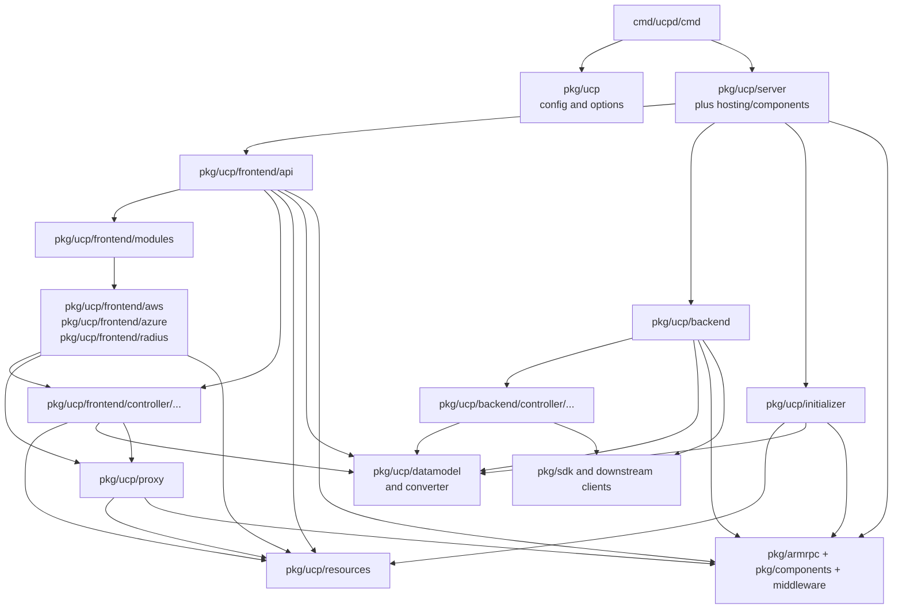
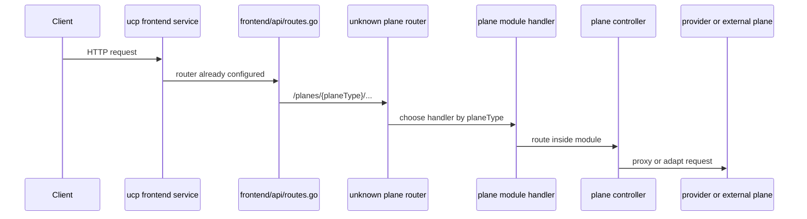

# UCP Architecture

UCP is the control-plane routing hub for Radius. It accepts ARM-style requests,
identifies the target plane or provider, and either serves UCP behavior,
reverse-proxies the request, or adapts it to an external system.

UCP owns request routing, plane-aware addressing, parts of protocol
translation, and shared control-plane concerns such as API version handling. It
is not the place for resource-type authoring or Kubernetes reconciliation
logic.

## Entry Points

- Binary entry: [cmd/ucpd/main.go](../../cmd/ucpd/main.go)
- Cobra root: [cmd/ucpd/cmd/root.go](../../cmd/ucpd/cmd/root.go)
- Config loading: [pkg/ucp/config.go](../../pkg/ucp/config.go)
- Option construction: [pkg/ucp/options.go](../../pkg/ucp/options.go)
- Server bootstrap: [pkg/ucp/server/server.go](../../pkg/ucp/server/server.go)
- API server wiring: [pkg/ucp/frontend/api/server.go](../../pkg/ucp/frontend/api/server.go)

`cmd/ucpd/cmd/root.go` reads a service config file, constructs UCP options,
creates a logger, builds the server, and hands execution to shared hosting.

## Quick Reference

| Topic | Start Here |
|------|------------|
| Startup | `cmd/ucpd/cmd/root.go` |
| HTTP/API wiring | `pkg/ucp/frontend/api/server.go` |
| Top-level routes | `pkg/ucp/frontend/api/routes.go` |
| Proxy/adaptation | `pkg/ucp/frontend/controller`, `pkg/ucp/proxy` |
| Resource IDs | `pkg/ucp/resources` |

| Test Focus | Packages |
|-----------|----------|
| Unit and route tests | `./pkg/ucp/frontend/...`, `./pkg/ucp/proxy/...` |
| Integration coverage | `./pkg/ucp/integrationtests/...` |
| Broad safety check | `./pkg/ucp/...` |

## Core Packages

| Package | Responsibility |
|--------|----------------|
| `pkg/ucp/frontend` | HTTP handlers, route registration, API surface |
| `pkg/ucp/proxy` | request forwarding and proxy helpers |
| `pkg/ucp/aws` | AWS-specific adaptation logic |
| `pkg/ucp/resources` | UCP resource ID parsing and construction |
| `pkg/ucp/datamodel` | version-agnostic UCP storage model |
| `pkg/ucp/server` | service startup and hosting integration |
| `pkg/ucp/config` | runtime configuration types |

## How It Works

The UCP process starts in [cmd/ucpd/cmd/root.go](../../cmd/ucpd/cmd/root.go),
loads config, constructs runtime options, and builds a multi-service host via
[pkg/ucp/server/server.go](../../pkg/ucp/server/server.go).

At request time, the frontend under `pkg/ucp/frontend` decides whether the
request terminates in UCP or is forwarded downstream. The architectural hinge
is `pkg/ucp/resources`: most routing logic is only correct if plane, scope, and
provider segments are parsed consistently.

For UCP-native or ARM-like targets, forwarding can be relatively direct. For
non-ARM targets such as AWS, UCP also performs protocol adaptation rather than
simple proxying.

## Invariants And Constraints

- UCP should stay focused on routing, identity of targets, and translation.
- Resource-type authoring logic should remain in provider processes, primarily
  `dynamic-rp`.
- Resource ID parsing and plane resolution need to stay consistent across all
  entry points.
- Changes in proxy behavior often require checking call flows, headers, and API
  version handling together.

## Change This Safely

### Packages That Usually Move Together

- `pkg/ucp/frontend/api`, `pkg/ucp/frontend/controller`, and `pkg/ucp/proxy`
  when routing behavior changes
- `pkg/ucp/resources` and controller code when resource ID parsing or provider
  resolution changes
- `pkg/ucp/datamodel` and `pkg/ucp/api` when persisted shape or API version
  conversions change

### Suggested Test Scope

- `go test ./pkg/ucp/...`
- Pay particular attention to route, proxy, and integration-style tests under:
  `pkg/ucp/frontend/...`, `pkg/ucp/proxy/...`, and `pkg/ucp/integrationtests/...`

## Package Dependency View

The important static seam is `root -> host -> frontend/api module dispatch`
versus `backend worker` and `initializer`. UCP does not use the builder-driven
namespace model used by the generic provider; it dispatches through plane
modules and then drops into controller, proxy, and resource-ID logic.

## Representative Flow

The representative UCP flow is plane dispatch. The frontend API service builds a
module map, registers a catch-all route under `/planes/{planeType}`, then hands
the request to the selected module handler. After that handoff, the plane module
owns the rest of the path: direct UCP behavior, reverse proxying, or adaptation.

## Related Docs

- [service-interaction-map.md](service-interaction-map.md)
- [state-persistence.md](state-persistence.md)
- [../ucp/overview.md](../ucp/overview.md)
- [../ucp/call_flows.md](../ucp/call_flows.md)
- [../ucp/code_walkthrough.md](../ucp/code_walkthrough.md)