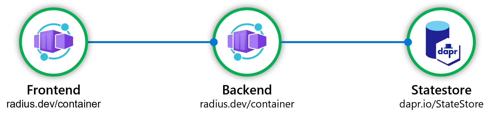
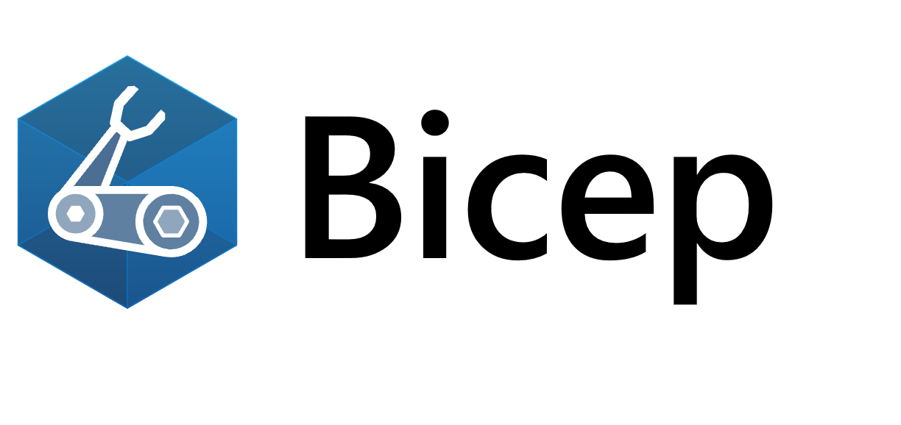



Developers [describe their application]() services and relationships, rather than just a list of infrastructure.



Radius applications and tooling are agnostic of platform, services, and infrastructure. 
<table style="max-width:600px;margin-top:10%">
  <tr>
    <td style="width:50%;text-align:center">
      <a href=""></a>
    </td>
    <td style="width:50%;text-align:center">
      <a href=""></a>
    </td>
  </tr>
</table>




Radius extends strong existing tools to further streamline the app developer experience. 
<table style="max-width:600px">
  <tr>
    <td style="width:50%;text-align:center">
      <a href=""></a>
    </td>
    <td style="width:50%;text-align:center">
      
    </td>
  </tr>
</table>


Developers can offload the complexity of wiring-up applications and let Radius employ best-practices.
<table style="max-width:600px;margin-top:5%">
  <tr>
    <td style="width:25%;text-align:center">
      <a href=""></a>
    </td>
    <td style="width:25%;text-align:center">
      <a href=""></a>
    </td>
    <td style="width:25%;text-align:center">
      <a href=""></a>
    </td>
  </tr>
  </table>




