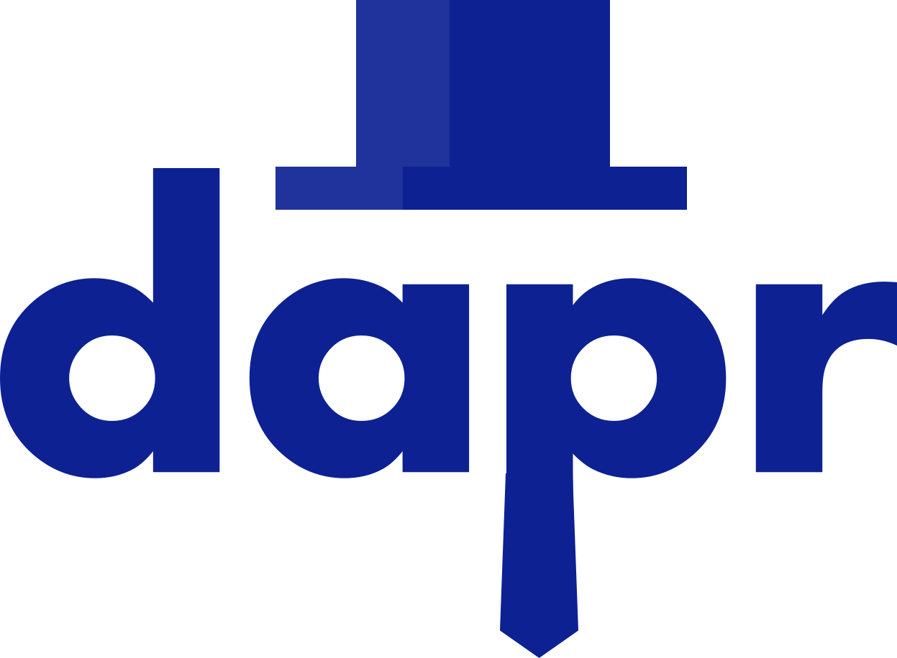
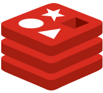
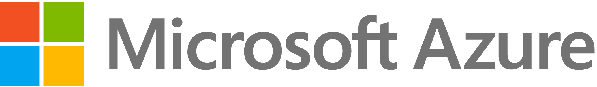

## Getting started

Author and deploy your first appliction in minutes with Radius:



## Features




  Model your Radius Application using **Components**, **Connections**, **Traits**, and **Scopes** which describe the functionality of your app, all in the Bicep language.

  <pre style="color:#f8f8f2;background-color:#272822;-moz-tab-size:4;-o-tab-size:4;tab-size:4">resource app 'Application' = {
  name: 'eShop'

  resource basket 'ContainerComponent' = {...}
  resource orders 'ContainerComponent' = {...}
  resource inventory 'dapr.StateStoreComponent' = {...}
  ...
}</pre>
  
  [**Learn the Radius app model**]()



  Radius Components describe the code, data, and infrastructure pieces of an application. They capture behavior and requirements, and make it easy to parameterize and deploy across platforms.
  
  Portable Components, like [Dapr](), can be deployed to different Radius platforms with no changes to your code.

  <table style="max-width:600px">
  <tr>
    <td style="width:25%;text-align:center">
      
    </td>
    <td style="width:25%;text-align:center">
      
    </td>
    <td style="width:25%;text-align:center">
      
    </td>
    <td style="width:25%;text-align:center">
      
    </td>
  </tr>
  </table>
   
  
  [**Check out the Radius components**]()






  A Radius environment is where you deploy and host Radius applications.
  
  It includes a **control-plane**, which communicates with with the rad CLI, and a **runtime** to which applications are deployed.

  Radius offers support for both cloud and edge with [Kubernetes]() and [Azure]() managed environments.
  
  For development, [local]() environments allow you to run Radius applications locally.

  <table style="max-width:600px">
  <tr>
    <td style="width:50%;text-align:center">
      <a href=""></a>
    </td>
    <td style="width:50%;text-align:center">
      <a href=""></a>
    </td>
  </tr>
  <tr>
    <td colspan="2" style="width:100%;text-align:center">
      <a href=""></a>
    </td>
  </tr>
  </table>
   
  
  [**Initialize Radius on your platform**]()



  The rad CLI is your primary interface with Radius [environments]() and [applications]().

  Developers can initialize environments across platforms, deploy applications, view logs, check status, and more.

  <pre style="color:#f8f8f2;background-color:#272822;-moz-tab-size:4;-o-tab-size:4;tab-size:4">
  $ rad env init Azure
  Initializing Azure environment...
  $ rad deploy eshop.bicep
  Deploying application 'eShop' into environment 'Azure'...
  $ rad resource logs -c orders -a eshop
  Order #1 received
  Order #2 received
  ...</pre>
  
  
  [**Install the rad CLI**]()



