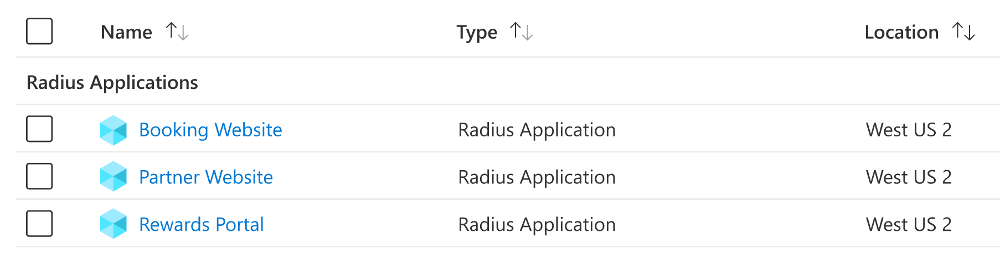

## Overview

Project Radius lets you model, deploy, and manage applications across cloud and edge. It is designed to be:



Manage your applications as individual resources instead of a list of infrastructure.



Deploy your application across cloud and edge with support for both [Microsoft Azure]() and [Kubernetes]() platforms.
<table style="max-width:600px;margin-top:10%">
  <tr>
    <td style="width:50%;text-align:center">
      <a href=""></a>
    </td>
    <td style="width:50%;text-align:center">
      <a href=""></a>
    </td>
  </tr>
</table>




Leverage the Bicep language and set of tooling to build your model and deploy your application.
<table style="max-width:600px">
  <tr>
    <td style="width:50%;text-align:center">
      
    </td>
    <td style="width:50%;text-align:center">
      <a href=""></a>
    </td>
  </tr>
</table>


Radius resources are extensible, allowing you to add your own resource types and customizations.
<table style="max-width:600px;margin-top:5%">
  <tr>
    <td style="width:25%;text-align:center">
      <a href=""></a>
    </td>
    <td style="width:25%;text-align:center">
      <a href=""></a>
    </td>
    <td style="width:25%;text-align:center">
      <a href=""></a>
    </td>
    <td style="width:25%;text-align:center">
      <a href=""></a>
    </td>
  </tr>
  </table>



## Getting started

Author and deploy your first appliction in minutes with Radius:


