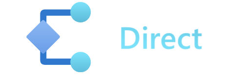
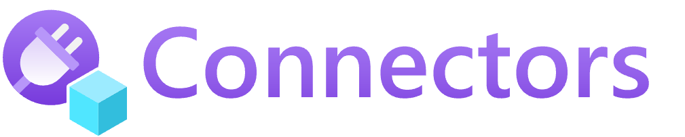

Resources describe the code, data, and infrastructure pieces of an application.

Each node of an architecture diagram would map to one Resource. Together, an Application's Resources capture all of the important behaviors and requirements needed for a runtime to host that app. 

## Resource definition

In your app's Bicep file, a resource captures: 

| Property | Description | Example |
|----------|-------------|---------|
| **Resource type** | What type of thing is this? | `Container`
| **Name** | The logical name of the Resource, must be unique per-Application and resource type | `my-container`
| **Essentials** | How do I run this? | Container image and tag (`my-container:latest`)
| **Connections** | What other Resource will I interact with? | Need to read from `my-db` 
| **Routes** | What capabilities do I provide for others? | Offer an HTTP endpoint on `/home`
| **Traits** | What operational behaviors do I offer and interact with? | Need a Dapr sidecar (`dapr.io.App`)

### Examples

The following examples shows two Resources, one representing a [Container]() and the other describing a [Dapr State Store](https://docs.dapr.io/developing-applications/building-blocks/state-management/state-management-overview/).

#### Container



#### Dapr State Store



Other resources, like the `storefront` container above, can now connect to this Dapr State Store and save/get state items.

## Services 

A dev team's app code will likely center around core runnable resources, which we call services. Running code can be modeled with services like a container or an App Service. [Learn more]()

## Connecting to resources 

There are several ways a service resource (like a container) can connect to other supporting resources. 





Connect directly to Kubernetes() and Azure () resources. 

[Learn more]()




Add portability to your application through platform-agnostic resources.
[Learn more]()




Model and connect to external 3rd party resources  
Coming soon!



## Next step



