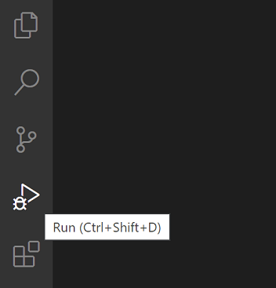
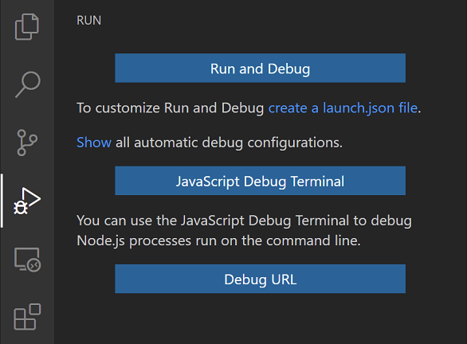
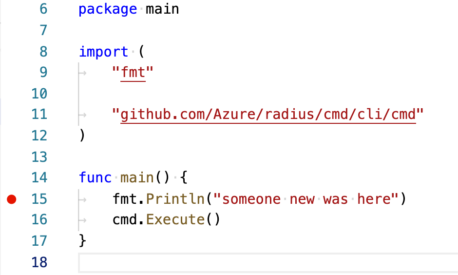
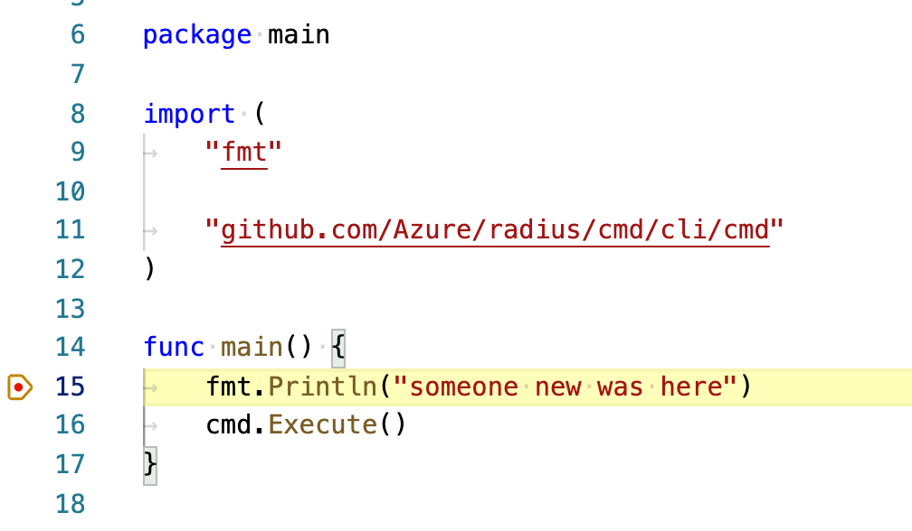

## Debugging your changes

### Creating debug settings

You can debug your changes right from VS Code. It requires a small amount of set up for Go.

First, open the [**Run View**](https://code.visualstudio.com/docs/editor/debugging#_run-view) in VS Code. You can do this either by clicking the icon or using the keyboard shortcut `shift+command+D` (`shift+control+d`) on Windows.



At the top of the new pane you should see something like the following:

<br />

Click on `create a launch.json file`.


This will open the file `.vscode/launch.json` in the editor. This is where VS Code stores information about different debugging configurations.

Replace the contents with the following text:

```bash
{
    "version": "0.2.0",
    "configurations": [
        {
            "name": "rad CLI",
            "type": "go",
            "request": "launch",
            "mode": "debug",
            "program": "${workspaceFolder}/cmd/rad/main.go",
            "cwd": "${workspaceFolder}",

            // If you need to specify command line arguments
            // for the CLI they go here as a JSON array of strings
            "args": []
        }
    ]
}
```

{}
This is a basic Go debugger configuration that is set up to launch the `rad` CLI.

You can create definitions for any set of debug settings you want to keep handy.
{}

### Running with the debugger

To try it out, first you should set a breakpoint in `main.go`. The debugger will stop the program prior to crossing over your breakpoint.

Set a breakpoint by clicking in the *gutter* to the left of the line numbers in you editor. Place the breakpoint on the new line you added in `main.go`.



Now you can launch the CLI in the debugger. Press `F5` to launch the debugger. Alternatively, you can click the icon with the green triangle in the *run view* to launch.

After some time the program will start and the breakpoint should be hit.

{}
The first time you debug on macOS with a given version of Go you will be prompted to enter your password.

It is normal for this to take 1-2 minutes for the prompt to appear the first time.
{}



You can play around with the various debugger features, like stepping into code. When you're done, hit the red square *stop* icon in the debugger tools to end the debugging session.



## Related Links

- [Debugging Go with VS Code]()