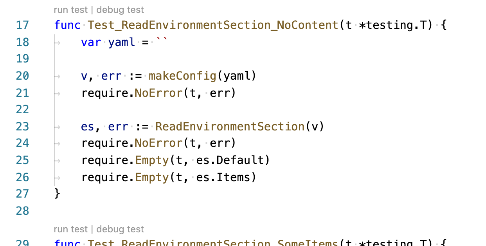

## Running tests

To run the all unit tests for the project from the command line:

```sh
make test
```

After tests run, you should see a big list of all of the project's packages:

```txt
go test ./pkg/...
ok  	github.com/Azure/radius/pkg/radrp	0.328s
?   	github.com/Azure/radius/pkg/radrp/armerrors	[no test files]
?   	github.com/Azure/radius/pkg/radrp/certs	[no test files]
?   	github.com/Azure/radius/pkg/radrp/db	[no test files]
?   	github.com/Azure/radius/pkg/radrp/k8sauth	[no test files]
?   	github.com/Azure/radius/pkg/radrp/metadata	[no test files]
ok  	github.com/Azure/radius/pkg/radrp/resources	0.283s
?   	github.com/Azure/radius/pkg/radrp/rest	[no test files]
?   	github.com/Azure/radius/pkg/radrp/revision	[no test files]
ok  	github.com/Azure/radius/pkg/cli	0.250s
?   	github.com/Azure/radius/pkg/cli/azcli	[no test files]
?   	github.com/Azure/radius/pkg/cli/azure	[no test files]
?   	github.com/Azure/radius/pkg/cli/bicep	[no test files]
?   	github.com/Azure/radius/pkg/cli/environments	[no test files]
?   	github.com/Azure/radius/pkg/cli/logger	[no test files]
?   	github.com/Azure/radius/pkg/cli/namegenerator	[no test files]
?   	github.com/Azure/radius/pkg/cli/prompt	[no test files]
?   	github.com/Azure/radius/pkg/cli/util	[no test files]
?   	github.com/Azure/radius/pkg/radclient	[no test files]
?   	github.com/Azure/radius/pkg/renderers	[no test files]
ok  	github.com/Azure/radius/pkg/renderers/containerv1alpha1
ok   	github.com/Azure/radius/pkg/renderers/cosmosdbmongov1alpha1
ok   	github.com/Azure/radius/pkg/renderers/dapr
ok   	github.com/Azure/radius/pkg/renderers/daprpubsubv1alpha1
ok   	github.com/Azure/radius/pkg/renderers/daprstatestorev1alpha1
ok   	github.com/Azure/radius/pkg/renderers/servicebusqueuev1alpha1
```

The Go test tools do not make much fanfare when all the tests pass - it just says `ok` for every package that has tests.
In general it will be very obvious in the CLI output if something failed.

## Running/Debugging a single test

The best way to run a single test or group of tests is from VS Code.

Open `./pkg/rad/config_test.go` in the editor. Each test function has the options to run or debug the test right above it.

<br />


