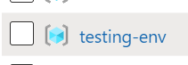
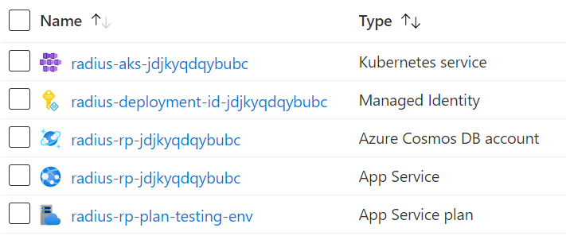

## Azure environments

An Azure Radius environment consists of various resources that together act as the private resource provider (control plane) and the application hosting environment to which you deploy Radius applications (runtime):


{}
While this page describes the current implementation of Azure Radius environments, this is subject to change as the project matures and as Radius moves toward the goal of a fully hosted, multi-tenant, service.

- For now we only support Azure as the environment
- For now we use AKS as the runtime/data-plane
- For now you will see all of the environment's control plane resources in your subscription and resource group
{}

When a new Azure Radius environment is created, the following resources are created:

| Resource | Description |
|----------|-------------|
|**Runtime**
| Azure Kubernetes Service | Runtime into which containers and workloads are deployed. Note that an additional managed Resource Group, prefixed with "MC-", is also deployed to host the AKS cluster resources.
| [Other Resources] | When applications are deployed, any additional resources are deployed into the resource group.
|**Control plane**
| Azure CosmosDB account | All of the server-side tracking of what your application definition is and what resources Radius is managing.
| Deployment script | Script used during the deployment of the Radius control plane.
| Managed Identity | Identity used by the deployment script when the rad CLI deploys the environment for the first time
| App Service | Radius private resource provider (control plane)
| App Service plan | Underlying plan for the private RP app service

## Managing environments

These steps will walk through how to deploy, manage, and delete environments in Microsoft Azure.

### Pre-requisites

- [Azure subscription](https://signup.azure.com)
- [az CLI](https://docs.microsoft.com/en-us/cli/azure/install-azure-cli). Ensure you are logged into Azure using `az login`.
- [rad CLI]()
- (optional) [create a an Azure Container Registry](https://docs.microsoft.com/en-us/azure/container-registry/container-registry-get-started-azure-cli) to use as a private container registry

### Deploy an environment

{}
While Radius environments are optimized for cost, any costs incurred by the deployment and use of a Radius environment in an Azure subscription are the responsibility of the user. Azure environments currently include a single node AKS cluster, an Azure CosmosDB account, and an App Service which all incur cost if deployed for extended periods.
{}

1. Deploy a Radius environment interactively:
   
   ```bash
   rad env init azure -i
   ```

   Follow the prompts, specifying the resource group you wish to create and selecting which region to deploy into.

   This step may take up to 10 minutes to deploy.

   {}
   To use a private container registry, you can specify the registry name as part of the `rad env init azure` command. The registry must be part of the same subscription as the environment being created.

   ```bash
   rad env init azure -i --container-registry myregistry
   ```

   {}

1. Verify deployment

   To verify the environment deployment succeeded, navigate to your subscription at https://portal.azure.com. You should see a new Resource Group with the name you entered during the previous step: 

   

   Inside you will see the [environment resources](#azure-environments) created for the environment:

   

### Connect to an existing environment

If you wish to attach to an existing environment instead of deploying a new one, simply specify the name, subscription, and resource group of an existing Radius environment when using the above steps for `rad env init azure`. The rad CLI will append the config for the existing environment to your local config file.

### Delete an environment

Use the rad CLI to [delete an environment]():

```bash
rad env delete -e azure --yes
```

## Related links

- [Radius tutorials]()
- [rad CLI reference]()
