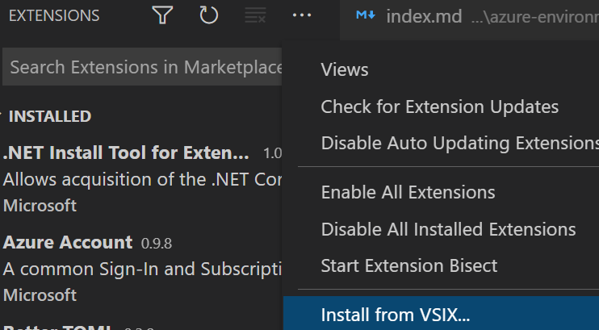

Radius can be used with any text editor, but Radius-specific optimizations are available for [Visual Studio Code](https://code.visualstudio.com/). The Project Radius VSCode extension provides:
- Syntax highlighting
- Auto-completion
- Linting

## Pre-requisites

- [Visual Studio Code](https://code.visualstudio.com/)

## Install Radius extension

1. Download the stable version of the [custom VSCode extension file](https://get.radapp.dev/tools/vscode/stable/rad-vscode-bicep.vsix)

1. Install the `.vsix` file
   - In VSCode, manually install the extension using the *Install from VSIX* command in the Extensions view command drop-down.
       
       
   - You can also import this extension on the [command-line](https://code.visualstudio.com/docs/editor/extension-gallery#_install-from-a-vsix) with:

      ```bash
      code --install-extension rad-vscode-bicep.vsix
      ```
   - If running on Windows Subsystem for Linux (WSL), make sure to install the extension in WSL as well:
      

1. Disable the official Bicep extension if you have it installed. (Do NOT install the Bicep extension if you haven't already.)
   - Our custom extension needs to be responsible for handling `.bicep` files and you cannot have both extensions enabled at once.

## Install other Radius extension versions

You can access other versions of the Radius extension from the following URLs:

- [Latest unstable](https://get.radapp.dev/tools/vscode/edge/rad-vscode-bicep.vsix)

