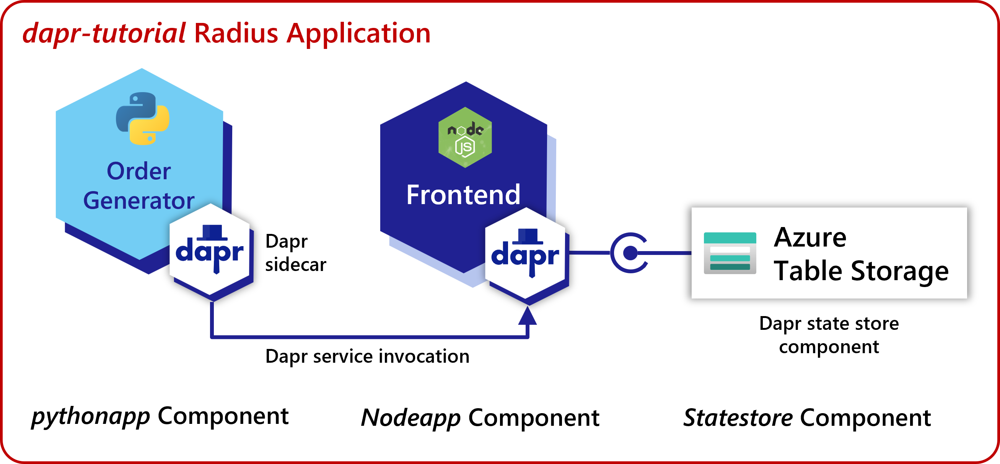
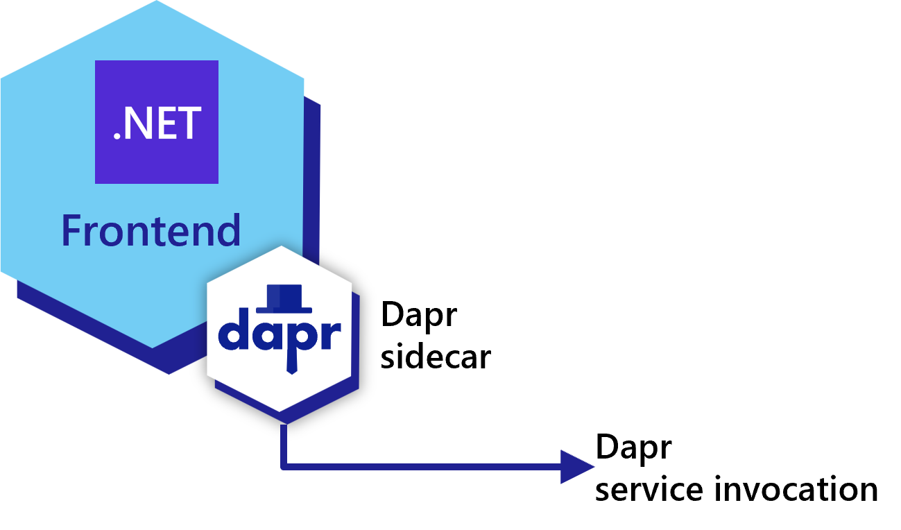
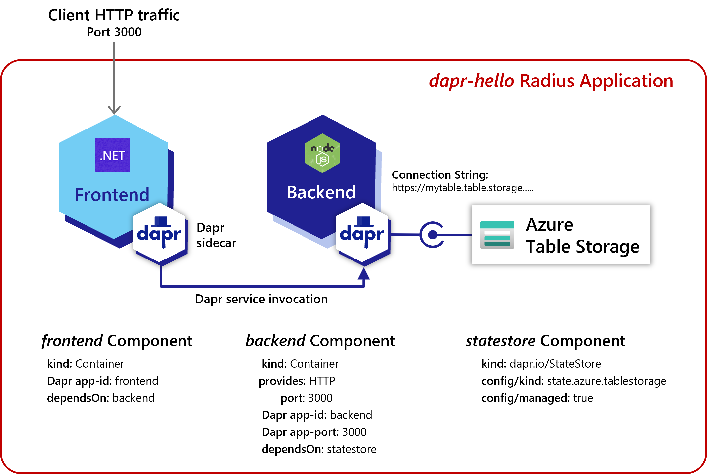

You will be deploying a microservices order processing application. It will have three Radius *components*:

- An containerized order processing microservice written in Node.JS ("nodeapp")
- A Dapr state store used to store the orders ("statestore")
- An order generating microservice ("pythonapp")

### Order processing microservice

The order processing microservice (`nodeapp`) accepts HTTP requests to create or display orders. Here is a diagram focused on the order processing service:

The nodeapp accepts HTTP requests on two endpoints: `GET /order` and `POST /neworder`.

### Dapr state store

The state store (`statestore`) stores information about orders. It could be any compatible [Dapr state store](https://docs.dapr.io/developing-applications/building-blocks/state-management/state-management-overview/). In this tutorial we will use Azure Table Storage.

### Order generating service

The order generting service (`pythonapp`) uses [Dapr service invocation](https://docs.dapr.io/developing-applications/building-blocks/service-invocation/service-invocation-overview/) to send requests to nodeapp. It does not accept any incoming traffic. 

### The Radius mindset

The diagrams shown so far document the communication flows, but a Radius application also describes additional details. 

A Radius template includes 

- The logical relationships of an application 
- The operational details associated with those relationships 

Here is an updated diagram that shows what the Radius template captures:

Key benefits of Radius:

- Supporting services like data components (`statestore` here) are part of the application
- Relationships between components are fully specified with protocols and other strongly-typed information

In addition to this high level information, the Radius model also uses typical details like:

- Container images
- Listening ports
- Configuration like connection strings

Keep the diagram in mind as you proceed through the following steps. Your Radius deployment template will aim to match it. 

 
