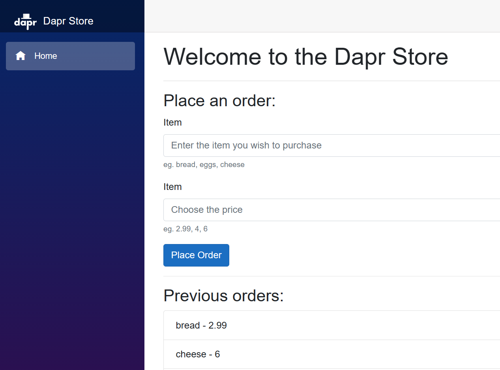
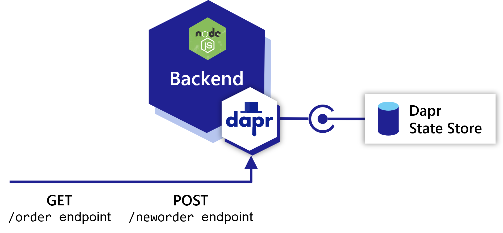
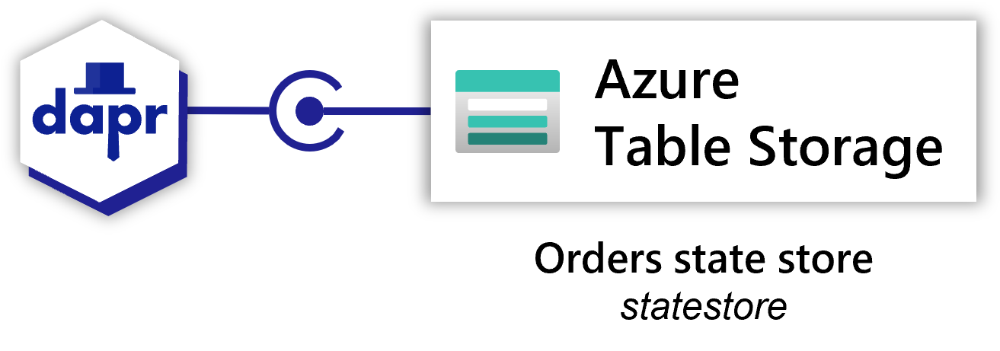
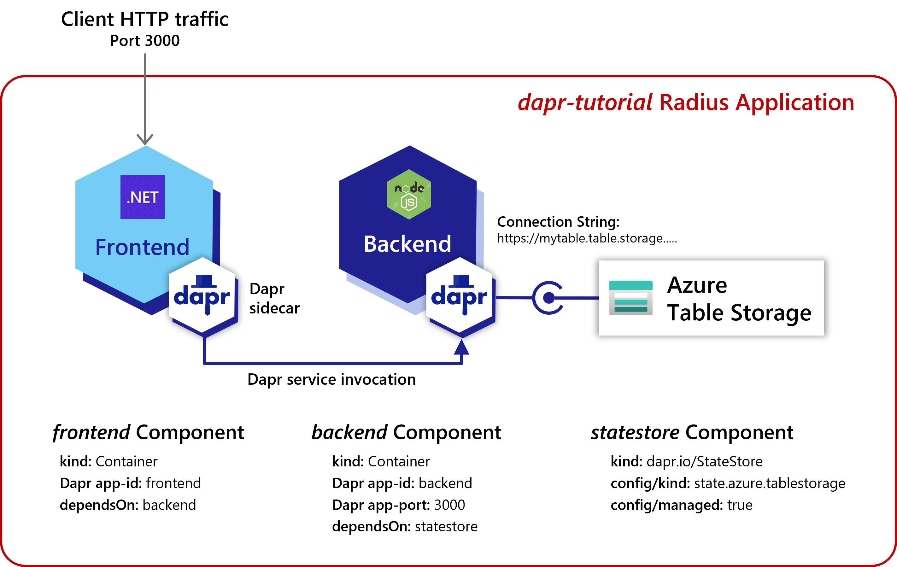

In this tutorial you will be deploying an online store where you an order items:

## Components

This Radius application will have three [Components]():

- A UI for users to place orders written with .NET Blazor (`frontend`)
- A backend order processing microservice written in Node.JS (`backend`)
- A Dapr state store used to store the orders (`statestore`)

### Frontend

The user-facing UI app (`frontend`) offers a portal for users to place orders. Upon creating an order, `frontend` uses [Dapr service invocation](https://docs.dapr.io/developing-applications/building-blocks/service-invocation/service-invocation-overview/) to send requests to `nodeapp`.

### Backend

The order processing microservice (`backend`) accepts HTTP requests to create or display orders. It accepts HTTP requests on two endpoints: `GET /order` and `POST /neworder`.

### Statestore

The Dapr state store (`statestore`) stores information about orders. It could be any compatible [Dapr state store](https://docs.dapr.io/developing-applications/building-blocks/state-management/state-management-overview/). In this tutorial we will use Azure Table Storage.

## Bindings

The diagrams shown so far document the communication flows, but a Radius application also describes additional details through [Bindings]().

A Radius template includes Bindings for:

- The logical relationships of an application
- The operational details associated with those relationships

Here is an updated diagram that shows what the Radius template captures:

## Summary

In this tutorial, you will learn how Radius offers:

- Services like data components (`statestore` here) as part of the application
- Relationships between components that are fully specified with protocols and other strongly-typed information

In addition to this high level information, the Radius model also uses typical details like:

- Container images
- Listening ports
- Configuration like connection strings

Keep the diagram in mind as you proceed through the following steps. Your Radius deployment template will aim to match it.

 
