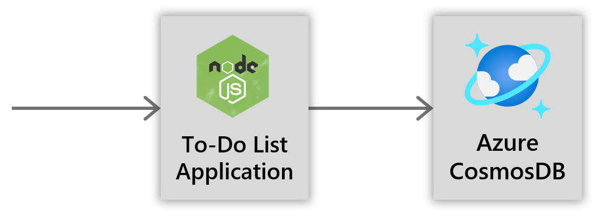
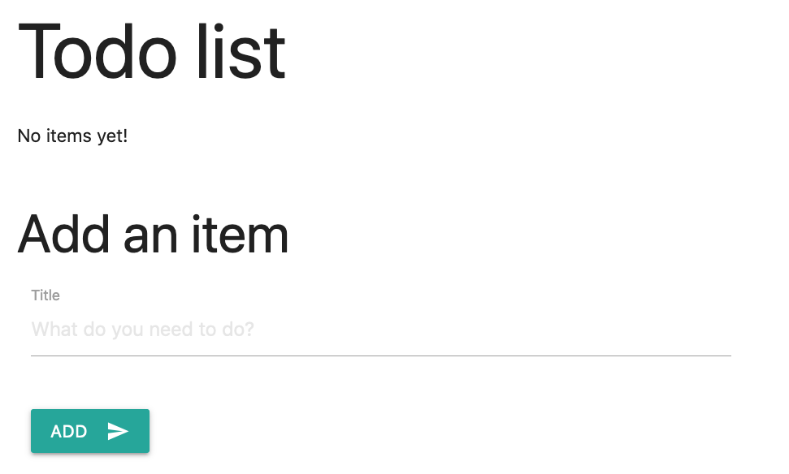

## Before you begin

This tutorial will teach you how to use Radius to deploy a web application from first principles. You will learn:  

- The concepts of the Radius application model 
- The basic syntax of the Bicep language 

No prior knowledge of Radius or [Bicep](https://docs.microsoft.com/en-us/azure/azure-resource-manager/templates/bicep-overview) is needed.

## Prerequisites

- [Install Radius CLI]()
- [Create a Radius environment]()
- [(recommended) Install Visual Studio Code](https://code.visualstudio.com/)
   - The [Radius VSCode extension]() provides syntax highlighting, completion, and linting.
   - You can also complete this tutorial with any basic text editor.

## Overview of the tutorial application

You will be deploying a *To-Do List* web application. It will have two Radius *components*:

- A containerized web application written in Node.JS ("webapp")
- An Azure CosmosDB database ("db")




### Web application

The example web application (`todoapp`) is a single-page-application (SPA) with a Node.JS backend. The SPA sends requests HTTP requests to the Node.JS backend to read and store *todo* items.

The web application listens on port 3000 for HTTP requests. 

The web application uses the MongoDB protocol to read and store data in a database. The web application reads the environment variable `DB_CONNECTION` to discover the database connection string.

### Database

The database (`db`) is an Azure Cosmos MongoDB database.

## The Radius mindset

The diagrams shown so far document the communication flows, but a Radius application also describes additional details. 

A Radius template includes 

- the logical relationships of an application 
- the operational details associated with those relationships 

Here is an updated diagram that shows what the Radius template needs to capture:

<br />

This diagram reflects important details of the Radius model that are different from other deployment technologies you may have used:

- The data component (`db` here) is part of the application
- Relationships between components are fully specified with protocols and other strongly-typed information

In addition to this high level information, the Radius model also uses typical details like:

- Container images
- Listening ports
- Configuration like connection strings

Keep the diagram in mind as you proceed through the following steps. Your Radius deployment template will aim to match it. 

## Step 1: Creating the application definition

Radius uses the Bicep langauge as its file-format and structure. Create a new `template.bicep` file with the following content:

```bash
resource app 'radius.dev/Applications@v1alpha1' = {
  name: 'webapp'

}
```

This defines the basic structure of an application. This declaration:

- Defines an application resource with the variable name of `app`.
- Assigns the name `webapp` to the application resource that will be created.

Declarations in Bicep start with `resource`. They also declare a variable, assign a resource type, and then are followed by an equals-sign `=` and then an object. 

{}
Declarations in Bicep have symbolic (variable) names associated with them. The variable name `app` could be used in this file to reference the application in other declarations. The value of the `name` property (`webapp`) is what will be used to identify the application during management operations.
{}

{}
Objects in Bicep don't need quotes around property names like in JSON. Properties in Bicep are separated by newlines, not commas. In general Bicep will require less typing than the equivalent JSON but they can express similar structures.

While Bicep uses newlines to separate properties and other syntax, it is not sensitive to indention like YAML is. By convention Bicep uses 2 spaces for indentation, but it is just a convention and not required.
{}

At this point you could deploy the application but it doesn't contain any components and so it won't do anything interesting. 

## Step 2: Deploying a single container

Now that you've defined the shell for an application, you can add components to it.

### Add a container component

Inside your application definition, add the `todoapp` component shown below:

```bash
resource app 'radius.dev/Applications@v1alpha1' = {
  name: 'webapp'

  resource todoapplication 'Components' = {
    name: 'todoapp'
    kind: 'radius.dev/Container@v1alpha1'
    properties: {
      run: {
        container: {
          image: 'radiusteam/tutorial-todoapp'
        }
      }
    }
  }
}
```

The content you added declares a *component*. If you visualize the structure of an application as a graph, then components represent the nodes and things to deploy.

A component can be:

- A resource that runs your code (eg. a container)
- A resource that works with data (eg. a message queue or database)
- A configuration resource (eg. configuration for an API gateway)

#### Kind

The component *kind* specifies the type of resource to deploy. In this case, the kind is `radius.dev/Container@v1alpha1`, which represents a generic container.

The set of properties and settings available inside the body of the component depends on the kind. The `run` section is used to specify how the component runs. In this case `run` specifies the container image to run. 

{}
Like the application declaration, components also declare a variable name. The variable name `todoapplication` could be used in this file to reference the component in other declarations. The value of the `name` property (`todoapp`) is what will be used to identify the component during management operations.
{}

{}
The `run` section is one of several top level sections in a *component*. In general, components that run your code will have a `run` section.
{}

### Add an HTTP service

If you were to deploy the application now, it would run the `radiusteam/tutorial-todoapp` image but you would have no way to interact with the running application.

Add the ability to listen for HTTP traffic as depicted in the diagram above. Expand your `todoapp` as shown below so that it includes a web service definition via a `provides` section:

```bash
resource app 'radius.dev/Applications@v1alpha1' = {
  name: 'webapp'

  resource todoapplication 'Components' = {
    name: 'todoapp'
    kind: 'radius.dev/Container@v1alpha1'
    properties: {
      run: {
        container: {
          image: 'radiusteam/tutorial-todoapp'
        }
      }
      provides: [
        {
          kind: 'http'
          name: 'web'
          containerPort: 3000
        }
      ]
    }
  }
}
```

#### Service

What you've added here defines a *service* called `web` and with the kind `http`. Services in Radius are logical connection-points. It's a way that one component can expose functionality for components of the application to bind to. In this case you've defined an HTTP service that others can use to find the URL of `todoapp` and send it HTTP traffic.

There is nothing special about the name `web`, it is just an identifier used for the name of the service.

{}
HTTP services in Radius are *internal*, meaning that they are not exposed to internet traffic by default.
{}

### Deploy application

Now you are ready to deploy the application for the first time. 

1. First, double-check that you are logged-in to Azure. Switch to your commandline and run the following command:

   ```sh
   az login
   ```

1. Then after that completes, run:

   ```sh
   rad deploy template.bicep
   ```

   This will deploy the application and launch the container.

1. Confirm that your web application was deployed

   View deployed applications:

   ```sh
   rad application list
   ```
   
   Example output with the `webapp` Radius application: 
   ```sh
   {
     "value": [
       {
         "id": "/subscriptions/{SUB-ID}/resourceGroups/{RESOURCE-GROUP}/providers/Microsoft.CustomProviders/resourceProviders/radius/Applications/webapp",
         "name": "radius/webapp",
         "type": "Microsoft.CustomProviders/resourceProviders/Applications"
       }
     ]
   }
   ```

   View deployments for a specific app: 

   ```sh
   rad deployment list --application-name webapp
   ```

   Your `todoapp` component has been created into a `default` deployment of the `webapp` application. 
   You should see something like this:

   ```sh
   {
     "value": [
       {
         "id": "/subscriptions/{SUB-ID}/resourceGroups/{RESOURCE-GROUP}/providers/Microsoft.CustomProviders/resourceProviders/radius/Applications/webapp/Deployments/default",
         "name": "radius/webapp/default",
         "type": "Microsoft.CustomProviders/resourceProviders/Applications/Deployments",
         "properties": {
           "components": [
             {
               "componentName": "todoapp"
             }
           ]
         }
       }
     ]
   }
   ```

1. View the properties of the deployed `todoapp` component 

   ```sh
   rad component get --application-name webapp --name todoapp
   ```
 
   The details of the `todoapp` component should match its definition from your template.bicep file. Example output:

   ```sh
   Using config file: /Users/{USER}/.rad/config.yaml
   {
     "id": "/subscriptions/{SUB-ID}/resourceGroups/{RESOURCE-GROUP}/providers/Microsoft.CustomProviders/resourceProviders/radius/Applications/webapp/Components/todoapp",
     "name": "radius/webapp/todoapp",
     "type": "Microsoft.CustomProviders/resourceProviders/Applications/Components",
     "kind": "radius.dev/Container@v1alpha1",
     "properties": {
       "dependsOn": [
         {
           "kind": "mongodb.com/Mongo",
           "name": "db",
           "setEnv": {
             "DB_CONNECTION": "connectionString"
           }
         }
       ],
       "provides": [
         {
           "containerPort": 3000,
           "kind": "http",
           "name": "web"
         }
       ],
       "revision": "89622fa78bc845079129b8722a20452156f1f80f",
       "run": {
         "container": {
           "image": "radiusteam/tutorial-todoapp"
         }
       }
     }
   }
   ```

1. To test out your `webapp` application, open a local tunnel to your application:

   ```sh
   rad expose webapp todoapp --port 3000
   ```

   {}
   The `rad expose` command provides the application name, followed by the component name, followed by a port. If you changed any of these names when deploying, update your command to match.
   {}

1. Visit the URL `http://localhost:3000` in your browser. For now you should see a page like:

   

   If the page you are seeing matches the screenshot hat means that the container is running as expected. 

   You can play around with the application's features features:
   - Add a todo item
   - Mark a todo item as complete
   - Delete a todo item

1. When you are done testing press CTRL+C to terminate the port-forward, and you are ready to move on to the next step.

## Step 3: Adding a database

As the message from the previous step stated, you have not yet configured a database, so the todo items you enter will be stored in memory inside the application. If the web application restarts then all of your data will be lost!

In this step you will learn how to add a database and connect to it from the application.

### Add db component
Add a new component declaration (`db`) to your application definition as shown below. Leave your existing declaration for `todoapp` unchanged.

```bash
resource app 'radius.dev/Applications@v1alpha1' = {
  name: 'webapp'

  ...

  resource db 'Components' = {
    name: 'db'
    kind: 'azure.com/CosmosDocumentDb@v1alpha1'
    properties: {
      config: {
        managed: true
      }
    }
  }
}
```

This declaration adds the database as a component of kind `azure.com/CosmosDocumentDb@v1alpha1`. You've seen component declarations before, so you can notice some differences with this one. `db` has a `config` section instead of a `run` section.

{}
The `config` section is one of several top level sections in a *component*. In general components that represent a data store will have a `config` section
{}

Inside the `config` section, you specified `managed: true`. This flag tells Radius to manage the lifetime of the database for you. The database will be deleted when you delete the application.

### Reference db from todoapp

Now that you've created the database as a component, you can connect them by referencing the `db` component from the `todoapp` component.

Type or paste the additional content from the following text inside your application definition. What's new is the `dependsOn` section:

```bash
resource app 'radius.dev/Applications@v1alpha1' = {
  name: 'webapp'

  resource todoapplication 'Components' = {
    name: 'todoapp'
    kind: 'radius.dev/Container@v1alpha1'
    properties: {
      run: {
        container: {
          image: 'radiusteam/tutorial-todoapp'
        }
      }
      dependsOn: [
        {
          kind: 'mongodb.com/Mongo'
          name: 'db'
          setEnv: {
            DB_CONNECTION: 'connectionString'
          }
        }
      ]
      provides: [
        {
          kind: 'http'
          name: 'web'
          containerPort: 3000
        }
      ]
    }
  }

  ...
}
```

The `dependsOn` section is used to configure relationships between a component and services provided by other components. The `db` is of kind `azure.com/CosmosDocumentDb@v1alpha1`, which supports the MongoDB protocol. `db` is considered to provide a service of kind `mongodb.com/Mongo` implicitly. Configuring a dependency on a service is the other part of specifying a relationship. This declares the *intention* from the `todoapp` component to communicate with the `db` using `mongodb.com/Mongo` as the protocol.

{}
Relations in Radius are based on protocols and services as a form of *loose-coupling*. The definition of `todoapp` documents its dependency on a *MongoDB-compatible database* rather than a dependency on a *cloud-provider-specific service (Azure CosmosDB)*.

`db` could be replaced with another MongoDB-compatible database (eg. MongoDB Atlas) and the defintion of `todoapp` would not need to change.
{}


The `setEnv` section declares operations to perform *based on* the relationship. In this case the `connectionString` value will be retrieved from the database and set as an environment variable on the component. As a result, `todoapp` will be able to use the `DB_CONNECTION` environment variable to access to the database connection string.

{}
Radius captures the relationships and intentions behind an application so that they can simplify deployment. Examples of this include: wiring up connection strings, granting permissions, or restarting components when a dependency changes.
{}

### Deploy application with database

Now you are ready to deploy.

1. Switch to the command-line and run the following command.

   ```sh
   rad deploy template.bicep
   ```

   This will deploy the application, including the Azure CosmosDB database. This may take a few minutes because of the extra time required to create the database.

1. Confirm that the database was deployed.

   ```sh
   rad deployment list --application-name webapp
   ```

   Now you should see both `db` and `todoapp` components in your `webapp` application, similar to:

   ```sh
   Using config file: /Users/{USER}/.rad/config.yaml
   {
     "value": [
       {
         "id": "/subscriptions/{SUB-ID}/resourceGroups/{RESOURCE-GROUP}/providers/Microsoft.CustomProviders/resourceProviders/radius/Applications/webapp/Deployments/default",
         "name": "radius/webapp/default",
         "type": "Microsoft.CustomProviders/resourceProviders/Applications/Deployments",
         "properties": {
           "components": [
             {
               "componentName": "db"
             },
             {
               "componentName": "todoapp"
             }
           ]
         }
       }
     ]
   }
   ```

1. To test out the database, open a local tunnel on port 3000 again:

   ```sh
   rad expose webapp todoapp --port 3000
   ```

1. Visit the URL `http://localhost:3000` in your browser. You should see a page like:

   

   If your page matches, then it means that the container is able to communicate with the database. Just like before, you can test the features of the todo app. Add a task or two. Now your data is being stored in an actual database. 

1. When you are done testing press CTRL+C to terminate the port-forward. 

## Step 4: Cleanup

If you'd like to try another tutorial with your existing environment, go back to the [Radius tutorials]() page. 

If you're done with testing, clean up your environment to **prevent additional charges in your subscription**. 

Deleting an environment will delete:

- Your Radius environment
- The related resource group
- The application you just deployed

```sh
rad env delete azure --yes
```

You have completed this tutorial!

## Related links

- View the full template.bicep for this tutorial [here](https://github.com/Azure/radius/blob/main/docs/content/getting-started/tutorial/webapp/template.bicep)