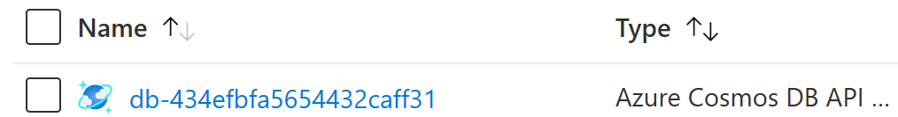
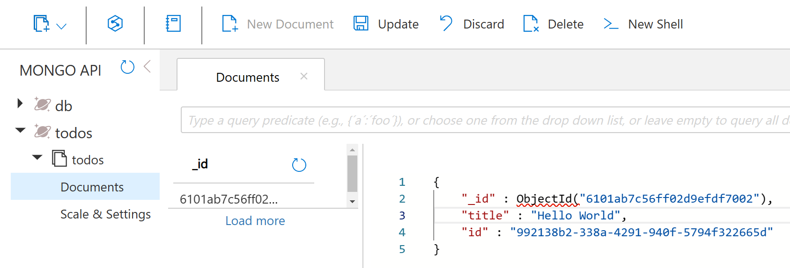

So far you have not yet configured a database, so the todo items you enter will be stored in memory inside the application. If the website restarts then all of your data will be lost!

In this step you will learn how to add a database and connect to it from the application.

We'll discuss template.bicep changes and then provide the full, updated file before deployment. 

## Add db component
A `db` database component is used to specify a few properties about the database: 

- **kind:** `mongodb.com/Mongo@v1alpha1` represents a MongoDB compatible database.
- **managed:** `true` tells Radius to manage the lifetime of the component for you ([more information]())





{}
When deploying to an Azure environment a managed `mongodb.com/Mongo@v1alpha1` component will be bound to Azure CosmosDB. By declaring your dependency on a generic *MongoDB-compatible* database, your code is more portable. You can use the component kind `azure.com/CosmosDBMongo@v1alpha1` to explictly declare a component backed by Azure CosmosDB.
{}

{}
When deploying to a Kubernetes environment a managed `mongodb.com/Mongo@v1alpha1` component will be bound to the `mongo` docker image running a lightweight developer configuration. 
{}



## Reference db from todoapp

Radius captures both logical relationships and related operational details. Examples of this include: wiring up connection strings, granting permissions, or restarting components when a dependency changes.

Once the database is defined as a component, you can connect to it by referencing the `db` component from within the `todoapp` component via a `uses` section. 

The `uses` section is used to configure relationships between a component and bindings provided by other components. The `db` is of kind `mongodb.com/Mongo@v1alpha1`, which supports the MongoDB protocol. `db` automatically provides a binding of kind `mongodb.com/Mongo`. Configuring a dependency on a binding is the other part of specifying a relationship. This declares the *intention* from the `todoapp` component to communicate with the `db` using `mongodb.com/Mongo` as the protocol.

Here's what the `todoapp` component will look like with the `uses` section added within its properties:

{{< rad file="snippets/app.bicep" embed=true marker="//CONTAINER" replace-key-run="//RUN" replace-value-run="run: {...}" replace-key-bindings="//BINDINGS" replace-value-bindings="bindings: {...}" >}}

The `env` section declares operations to perform *based on* the relationship. In this case the `connectionString` value will be retrieved from the database and set as an environment variable on the component. As a result, `todoapp` will be able to use the `DBCONNECTION` environment variable to access to the database connection string.

## Update your template.bicep file 

Update your `template.bicep` file to match the full application definition:



## Deploy application with database

1. Now you are ready to re-deploy the application, including the Azure CosmosDB database. Switch to the command-line and run: 

   ```sh
   rad deploy template.bicep
   ```

   This may take a few minutes because of the time required to create the database.

1. You can confirm that the new `db` component was deployed by running:

   ```sh
   rad deployment list --application webapp -o json
   ```

   You should see both `db` and `todoapp` components in your `webapp` application. Example output: 

   ```
   DEPLOYMENT  COMPONENTS
   default     db todoapp
   ```

1. To test the database, open a local tunnel on port 3000 again:

   ```sh
   rad component expose todoapp --application webapp --port 3000
   ```

1. Visit the URL [http://localhost:3000](http://localhost:3000) in your browser. You should see a page like:

   

   If your page matches, then it means that the container is able to communicate with the database. Just like before, you can test the features of the todo app. Add a task or two. Now your data is being stored in an actual database.

1. Open the Azure resource group where your application is deployed. The URL was output during the `rad deploy` command.

1. Open the CosmosDB resource prefixed with `db-`

   

1. Open the Data Explorer to the `todos` collection. You can now see the entries you added in the todo app.

   

1. When you're done testing press CTRL+C to terminate the port-forward. 

## Next steps

<br>