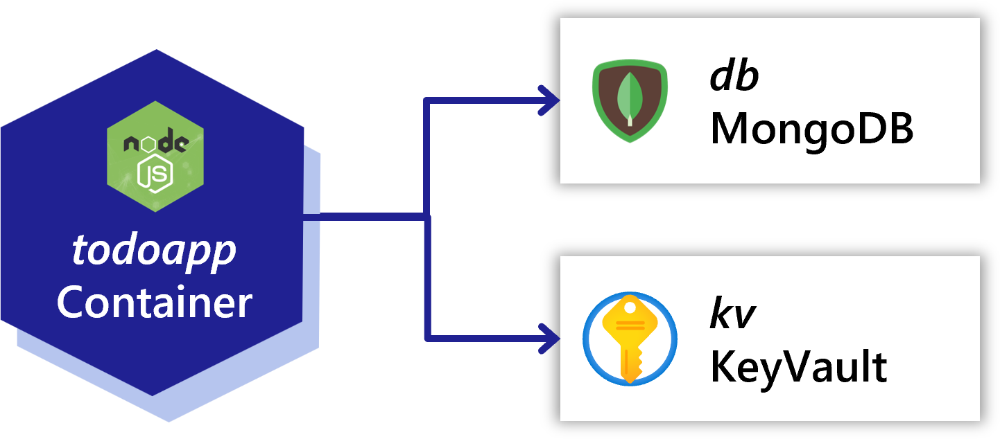
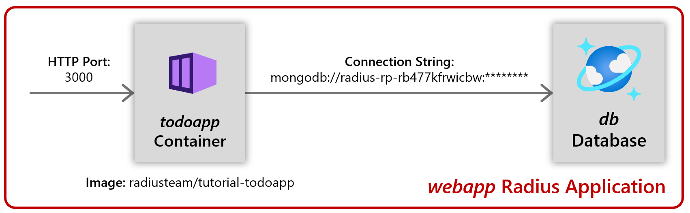

You will be deploying a *To-Do List* website. It will have two Radius *components*:

- A containerized website written in Node.JS ("webapp")
- An Azure CosmosDB database ("db")

### Website frontend

The example website (`todoapp`) is a single-page-application (SPA) with a Node.JS backend. The SPA sends requests HTTP requests to the Node.JS backend to read and store *todo* items.

The website listens on port 3000 for HTTP requests. 

The website uses the MongoDB protocol to read and store data in a database. The website reads the environment variable `DB_CONNECTION` to discover the database connection string.

You can download the source code [here](/tutorial/webapp.zip) if you want to see how the frontend is built.

### Database

The database (`db`) is an Azure Cosmos MongoDB database.

### The Radius mindset

The diagrams shown so far document the communication flows, but a Radius application also describes additional details. 

A Radius template includes 

- The logical relationships of an application 
- The operational details associated with those relationships 

Here is an updated diagram that shows what the Radius template captures:

 

Key benefits of Radius:

- Supporting services like data components (`db` here) are part of the application
- Relationships between components are fully specified with protocols and other strongly-typed information

In addition to this high level information, the Radius model also uses typical details like:

- Container images
- Listening ports
- Configuration like connection strings

Keep the diagram in mind as you proceed through the following steps. Your Radius deployment template will aim to match it. 

 

