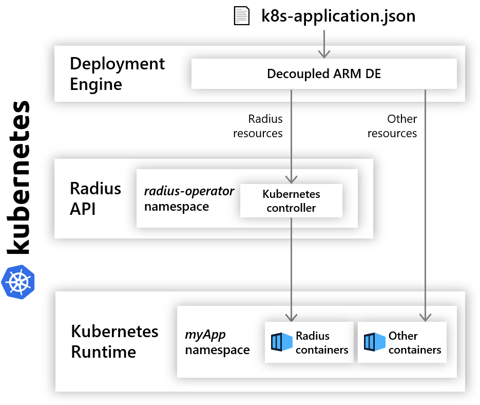

## Kubernetes environments

A Kubernetes Radius environment allows you to deploy Radius applications to a Kubernetes cluster.
<!-- markdownlint-disable MD033 -->


## Managing environments

These steps will walk through how to deploy, manage, and delete environments in a Kubernetes cluster.

### Pre-requisites

- [rad CLI]()
- A Kubernetes Cluster. There are many different options here, including:
  - [Azure Kubernetes Service](https://docs.microsoft.com/en-us/azure/aks/tutorial-kubernetes-deploy-cluster)
    - Note that [AKS-managed AAD](https://docs.microsoft.com/en-us/azure/aks/managed-aad) is not supported currently
  - [Kubernetes in Docker Desktop](https://www.docker.com/blog/docker-windows-desktop-now-kubernetes/), however it does take up quite a bit of memory on your machine, so use with caution.
  - [Minikube](https://kubernetes.io/docs/tasks/tools/install-minikube/)
  - [K3s](https://k3s.io), a lightweight single-binary certified Kubernetes distribution from Rancher.
  - Another Kubernetes provider of your choice.

{}
If you choose a container registry provided by a cloud provider (other than Dockerhub), you will likely have to take some steps to configure your Kubernetes cluster to allow access. Follow the instructions provided by your cloud provider.
{}

### Initialize an environment

1. Initialize a Radius environment interactively:

   ```bash
   rad env init kubernetes -i
   ```

   Follow the prompts, specifying the namespace which applications will be deployed into.

   {}
   When Radius initializes a Kubernetes environment, it will deploy the system resources into the `radius-system` namespace. These aren't part your application. The namespace specified in interactive mode will be used for future deployments by default.
   {}

1. Verify initialization

   To verify the environment initialization succeeded, you can run the following command:

   ```bash
   kubectl get deployments -n radius-system
   ```

   The output should look like this:

   ```bash
   NAME                                         READY   STATUS    RESTARTS   AGE
   haproxy-ingress-6f94f4bd85-497pc             1/1     Running   0          29s
   radius-controller-manager-77bc56f9d4-2jg7s   2/2     Running   0          38s
   ```

   An ingress controller is automatically deployed to the `radius-system` namespace for you to manage gateways. In the future you will be able to deploy your own ingress controller. Check back for updates.

### Delete an environment

Use the rad CLI to [delete an environment]():

```bash
rad env delete -e <ENVIRONMENT_NAME> --yes
```

This will currently remove the entry for the kubernetes environment in your config file. It will *NOT* remove the resources created in the kubernetes cluster. In future updates, a better story around uninstalling/deletion will be provided.

## Additional resources

- [Kubernetes Bicep resources]()
