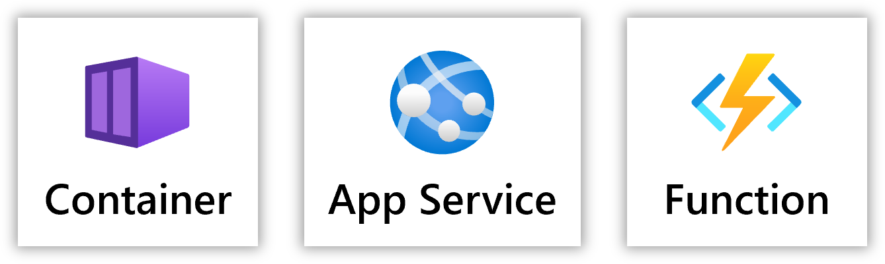
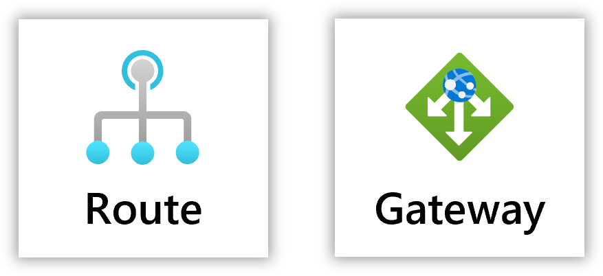
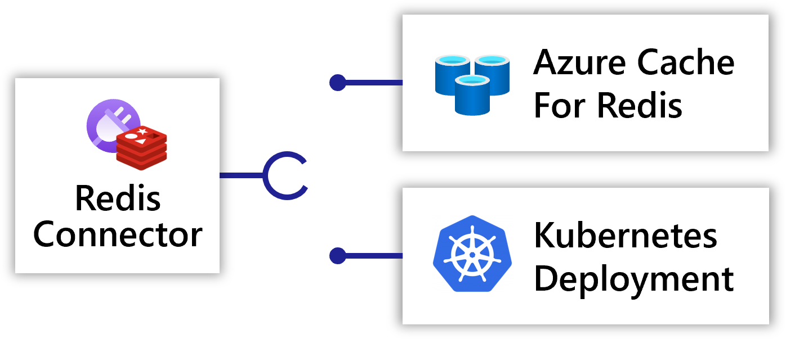
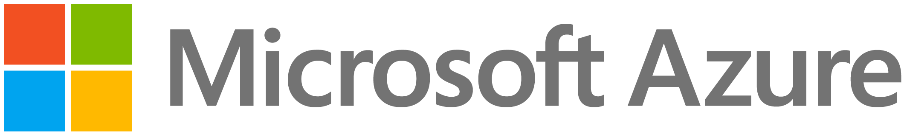

Applications are made up of resources. Resources can be abstract and deployable to multiple Radius platforms (*eg. Container, MongoDB, etc*), or they can be platform specific and deployable to a single platform (*Azure CosmosDB, Kubernetes DaemonSet, etc*).

{}
To learn more about the Radius application model an how to define resources and relationships visit the [Radius concepts]().
{}

## Resource types




Model your running code with services.  
[Learn more]()



Define your network relationships & requirements.  
[Learn more]()



Add portability to your application with connectors.  
[Learn more]()





Model and connect to Kubernetes resources.  
[Learn more]()



Model and connect to Microsoft Azure resources.  
[Learn more]()



Model and connect to external resources.  
Coming soon!

