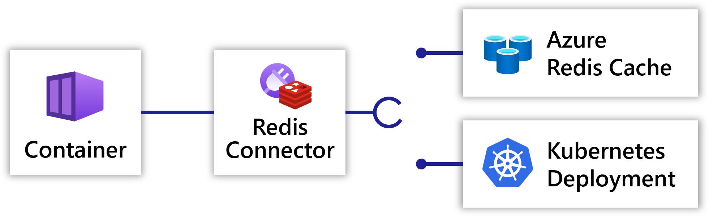

## Overview

Connectors provide **abstraction** and **portability** to Radius applications. This allows developement teams to depend on high level resource types and APIs, and let infra teams swap out the underlying resource and configuration.

### Example

The following examples show how a [container]() can connect to a Redis connector, which in turn binds to an Azure Cache for Redis or a Kubernetes Pod.




<h4>Underlying resource</h4>

In this example Redis is provided by a Kubernetes Pod:



<h4>Connector</h4>

A Redis connector can be configured with properties from the Kubernetes Pod:






<h4>Underlying resource</h4>

In this example Redis is provided by an Azure Cache for Redis:



<h4>Connector</h4>

A Redis connector can be configured with an Azure resource:







<h4>Container</h4>

A container can connect to the Redis connector without any configuration or knowledge of the underlying resource:



## Connector categories

Check out the Radius connector library to begin authoring portable applications:
