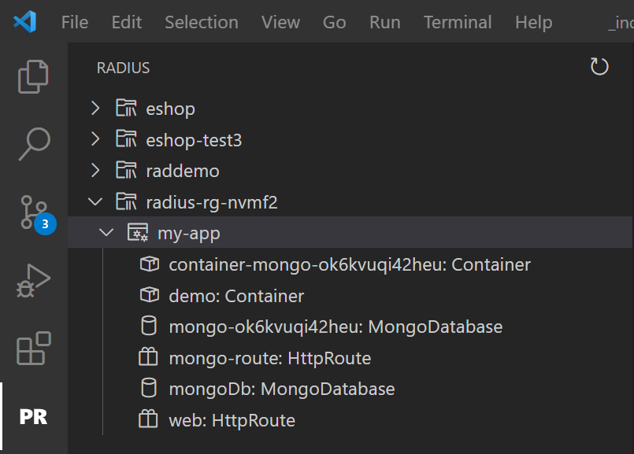
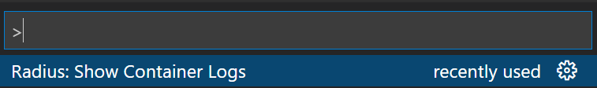
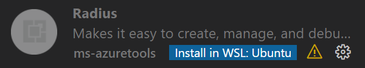

Developers can use the *preview* Radius Visual Studio Code extension which offers a variety of features to help manage Radius applications across cloud and edge.

{}
In addition to the Project Radius extension described in this page, a forked Bicep extension is also used for formatting and linting. This requirement will be removed in a future release. Visit the [getting started guide]() for instructions on installing the custom Bicep extension.
{}

## Features

### Manage your environments, applications, and resources

View and interact with environments, applications and resources deployed to your Radius environments.

Simply open the Project Radius extension and the extension will list all the environmetns in your local config, along with all of the applications and resources deployed to them:



### View logs from container resources

The Radius extension helps you debug your applications by streaming logs directly from a container resource to the terminal window inside the VS Code IDE.

From the Visual Studio command palette, select `Radius: Show Container Logs` and select your environment, application, and container:



## Installation

1. Download the latest [VSCode extension file](https://get.radapp.dev/tools/vscode/stable/rad-vscode.vsix)

1. Install the `.vsix` file:

   

   {}
   In VSCode, manually install the extension using the *Install from VSIX* command in the Extensions view    command drop-down.

   
   {}

   {}
   You can also import this extension on the [command-line](https://code.visualstudio.com/docs/editor/extension-gallery#_install-from-a-vsix) with:

   ```bash
   code --install-extension rad-vscode.vsix
   ```

   {}
   

1. If running on Windows Subsystem for Linux (WSL), make sure to install the extension in WSL as well:

   

## Additional resources

- [Forked Bicep extension instructions]()
- [Edge extension download](https://get.radapp.dev/tools/vscode/edge/rad-vscode.vsix)