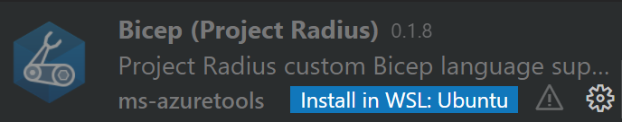
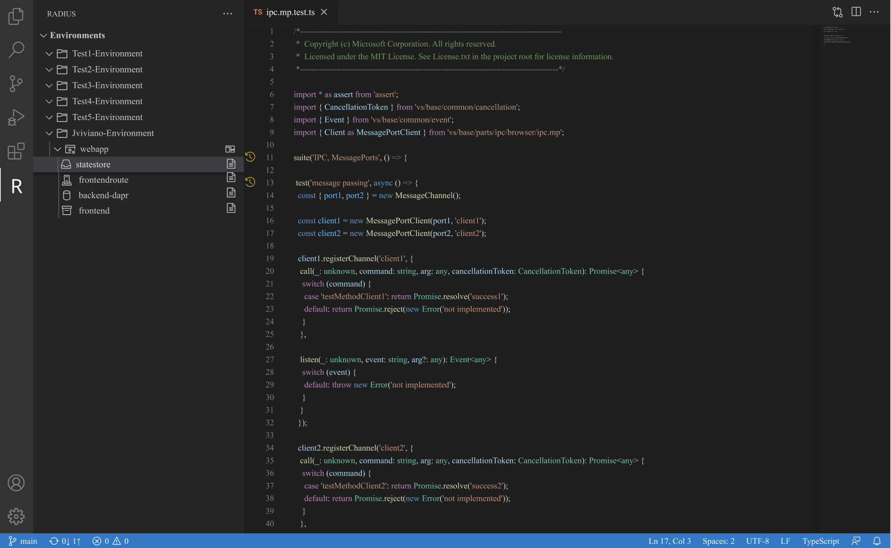

Radius offers a *preview* Radius Visual Studio Code extension for Radius-specific optimizations which enables users a variety of features related to better model, deploy and manage applications across cloud and edge. The extension also provides for Bicep files:
- Syntax highlighting
- Auto-completion
- Linting


## Pre-requisites

- [Visual Studio Code](https://code.visualstudio.com/)

## Preview installation guide
### Install Radius extension

1. Download the edge [custom VSCode extension file](https://radiuspublic.blob.core.windows.net/tools/vscode/edge/rad-vscode-bicep.vsix).

1. Install the `.vsix` file

   
   
   {}
   In VSCode, manually install the extension using the *Install from VSIX* command in the Extensions view    command drop-down.
          
   
   {}
   
   {}
   You can also import this extension on the [command-line](https://code.visualstudio.com/docs/editor/extension-gallery#_install-from-a-vsix) with:
   
   ```bash
   code --install-extension rad-vscode-bicep.vsix
   ```
   {}
   
   

1. Disable the official Bicep extension if you have it installed. (Do not install the Bicep extension if you haven't already, our custom extension needs to be responsible for handling `.bicep` files and you cannot have both extensions enabled at once.)

1. If running on Windows Subsystem for Linux (WSL), make sure to install the extension in WSL as well:

   

## Features
### Tree representation of your code
View environments, applications and resources deployed in a tree view style in Visual Studio Code.



### View logs from container resources
The Radius extension helps you find information about your applications with Radius by creating a temporary log file that can be opened and viewed with the logs from your resources.

Using the tree view resource nodes found in the explorer section, you can access a action icon command to create this log file and view logs related to the specific resource choosen.

### View a topology of your Radius application
Within the Environment view you can access a diagram of your Radius application by clicking on the corresponding action icon next to your application node. This opens up a webview containing how your current deployment understands the connections and architecture of your application.


## Install other Radius extension versions

You can access other versions of the Radius extension from the following URLs:

- [Latest stable](https://get.radapp.dev/tools/vscode/stable/rad-vscode-bicep.vsix)
- [Latest unstable](https://radiuspublic.blob.core.windows.net/tools/vscode/edge/rad-vscode-bicep.vsix)

## ADDITONAL RESOURCES

Learn how to create your first Radius environment


