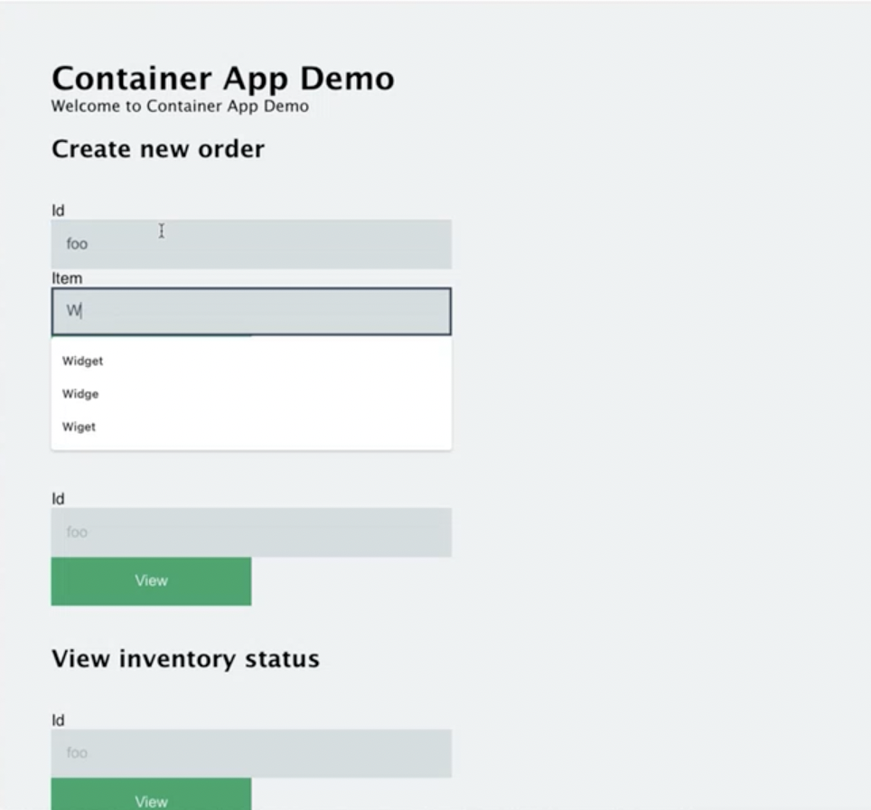

## Initialize environment





Visit the [getting started guide]() to deploy or connect to a Radius environment using Azure.





Open up a terminal and get ready to interact with the Radius Cli.

1. Create your Radius environment via the rad CLI:

   ```sh
   rad env init dev -i 
   ```

   This will create Docker containers containing local Kubernetes instances and ask you for a custom name for your local Radius environment. For confirmation you can check your Radius environment by running the command:

   ```sh
   rad env list
   ```

1. Confirm that your Radius local Kubernetes environment is ready:

   ```sh
   rad env status
   ```

   You should see a table outputed with information regarding `Nodes`, `Registry`, `Ingress(HTTP)`, `Ingress(HTTPS)` of your enviroment. Example output:

   ```sh
      NODES        REGISTRY         INGRESS (HTTP)          INGRESS (HTTPS)
      Ready (2/2)  localhost:50522  http://localhost:50526  https://localhost:50525
   ```

1. Initialize Dapr for Kubernetes:

   ```sh
   dapr init -k
   ```

{}
{}

## Deploy application to Azure

Using the [`rad deploy`]() command, deploy the Container App Store Microservice application to your environment:


{}

```sh
rad deploy app-azure.bicep -p adminPassword=CHOOSE-A-PASSWORD -p CLUSTER_IP=ip-address-you-retrieved
```

{}
{}

{}
Azure Redis cache can take ~20-30 minutes to deploy. You can monitor your deployment process in the `Deployments` blade of your environment's resource group.
{}

## Verify app resources

Verify the Container App Store Microservice resources are deployed:

```sh
rad resource list -a eshop
```

## Run app locally with local environment

Once Dapr is running, run your Radius application:

   ```sh
   rad app run --profile dev
   ```

The profile parameter profile construct allows you to use overrides in rad.yaml.

## Visit Container App Store Microservice

Now that Container App Store Microservice is deployed, you can visit the application.


