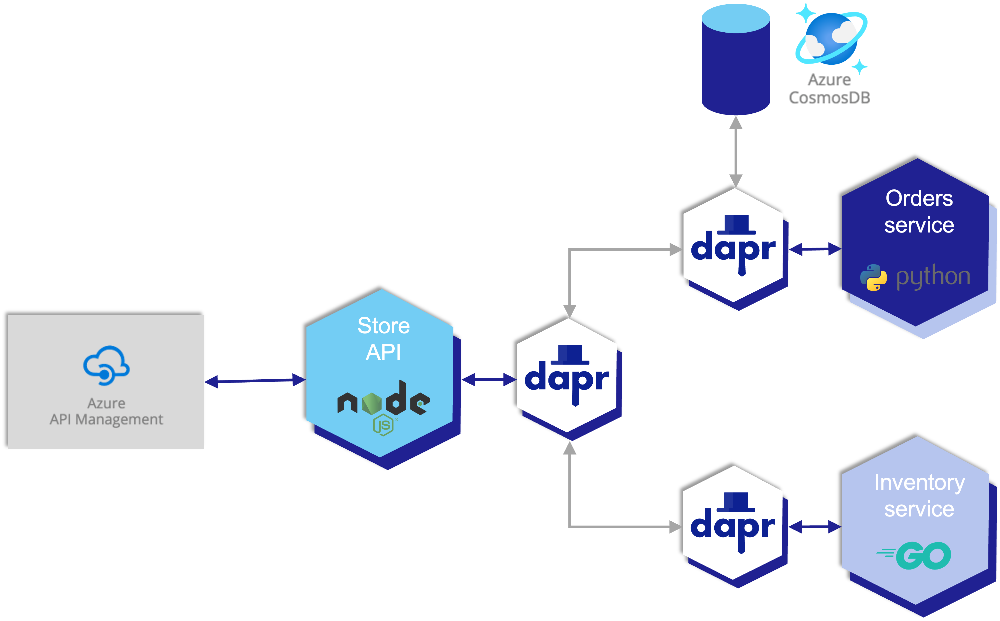

## Background

The [Container App Store Microservice](https://github.com/Azure-Samples/container-apps-store-api-microservice) reference application contains microservices written in Python, Go, and NodeJS. It uses Dapr to communicate between services.

## Prerequisites

- [rad CLI]()
- [Docker Desktop](https://www.docker.com/products/docker-desktop) (if running locally)
- [Dapr CLI](https://docs.dapr.io/getting-started/install-dapr-cli/) (if running locally or on Kubernetes)

### Architecture

From the [sample repo](https://github.com/Azure-Samples/container-apps-store-api-microservice/blob/main/assets/arch.png):

This is a sample microservice solution for Azure Container Apps. It will create a store microservice which will need to call into an order service and an inventory service. Dapr is used to secure communication and calls between services, and Azure API Management and Azure Cosmos DB are created alongside the microservices.

There are three main microservices in the solution:

**Store API (node-app)**

The node-app is an express.js API that exposes three endpoints. / will return the primary index > page, /order will return details on an order (retrieved from the order service), and /inventory > will return details on an inventory item (retrieved from the inventory service).

**Order Service (python-app)**

*The python-app is a Python flask app that will retrieve and store the state of orders. It uses > Dapr state management to store the state of the orders. When deployed in Container Apps, Dapr is configured to point to an Azure Cosmos DB to back the state.*

**Inventory Service (go-app)**

The go-app is a Go mux app that will retrieve and store the state of inventory. For this sample, the mux app just returns back a static value.

### Deploying without Radius

There are two options for [deploying the Container App Store Microservice](https://github.com/Azure-Samples/container-apps-store-api-microservice#deploy-and-run) without Radius: GitHub Actions or the Azure CLI.

## Adding Radius

Adding Project Radius to the Container App Store Microservice on containers application allows teams to:

- Define first-class relationships between microservices and infrastucture
- Add portability to the application across Azure, Kubernetes, and local development environments
- Run and test the application locally

By the end of this sample you will be able to deploy Container App Store Microservice both locally or to the cloud using Project Radius.


