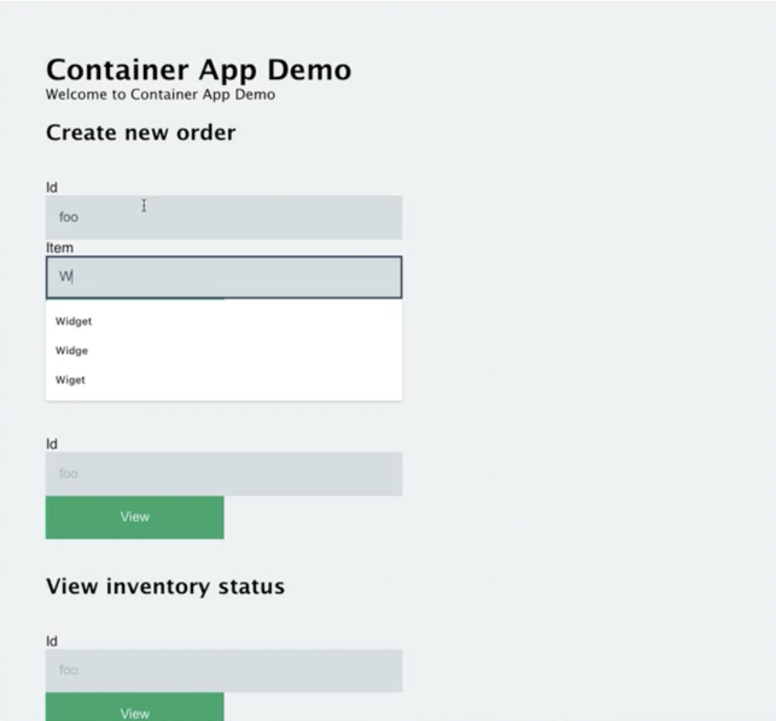

## Initialize environment

Begin by create a new Radius [local dev environment]():

1. Create your Radius environment via the rad CLI:

   ```sh
   rad env init dev -i 
   ```

   This will create Docker containers containing local k3d instances and ask you for a custom name for your local Radius environment.

1. Confirm that your Radius local Kubernetes environment is ready:

   ```sh
   rad env status
   ```

   You should see a table outputed with information regarding `Nodes`, `Registry`, `Ingress(HTTP)`, `Ingress(HTTPS)` of your enviroment. Example output:

   ```sh
      NODES        REGISTRY         INGRESS (HTTP)          INGRESS (HTTPS)
      Ready (2/2)  localhost:50522  http://localhost:50526  https://localhost:50525
   ```

1. Initialize Dapr on the k3d cluster:

   *This step is temporary, pending additional work on the Dapr extension.*

   ```sh
   dapr init -k
   ```

## Run application locally

Using the [`rad app run`]() command, run the Container App Store Microservice application in your local environment. This will build the Docker containers, push them to the local registry, and deploy them to the local k3d cluster.

```sh
rad app run app --profile dev  
```

## Visit Container App Store Microservice

Now that Container App Store Microservice is deployed, you can visit the application via the Ingress IP address listed above:



## Next steps

Now that you have run your application locally, you can deploy it to Azure or Kubernetes.


