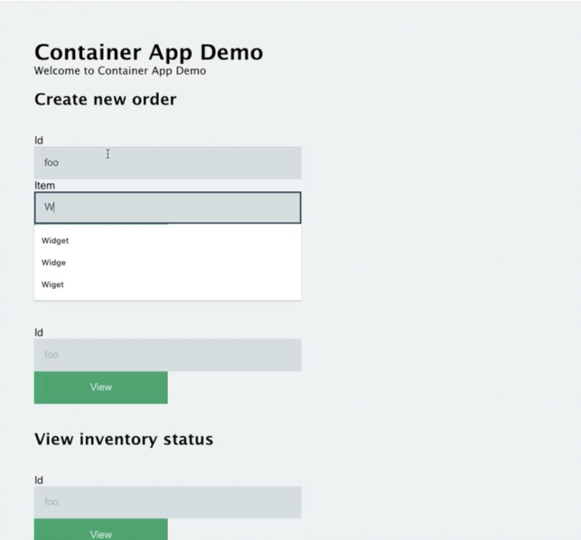

## Initialize environment

Create a new Azure environment, specifying your subscription and resource group:
```sh
rad env init azure -i
```

## Deploy application to Azure

Using the [`rad app deploy`]() command, deploy the Container App Store Microservice application to your environment:

```sh
rad app deploy
```

The deployed resources, along with gateway IP address, will be output to the console upon a successful deployment.

## Visit Container App Store Microservice

Now that Container App Store Microservice is deployed, you can visit the application via the IP address output above.


