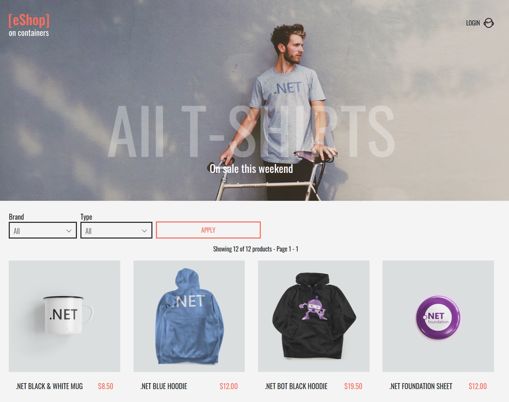

## Download eShop

Download the eShop template for your desired environment:


{}
This template uses Azure SQL, Azure Redis Cache, Azure Service Bus, and Azure CosmosDB w/ Mongo API:

{}
{}
This template uses containerized versions of SQL, Redis, RabbitMQ, and MongoDB:

{}
{}

## Initialize environment

Visit the [getting started guide]() to deploy or connect to a Radius environment running the latest release.

### Deploy ingress controller

The eShop application requires an ingress controller to be deployed to your environment, so you can access it over the internet without port-forwarding.



{}
An Ingress controller is configured for you by default when you initialize an environment.
{}

{}
Run the following command to initialize an Ingress controller:
```sh
helm repo add ingress-nginx https://kubernetes.github.io/ingress-nginx
helm upgrade radius-ingress-nginx ingress-nginx/ingress-nginx --install --create-namespace --namespace radius-system --version 3.29.0 --wait
```
{}



### Configure ingress controller

{}
The following steps are temporary, pending updates to Radius gateway resources.
{}

eShop requires the nginx ingress controller to accept large headers, which are used by the identity microservice. Run the following commands to override the default ConfigMap:

#### (Azure envs only) Get kubectl context

```sh
rad env merge-credentials
```

#### Edit ConfigMap

```sh
kubectl edit configmap radius-ingress-nginx-controller -n radius-system
```

Past in the following yaml at the end of the document that opens, and then save and exit:

```yml
data:
  proxy-buffer-size: 128k
  proxy-buffers: 4 256k
```

Now get the pod of the nginx ingress controller in order to restart it:

```bash
$ kubectl get pods -n radius-system
NAME                                    READY   STATUS    RESTARTS   AGE
radius-ingress-nginx-controller-ID      1/1     Running   0          3m
$ kubectl delete pod radius-ingress-nginx-controller-ID -n radius-system
```

The pod should restart and now accept large headers.

### Get cluster IP

Radius gateways are still in development, and will get more features in upcoming releases. Until they are updated, manually retrieve your cluster IP address to pass into the application:


{}

1. Navigate to the RE-[ENV-NAME] resource group that was initialized for your environment.
1. Select the Azure Kubernetes Service cluster.
1. Note the IP address of the External IP of your LoadBalancer.
{}
{}
1. Ensure your cluster is set as the default cluster in your kubectl config, and Radius is initialized on it.
1. Run `kubectl get svc -A` and note the EXTERNAL-IP value of your load balancer.
{}
{}

## Deploy application

Using the [`rad deploy`]() command, deploy the eShop application to your environment:


{}
```sh
$ rad deploy eshop-azure.bicep -p adminPassword=CHOOSE-A-PASSWORD -p CLUSTER_IP=ip-address-you-retrieved
```
{}
{}
```sh
$ rad deploy eshop-kubernetes.bicep -p adminPassword=CHOOSE-A-PASSWORD -p CLUSTER_IP=ip-address-you-retrieved
```
{}
{}

{}
Azure Redis cache can take ~20-30 minutes to deploy. You can monitor your deployment process in the `Deployments` blade of your environment's resource group.
{}

## Verify app resources

Verify the eShop resources are deployed:

```sh
rad resource list -a eshop
```

## Visit eShop

Now that eShop is deployed, you can visit the eShop application in your browser at `https://CLUSTER-IP.nip.io`:



Login and try buying an item!
