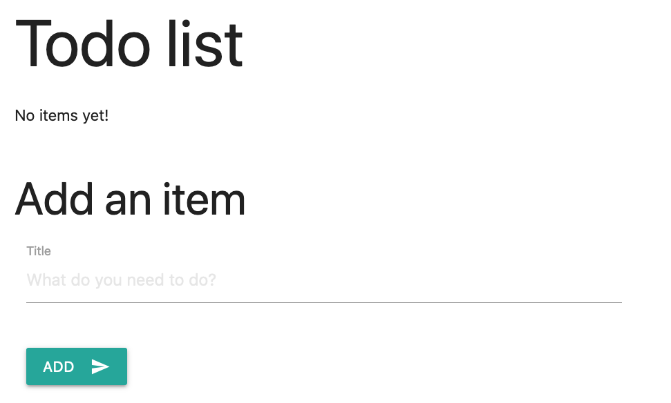

{}
This step is currently only available for Microsoft Azure environments.
{}

In this step you will learn how to add a secret store and connect to it from the application and retrieve secrets.

We'll discuss template.bicep changes and then provide the full, updated file before deployment. 

## Add kv component

A `kv` secret store component is used to specify a few properties about the KeyVault: 

- **kind:** `azure.com/KeyVault@v1alpha1` represents an Azure Key Vault
- **managed:** `true` tells Radius to manage the lifetime of the component for you ([more information]())



## Reference kv from todoapp

### Access Key Vault URI

Once the secret store is defined as a component, you can connect to it by referencing the `kv` component from within the `todoapp` component via a `uses` section. The `env` section declares operations to perform *based on* the relationship. In this case the `uri` value will be retrieved from the key vault and set as an environment variable on the component. As a result, `todoapp` will be able to use the `KV_URI` environment variable to access to the key vault.

### Place connection string in Key Vault

Additionally, we no longer want the application to access the connection string to the database in clear text as an environment variable. Instead, we want to create a secret in the secret store which will store the connection string. The `secrets` section declares the secrets to be created for the container to access the `db` component. 
- The `connectionString` value will be retrieved from the database and set as a secret in the secret store (identified by `store` property)  
- The secret name will be `DBCONNECTION`.

Here's what the `todoapp` component will look like with the key vault binding info added to the `uses` section. 

{{< rad file="snippets/app.bicep" embed=true marker="//CONTAINER" replace-key-run="//RUN" replace-value-run="run: {...}" replace-key-bindings="//BINDINGS" replace-value-bindings="bindings: {...}" >}}

## Update your template.bicep file 

Update your `template.bicep` file to match the full application definition:



## Deploy application with database and secret store

1. Now you are ready to re-deploy the application, including the Azure CosmosDB database and Azure KeyVault. Switch to the command-line and run: 

   ```sh
   rad deploy template.bicep
   ```

   This may take a few minutes because of the time required to create the key vault.

1. You can confirm that the new `kv` component was deployed by running:

   ```sh
   rad deployment list --application webapp
   ```

   You should see `kv`, `db` and `todoapp` components in your `webapp` application. Example output: 

   ```
   DEPLOYMENT  COMPONENTS
   default     db kv todoapp 
   ```

1. To test the database, open a local tunnel on port 3000 again:

   ```sh
   rad component expose --application webapp todoapp --port 3000
   ```

1. Visit the URL [http://localhost:3000](http://localhost:3000) in your browser. You should see a page like:

   

   If your page matches, then it means that the container is able to access the connection string to the database from the secret store and use it to connect to the database. Just like before, you can test the features of the todo app. 

1. When you're done testing press CTRL+C to terminate the port-forward. 

You have completed this tutorial!

{}
If you're done with testing, you can use the rad CLI to [delete an environment]() to **prevent additional charges in your subscription**.
{}

## Next steps

- To view the website application code used in this tutorial, download the [zipped application code](/tutorial/webapp.zip).
- If you'd like to try another tutorial with your existing environment, go back to the [Radius tutorials]() page.


