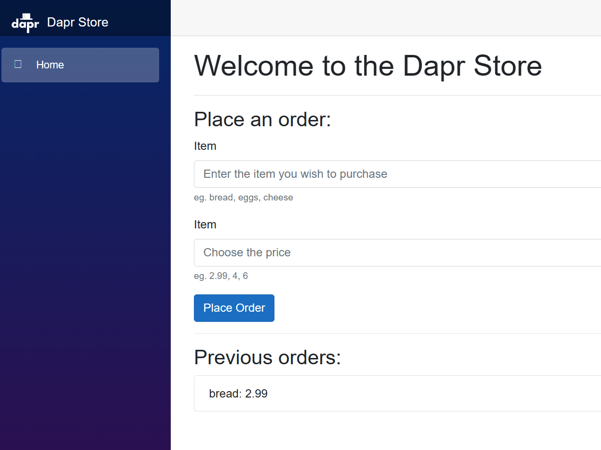
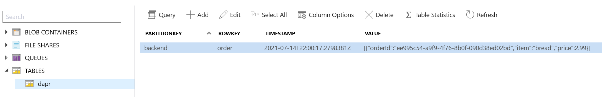

To complete the application, you'll add another component for the frontend user interface.

Again, we'll discuss changes to template.bicep and then provide the full, updated file before deployment.

## Add frontend component

Another container component is used to specify a few properties about the order generator:

- **resource type**: `ContainerComponent` indicates you are using a generic container.
- **container image**: `radius.azurecr.io/daprtutorial-frontend` is a Docker image the container will run.
- **connections**: `daprBackend.id` declares the intention for `frontend` to communicate with `backend` through the `daprBackend` Dapr HTTP Route.
- **traits**: `dapr.io/Sidecar` configures Dapr on the container.



As before with connections, the `frontend` component is using an environment variable to get information about the the `backend`'s route. This avoids hardcoding:

```C#
var appId = Environment.GetEnvironmentVariable("CONNECTION_BACKEND_APPID");
services.AddSingleton<HttpClient>(DaprClient.CreateInvokeHttpClient(appId));
```
  
## Deploy application

1. Make sure your `template.json` file matches the full tutorial file:

   

1. Switch to the command line and run:

   ```sh
   rad deploy template.bicep
   ```

1. To test out the frontend microservice, open a local tunnel on port 80:

   ```sh
   rad resource expose ContainerComponent frontend --application dapr-tutorial --port 5000 --remote-port 80
   ```

1. Visit [http://localhost:5000](http://localhost:5000) in your browser and submit orders.

   

1. When you're done testing press CTRL+C to terminate the port-forward.

1. Open the [Azure Portal](https://portal.azure.com) and navigate to the resource group for your environment. Open the storage account and navigate to Azure Storage Explorer to see the state items you just persisted:

   

You have completed this tutorial!

{}
If you're done with testing, you can use the rad CLI to [delete an environment]() to **prevent additional charges in your subscription**.
{}

## Next steps

- If you'd like to try another tutorial with your existing environment, go back to the [Radius tutorials]() page. 
- Related links for Dapr:
  - [Dapr documentation](https://docs.dapr.io/)
  - [Dapr quickstarts](https://github.com/dapr/quickstarts/tree/v1.0.0/hello-world)

<br>
