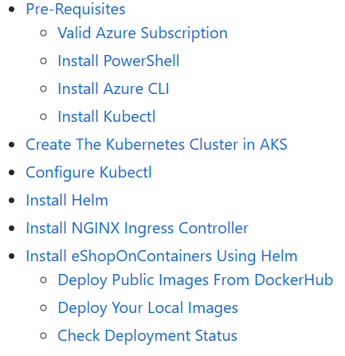

## Background

The [eShop on Containers](https://github.com/dotnet-architecture/eShopOnContainers) reference application is a sample .NET Core reference application based on a simplified microservices architecture and Docker containers.

### Architecture


From the [eShop repo](https://github.com/dotnet-architecture/eShopOnContainers#architecture-overview):

> The architecture proposes a microservice oriented architecture implementation with multiple autonomous microservices (each one owning its own data/db) and implementing different approaches within each microservice (simple CRUD vs. DDD/CQRS patterns) using HTTP as the communication protocol between the client apps and the microservices and supports asynchronous communication for data updates propagation across multiple services based on Integration Events and an Event Bus.

### Deployment



Currently, [deploying eShop](https://github.com/dotnet-architecture/eShopOnContainers/tree/dev/deploy/k8s) requires deploying a cluster and the backing infrastructure, configuring multiple CLIs and tools, running deployment scripts, and manually copying/pasting credentials and endpoints.

#### Kubernetes cluster

To deploy an AKS cluster, eShop [provides instructions](https://github.com/dotnet-architecture/eShopOnContainers/wiki/Deploy-to-Azure-Kubernetes-Service-(AKS)) on how to use the Azure portal or Azure CLI. You could also use [ARM/Bicep templates](https://github.com/Azure/bicep/tree/main/docs/examples/101/aks).

#### Azure resources (optional)

If deploying to Azure, you can also deploy infrastructure resources (Service Bus, Redis Cache, Cosmos DB, etc.) using ARM/Bicep templates provided [here](https://github.com/dotnet-architecture/eShopOnContainers/wiki/Deploying-Azure-resources).

#### Helm charts

Once the cluster and infrastructure resources are deployed, you can deploy the eShop application using Helm charts and PowerShell as detailed [here](https://github.com/dotnet-architecture/eShopOnContainers/wiki/Deploy-to-Azure-Kubernetes-Service-(AKS)#install-eshoponcontainers-using-helm).

## Adding Radius

Adding Project Radius to the eShop on containers application will allow teams to:

- Define the entire collection of microservices and backing infrastructure as a single application
- Easily manage configuration and credentials between infrastructure and services, all within the app model
- Simplify deployment with Bicep and Azure Resource Manager (ARM)

By the end of this tutorial you will be able to deploy eShop on containers with just a single command:

```sh
$ rad env init azure -n cloud
Initializing Azure environment 'cloud'...
Environment 'cloud' initialized.
$ rad deploy eshop.bicep
Deploying Application 'eshop' to environment 'cloud'...
Deployment Complete
```



